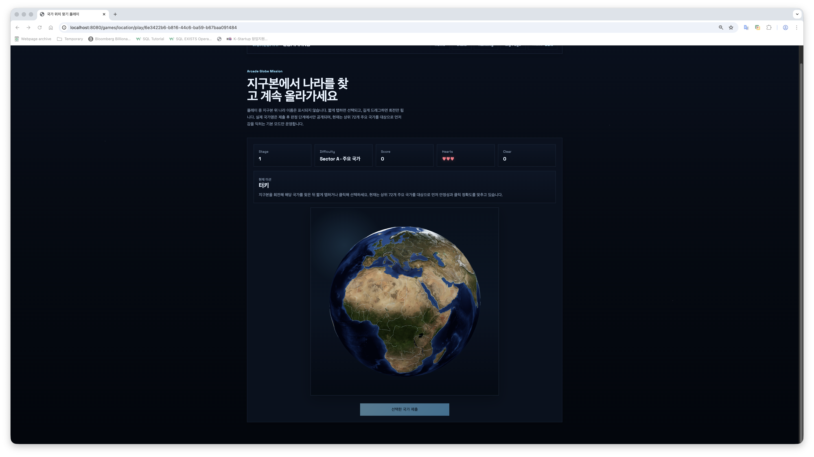
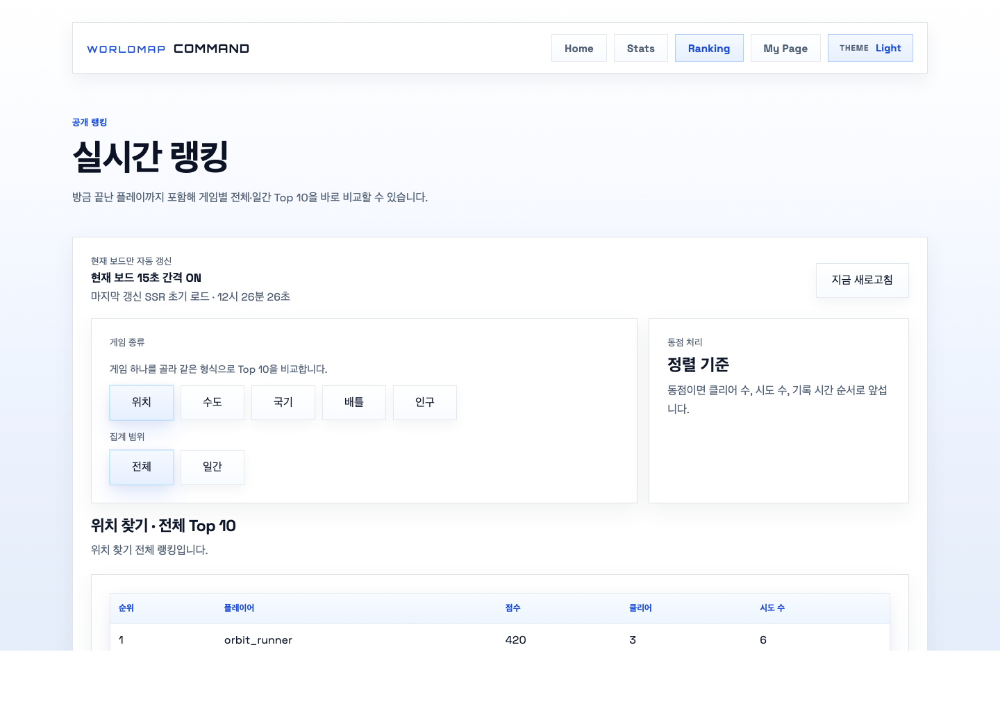
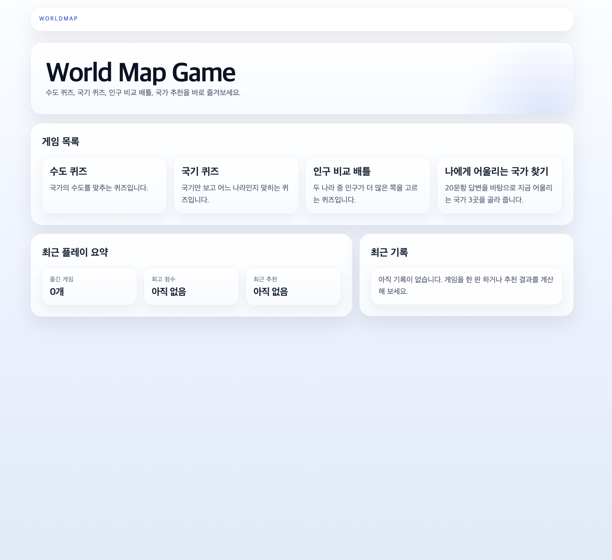
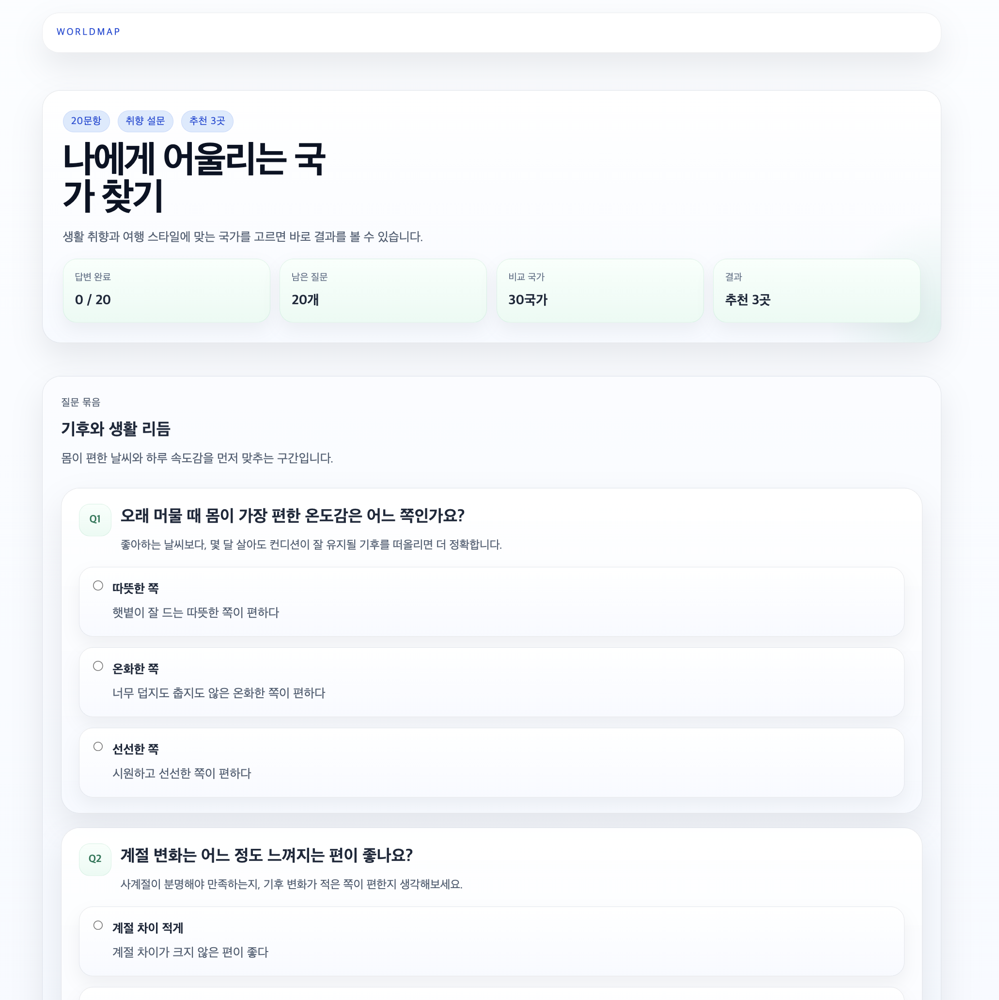

# WorldMap

> 나라를 찾고, 비교하고, 나에게 어울리는 국가까지 탐색하는 지리 게임 플랫폼

WorldMap은 퀴즈 몇 개를 나열한 사이트가 아니라, 서로 다른 길이의 플레이 경험과 추천 흐름을 하나의 제품으로 묶어 보려는 프로젝트입니다.
처음부터 목표는 “정답을 맞히는 화면” 하나가 아니라, `홈 -> 게임 -> 기록 -> 추천 -> 운영 리뷰`가 한 흐름으로 이어지는 서비스 감각을 만드는 것이었습니다.

또 하나의 중요한 목표는, 구현을 빨리 늘리는 대신 **왜 이런 구조와 규칙을 선택했는지 끝까지 설명할 수 있는 프로젝트**를 만드는 것이었습니다.

## 바로 보기

- `공개 데모`: [https://world-map-game-demo-lite-git.pages.dev/](https://world-map-game-demo-lite-git.pages.dev/)
- `메인 앱`: 로컬 실행 가능, 공개 배포 전
- `아키텍처 개요`: [docs/ARCHITECTURE_OVERVIEW.md](docs/ARCHITECTURE_OVERVIEW.md)
- `요청 흐름`: [docs/REQUEST_FLOW_GUIDE.md](docs/REQUEST_FLOW_GUIDE.md)
- `재현형 블로그`: [blog/README.md](blog/README.md)

## 어떤 제품을 만들고 싶었나

- 단순한 지리 퀴즈 모음이 아니라, `탐색형 플레이 + 짧은 퀴즈 + 생활 취향 추천`이 함께 있는 제품
- “한 번 하고 끝나는 게임”보다 기록, 랭킹, 추천이 서로 이어져 다음 행동을 만들 수 있는 구조
- 비회원도 바로 시작할 수 있지만, 마음에 들면 계정으로 자연스럽게 기록을 이어갈 수 있는 흐름
- 정답과 추천 결과를 그냥 뿌리는 대신, 왜 이런 결과가 나왔는지 나중에 설명할 수 있는 설계

## Main App과 Demo Lite

| 구분 | 역할 | 핵심 특징 | 현재 상태 |
| --- | --- | --- | --- |
| `Main App` | 전체 제품 본편 | Spring Boot 기반 서버 주도 게임, 추천, 랭킹, 기록, 운영 화면 | 로컬 실행 가능, 공개 배포 전 |
| `Demo Lite` | 공개 체험판 | 핵심 게임과 추천 흐름만 남긴 정적 데모 | Cloudflare Pages 공개 중 |

`Main App`은 제가 실제로 설계한 제품의 전체 그림입니다.
`Demo Lite`는 메인 앱이 아직 공개 배포되지 않은 상태에서도, 화면 톤과 핵심 플레이 흐름을 누구나 바로 체험할 수 있도록 만든 별도 공개 트랙입니다.

## 화면

메인 앱 스크린샷은 로컬 `local` 프로필에서 캡처했고, `Demo Lite`는 실제 공개 URL에서 캡처했습니다.

### Main App

<p align="center">
  
  
</p>

- 왼쪽은 대표 모드인 `국가 위치 찾기` 실제 플레이 화면입니다. 지구본 위에서 나라를 직접 찾는 경험이 이 제품의 출발점입니다.
- 오른쪽은 게임별 전체/일간 기록을 비교하는 공개 랭킹 화면입니다.

### Demo Lite

<p align="center">
  
  
</p>

- `Demo Lite`는 제품 분위기와 핵심 흐름을 누구나 바로 체험할 수 있게 만든 공개 데모입니다.
- 특히 추천 화면은 “나에게 어울리는 국가 찾기”라는 제품 방향을 가장 빠르게 전달하는 첫 진입 화면입니다.

## 어떻게 설계하고 만들었나

이 프로젝트에서 제가 보여 주고 싶은 건 “기능 수”보다 **제품을 어떤 식으로 나눠 설계했는가**입니다.

### 1. 게임을 따로 만들지 않고 하나의 제품으로 묶기

WorldMap은 위치 찾기, 수도 퀴즈, 국기 퀴즈, 인구 비교 배틀, 국가 추천이 각각 따로 노는 구조를 피하려고 했습니다.

- 홈에서 바로 여러 플레이 길이를 제안하고
- 랭킹과 기록이 게임 사이를 다시 연결하고
- 추천이 “정답 맞히기”와 다른 감정선을 추가하게 만들었습니다

즉, 개별 미니게임을 늘리는 것보다 **서로 다른 경험이 한 제품 안에서 이어지는가**를 먼저 봤습니다.

### 2. 긴 플레이와 짧은 플레이를 같이 두기

- `국가 위치 찾기`: 더 오래 붙잡히는 러너형 대표 모드
- `수도 퀴즈 / 국기 퀴즈 / 인구 비교 배틀 / 인구수 퀴즈`: 짧고 빠르게 반복할 수 있는 모드
- `국가 추천`: 게임과 다른 종류의 몰입을 만드는 탐색형 흐름

이 조합 덕분에 사용자는 “한 판 빨리 하기”와 “조금 오래 파보기” 사이를 자연스럽게 오갈 수 있습니다.

### 3. 기록과 운영 화면도 처음부터 제품 일부로 보기

랭킹, 개인 기록, 운영 리뷰 화면은 나중에 덧붙인 부가기능이 아니라 처음부터 제품의 일부로 봤습니다.

- 공개 랭킹은 “다른 사람은 어느 정도까지 갔는가”
- 마이페이지는 “나는 어떤 게임에 강한가”
- 운영 화면은 “추천 결과와 제품 반응이 실제로 어떤가”

이렇게 역할을 분리해 두면, 게임 하나하나보다 **제품 전체가 어떻게 굴러가는지**를 설명하기 쉬워집니다.

## AI와 함께 `나에게 어울리는 국가 찾기`를 만든 방식

이 프로젝트에서 AI를 가장 잘 보여 줄 수 있는 부분은 런타임 채팅 기능이 아니라, `국가 추천`을 설계하고 다듬은 과정입니다.

처음 아이디어는 아주 막연했습니다.
“여행 취향 테스트”처럼 가볍게 끝나는 게 아니라, **사용자가 실제로 어디에서 살아 보고 싶은지까지 상상하게 만드는 추천**을 만들고 싶었습니다.

그래서 AI를 코드 생성기보다 **기획 보조자 + 설계 보조자 + 검증 보조자**로 더 많이 썼습니다.

### 1. 질문 축을 넓히는 데 AI를 사용했습니다

처음에는 단순히

- 따뜻한 나라를 좋아하는지
- 도시를 좋아하는지
- 생활비를 중요하게 보는지

정도만 묻는 얕은 설문으로 시작했습니다.

여기서 AI를 사용한 방식은 “문항을 대신 써 달라”가 아니라,

- 이 질문 세트로는 어떤 사람이 제대로 구분되지 않는지
- 실제 생활 선택에서 빠진 축이 무엇인지
- 서로 충돌하는 취향을 어떻게 질문으로 드러낼 수 있는지

를 빠르게 탐색하는 것이었습니다.

그 과정에서 단순 취향 체크가 아니라,

- 기후 방향
- 사계절 변화 선호
- 기후 적응 성향
- 생활 리듬
- 인구 밀도 감수성
- 비용 대비 품질 기준
- 주거 공간 vs 중심 접근성
- 도시 편의 vs 자연 접근성
- 이동 방식
- 영어 지원 필요도
- 초기 정착 친화도
- 치안 / 공공서비스 우선도
- 디지털 인프라
- 음식 / 다양성 / 문화 생활
- 일과 삶의 균형
- 장기 정착과 미래 기반

같은 축을 실제 제품 질문으로 끌어올렸고, 지금은 `20문항` 구조로 정리돼 있습니다.

### 2. 나라 프로필 설계도 AI를 탐색 파트너처럼 활용했습니다

추천 기능이 설득력을 가지려면 질문만 많아서는 안 되고, 각 국가를 어떤 기준으로 비교할지도 명확해야 했습니다.

그래서 AI를 이용해

- 각 나라를 어떤 속성으로 비교하면 좋은지 후보를 넓히고
- 비슷한 나라들이 실제로는 어떤 축에서 갈리는지 보고
- “이 프로필이면 왜 이 나라가 1위인지 설명 가능한가”를 계속 점검했습니다

그 뒤 최종적으로는 사람이 직접 정리해서,

- `30개 국가 프로필`
- 각 국가의 기후, pace, 가격대, 주거, 이동성, 영어/정착 친화도, 안전, 공공서비스, 디지털 편의, 음식, 다양성, 문화, 장기 정착성

같은 속성을 고정된 데이터로 유지했습니다.

즉, 결과는 AI가 실시간으로 만들어 주는 것이 아니라, **AI와 함께 질문과 비교축을 설계한 뒤 사람이 고정한 데이터와 규칙으로 계산**합니다.

### 3. 추천 로직은 일부러 생성형이 아니라 규칙 기반으로 만들었습니다

여기서 가장 중요한 선택은, 추천 결과를 LLM이 그때그때 말해 주는 방식으로 가지 않은 것입니다.

대신 저는

- 설문 버전: `survey-v4`
- 엔진 버전: `engine-v20`

처럼 버전을 고정하고,

- 국가별 점수 규칙
- 보너스와 패널티
- 동점 처리
- 결과 설명 문장

을 서버 코드 안에 남겼습니다.

이렇게 한 이유는 추천 기능을 **그럴듯한 생성 결과**가 아니라, **반복해서 검증하고 튜닝할 수 있는 제품 로직**으로 다루고 싶었기 때문입니다.

### 4. AI는 튜닝 후보를 빠르게 넓히는 데 강했고, 최종 결정은 사람이 했습니다

추천 엔진을 다듬는 과정에서 AI는 특히 아래 역할에서 유용했습니다.

- 특정 페르소나가 왜 이상한 결과를 받는지 가설 세우기
- 점수식에서 어떤 축이 과하게 세거나 약한지 비교안 만들기
- 질문/프로필/결과 설명 사이의 어색한 부분을 빠르게 찾기
- 문서와 테스트에서 빠진 설명 포인트를 점검하기

하지만 최종 결정은 항상 사람이 했습니다.

- 어떤 문항을 제품 질문으로 채택할지
- 어떤 나라를 비교 대상에 넣을지
- 어떤 보너스와 패널티가 과한지
- 이 결과를 “좋은 추천”이라고 볼 수 있는지

같은 판단은 제가 직접 했고, 그 결과만 코드와 테스트에 남겼습니다.

### 5. 그래서 추천 기능도 “AI를 썼다”보다 “AI와 함께 설계했다”가 더 정확합니다

이 기능에서 제가 보여 주고 싶은 건 “LLM이 나라를 추천한다”가 아닙니다.

오히려

- 막연한 아이디어를 질문 구조로 정리하고
- 생활 선택이라는 추상적 문제를 비교 가능한 국가 프로필로 바꾸고
- 추천 로직을 버전과 테스트가 있는 제품 기능으로 고정하고
- 만족도 피드백과 운영 리뷰 화면으로 다음 개선 루프까지 연결한 것

이 전체 과정입니다.

즉, AI는 이 프로젝트에서 **개발 속도를 올리는 도구**이면서도, 동시에 **제품 기획을 더 빠르게 실험하는 파트너**로 썼습니다.
다만 최종 결과는 항상 코드, 테스트, 문서, 운영 화면으로 사람이 다시 책임지는 구조로 닫았습니다.

## 기술적으로도 설명할 수 있는 포인트

- 게임을 `Session / Stage / Attempt`로 나눠 상태 있는 플레이를 설명 가능한 구조로 만들었습니다.
- PostgreSQL은 기준 저장소, Redis는 세션과 랭킹 조회 모델로 역할을 분리했습니다.
- 게스트 플레이를 회원 기록으로 이어받는 ownership 흐름을 넣었습니다.
- 추천 결과는 생성형 문장이 아니라 설명 가능한 규칙 기반 점수 계산으로 만들었습니다.
- 통합 테스트, 브라우저 스모크, 공개 URL 스모크, 배포 전 점검까지 검증 레일을 붙였습니다.

## 로컬 실행

### Main App

요구 사항:

- Java 25
- Docker Desktop 또는 Docker Engine

```bash
docker compose up -d
./gradlew bootRun --args='--spring.profiles.active=local'
```

- 실행 주소: [http://localhost:8080](http://localhost:8080)

### Demo Lite

```bash
cd demo-lite
npm install
npm run dev
```

## 검증 명령

### Main App

```bash
./gradlew test
./gradlew browserSmokeTest
```

### Demo Lite

```bash
cd demo-lite
npm test
npm run build
npm run verify:pages
npm run smoke:public -- https://world-map-game-demo-lite-git.pages.dev
```

## 더 읽을 문서

- 아키텍처: [docs/ARCHITECTURE_OVERVIEW.md](docs/ARCHITECTURE_OVERVIEW.md)
- 요청 흐름: [docs/REQUEST_FLOW_GUIDE.md](docs/REQUEST_FLOW_GUIDE.md)
- ERD: [docs/ERD.md](docs/ERD.md)
- 발표 정리: [docs/PRESENTATION_PREP.md](docs/PRESENTATION_PREP.md)
- 재현형 블로그: [blog/README.md](blog/README.md)

## 현재 상태

- `Main App`: 핵심 기능과 검증 레일은 정리되어 있지만, 아직 공개 운영 URL은 없습니다.
- `Demo Lite`: 공개 배포 중이며 계속 smoke로 확인합니다.
- 추천은 생성형 결과가 아니라 버전이 고정된 규칙 기반 엔진으로 운영합니다.
- AWS ECS 기준 배포 입력과 사전 점검 레일은 준비돼 있습니다.
