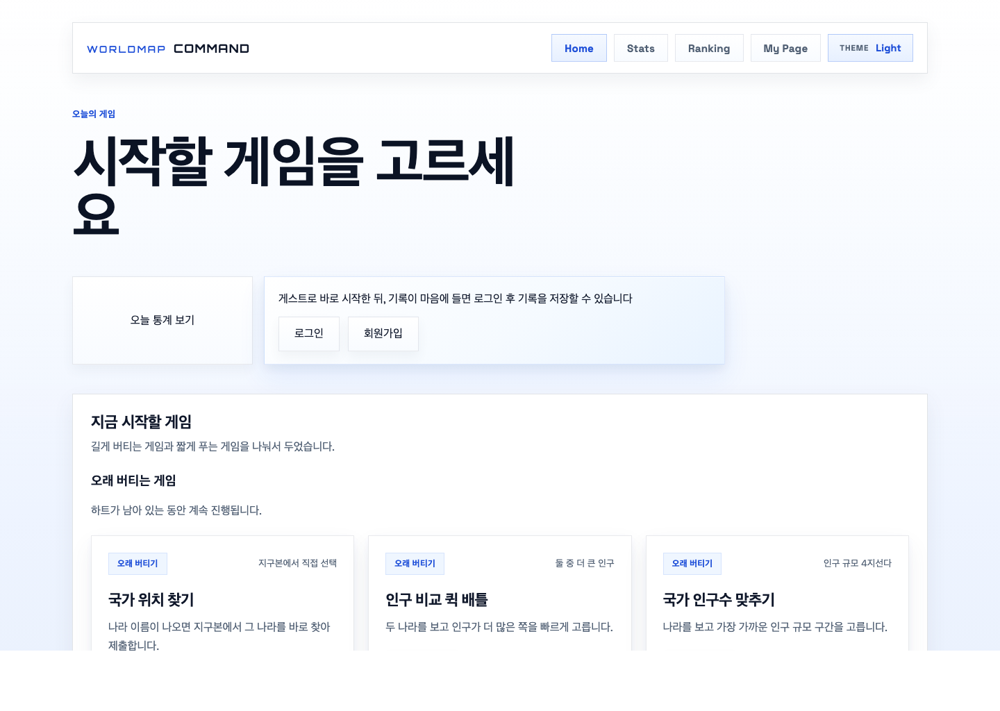
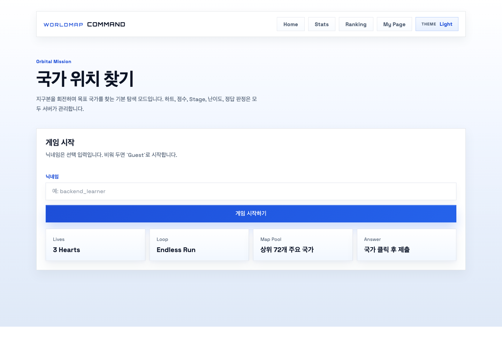
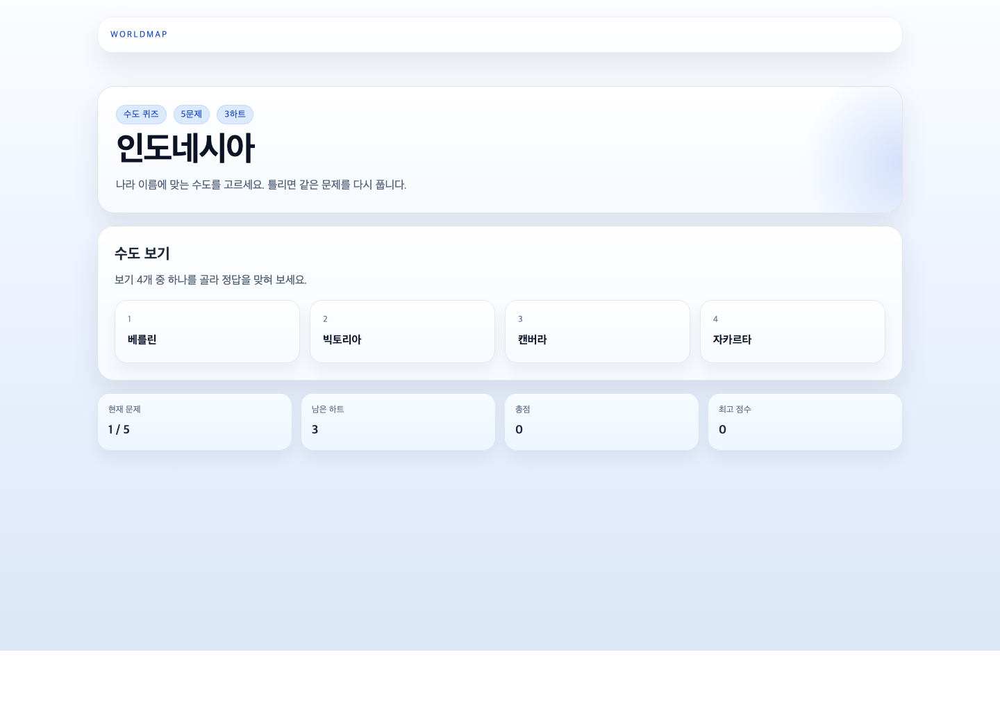

# WorldMap

> 여러 지리 게임과 국가 추천을 한곳에서 즐길 수 있는 서버 주도 게임 플랫폼

WorldMap은 단순한 퀴즈 모음이 아니라, 여러 게임 모드와 추천 흐름, 공개 랭킹, 개인 기록, 운영 리뷰 화면까지 하나의 제품으로 연결한 포트폴리오 프로젝트입니다.

핵심은 브라우저가 아니라 **서버가 게임 상태를 관리한다**는 점입니다.
브라우저는 입력과 렌더링을 맡고, 서버는 세션 시작, 정답 판정, 점수 계산, 재시도 규칙, 결과 공개 시점을 책임집니다.

## 바로 보기

- `공개 데모`: [https://world-map-game-demo-lite-git.pages.dev/](https://world-map-game-demo-lite-git.pages.dev/)
- `메인 앱`: 로컬 실행 / 배포 준비 상태
- `아키텍처`: [docs/ARCHITECTURE_OVERVIEW.md](docs/ARCHITECTURE_OVERVIEW.md)
- `요청 흐름`: [docs/REQUEST_FLOW_GUIDE.md](docs/REQUEST_FLOW_GUIDE.md)
- `재현형 블로그`: [blog/README.md](blog/README.md)

## 무엇을 할 수 있나

- `국가 위치 찾기`: 지구본 위에서 나라를 직접 찾는 대표 모드
- `수도 퀴즈`: 4지선다 수도 맞히기
- `국기 퀴즈`: 국기 이미지를 보고 나라 맞히기
- `인구 비교 배틀`: 두 나라 중 인구가 더 많은 쪽 고르기
- `국가 추천`: 20문항 답변 기반 국가 추천
- `랭킹 / stats / mypage / dashboard`: 공개 랭킹, 공개 서비스 통계, 개인 기록, 운영 리뷰 화면

## 왜 이 저장소를 볼 만한가

- 단순 CRUD가 아니라, 상태가 있는 게임 제품을 서버 도메인으로 설계했습니다.
- 게임 루프를 `Session / Stage / Attempt`로 나눠 설명 가능한 구조로 만들었습니다.
- `PostgreSQL`을 source of truth로 두고, `Redis`는 leaderboard read model과 세션 저장소로 사용합니다.
- 게스트 플레이를 회원 기록으로 이어받는 ownership 흐름을 갖고 있습니다.
- 단위 테스트만이 아니라 integration test, browser smoke, public URL smoke, deploy preflight까지 검증 레일을 갖고 있습니다.

## Main App과 Demo Lite

| 구분 | 목적 | 기술 스택 | 현재 상태 |
| --- | --- | --- | --- |
| `Main App` | 서버가 상태를 직접 관리하는 전체 제품 | Spring Boot, Thymeleaf SSR, PostgreSQL, Redis, Playwright | 로컬 실행 가능, 운영 배포 준비 중 |
| `Demo Lite` | 제품 분위기와 핵심 흐름을 빠르게 보여 주는 공개 데모 | Vite, vanilla JS, 정적 자산, browser local-state | Cloudflare Pages에 공개 배포 |

`Demo Lite`는 전체 Spring Boot 앱이 아직 공개 배포되지 않은 상태에서도 제품 방향과 화면 경험을 바로 보여 주기 위해 만든 별도 공개 트랙입니다.
기능 범위는 더 작지만, 실제 제품의 톤과 플레이 흐름은 최대한 맞추도록 설계했습니다.

## 화면 미리보기

메인 앱 스크린샷은 로컬 `local` 프로필 기동 상태에서 캡처했습니다.
Demo Lite 스크린샷은 실제 공개 URL에서 캡처했습니다.

### Main App

#### 홈



- 긴 러너형 게임, 짧은 퀴즈, 추천, 공개 통계, 계정 진입점을 한 화면에서 보여 줍니다.

#### 국가 위치 찾기



- 대표 모드인 위치 게임 진입 화면입니다. 실제 플레이에서는 서버가 Stage, 하트, 점수, 결과 공개 시점을 관리합니다.

#### 실시간 랭킹


- 게임별 전체 / 일간 Top 10을 비교하는 공개 랭킹 화면입니다.

### Demo Lite

#### 홈


- 공개 데모에서 유지한 플레이 가능한 경로만 간단하게 보여 주는 landing 화면입니다.

#### 수도 퀴즈



- 빠르게 제품을 체험할 수 있도록 남겨 둔 대표 플레이 화면입니다.

#### 국가 추천


- 20문항 설문 기반 추천 흐름을 정적 공개 데모에서도 확인할 수 있습니다.

## 기술적으로 강조할 포인트

### 1. 서버 주도 게임 루프

메인 앱에서는 게임 상태를 브라우저가 아니라 서버가 직접 관리합니다.

- 게임 세션은 `Session / Stage / Attempt` 구조로 나뉩니다.
- 서버가 정답 여부, 점수, 하트, 다음 Stage, 결과 공개 조건을 결정합니다.
- stale submit, duplicate submit 같은 문제도 서버 계약으로 막습니다.

### 2. PostgreSQL + Redis 역할 분리

- `PostgreSQL`: 국가 데이터, 게임 세션, 시도 기록, leaderboard record, recommendation feedback의 source of truth
- `Redis`: leaderboard read model, production session backend
- 공개 랭킹과 stats는 Redis가 비어 있거나 내려가도 DB fallback으로 읽을 수 있게 설계했습니다.

### 3. 설명 가능한 추천 엔진

- 20문항 설문
- 30개 국가 프로필
- deterministic scoring
- feedback loop와 운영 리뷰 화면 연결

즉, 결과를 “그럴듯하게 생성”하는 대신, 왜 이런 추천이 나왔는지 설명 가능한 구조를 우선했습니다.

### 4. 게스트에서 회원으로 이어지는 기록

- 로그인 없이 바로 시작 가능
- 로그인 시 현재 브라우저 기록을 회원 기록으로 claim 가능
- `/mypage`, `/stats`, `/dashboard`는 같은 기록 위에 서로 다른 read model을 얹는 방식입니다

### 5. 검증 레일

- Spring integration tests
- 실제 브라우저 기반 smoke tests
- 공개 URL smoke
- 배포 preflight checks

“기능이 있다”보다 “검증 가능한 제품이다”를 더 중요하게 봤습니다.

## AI를 어떻게 사용했는가

이 프로젝트는 AI를 쓰지 않은 프로젝트가 아니라, **AI를 작업 방식 안에 넣되 최종 책임은 사람이 지는 방식**으로 만든 프로젝트입니다.

- AI를 반복 구현, 문서 동기화, 설계 대안 비교, 테스트 누락 점검에 사용했습니다.
- 대신 도메인 경계, API 계약, public behavior는 사람이 최종 판단했습니다.
- 의미 있는 조각은 테스트, smoke, 수동 검증 중 최소 하나로 닫았습니다.
- `docs/`, `blog/`, `WORKLOG`를 함께 유지해서 “왜 이렇게 만들었는가”를 설명할 수 있게 했습니다.
- 목표는 “코드를 더 많이 생성”하는 것이 아니라, “속도를 올리되 품질 소유권을 잃지 않는 것”이었습니다.

## 로컬 실행

### Main App

요구 사항:

- Java 25
- Docker Desktop 또는 Docker Engine

```bash
docker compose up -d
./gradlew bootRun --args='--spring.profiles.active=local'
```

실행 주소:

- [http://localhost:8080](http://localhost:8080)

### Demo Lite

```bash
cd demo-lite
npm install
npm run dev
```

## 검증 명령

### Main App

```bash
./gradlew test
./gradlew browserSmokeTest
```

### Demo Lite

```bash
cd demo-lite
npm test
npm run build
npm run verify:pages
npm run smoke:public -- https://world-map-game-demo-lite-git.pages.dev
```

## 더 읽을 문서

### 프로젝트 개요

- [docs/ARCHITECTURE_OVERVIEW.md](docs/ARCHITECTURE_OVERVIEW.md)
- [docs/REQUEST_FLOW_GUIDE.md](docs/REQUEST_FLOW_GUIDE.md)
- [docs/ERD.md](docs/ERD.md)
- [docs/PRESENTATION_PREP.md](docs/PRESENTATION_PREP.md)

### 배포 / 운영 준비

- [docs/DEPLOYMENT_RUNBOOK_AWS_ECS.md](docs/DEPLOYMENT_RUNBOOK_AWS_ECS.md)
- [docs/DEPLOYMENT_RUNBOOK_RAILWAY.md](docs/DEPLOYMENT_RUNBOOK_RAILWAY.md)
- [docs/LOCAL_DEMO_BOOTSTRAP.md](docs/LOCAL_DEMO_BOOTSTRAP.md)

### 재현형 설명

- [blog/README.md](blog/README.md)
- [blog/00_rebuild_guide.md](blog/00_rebuild_guide.md)
- [blog/00_series_plan.md](blog/00_series_plan.md)

## 현재 상태

- `Main App`: 서버 주도 구조와 핵심 기능 설명에는 충분하지만, 아직 공개 production URL은 없습니다.
- `Demo Lite`: 공개 배포 중이며 smoke로 계속 점검합니다.
- production 배포 입력, verify workflow, browser smoke 레일은 이미 준비돼 있습니다.
- 추천은 deterministic engine 중심이며, 런타임 생성형 AI 호출에는 의존하지 않습니다.

## License

별도 라이선스 파일이 없다면 모든 권리는 저장소 소유자에게 있습니다.
