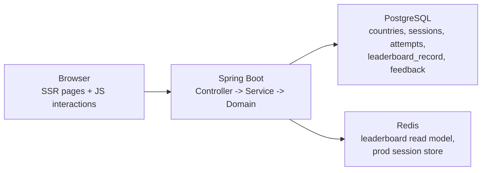

# WorldMap

Spring Boot 기반 `서버 주도 geography game platform` 포트폴리오입니다.

WorldMap은 하나의 웹사이트에서 아래 기능을 제공합니다.

- 국가 위치 찾기
- 수도 맞히기
- 국가 인구수 맞추기
- 인구 비교 퀵 배틀
- 국기 보고 나라 맞히기
- 설문 기반 국가 추천
- 실시간 랭킹과 공개 `/stats`
- 회원 전적 `/mypage`
- 운영용 `/dashboard`

핵심 차별점은 브라우저가 아니라 **서버가 문제 생성, 정답 판정, 점수 계산, 진행 상태, 결과 공개 시점**을 책임진다는 점입니다.

## 무엇을 보여 주는 프로젝트인가

이 저장소는 단순 CRUD 포트폴리오가 아니라, 상태가 있는 서비스형 게임 백엔드를 설명하기 위한 프로젝트입니다.

- 게임 루프를 `Session / Stage / Attempt`로 나눈 서버 도메인 설계
- PostgreSQL source of truth + Redis leaderboard/session 전략
- Thymeleaf SSR + JSON API 혼합 구조
- guest 플레이에서 member ownership으로 이어지는 기록 귀속
- 런타임 LLM 없이도 설명 가능한 deterministic recommendation engine
- `test`, `browserSmokeTest`, `publicUrlSmokeTest`로 나눈 검증 레일

## 현재 제품 범위

| 영역 | 설명 |
| --- | --- |
| 위치 게임 | 3D 지구본 위 국가 선택, endless run, 하트 3개 |
| 수도 게임 | 4지선다 수도 맞히기 |
| 인구수 게임 | 4지선다 인구 규모 추정 |
| 인구 배틀 | 두 국가 중 인구가 더 많은 나라 선택 |
| 국기 게임 | 국기 이미지 보고 나라 맞히기 |
| 추천 | 20문항 설문 기반 상위 3개 국가 추천 |
| 랭킹 | 일간/전체 보드와 public `/ranking` |
| 공개 지표 | `/stats`에서 서비스 활동량과 daily top 3 제공 |
| 개인 기록 | `/mypage`에서 best run, recent play, mode performance 제공 |
| 운영 화면 | `/dashboard`에서 recommendation feedback과 baseline review 확인 |

## 아키텍처 한눈에 보기



책임 분리는 아래처럼 가져갑니다.

- 브라우저: 입력, 렌더링, 하이라이트, modal focus 같은 상호작용
- 서버: 세션 시작, Stage 진행, 정답 판정, 점수 계산, 결과 공개 조건
- PostgreSQL: 게임/추천/기록의 source of truth
- Redis: leaderboard read model과 production session backend

## 핵심 요청 흐름

### 1. 게임 플레이

1. 사용자가 게임 시작 페이지에 들어갑니다.
2. 서버가 `memberId` 또는 `guestSessionKey` 기준으로 새 게임 세션을 만듭니다.
3. 사용자가 답을 제출하면 서버가 정답 여부, 하트, 점수, 다음 Stage를 계산합니다.
4. terminal 상태가 되면 leaderboard와 read model에 반영합니다.
5. 결과는 `GAME_OVER` 또는 `FINISHED`가 된 뒤에만 열립니다.

### 2. 추천 설문

1. 사용자가 `/recommendation/survey`에 답합니다.
2. 서버가 deterministic scoring으로 상위 3개 국가를 계산합니다.
3. 결과 페이지에서 explanation과 feedback token을 함께 제공합니다.
4. 만족도 피드백은 이후 운영 `/dashboard` review에 반영됩니다.

### 3. 랭킹 / 통계

1. terminal run이 생기면 `leaderboard_record`가 저장됩니다.
2. after-commit으로 Redis sorted set을 갱신합니다.
3. `/ranking`, `/stats`는 leaderboard read model을 읽고, Redis 장애 시 DB top record로 fallback합니다.

## 기술 스택

- Java 25
- Spring Boot 3.5.12
- Thymeleaf SSR
- Spring Data JPA
- PostgreSQL
- Redis
- Spring Session Data Redis
- JUnit 5 / Spring Boot Test
- Playwright browser smoke tests
- GitHub Actions verify lane
- ECS deploy preparation

## 빠른 실행

### 요구 사항

- Java 25
- Docker Desktop 또는 Docker Engine

### 로컬 실행

```bash
docker compose up -d
./gradlew bootRun --args='--spring.profiles.active=local'
```

기본 진입 주소:

- [http://localhost:8080](http://localhost:8080)

`local` 프로필에서는 PostgreSQL/Redis를 `compose.yaml` 기준으로 사용하고, demo bootstrap이 기본 활성화되어 바로 화면을 둘러볼 수 있습니다.

### demo-lite 실행

무료 static hosting 기준으로 분리 중인 `demo-lite` 별도 앱은 아래처럼 실행합니다.

```bash
cd demo-lite
npm install
npm run dev
```

현재는 수도 맞히기, 국기 퀴즈, 인구 비교 배틀, 20문항 추천 결과, browser recent play summary, recent streak / 복사용 한 줄 요약까지 local-state 데모가 열려 있습니다.

현재 공개 URL:

- [https://worldmap-demo-lite.pages.dev/](https://worldmap-demo-lite.pages.dev/)

- `#/`
- `#/games/capital`
- `#/games/flag`
- `#/games/population-battle`
- `#/recommendation`

주의:

- 현재 public URL은 `wrangler pages deploy`로 열어 둔 수동 Pages 배포입니다.
- 다만 가장 최근 production alias는 clean repo commit `5356fde` 기준으로 다시 맞췄습니다.
- 아직 Git-connected 자동 배포 source of truth는 아니므로, 다음 단계는 이 상태를 `main` 기준 auto deploy 흐름으로 넘기는 것입니다.

공개 URL smoke:

```bash
cd demo-lite
npm run smoke:public -- https://worldmap-demo-lite.pages.dev
```

## 검증 레일

기본 회귀:

```bash
./gradlew test
```

실제 브라우저 smoke:

```bash
./gradlew browserSmokeTest
```

공개 URL smoke와 navigation timing:

```bash
WORLDMAP_PUBLIC_BASE_URL=https://<public-url> ./gradlew publicUrlSmokeTest
```

## 배포 상태

현재 저장소에는 production runtime 계약과 Railway 단일 플랫폼 배포 준비, 그리고 free-tier용 `demo-lite` 별도 트랙 준비가 포함되어 있습니다.

- `application-prod.yml`로 prod 전용 datasource / Redis / readiness 계약 분리
- `verify.yml`로 `test` + `browser-smoke` 검증 레일 분리
- ECS task definition sample + render script + preflight script 제공
- Railway 런북과 `demo-lite` scope / decomposition 문서 정리
- `demo-lite`용 Cloudflare Pages 런북, `.node-version`, `_headers` baseline 추가
- `demo-lite`용 public URL smoke 스크립트 추가

현재 상태는 두 갈래입니다.

- full Spring Boot 앱: 공개 URL 미연결, 배포 준비와 검증 레일 정리 단계
- `demo-lite`: [https://worldmap-demo-lite.pages.dev/](https://worldmap-demo-lite.pages.dev/) 에 공개 URL이 열려 있고, `npm run smoke:public`으로 반복 검증 가능

배포 전 확인:

```bash
python3 scripts/check_prod_deploy_preflight.py --repo answndud/world_map_game
```

## 문서 안내

빠르게 프로젝트를 이해하려면 아래 순서가 좋습니다.

### 공개 소개 / 발표용

- [docs/ARCHITECTURE_OVERVIEW.md](docs/ARCHITECTURE_OVERVIEW.md)
- [docs/REQUEST_FLOW_GUIDE.md](docs/REQUEST_FLOW_GUIDE.md)
- [docs/ERD.md](docs/ERD.md)
- [docs/PRESENTATION_PREP.md](docs/PRESENTATION_PREP.md)

### 배포 / 운영 준비

- [docs/DEPLOYMENT_RUNBOOK_AWS_ECS.md](docs/DEPLOYMENT_RUNBOOK_AWS_ECS.md)
- [docs/DEPLOYMENT_RUNBOOK_RAILWAY.md](docs/DEPLOYMENT_RUNBOOK_RAILWAY.md)
- [docs/DEMO_LITE_SCOPE_PLAN.md](docs/DEMO_LITE_SCOPE_PLAN.md)
- [docs/DEMO_LITE_DECOMPOSITION_PLAN.md](docs/DEMO_LITE_DECOMPOSITION_PLAN.md)
- [docs/LOCAL_DEMO_BOOTSTRAP.md](docs/LOCAL_DEMO_BOOTSTRAP.md)

### 구현 과정과 재현 설명

- [blog/README.md](blog/README.md)
- [blog/00_rebuild_guide.md](blog/00_rebuild_guide.md)
- [blog/00_series_plan.md](blog/00_series_plan.md)

### 내부 개발 기준

- [docs/PORTFOLIO_PLAYBOOK.md](docs/PORTFOLIO_PLAYBOOK.md)
- [docs/WORKLOG.md](docs/WORKLOG.md)
- [AGENTS.md](AGENTS.md)

## 저장소에서 강조해서 볼 포인트

면접이나 코드 리뷰에서 특히 설명 가치가 높은 지점은 아래입니다.

- 게임 상태를 서버가 직접 관리하는 `Session / Stage / Attempt` 모델
- guest ownership -> member ownership으로 이어지는 기록 귀속
- terminal run만 leaderboard에 쓰고, public read model은 Redis + DB fallback으로 읽는 구조
- deterministic recommendation engine과 feedback loop
- browser smoke / public URL smoke / deploy preflight까지 이어지는 verification pipeline

## 현재 한계

- 공개 production URL은 아직 없습니다.
- 추천은 deterministic engine 중심이며 런타임 생성형 AI 호출은 없습니다.
- browser smoke는 대표 public 흐름과 terminal modal contract를 고정하지만, 전체 제품 full browser proof는 아닙니다.
- 신규 게임 3종은 public lineup의 첫 vertical slice이며 장기적인 난이도/콘텐츠 확장은 계속 남아 있습니다.

## 라이선스

별도 라이선스 파일이 없다면 기본적으로 모든 권리는 저장소 소유자에게 있습니다.
