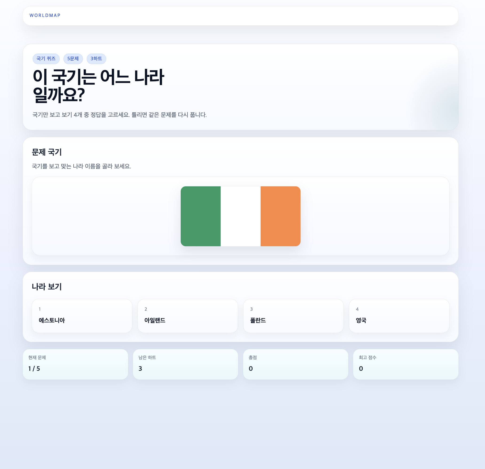

# WorldMap

> 웹에서 바로 열어 보고, 플레이하고, 기록을 남기고, 나에게 어울리는 국가까지 탐색할 수 있는 지리 게임 프로젝트

웹 기반 게임을 직접 기획하고 만들어 보고 싶었습니다.
처음엔 `나라를 찾는 게임` 하나로 시작했지만, 프로젝트를 진행하면서 수도 퀴즈, 국기 퀴즈, 인구 비교 배틀, 국가 추천, 랭킹, 내 기록, 운영 화면까지 확장했습니다.

중간에는 AI를 단순 코드 생성기가 아니라 `기획 실험 파트너`처럼 사용했습니다.
특히 `나에게 어울리는 국가 찾기`는 질문 축을 넓히고, 국가 프로필을 정리하고, 결과를 검증하는 과정에서 AI를 적극적으로 활용해 기능을 키웠습니다.

## 바로 보기

- 공개 데모: [Demo Lite](https://world-map-game-demo-lite-git.pages.dev/)
- 메인 앱: 로컬 실행 가능, 공개 배포 전
- 아키텍처 개요: [docs/ARCHITECTURE_OVERVIEW.md](docs/ARCHITECTURE_OVERVIEW.md)
- 요청 흐름: [docs/REQUEST_FLOW_GUIDE.md](docs/REQUEST_FLOW_GUIDE.md)
- AI 추천 설계 문서: [docs/recommendation/AI_ASSISTED_COUNTRY_MATCH_DESIGN.md](docs/recommendation/AI_ASSISTED_COUNTRY_MATCH_DESIGN.md)
- 재현형 블로그: [blog/README.md](blog/README.md)

## 왜 이 프로젝트를 만들었나

- 단순한 퀴즈 모음이 아니라, `홈 -> 게임 -> 기록 -> 추천 -> 운영 리뷰`가 이어지는 제품을 만들고 싶었습니다.
- 오래 붙잡히는 대표 게임과 짧게 반복할 수 있는 퀴즈를 한 제품 안에 같이 두고 싶었습니다.
- 비회원도 바로 시작할 수 있지만, 마음에 들면 계정으로 기록을 이어 갈 수 있는 흐름을 넣고 싶었습니다.
- 추천 기능도 “그럴듯한 결과”가 아니라, 왜 이런 결과가 나왔는지 설명 가능한 구조로 만들고 싶었습니다.

## Main App과 Demo Lite

| 구분 | 역할 | 무엇을 볼 수 있나 | 현재 상태 |
| --- | --- | --- | --- |
| Main App | 전체 제품 본편 | 서버 주도 게임 루프, 추천, 랭킹, 내 기록, 운영 화면 | 로컬 실행 가능, 공개 배포 전 |
| Demo Lite | 공개 체험판 | 핵심 게임 4종 + 추천 흐름을 빠르게 체험하는 정적 데모 | Cloudflare Pages 공개 중 |

Main App은 실제로 설계한 제품의 전체 그림입니다.
Demo Lite는 메인 앱이 아직 공개 배포되지 않은 상태에서도, 제품 톤과 핵심 플레이 감각을 누구나 바로 체험할 수 있게 분리한 공개 트랙입니다.

## 화면

모든 main 캡처는 최신 다크모드 기준으로 다시 촬영했고, README에 맞게 같은 폭으로 배치했습니다.

### Main App

<table>
  <tr>
    <td width="50%">
      
    </td>
    <td width="50%">
      
    </td>
  </tr>
  <tr>
    <td valign="top">
      <sub>홈에서 오래 하는 게임, 짧게 푸는 퀴즈, 추천 흐름을 한 제품 안에서 고를 수 있게 정리했습니다.</sub>
    </td>
    <td valign="top">
      <sub>대표 모드인 국가 위치 찾기 플레이 화면입니다. 지구본 위에서 직접 나라를 찾는 경험이 이 프로젝트의 출발점입니다.</sub>
    </td>
  </tr>
</table>

### Demo Lite

<table>
  <tr>
    <td width="50%">
      
    </td>
    <td width="50%">
      
    </td>
  </tr>
  <tr>
    <td valign="top">
      <sub>공개 데모에서는 서버 없이도 플레이 감각이 바로 보이도록, 짧게 반복하는 퀴즈 화면을 전면에 두었습니다.</sub>
    </td>
    <td valign="top">
      <sub>추천 기능은 “나에게 어울리는 국가 찾기”라는 제품 방향을 가장 빠르게 전달하는 화면이라 공개 데모에서도 핵심으로 유지했습니다.</sub>
    </td>
  </tr>
</table>

## 어떻게 프로젝트를 확장했나

이 프로젝트에서 보여 주고 싶은 건 기능 수 자체보다, `웹 기반 게임을 어떻게 제품으로 확장했는가`입니다.

### 1. 긴 플레이와 짧은 플레이를 함께 두었다

- `국가 위치 찾기`: 오래 붙잡히는 대표 모드
- `수도 퀴즈 / 국기 퀴즈 / 인구 비교 배틀 / 인구수 퀴즈`: 짧게 반복할 수 있는 모드
- `나에게 어울리는 국가 찾기`: 정답 맞히기와는 다른 종류의 몰입을 만드는 탐색형 흐름

즉, 개별 미니게임을 늘리는 것보다 `서로 다른 길이의 경험이 한 제품 안에서 자연스럽게 이어지는가`를 먼저 봤습니다.

### 2. 기록과 운영 화면을 처음부터 제품 일부로 봤다

- 공개 랭킹은 “다른 사람은 어느 정도까지 갔는가”
- 내 기록은 “나는 어떤 게임에 강한가”
- 운영 화면은 “추천 결과와 제품 반응이 실제로 어떤가”

이렇게 분리해 두면 게임 하나하나보다 `제품 전체가 어떻게 굴러가는지`를 더 설명하기 쉬워집니다.

### 3. 게스트로 바로 시작하고, 마음에 들면 계정으로 이어가게 만들었다

처음부터 회원가입을 강요하면 게임 진입이 무거워집니다.
그래서 게스트로 바로 시작하게 하고, 이후 로그인하면 이전 기록을 계정으로 가져가도록 설계했습니다.

이 흐름 덕분에 제품은 가볍게 시작되지만, 기록과 랭킹은 계속 이어질 수 있습니다.

## AI를 어떻게 활용했나

이 프로젝트에서 AI는 단순한 자동완성 도구보다 `기획과 확장을 빠르게 실험하는 파트너`에 가까웠습니다.

- 아이디어를 질문 구조로 바꾸는 과정에서 빠진 축과 중복 문항을 찾는 데 사용했습니다.
- 국가 추천 기능에서 어떤 국가 프로필 축이 필요한지 후보를 넓히는 데 사용했습니다.
- 페르소나 시나리오와 만족도 개선 루프를 빠르게 점검하는 데 사용했습니다.
- 문서와 테스트에서 설명이 빠진 부분을 찾고, 반복적인 정리 작업을 줄이는 데 사용했습니다.

다만 최종 결과는 항상 제가 직접 결정하고, 코드·테스트·문서로 다시 닫았습니다.

자세한 내용은 별도 문서에 정리했습니다.
→ [AI와 함께 `나에게 어울리는 국가 찾기`를 설계한 과정](docs/recommendation/AI_ASSISTED_COUNTRY_MATCH_DESIGN.md)

## 구현에서 특히 신경 쓴 점

- 게임 상태를 `Session / Stage / Attempt`로 나눠, 상태 있는 플레이를 설명 가능한 구조로 유지했습니다.
- PostgreSQL은 기준 저장소, Redis는 세션과 랭킹 읽기 모델로 역할을 분리했습니다.
- 게스트 플레이를 회원 기록으로 이어받는 ownership 흐름을 넣었습니다.
- 추천 결과는 생성형 문장 대신 규칙 기반 계산으로 고정해 반복 검증이 가능하게 만들었습니다.
- `test`, `browserSmokeTest`, public smoke, deploy preflight까지 검증 레일을 붙였습니다.

## 로컬 실행

### Main App

요구 사항:

- Java 25
- Docker Desktop 또는 Docker Engine

```bash
docker compose up -d
./gradlew bootRun --args='--spring.profiles.active=local'
```

- 실행 주소: [http://localhost:8080](http://localhost:8080)

### Demo Lite

```bash
cd demo-lite
npm install
npm run dev
```

## 검증 명령

### Main App

```bash
./gradlew test
./gradlew browserSmokeTest
```

### Demo Lite

```bash
cd demo-lite
npm test
npm run build
npm run verify:pages
npm run smoke:public -- https://world-map-game-demo-lite-git.pages.dev
```

## 더 읽을 문서

- 아키텍처 개요: [docs/ARCHITECTURE_OVERVIEW.md](docs/ARCHITECTURE_OVERVIEW.md)
- 요청 흐름: [docs/REQUEST_FLOW_GUIDE.md](docs/REQUEST_FLOW_GUIDE.md)
- ERD: [docs/ERD.md](docs/ERD.md)
- 발표 준비: [docs/PRESENTATION_PREP.md](docs/PRESENTATION_PREP.md)
- 추천 오프라인 개선 루프: [docs/recommendation/OFFLINE_AI_SURVEY_IMPROVEMENT.md](docs/recommendation/OFFLINE_AI_SURVEY_IMPROVEMENT.md)
- 추천 페르소나 평가 세트: [docs/recommendation/PERSONA_EVAL_SET.md](docs/recommendation/PERSONA_EVAL_SET.md)
- 재현형 블로그: [blog/README.md](blog/README.md)

## 현재 상태

- Main App은 핵심 기능과 검증 레일이 정리돼 있지만, 아직 공개 운영 URL은 없습니다.
- Demo Lite는 공개 배포 중이며 정적 데모 기준 smoke로 계속 확인합니다.
- 추천 기능은 런타임 LLM 호출이 아니라, AI-assisted 설계와 서버 규칙 기반 계산을 조합한 구조입니다.
