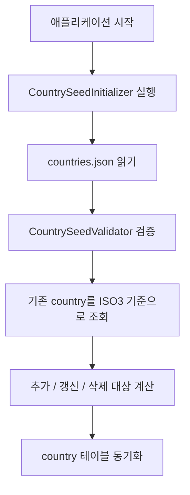

# [Spring Boot 포트폴리오] 03. `country` 엔티티와 국가 시드 데이터를 왜 먼저 넣어야 할까

## 이번 글에서 다루는 것

이 글에서는 WorldMap 프로젝트의 두 번째 단계인 `국가 데이터와 시드 적재`를 정리한다.

이번 단계의 핵심은 단순히 국가 목록 JSON 하나를 넣는 것이 아니다.

1. 게임과 추천 기능이 함께 쓰는 공통 기준 데이터를 만든다.
2. 그 데이터를 `DB에 왜 넣었는지` 설명 가능하게 만든다.
3. 시드 값의 출처와 의미를 나중에 면접에서 답할 수 있게 남긴다.

이번 글을 읽고 나면 아래를 설명할 수 있어야 한다.

1. 왜 `country` 테이블이 먼저 필요한가
2. 왜 JSON 시드 파일을 선택했는가
3. 대표 좌표 1개와 실제 국가 경계 데이터는 무엇이 다른가
4. 시드 적재 로직을 왜 앱 시작 시점에 붙였는가

## 왜 이 단계가 필요한가

이 프로젝트의 모든 기능은 결국 국가 데이터를 사용한다.

- 위치 찾기 게임은 정답이 될 국가를 알아야 한다.
- 인구수 게임은 국가별 인구 값을 알아야 한다.
- 나라 추천 기능도 추천 결과로 어떤 국가를 반환할지 알아야 한다.

즉, 국가 데이터가 정리되지 않으면 나머지 기능은 전부 임시값으로 흘러가게 된다.

그래서 이번 프로젝트에서는 `게임 로직보다 먼저 country 도메인`을 만든다.

## 이번 단계에서 바뀐 파일

- `/Users/alex/project/worldmap/src/main/java/com/worldmap/country/domain/Country.java`
- `/Users/alex/project/worldmap/src/main/java/com/worldmap/country/domain/Continent.java`
- `/Users/alex/project/worldmap/src/main/java/com/worldmap/country/domain/CountryReferenceType.java`
- `/Users/alex/project/worldmap/src/main/java/com/worldmap/country/domain/CountryRepository.java`
- `/Users/alex/project/worldmap/src/main/java/com/worldmap/country/application/CountrySeedInitializer.java`
- `/Users/alex/project/worldmap/src/main/java/com/worldmap/country/application/CountrySeedValidator.java`
- `/Users/alex/project/worldmap/src/main/java/com/worldmap/country/application/CountryCatalogService.java`
- `/Users/alex/project/worldmap/src/main/java/com/worldmap/country/infrastructure/CountrySeedReader.java`
- `/Users/alex/project/worldmap/src/main/java/com/worldmap/country/web/CountryApiController.java`
- `/Users/alex/project/worldmap/src/main/resources/data/countries.json`
- `/Users/alex/project/worldmap/src/test/java/com/worldmap/country/CountrySeedIntegrationTest.java`

## `country` 엔티티에 무엇을 넣었는가

이번 버전의 `Country` 엔티티에는 아래 필드를 넣었다.

- `iso2Code`
- `iso3Code`
- `nameKr`
- `nameEn`
- `continent`
- `capitalCity`
- `referenceLatitude`
- `referenceLongitude`
- `referenceType`
- `population`
- `populationYear`

여기서 가장 중요한 것은 `referenceLatitude`, `referenceLongitude`, `referenceType`이다.

왜냐하면 위치 찾기 게임이라고 해서 처음부터 국가 경계 폴리곤을 다루면 복잡도가 너무 커지기 때문이다.

그래서 첫 버전에서는 이렇게 타협했다.

- 국가마다 정답 기준점 1개만 저장한다.
- 그 기준점이 무엇인지 `referenceType`으로 명시한다.
- 현재는 `CAPITAL_CITY`를 사용한다.

즉, 지금 구조는 “국가 전체 경계”가 아니라 “국가를 대표하는 점 하나”를 저장하는 구조다.

## 왜 JSON 시드 파일을 선택했는가

이번 단계에서는 CSV보다 JSON이 더 적합했다.

이유는 세 가지다.

1. 위도, 경도, enum, 메타데이터를 함께 담기 쉽다.
2. `metadata`와 `countries`를 나눠서 출처와 기준 연도를 같이 저장할 수 있다.
3. Jackson으로 바로 읽기 쉬워 Spring Boot와 자연스럽게 연결된다.

실제 시드 파일은 `/Users/alex/project/worldmap/src/main/resources/data/countries.json`에 있다.

구조는 대략 이렇게 생겼다.

```json
{
  "metadata": {
    "sourceName": "World Bank API",
    "populationIndicator": "SP.POP.TOTL",
    "populationYear": 2024
  },
  "countries": [
    {
      "iso3Code": "KOR",
      "nameKr": "대한민국",
      "continent": "ASIA",
      "referenceType": "CAPITAL_CITY",
      "population": 51751065
    }
  ]
}
```

핵심은 국가 목록만 저장한 것이 아니라, `이 값이 어디서 왔는지`를 같이 남겼다는 점이다.

## 인구수와 좌표 값은 어떻게 정했는가

이번 시드의 인구수는 World Bank API의 `SP.POP.TOTL` 지표를 기준으로 잡았다.

- 기준 연도: 2024
- 출처: World Bank API

대표 좌표는 지금 단계에서 `capital city coordinate`를 사용했다.

이 판단은 완벽해서가 아니라, 첫 버전의 복잡도를 통제하기 위한 선택이다.

즉:

- 인구수는 비교적 설명 가능한 공식 지표를 사용한다.
- 위치는 나중에 고도화할 수 있도록 일단 대표점 1개만 저장한다.

이 차이를 구분해서 설명할 수 있어야 한다.

## 앱 시작 시 시드를 적재하는 흐름

실제 흐름은 아래와 같다.



이 구조를 택한 이유는 간단하다.

- 로컬 개발에서 바로 실행해 볼 수 있다.
- 테스트 환경에서도 같은 방식으로 재현할 수 있다.
- 국가 범위가 바뀌어도 DB와 정적 자산 범위를 쉽게 맞출 수 있다.

단, 이것이 최종 답은 아니다.

운영 환경으로 갈수록 시드 적재와 스키마 마이그레이션은 분리해서 생각해야 한다.

## 시드 검증은 왜 따로 만들었는가

`CountrySeedValidator`를 따로 둔 이유는 “JSON을 읽었다”와 “데이터가 정상이다”를 분리하기 위해서다.

현재 검증하는 것은 아래다.

- ISO2 코드 형식
- ISO3 코드 형식
- 중복 ISO 코드
- 필수값 누락
- 위도/경도 범위
- 인구수 0 이하 여부

이렇게 해두면 잘못된 시드 파일이 들어왔을 때 애플리케이션이 조용히 이상한 상태로 뜨는 것을 막을 수 있다.

## 조회 API를 왜 지금 추가했는가

이번 단계에서 `/api/countries`, `/api/countries/{iso3Code}`를 같이 만든 이유는 두 가지다.

1. 적재된 데이터가 실제로 조회 가능한지 바로 검증하기 위해서
2. 다음 단계 게임 출제 API에서 재사용할 읽기 모델을 미리 만들기 위해서

즉, 시드를 넣는 것에서 끝내지 않고 `읽는 경로`까지 같이 만든 것이다.

## 테스트에서는 무엇을 검증했는가

`CountrySeedIntegrationTest`에서는 아래를 확인한다.

1. 애플리케이션 시작 시 독립국 194건이 동기화되는가
2. 기존 데이터가 있어도 시드 초기화 로직이 국가를 추가 / 복원 / 정리하는가
3. `/api/countries/KOR`가 정상 응답하는가
4. 없는 ISO3 코드는 `404`를 주는가

이 테스트가 중요한 이유는 이번 단계의 핵심 리스크가 “데이터가 진짜 들어갔는가”이기 때문이다.

## 내가 꼭 이해해야 하는 포인트

이번 단계를 끝내고 아래 질문에 답하지 못하면 아직 완전히 이해한 것이 아니다.

1. 왜 국가 데이터를 DB에 넣었나요?
2. 왜 JSON 시드를 택했나요?
3. `referenceLatitude`는 실제 국가 경계 중심점인가요, 수도 좌표인가요?
4. 시드 데이터와 운영 중 생성되는 데이터는 무엇이 다른가요?
5. 왜 잘못된 시드면 앱 시작 자체를 실패시키나요?

## 면접에서는 이렇게 말하면 된다

“게임과 추천 기능이 공통으로 쓰는 기준 데이터를 먼저 `country` 테이블에 정리했습니다. 시드 파일은 JSON으로 두고, 출처와 기준 연도를 메타데이터에 함께 넣어 설명 가능하게 만들었습니다. 대표 좌표는 국가 경계 중심이 아니라 출제용 기준점으로 저장하고, 앱 시작 시에는 이 시드를 ISO3 기준으로 동기화해 DB와 프론트 자산 범위를 항상 맞추도록 했습니다.”

## 다음 글에서 이어질 것

다음 단계에서는 이 국가 데이터를 실제 게임 상태와 연결하기 위해 `game_session`, `game_round` 구조를 설계하게 된다.

즉, 이번 글이 “게임의 재료 준비”였다면 다음 글은 “게임 진행 상태 모델링” 단계다.
