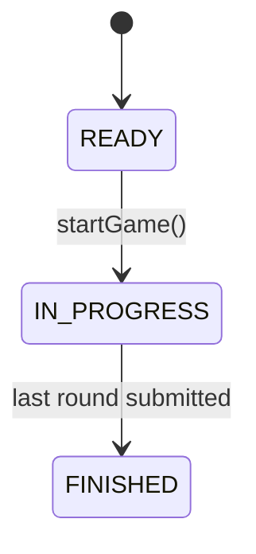
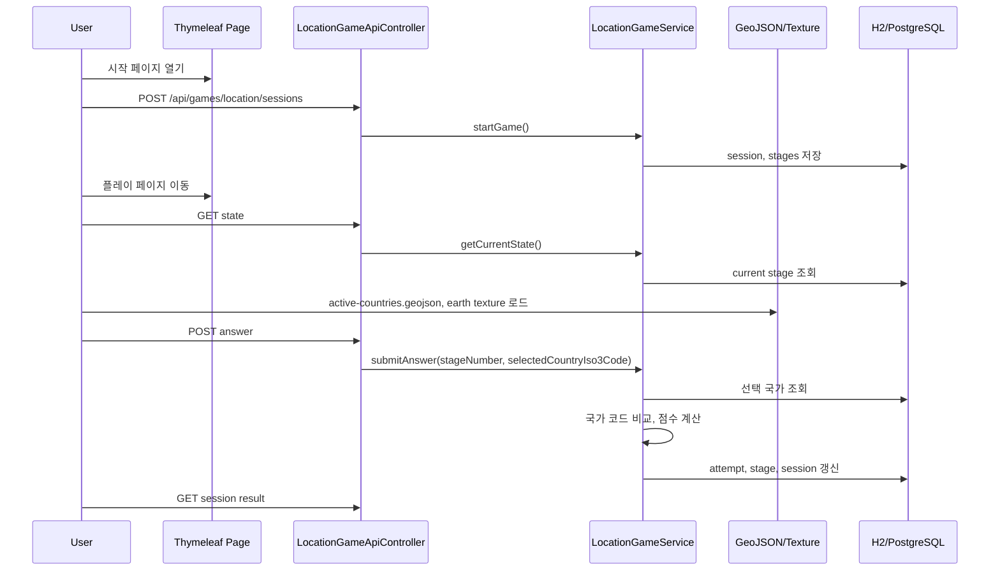

# [Spring Boot 포트폴리오] 04. 3D 지구본에서 나라를 고르게 하고, 서버가 정답을 판정하는 위치 찾기 게임 Level 1 만들기

## 이번 글의 목표

이번 단계에서는 WorldMap 프로젝트의 첫 번째 실제 게임인 `국가 위치 찾기 Level 1`을 실제 요구사항에 맞게 완성한다.

핵심은 프론트가 아니라 서버가 아래를 관리하게 만드는 것이다.

1. 어떤 나라가 출제되는가
2. 현재 몇 번째 라운드인가
3. 사용자가 어떤 나라를 골랐는가
4. 점수를 얼마 줄 것인가
5. 게임이 끝났는가

즉, 이 글의 진짜 주제는 “3D 지구본 렌더링”보다 “서버 주도 게임 상태 관리”다.

## 왜 이 단계가 중요한가

이 프로젝트의 정체성은 백엔드 포트폴리오다.

그래서 위치 찾기 게임도 프론트 애니메이션보다 먼저 아래가 보여야 한다.

- 세션이 생긴다.
- 라운드가 저장된다.
- 답안을 제출하면 서버가 정답을 판정한다.
- 총점과 진행 상태가 DB에 남는다.

이 네 가지가 먼저 있어야 면접에서 “게임형 서비스라도 결국 상태를 다루는 백엔드”라고 설명할 수 있다.

## 이번 단계에서 바뀐 파일

- `/Users/alex/project/worldmap/src/main/java/com/worldmap/game/location/domain/LocationGameSession.java`
- `/Users/alex/project/worldmap/src/main/java/com/worldmap/game/location/domain/LocationGameRound.java`
- `/Users/alex/project/worldmap/src/main/java/com/worldmap/game/location/application/LocationGameService.java`
- `/Users/alex/project/worldmap/src/main/java/com/worldmap/game/location/application/LocationGameScoringPolicy.java`
- `/Users/alex/project/worldmap/src/main/java/com/worldmap/game/location/web/LocationGameApiController.java`
- `/Users/alex/project/worldmap/src/main/java/com/worldmap/game/location/web/LocationGamePageController.java`
- `/Users/alex/project/worldmap/src/main/resources/templates/location-game/start.html`
- `/Users/alex/project/worldmap/src/main/resources/templates/location-game/play.html`
- `/Users/alex/project/worldmap/src/main/resources/templates/location-game/result.html`
- `/Users/alex/project/worldmap/src/main/resources/static/js/location-game.js`
- `/Users/alex/project/worldmap/src/main/resources/static/data/world-countries.geojson`
- `/Users/alex/project/worldmap/src/main/resources/static/images/earth-blue-marble.jpg`
- `/Users/alex/project/worldmap/src/test/java/com/worldmap/game/location/LocationGameFlowIntegrationTest.java`
- `/Users/alex/project/worldmap/src/test/java/com/worldmap/game/location/application/LocationGameScoringPolicyTest.java`

## 세션과 라운드를 왜 분리했는가

이 단계에서 가장 중요한 설계는 `session`과 `round`를 분리한 것이다.

`LocationGameSession`은 판 전체를 나타낸다.

- 플레이어 닉네임
- 총 라운드 수
- 현재 진행 라운드
- 누적 점수
- 게임 상태

`LocationGameRound`는 문제 하나를 나타낸다.

- 몇 번째 문제인지
- 어떤 나라가 출제됐는지
- 사용자가 어떤 나라를 선택했는지
- 정답 여부와 점수

이렇게 나누면 좋은 점이 분명하다.

1. 세션은 게임의 전체 상태를 관리한다.
2. 라운드는 문제별 기록을 저장한다.
3. 결과 페이지에서 라운드별 회고를 보여주기 쉽다.
4. 이후 인구수 게임도 비슷한 세션 구조를 재사용하기 좋다.

## 상태 전이는 어떻게 잡았는가

세션 상태는 세 가지다.

- `READY`
- `IN_PROGRESS`
- `FINISHED`

흐름은 아래와 같다.

여기서 포인트는 세션 생성과 플레이 시작을 분리했다는 점이다.

세션은 먼저 `READY` 상태로 만들어지고, 라운드를 준비한 뒤 `IN_PROGRESS`로 바뀐다.

이 구조를 두면 상태 전이를 코드에서 더 분명히 설명할 수 있다.

## 중복 제출은 어떻게 막았는가

이 단계에서 꼭 챙겨야 하는 예외가 `중복 제출`이다.

예를 들어 1라운드 제출 버튼을 사용자가 두 번 누르면, 서버가 현재 라운드를 2로 올린 뒤 두 번째 요청이 다음 라운드를 잘못 먹을 수 있다.

그래서 이번 버전에서는 답안 제출 요청에 `roundNumber`를 같이 보내도록 했다.

서버는 아래를 검사한다.

1. 요청의 `roundNumber`
2. 세션의 `currentRoundNumber`

둘이 다르면 바로 거절한다.

즉, “프론트가 본 라운드”와 “서버가 현재라고 생각하는 라운드”가 다르면 답안을 받지 않는다.

이게 이번 단계에서 중복 제출 방지의 핵심이다.

## 정답 판정과 점수 계산은 어떤 기준인가

점수 계산은 `LocationGameScoringPolicy`로 분리했다.

현재 정책은 아주 단순하다.

1. 사용자가 선택한 국가 ISO3와 정답 국가 ISO3가 같으면 정답이다.
2. 맞으면 100점, 틀리면 0점이다.

왜 이렇게 했는가?

- 현재 요구사항이 “정확한 국가 선택”이기 때문이다.
- 프론트가 시각적으로 화려해도 판정 기준은 아주 명확해야 설명하기 쉽다.
- 이후 Level 2에서 시간 보너스나 힌트 차등 같은 정책을 넣어도 클래스를 교체하거나 확장하기 쉽다.

## 왜 지구본 UI와 정답 판정 로직을 분리했는가

이 질문이 핵심이다.

현재 UI는 `Globe.gl + GeoJSON + 바닐라 JS`로 3D 지구본을 렌더링한다.

하지만 프론트가 하는 일은 여기까지다.

- 국가 폴리곤을 보여준다.
- 사용자가 클릭한 국가의 `ISO3 코드`를 기억한다.
- 그 코드를 서버에 제출한다.

정답 판정은 서버가 한다.

이렇게 나누면 좋은 점이 분명하다.

1. 프론트가 정답을 미리 알거나 계산하지 않는다.
2. 클라이언트 조작이 있어도 서버가 시드 국가와 현재 라운드를 다시 검증한다.
3. 나중에 지구본 라이브러리를 바꾸더라도 백엔드 API와 세션 구조는 유지할 수 있다.

## 왜 전체 세계 GeoJSON을 그대로 쓰지 않았는가

처음에는 전 세계 국가 폴리곤 전체를 그대로 지구본에 올리려고 했다.

하지만 실제로는 고해상도 GeoJSON 파일이 너무 커서 브라우저가 멈추는 문제가 생겼다.

그래서 현재 Level 1은 전략을 바꿨다.

1. 현재 시드에 들어 있는 독립국 194개만 별도 GeoJSON으로 추린다.
2. 좌표 정밀도를 조금 낮춰 파일 크기를 줄인다.
3. 프론트는 이 경량 자산만 렌더링한다.

이 판단이 중요한 이유는 “좋은 기능”보다 “실제로 사용자 브라우저에서 버티는 기능”이 먼저이기 때문이다.

포트폴리오에서도 이 포인트를 설명할 수 있어야 한다.

- 왜 전체 데이터를 그대로 쓰지 않았는가
- 어떤 기준으로 자산을 줄였는가
- 기능 요구사항과 성능 요구사항을 어떻게 같이 맞췄는가

## 요청 흐름은 어떻게 지나가는가

전체 흐름은 이렇게 본다.

핵심은 프론트가 점수를 계산하지 않는다는 점이다.

프론트는 나라 이름을 보여 주고, 사용자가 선택한 국가 코드를 제출할 뿐이다.

## 테스트는 무엇을 검증했는가

이번 단계에서는 테스트를 두 층으로 나눴다.

### 1. 점수 정책 단위 테스트

`LocationGameScoringPolicyTest`에서 확인한 것:

- 같은 국가 ISO3를 제출하면 100점을 받는가
- 다른 국가 ISO3를 제출하면 0점이 되는가

### 2. 전체 흐름 통합 테스트

`LocationGameFlowIntegrationTest`에서 확인한 것:

- 세션 시작이 되는가
- 현재 라운드를 조회할 수 있는가
- 정답을 제출하면 점수와 상태가 바뀌는가
- 마지막 라운드 후 `FINISHED`로 끝나는가
- 같은 라운드를 다시 제출하면 막히는가

이 조합이 좋은 이유는 “계산 정책”과 “실제 저장 흐름”을 둘 다 증명해 주기 때문이다.

## 내가 꼭 이해해야 하는 질문

1. 왜 세션과 라운드를 분리했는가?
2. 왜 정답 판정을 서버가 해야 하는가?
3. 왜 `roundNumber`를 답안 요청에 포함했는가?
4. 왜 점수 계산을 서비스 본문이 아니라 정책 클래스로 분리했는가?
5. 왜 프론트는 폴리곤 클릭만 하고, 정답 여부는 서버가 계산하는가?
6. 왜 답안 모델을 좌표가 아니라 `selectedCountryIso3Code`로 잡았는가?

## 면접에서는 이렇게 설명하면 된다

“위치 찾기 게임 Level 1에서는 3D 지구본에서 나라를 클릭하는 UI를 만들되, 정답 판정은 서버가 하도록 설계했습니다. 세션에는 전체 상태와 누적 점수를 두고, 라운드에는 문제 국가와 사용자가 선택한 국가, 판정 결과를 저장했습니다. 답안 제출 시 `roundNumber`와 `selectedCountryIso3Code`를 함께 받아 중복 제출과 클라이언트 조작을 막았고, 점수 계산은 별도 정책 클래스로 분리했습니다. 그래서 프론트 연출이 바뀌어도 백엔드의 세션 구조와 판정 로직은 설명 가능하게 유지됩니다.”

## 다음 단계

다음에는 이 세션/라운드 흐름을 참고해서 `국가 인구수 맞추기 게임 Level 1`을 만들게 된다.

그때 핵심 질문은 이것이다.

“무엇을 공통화하고, 무엇을 모드별로 분리할 것인가?”
