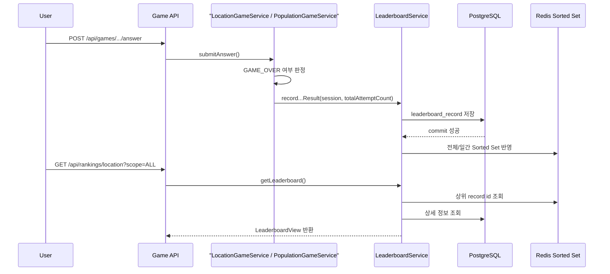

# [Spring Boot 포트폴리오] 06. Redis Sorted Set으로 게임 종료 run을 랭킹에 반영하기

## 이번 글의 핵심 질문

게임이 끝났다고 해서 점수를 결과 페이지에만 보여주고 끝내면 서비스 느낌이 약하다.

그래서 이번 단계의 질문은 이것이다.

“게임 종료 결과를 어디에 어떻게 저장해야 같은 세션 재시작 구조와 충돌하지 않으면서 랭킹까지 설명 가능할까?”

이번 글에서는 그 답을 `LeaderboardRecord + Redis Sorted Set` 구조로 정리한다.

## 왜 세션을 그대로 랭킹 row로 쓰면 안 되는가

WorldMap의 두 게임은 모두 같은 `sessionId`를 다시 시작할 수 있다.

즉, 세션은 “플레이 공간”이지 “종료된 한 판의 결과”가 아니다.

이 구조에서 세션 자체를 랭킹 row로 쓰면 문제가 생긴다.

1. 다시 시작할 때 이전 기록이 덮어써질 수 있다.
2. 게임오버가 여러 번 나도 한 세션으로 뭉개질 수 있다.
3. 일간 / 전체 랭킹에 “종료된 한 판”을 독립적으로 남기기 어렵다.

그래서 이번 단계에서는 세션과 별도로 `leaderboard_record`를 만든다.

핵심은 이것이다.

- 세션: 현재 플레이 공간
- 랭킹 레코드: 종료된 한 판(run)의 결과

## 이번 글에서 다룰 파일

- `/Users/alex/project/worldmap/src/main/java/com/worldmap/ranking/domain/LeaderboardRecord.java`
- `/Users/alex/project/worldmap/src/main/java/com/worldmap/ranking/domain/LeaderboardRecordRepository.java`
- `/Users/alex/project/worldmap/src/main/java/com/worldmap/ranking/application/LeaderboardRankingPolicy.java`
- `/Users/alex/project/worldmap/src/main/java/com/worldmap/ranking/application/LeaderboardService.java`
- `/Users/alex/project/worldmap/src/main/java/com/worldmap/ranking/application/LeaderboardEntryView.java`
- `/Users/alex/project/worldmap/src/main/java/com/worldmap/ranking/application/LeaderboardView.java`
- `/Users/alex/project/worldmap/src/main/java/com/worldmap/ranking/web/LeaderboardApiController.java`
- `/Users/alex/project/worldmap/src/main/java/com/worldmap/ranking/web/LeaderboardPageController.java`
- `/Users/alex/project/worldmap/src/main/java/com/worldmap/game/location/application/LocationGameService.java`
- `/Users/alex/project/worldmap/src/main/java/com/worldmap/game/population/application/PopulationGameService.java`
- `/Users/alex/project/worldmap/src/test/java/com/worldmap/ranking/LeaderboardIntegrationTest.java`

## 먼저 알아둘 개념

### 1. Redis Sorted Set

랭킹은 “점수 순으로 정렬된 상위 N명”을 빨리 읽는 문제가 핵심이다.

이때 Redis Sorted Set은 멤버와 점수를 함께 저장하고 정렬 조회를 빠르게 제공한다.

### 2. Source of Truth

Redis는 빠르지만 영속 저장소는 아니다.

그래서 진실 공급원은 RDB에 두고, Redis는 읽기 최적화된 read model로 쓰는 것이 안전하다.

### 3. After Commit

트랜잭션 안에서 RDB 저장이 실패했는데 Redis만 먼저 갱신되면 데이터가 어긋난다.

그래서 이번 구조는 `RDB 저장 -> commit 성공 -> Redis 반영` 순서를 지킨다.

## 왜 `LeaderboardRecord`가 필요한가

이번 단계의 핵심 엔티티는 `LeaderboardRecord`다.

이 엔티티는 아래 정보를 가진다.

- 어떤 게임 모드인지
- 어떤 세션에서 나온 run인지
- 플레이어 닉네임이 무엇인지
- 총점이 얼마인지
- 몇 Stage를 클리어했는지
- 총 시도 수가 몇 번인지
- 언제 끝났는지
- Redis 정렬에 쓸 `rankingScore`

특히 중요한 필드는 두 개다.

### `runSignature`

같은 종료 결과가 두 번 들어가지 않게 막는 idempotency 키다.

현재는 `gameMode + sessionId + finishedAt` 조합으로 만든다.

### `leaderboardDate`

일간 랭킹 키를 만들 때 쓰는 날짜다.

현재는 `finishedAt.toLocalDate()`를 저장한다.

즉, 랭킹 엔티티는 단순 점수표가 아니라 `종료된 게임 run의 요약본`이다.

## 왜 점수와 랭킹 점수를 분리했는가

게임이 가진 실제 점수와 랭킹 정렬 기준은 꼭 같을 필요가 없다.

그래서 이번 단계에서는 `LeaderboardRankingPolicy`를 따로 둔다.

현재 정책은 아래처럼 계산한다.

- 총점 가중치
- 클리어 Stage 수 가중치
- 시도 수가 적을수록 작은 보너스

즉, 정렬 기준은 단순 총점만이 아니라 “얼마나 멀리 갔고, 얼마나 효율적으로 갔는가”까지 반영한다.

이걸 서비스 본문에 넣지 않고 정책 클래스로 분리한 이유는 명확하다.

1. 랭킹 정렬 규칙을 테스트 가능하게 만들기 위해
2. 나중에 동점 처리 기준이 바뀌어도 서비스 흐름을 흔들지 않기 위해
3. “게임 점수”와 “랭킹 정렬 점수”를 다르게 설명할 수 있게 하기 위해

## `LeaderboardService`는 무엇을 하는가

이번 단계의 중심 서비스는 `LeaderboardService`다.

여기서 핵심 메서드는 네 개다.

### 1. `recordLocationLevelOneResult()`

- 입력: 위치 게임 세션, 총 시도 수
- 역할: 위치 게임 종료 결과를 랭킹 저장 흐름으로 넘긴다.

### 2. `recordPopulationLevelOneResult()`

- 입력: 인구수 게임 세션, 총 시도 수
- 역할: 인구수 게임 종료 결과를 랭킹 저장 흐름으로 넘긴다.

### 3. `recordResult()`

- 입력: 모드, 세션 id, 닉네임, 총점, 클리어 수, 총 시도 수, 종료 시각
- 역할:
  - 종료 시간이 있는지 확인
  - `runSignature` 중복 여부 확인
  - `LeaderboardRecord` 저장
  - 커밋 이후 Redis 반영 예약

즉, 진짜 비즈니스 규칙은 이 메서드에 모여 있다.

### 4. `getLeaderboard()`

- 입력: 게임 모드, 범위(전체/일간), limit
- 역할:
  - Redis에서 상위 record id 조회
  - RDB에서 상세 정보 조합
  - Redis가 비었거나 깨졌으면 RDB fallback 후 재구성

즉, 이 메서드는 “빠른 조회”와 “복구 가능한 조회”를 동시에 책임진다.

## 왜 이 로직이 컨트롤러가 아니라 서비스에 있어야 하는가

랭킹 반영은 단순 CRUD가 아니다.

한 번의 종료 처리 안에 아래가 모두 들어 있다.

1. 현재 run 요약 계산
2. RDB 저장
3. 중복 기록 방지
4. 커밋 이후 Redis 반영
5. Redis 유실 시 fallback 복구

이건 요청 파라미터를 해석하는 수준이 아니라 도메인 규칙이다.

그래서 컨트롤러가 아니라 서비스에 있어야 한다.

컨트롤러는 아래처럼 얇게 남는 편이 맞다.

- `LeaderboardApiController`
  - `/api/rankings/{gameMode}` 요청을 받아 서비스 호출
- `LeaderboardPageController`
  - `/ranking` 페이지를 SSR로 렌더링하기 위해 서비스 호출

## 실제 요청 흐름은 어떻게 지나가는가

핵심은 저장과 조회 모두 서비스가 기준을 갖고 있다는 점이다.

프론트는 단지 `/ranking`이나 `/api/rankings/*`를 호출할 뿐이다.

## Redis가 비었을 때는 어떻게 하는가

이번 단계에서 중요한 안정화 포인트가 하나 더 있다.

Redis 키가 비어 있거나 일부 레코드 id가 깨져 있을 수 있다.

이때 `getLeaderboard()`는 아래처럼 처리한다.

1. Redis에서 상위 id 조회
2. 비어 있으면 RDB에서 상위 레코드 조회
3. 레코드를 다시 Redis에 동기화
4. Redis id와 RDB 레코드 수가 다르면 Redis 키 재구성

즉, Redis가 읽기 최적화 계층이지만 없어도 서비스는 돌아간다.

이 설계는 면접에서 설명 가치가 높다.

## 테스트는 무엇을 검증했는가

이번 단계의 핵심 테스트는 `LeaderboardIntegrationTest`다.

### 1. 위치 게임 종료 후 랭킹 반영

- 실제 위치 게임을 시작한다.
- 한 Stage는 맞히고, 다음 Stage에서 3번 틀려 `GAME_OVER`를 만든다.
- `/api/rankings/location`과 `/ranking`을 호출해 랭킹이 보이는지 확인한다.
- Redis ZSet cardinality도 확인한다.

### 2. Redis 유실 시 DB fallback 복구

- 실제 인구수 게임을 플레이해 랭킹 레코드를 만든다.
- Redis 키를 직접 비운다.
- `/api/rankings/population`을 다시 호출한다.
- 서비스가 RDB에서 읽어온 뒤 Redis 키를 다시 만드는지 확인한다.

즉, 이번 테스트는 단순 조회 테스트가 아니라 “실제 게임 종료 -> 랭킹 반영 -> 복구 가능한 조회” 전체를 검증한다.

## 내가 꼭 답할 수 있어야 하는 질문

1. 왜 세션이 아니라 `leaderboard_record`를 따로 만들었는가?
2. 왜 Redis보다 RDB를 먼저 저장하는가?
3. 왜 Redis 반영을 `after commit`으로 미뤘는가?
4. `rankingScore`와 `totalScore`는 왜 분리했는가?
5. Redis 키가 날아가면 어떻게 복구하는가?

## 면접에서는 이렇게 설명하면 된다

“랭킹은 세션을 그대로 재사용하지 않고, 종료된 한 판의 결과를 `leaderboard_record`로 따로 저장했습니다. 이유는 게임이 같은 `sessionId`로 다시 시작될 수 있어서 세션 자체를 랭킹 row로 쓰면 이전 기록이 덮어써질 수 있기 때문입니다. 저장은 항상 RDB가 먼저고, 커밋이 끝난 뒤 Redis Sorted Set의 전체/일간 키에 record id를 반영합니다. 조회는 Redis에서 상위 id를 빠르게 가져오고, 상세 정보는 RDB에서 채우며, Redis가 비어 있으면 RDB로 fallback해서 키를 다시 복구합니다.”

## 다음 글

다음 글에서는 이 랭킹 구조를 바탕으로 `/ranking` 화면에 짧은 주기 폴링을 붙여, “실시간처럼 보이는 랭킹 페이지”를 만드는 과정을 정리한다.
