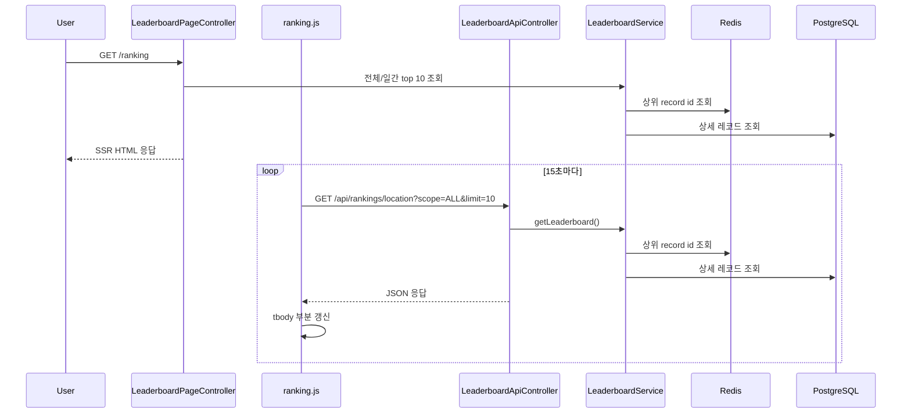

# [Spring Boot 포트폴리오] 07. SSE 대신 15초 폴링으로 랭킹 화면을 살아 있게 만들기

## 이번 글의 핵심 질문

랭킹 데이터를 Redis에 넣었다고 해서 사용자가 “실시간 같다”고 느끼는 것은 아니다.

페이지가 처음 SSR로 렌더링된 뒤 그대로 멈춰 있으면, Redis를 썼는지 아닌지도 잘 드러나지 않는다.

그래서 이번 단계의 질문은 이것이다.

“이미 만든 랭킹 API를 재사용하면서도, 화면이 계속 살아 움직이는 것처럼 보이게 하려면 무엇을 먼저 붙여야 할까?”

이번 글에서는 그 답을 `짧은 주기 폴링`으로 정리한다.

## 왜 바로 SSE로 가지 않았는가

실시간 UI를 만들 때 흔히 떠올리는 선택지는 SSE나 WebSocket이다.

그런데 현재 단계에서는 그보다 먼저 확인해야 할 것이 있다.

1. 랭킹 저장 구조가 안정적인가
2. 읽기 API가 충분히 단순한가
3. 화면이 부분 갱신만으로 자연스럽게 바뀌는가

이 세 가지가 먼저다.

그래서 이번 단계에서는 복잡도를 한 단계 낮춰 `15초 폴링`으로 시작했다.

이 선택의 장점은 분명하다.

- 기존 API를 그대로 재사용한다.
- 서버 구조를 새로 열지 않는다.
- 프론트는 표의 `tbody`만 바꾸면 된다.
- 나중에 SSE로 바꿔도 SSR 초기 렌더링 구조는 유지된다.

즉, 현재 단계에서는 “실시간 전달 기술”보다 “갱신 구조를 설명 가능하게 만드는 것”이 우선이다.

## 이번 글에서 다룰 파일

- `/Users/alex/project/worldmap/src/main/resources/templates/ranking/index.html`
- `/Users/alex/project/worldmap/src/main/resources/static/js/ranking.js`
- `/Users/alex/project/worldmap/src/main/resources/static/css/site.css`
- `/Users/alex/project/worldmap/src/main/java/com/worldmap/ranking/web/LeaderboardPageController.java`
- `/Users/alex/project/worldmap/src/main/java/com/worldmap/ranking/web/LeaderboardApiController.java`
- `/Users/alex/project/worldmap/src/test/java/com/worldmap/ranking/LeaderboardIntegrationTest.java`

## 먼저 알아둘 개념

### 1. SSR 초기 렌더링

`/ranking`은 처음에는 서버가 HTML을 완성해서 내려준다.

즉, 자바스크립트가 늦게 붙더라도 첫 화면은 바로 볼 수 있다.

### 2. 점진적 향상

초기 HTML은 SSR로 안정적으로 주고, 이후에만 JS가 표를 다시 그린다.

이 구조가 SSR + 바닐라 JS 조합의 장점이다.

### 3. 부분 갱신

전체 페이지를 새로고침하지 않고, 필요한 영역만 바꾸는 방식이다.

이번 단계에서는 각 랭킹 표의 `tbody`만 다시 그린다.

## `ranking/index.html`은 무엇을 바꿨는가

이번 단계에서 템플릿은 두 역할을 가진다.

1. SSR 첫 화면을 안정적으로 그린다.
2. 폴링 대상이 되는 표의 위치를 명확히 표시한다.

그래서 각 `tbody`에 아래 data 속성을 둔다.

- `data-game-mode="location" | "population"`
- `data-scope="ALL" | "DAILY"`

이렇게 해두면 JS는 “이 표가 어떤 API를 다시 호출해야 하는지”를 직접 알 수 있다.

또 상단에는 아래 상태 UI를 추가했다.

- 자동 갱신 상태
- 마지막 갱신 시각
- `지금 새로고침` 버튼

즉, 사용자가 “지금 화면이 어떻게 갱신되고 있는지”를 읽을 수 있게 한 것이다.

## `ranking.js`의 핵심 메서드는 무엇인가

이번 단계의 중심은 `ranking.js`다.

여기서 핵심 메서드는 세 개다.

### 1. `refreshLeaderboards()`

- 역할:
  - 모든 랭킹 표의 `gameMode`, `scope`를 읽는다.
  - `/api/rankings/{gameMode}?scope=${scope}&limit=10`을 병렬로 호출한다.
  - 응답을 받아 각 표의 `tbody`를 다시 그린다.
  - 마지막 갱신 시각과 상태 문구를 갱신한다.

중요한 점은 `refreshInFlight` 플래그를 둬서 중복 갱신을 막는다는 것이다.

### 2. `renderLeaderboardRows()`

- 역할:
  - 응답 entries를 HTML row로 바꾼다.
  - 랭킹이 비어 있으면 “아직 기록이 없습니다” 행을 그린다.

즉, 이 함수는 API 결과를 DOM에 반영하는 가장 좁은 책임만 맡는다.

### 3. `handleVisibilityChange()`

- 역할:
  - 탭이 보이지 않으면 자동 갱신을 멈춘다.
  - 다시 보이면 즉시 한 번 갱신한 뒤 타이머를 재시작한다.

이 로직이 중요한 이유는, 폴링은 단순하지만 방치하면 불필요한 호출이 늘어나기 쉽기 때문이다.

## 왜 이 로직이 서버가 아니라 프론트에 있어야 하는가

이번 단계에서 바뀐 것은 “어떻게 저장하느냐”가 아니라 “이미 있는 데이터를 화면에서 어떻게 다시 읽느냐”다.

즉, 랭킹 저장과 정렬은 이미 서버가 맡고 있다.

이번에 프론트가 맡는 책임은 아래뿐이다.

- 언제 갱신할지
- 어떤 표를 다시 그릴지
- 오류 메시지를 어떻게 보여줄지

반대로 아래는 여전히 서버 책임이다.

- 랭킹 점수 계산
- Redis 조회
- RDB fallback
- 전체 / 일간 구분

이 분리가 중요하다.

그래야 나중에 SSE로 바꿔도 서버의 랭킹 도메인 구조를 흔들지 않는다.

## 실제 요청 흐름은 어떻게 지나가는가

핵심은 SSR과 API 갱신이 같은 서비스를 재사용한다는 점이다.

즉, 같은 도메인 규칙을 두 개로 복제하지 않았다.

## 오류와 백그라운드 탭은 어떻게 처리했는가

폴링에서 중요한 것은 “실패했을 때 더 나쁘게 보이지 않게” 만드는 것이다.

이번 단계에서는 아래처럼 처리했다.

### 오류 발생 시

- 기존 표 내용은 유지한다.
- 상단 메시지 박스에 오류만 보여준다.

즉, 잠깐의 실패가 전체 페이지를 깨뜨리지는 않는다.

### 백그라운드 탭일 때

- 폴링 타이머를 멈춘다.
- 상태 문구를 `탭 비활성화로 자동 갱신 일시정지`로 바꾼다.
- 다시 활성화되면 즉시 한 번 새로고침한다.

이렇게 하면 불필요한 API 호출을 줄이면서도 사용자 체감은 유지할 수 있다.

## 테스트는 무엇을 검증했는가

이번 단계는 프론트 동작이 들어가서 테스트를 두 층으로 봤다.

### 1. JS 문법 확인

- `node --check src/main/resources/static/js/ranking.js`

즉, 최소한 배포 가능한 JS 문법 상태는 보장했다.

### 2. 랭킹 페이지 통합 테스트

`LeaderboardIntegrationTest`에서 아래를 확인했다.

- `/ranking` 페이지가 정상 렌더링되는가
- `지금 새로고침` 버튼이 HTML에 들어가는가
- 위치/인구수 랭킹 모델이 같이 내려가는가

즉, 이번 단계의 테스트 포인트는 “저장 구조”가 아니라 “랭킹 페이지가 갱신 가능한 형태로 SSR된다”는 것이다.

## 내가 꼭 답할 수 있어야 하는 질문

1. 왜 바로 SSE가 아니라 폴링으로 시작했는가?
2. 왜 SSR 첫 렌더링과 폴링 갱신을 같이 쓰는가?
3. 왜 표 전체가 아니라 `tbody`만 다시 그리는가?
4. 왜 백그라운드 탭에서 폴링을 멈추는가?
5. 왜 랭킹 정렬 규칙은 프론트가 아니라 서버가 계속 맡아야 하는가?

## 면접에서는 이렇게 설명하면 된다

“랭킹 1차에서는 Redis Sorted Set에 저장하고 읽는 구조를 먼저 만들었고, 2차에서는 `/ranking` 화면에 15초 주기 폴링을 붙여 실시간처럼 보이게 만들었습니다. 초기 화면은 SSR로 안정적으로 렌더링하고, 이후에는 기존 랭킹 API를 주기적으로 다시 호출해 각 표의 `tbody`만 부분 갱신합니다. 탭이 비활성화되면 호출을 멈추고, 다시 활성화되면 즉시 한 번 갱신하도록 해서 불필요한 트래픽도 줄였습니다.”

## 다음 글

다음 단계는 추천 기능 쪽으로 넘어간다.

이제 게임과 랭킹 흐름이 어느 정도 잡혔으니, 다음에는 설문 기반 추천 엔진을 어떻게 서버 주도로 설계할지 정리할 차례다.
