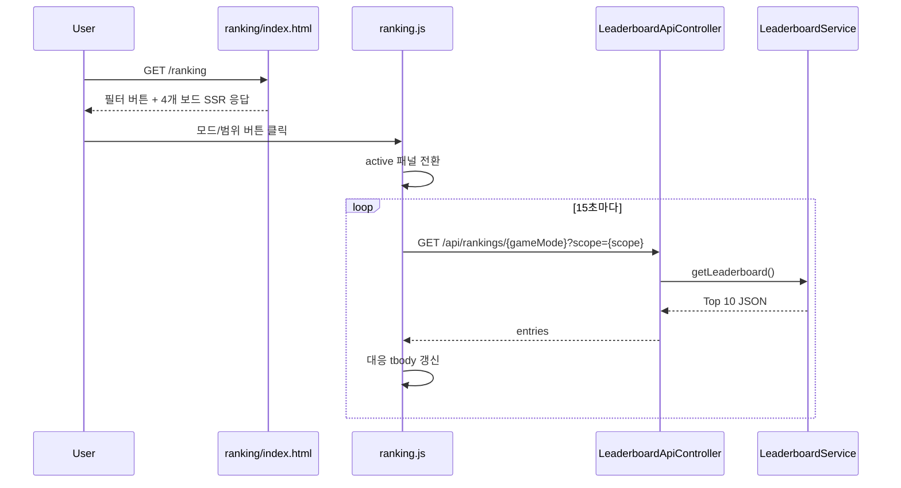

# [Spring Boot 포트폴리오] 08. 랭킹 화면에 모드/범위 필터와 동점 규칙을 정리하기

## 이번 글의 핵심 질문

랭킹 저장 구조와 폴링까지 붙여도 화면이 여전히 복잡하면 사용자는 핵심을 빨리 읽지 못한다.

특히 이전 버전의 `/ranking`은 아래 문제가 있었다.

1. 위치 / 인구수
2. 전체 / 일간

이 네 보드를 한 화면에 모두 펼쳐 보여줘서, “지금 내가 어떤 보드를 보고 있는지”가 약했다.

그래서 이번 단계의 질문은 이것이다.

“백엔드 API는 그대로 두고, 랭킹 화면만 더 읽기 쉽게 정리하려면 무엇을 바꿔야 할까?”

이번 글에서는 그 답을 `모드/범위 필터 + active 보드 전환 + 동점 규칙 노출`로 정리한다.

## 왜 이 단계가 필요한가

랭킹 기능의 핵심은 이미 있었다.

- 게임 종료 시 run 저장
- Redis Sorted Set 반영
- 전체 / 일간 조회
- 15초 폴링

그런데 화면은 아직 “보여줄 수 있다” 수준이지, “설명하기 쉽다” 수준은 아니었다.

포트폴리오에서 중요한 건 단순히 기능이 많아 보이는 것이 아니다.

사용자가 한 화면을 보고 아래를 바로 이해할 수 있어야 한다.

- 지금 어떤 게임의 랭킹인지
- 전체 랭킹인지 오늘 랭킹인지
- 동점이면 어떤 기준으로 순위가 갈리는지

그래서 이번 단계는 새로운 API를 만드는 작업이 아니라, 기존 랭킹 구조를 더 잘 읽히게 만드는 UX 정리 단계다.

## 이번 글에서 다룰 파일

- `/Users/alex/project/worldmap/src/main/resources/templates/ranking/index.html`
- `/Users/alex/project/worldmap/src/main/resources/static/js/ranking.js`
- `/Users/alex/project/worldmap/src/main/resources/static/css/site.css`
- `/Users/alex/project/worldmap/src/test/java/com/worldmap/ranking/LeaderboardIntegrationTest.java`

## 먼저 알아둘 개념

### 1. Active Board

여러 보드를 한 번에 다 보여주는 대신, 현재 사용자가 선택한 보드 하나만 크게 보여주는 방식이다.

이번 단계에서는 아래 조합 중 하나만 메인 테이블로 보인다.

- 위치 찾기 + 전체
- 위치 찾기 + 일간
- 인구수 맞추기 + 전체
- 인구수 맞추기 + 일간

### 2. 화면 필터와 도메인 규칙의 분리

필터 전환은 프론트가 맡아도 된다.

반면 정렬 기준, 동점 처리, 상위 10명 계산은 여전히 서버가 맡아야 한다.

즉, “어떤 보드를 보여줄지”는 UI 책임이고, “어떻게 정렬할지”는 서버 책임이다.

### 3. 같은 API 재사용

기존 `/api/rankings/location`, `/api/rankings/population`은 이미 `scope=ALL|DAILY`를 받는다.

그래서 이번 단계에서는 새 API를 늘리지 않고, 같은 API를 계속 재사용하는 쪽이 맞다.

## 화면 구조를 어떻게 바꿨는가

이전 버전은 `All Time 2개 + Daily 2개`를 동시에 보여줬다.

이번 버전은 구조를 이렇게 바꿨다.

1. 상단 자동 갱신 상태 바 유지
2. `게임 모드`, `집계 범위` 필터 버튼 추가
3. 동점 처리 규칙 카드 추가
4. active 보드 1개만 메인 테이블로 노출

즉, 네 보드를 동시에 읽게 하지 않고 “하나의 메인 보드 + 명확한 전환” 구조로 바꿨다.

## `ranking/index.html`은 어떤 역할을 하나

이번 단계에서 템플릿은 두 가지를 한다.

### 1. 필터 버튼과 규칙 카드를 SSR로 렌더링

사용자는 JS가 돌기 전에도 현재 화면이 무슨 기능을 하는지 읽을 수 있다.

### 2. 4개 보드를 모두 SSR로 준비하되, active 보드만 보이게 함

각 패널에는 아래 속성을 둔다.

- `data-ranking-panel="location:ALL"`
- `data-title`
- `data-copy`

이렇게 해두면 JS는 현재 필터 상태에 맞는 패널만 보이게 하면 된다.

즉, “필터를 누를 때마다 서버에 새 HTML을 요청”하지 않아도 된다.

## `ranking.js`에서 핵심으로 바뀐 부분은 무엇인가

이번 단계의 중심 메서드는 `syncActiveBoardUi()`다.

이 함수는 아래를 한 번에 처리한다.

1. 어떤 모드 버튼이 active인지 표시
2. 어떤 범위 버튼이 active인지 표시
3. 현재 선택한 보드 패널만 보이게 처리
4. 상단 제목과 설명 문구를 현재 보드에 맞게 교체

즉, 이 함수가 “필터 상태”와 “보이는 화면”을 연결한다.

추가로 `switchMode()`, `switchScope()`는 active 상태만 바꾸고, 실제 화면 동기화는 다시 `syncActiveBoardUi()`에 맡긴다.

이렇게 나누면 “입력 처리”와 “렌더링 동기화” 책임이 분리된다.

## 왜 이 로직이 프론트에 있어야 하는가

이번 단계에서 바뀐 것은 정렬 결과가 아니라 표현 방식이다.

서버는 이미 아래를 잘 하고 있다.

- Redis 조회
- RDB fallback
- top 10 계산
- 동점 처리

그래서 이번 단계에서 프론트가 맡는 책임은 오직 이것뿐이다.

- 어떤 보드를 현재 보여줄지
- active 버튼 스타일을 어떻게 바꿀지
- 상단 제목과 설명을 어떻게 바꿀지

만약 이걸 서버 새 엔드포인트나 새 템플릿 분기로 풀기 시작하면, 설명 가치보다 복잡도만 늘어난다.

## 동점 처리 규칙은 왜 화면에 적어야 하는가

동점 처리 규칙은 백엔드 코드 안에만 있으면 사용자도, 면접관도 읽기 어렵다.

현재 실제 정렬 기준은 이렇다.

1. `LeaderboardRankingPolicy`가 만든 내부 `rankingScore`
2. 그래도 같으면 더 빨리 끝난 run

이걸 화면에 적어두면 좋은 점이 있다.

- “왜 이 사람이 위에 있는지”를 설명할 수 있다.
- 단순 총점 랭킹이 아니라는 점이 드러난다.
- Redis Sorted Set에 넣는 score가 어떤 의미인지 UI에서도 이어진다.

즉, 동점 처리 규칙은 단순 안내 문구가 아니라 백엔드 설계를 사용자에게 드러내는 장치다.

## 실제 요청 흐름은 어떻게 지나가는가

핵심은 필터 전환과 데이터 갱신이 분리돼 있다는 점이다.

- 필터 전환: 프론트 로컬 상태
- 랭킹 계산: 서버

이 경계가 깔끔해야 설명이 쉽다.

## 테스트는 무엇을 검증했는가

이번 단계는 백엔드 도메인을 바꾼 것이 아니라 랭킹 화면 구성을 바꾼 것이다.

그래서 테스트도 그 변화에 맞췄다.

### 1. `LeaderboardIntegrationTest`

`GET /ranking` 응답에서 아래가 들어가는지 확인했다.

- `지금 새로고침`
- `게임 모드`
- `동점 처리`

즉, 새 랭킹 화면이 기대한 필터/설명 요소를 SSR로 내리는지 확인한 것이다.

### 2. `node --check src/main/resources/static/js/ranking.js`

필터 전환 로직이 들어간 JS 문법 상태를 확인했다.

## 내가 꼭 답할 수 있어야 하는 질문

1. 왜 4개 보드를 동시에 보여주지 않고 active 보드 1개만 보이게 바꿨는가?
2. 왜 새 API를 만들지 않고 기존 랭킹 API를 재사용했는가?
3. 왜 필터 전환은 프론트가 맡고, 정렬은 서버가 맡아야 하는가?
4. 동점 처리 규칙을 왜 화면에 적어야 하는가?
5. 이 변경은 도메인 변경인가, 표현 변경인가?

## 면접에서는 이렇게 설명하면 된다

“랭킹 저장 구조와 폴링은 이미 있었지만, 이전 화면은 위치/인구수와 전체/일간 보드를 한 번에 다 보여줘서 읽기 어려웠습니다. 그래서 이번에는 기존 API는 그대로 두고, 프론트에서 active 보드만 전환하는 필터 UI를 추가했습니다. 정렬과 동점 처리는 계속 서버가 맡고, 화면에는 그 규칙을 명시해서 백엔드 설계가 UI에서도 읽히게 만들었습니다.”

## 다음 글

다음 단계는 추천 기능이다.

이제 게임과 랭킹의 기본 축이 잡혔으니, 다음에는 설문 문항과 가중치를 기반으로 국가 후보를 계산하는 추천 엔진을 설계할 차례다.
