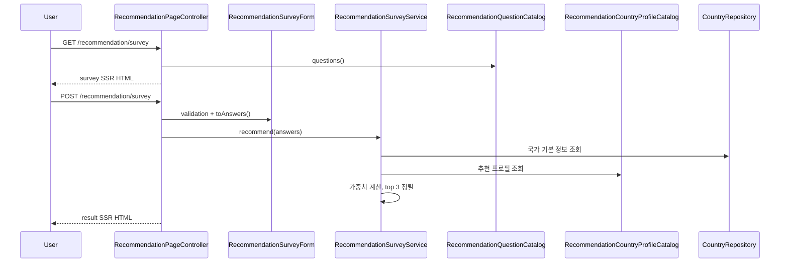

# [Spring Boot 포트폴리오] 09. 설문 답변을 서버 가중치로 계산해 top 3 국가를 추천하기

## 이번 글의 핵심 질문

추천 기능을 만들 때 가장 먼저 부딪히는 유혹은 “LLM에게 그냥 추천도 맡기자”는 생각이다.

하지만 그렇게 하면 두 가지 문제가 생긴다.

1. 같은 입력에 같은 결과가 나온다는 보장이 약해진다.
2. 왜 이 나라가 추천됐는지 백엔드 관점에서 설명하기 어려워진다.

그래서 이번 단계의 질문은 이것이다.

“LLM 없이도 설문 답변만으로 설명 가능한 추천 결과를 먼저 만들려면 어떻게 설계해야 할까?”

이번 글에서는 그 답을 `질문 카탈로그 + 불변 답변 객체 + 국가 프로필 카탈로그 + 가중치 계산 서비스` 구조로 정리한다.

## 왜 추천 계산과 설명 생성을 분리해야 하는가

이 프로젝트의 추천 기능은 처음부터 두 층으로 나눠야 한다.

- 계산: 서버가 deterministic하게 top 3 국가를 뽑는다.
- 설명: 나중에 LLM이 “왜 이 나라가 맞는지”를 자연어로 풀어준다.

이렇게 나누는 이유는 명확하다.

1. 추천 결과의 source of truth를 서버에 둘 수 있다.
2. 같은 입력에 같은 결과를 보장할 수 있다.
3. LLM이 실패해도 추천 기능 전체가 무너지지 않는다.

즉, 이번 단계의 목적은 “추천 문장”이 아니라 `추천 결과 계산기`를 먼저 만드는 것이다.

## 이번 글에서 다룰 파일

- `/Users/alex/project/worldmap/src/main/java/com/worldmap/recommendation/domain/RecommendationSurveyAnswers.java`
- `/Users/alex/project/worldmap/src/main/java/com/worldmap/recommendation/application/RecommendationQuestionCatalog.java`
- `/Users/alex/project/worldmap/src/main/java/com/worldmap/recommendation/application/RecommendationCountryProfileCatalog.java`
- `/Users/alex/project/worldmap/src/main/java/com/worldmap/recommendation/application/RecommendationSurveyService.java`
- `/Users/alex/project/worldmap/src/main/java/com/worldmap/recommendation/web/RecommendationSurveyForm.java`
- `/Users/alex/project/worldmap/src/main/java/com/worldmap/recommendation/web/RecommendationPageController.java`
- `/Users/alex/project/worldmap/src/main/resources/templates/recommendation/survey.html`
- `/Users/alex/project/worldmap/src/main/resources/templates/recommendation/result.html`
- `/Users/alex/project/worldmap/src/test/java/com/worldmap/recommendation/application/RecommendationSurveyServiceTest.java`
- `/Users/alex/project/worldmap/src/test/java/com/worldmap/recommendation/RecommendationPageIntegrationTest.java`

## 먼저 알아둘 개념

### 1. 질문 카탈로그

질문 문구와 선택지를 컨트롤러나 템플릿에 직접 하드코딩하지 않고, 서버 카탈로그로 관리하는 방식이다.

이렇게 해야 설문 문항도 “서버가 가진 추천 규칙”의 일부가 된다.

### 2. 불변 답변 객체

HTTP 요청으로 들어온 설문 값은 폼 객체로 먼저 받고, 실제 계산에는 불변 값 객체를 넘기는 편이 좋다.

이번 단계에서는 `RecommendationSurveyForm -> RecommendationSurveyAnswers` 흐름으로 나눴다.

### 3. 국가 프로필 카탈로그

현재 `country` 테이블에는 ISO 코드, 대륙, 좌표, 인구수는 있지만 기후나 생활 속도, 영어 친화도 같은 추천 속성은 없다.

그래서 이번 단계에서는 추천 전용 프로필을 별도 카탈로그로 둔다.

즉, 국가 기본 데이터와 추천 속성을 분리해서 시작한 것이다.

## 왜 답변을 바로 DB 엔티티로 저장하지 않았는가

이번 첫 조각에서는 아직 설문 답변을 DB에 저장하지 않는다.

대신 아래처럼 시작한다.

- `RecommendationSurveyForm`
  - 웹 요청 바인딩과 validation 담당
- `RecommendationSurveyAnswers`
  - 실제 추천 계산에 넘기는 불변 값 객체

이렇게 한 이유는 지금 단계의 핵심이 “기록”이 아니라 “결정 규칙”이기 때문이다.

즉, 아직은 다음 질문이 더 중요하다.

- 문항은 무엇인가?
- 어떤 가중치로 계산하는가?
- top 3를 어떻게 뽑는가?

답변 저장은 이후 전적이나 추천 기록과 함께 붙여도 늦지 않다.

## 질문 카탈로그는 어떤 역할을 하는가

`RecommendationQuestionCatalog`는 6개 문항을 관리한다.

현재 문항은 아래다.

1. 기후 취향
2. 생활 속도
3. 물가 허용 범위
4. 도시 / 자연 취향
5. 영어 중요도
6. 최우선 기준

이 카탈로그가 좋은 이유는 두 가지다.

1. 설문 페이지 SSR 렌더링에 그대로 쓸 수 있다.
2. 결과 페이지에서 “내가 무엇을 골랐는지” 요약에도 그대로 쓸 수 있다.

즉, 질문 정의가 템플릿 조각이 아니라 서버 도메인의 일부가 된다.

## 국가 프로필은 어떻게 시작했는가

이번 단계에서는 `RecommendationCountryProfileCatalog`에 12개 국가를 먼저 넣었다.

예를 들면 이런 속성을 가진다.

- 기후 방향
- 생활 속도
- 물가 수준
- 도시성
- 영어 친화도
- 치안
- 복지
- 음식 만족도
- 문화 다양성

이 값들은 아직 정교한 데이터 파이프라인이 아니라 `추천 엔진 1차용 프로필 카탈로그`다.

하지만 중요한 것은 “추천 계산이 이미 서버 내부 규칙으로 존재한다”는 점이다.

즉, 나중에 이 프로필을 DB나 외부 데이터로 옮겨도 계산 구조는 유지된다.

## `RecommendationSurveyService`는 무엇을 하는가

이번 단계의 핵심 메서드는 `recommend()`다.

이 메서드는 아래 순서로 움직인다.

1. `CountryRepository`에서 ISO 코드 기준 국가 기본 정보를 가져온다.
2. 추천 전용 프로필 카탈로그를 순회한다.
3. 설문 답변과 국가 프로필을 비교해 점수를 계산한다.
4. 점수 순으로 정렬해 상위 3개를 고른다.
5. 결과 페이지에서 바로 쓸 수 있는 view 모델로 바꾼다.

즉, 서비스는 “폼 처리”가 아니라 “추천 계산과 정렬”을 책임진다.

## 왜 이 로직이 컨트롤러가 아니라 서비스에 있어야 하는가

추천은 단순히 request parameter를 읽는 일이 아니다.

한 번의 추천 계산 안에 아래가 모두 들어 있다.

1. 답변 변환
2. 프로필 비교
3. 가중치 점수 계산
4. top 3 정렬
5. 결과용 이유 생성

이건 명백한 비즈니스 규칙이기 때문에 서비스에 있어야 한다.

컨트롤러는 얇게 남는 편이 맞다.

- GET `/recommendation/survey`
  - 설문 페이지 렌더링
- POST `/recommendation/survey`
  - validation 후 서비스 호출
  - 결과 페이지 렌더링

## 실제 요청 흐름은 어떻게 지나가는가

핵심은 설문 결과를 프론트가 계산하지 않는다는 점이다.

사용자는 보기만 고르고, 점수 계산과 정렬은 서버가 맡는다.

## 결과 페이지는 무엇을 보여주는가

이번 단계의 결과 페이지는 아래를 보여준다.

- 내가 선택한 6개 설문 답변 요약
- top 3 국가
- 각 국가의 핵심 한 줄 훅
- 서버가 계산한 매칭 이유 3개
- 매칭 점수

즉, 아직 LLM 문장은 없지만 “왜 이 나라가 올라왔는지”는 이미 설명 가능하다.

이게 중요한 이유는 다음 단계에서 LLM을 붙여도, 입력과 근거는 이미 서버가 갖고 있기 때문이다.

## 테스트는 무엇을 검증했는가

### 1. `RecommendationSurveyServiceTest`

이 테스트는 같은 설문 입력이 들어왔을 때 top 3가 deterministic하게 나오는지 확인한다.

예시 설문 조합에서는 `싱가포르`가 1위로 나오도록 기대값을 고정했다.

즉, 추천 계산 로직이 “말로만 deterministic”이 아니라 테스트로도 고정돼 있다.

### 2. `RecommendationPageIntegrationTest`

이 테스트는 아래를 확인한다.

- `/recommendation/survey` 페이지가 렌더링되는가
- 설문 POST 후 `/recommendation/result`가 정상 렌더링되는가
- 결과 페이지에 추천 국가가 실제로 보이는가

즉, 서비스 계산과 SSR 결과 화면을 같이 검증했다.

## 내가 꼭 답할 수 있어야 하는 질문

1. 왜 추천 계산을 LLM에 맡기지 않았는가?
2. 왜 폼 객체와 불변 답변 객체를 분리했는가?
3. 왜 `country` 테이블만으로 부족한 속성을 프로필 카탈로그로 시작했는가?
4. 왜 top 3 계산은 서비스가 맡아야 하는가?
5. 다음 단계에서 LLM은 어디에 붙일 것인가?

## 면접에서는 이렇게 설명하면 된다

“추천 기능은 처음부터 계산과 설명을 분리했습니다. 이번 단계에서는 `RecommendationSurveyForm`으로 설문 입력을 받고, `RecommendationSurveyAnswers`라는 불변 값 객체로 바꾼 뒤, `RecommendationSurveyService`가 국가 프로필 카탈로그와 비교해 top 3를 계산합니다. 즉 추천 결과 자체는 서버가 deterministic하게 만들고, LLM은 다음 단계에서 이 계산 결과를 설명하는 역할만 맡게 할 예정입니다.”

## 다음 글

다음 단계는 추천 계산 구조는 그대로 유지한 채 `후보 국가 풀을 더 넓히는 작업`이다.

즉, 바로 LLM으로 가지 않고 먼저 “어떤 나라들을 비교 대상으로 두는가”를 풍부하게 만든 뒤, 그 다음 글에서 설명 생성기로서의 LLM을 붙이는 흐름으로 이어진다.
