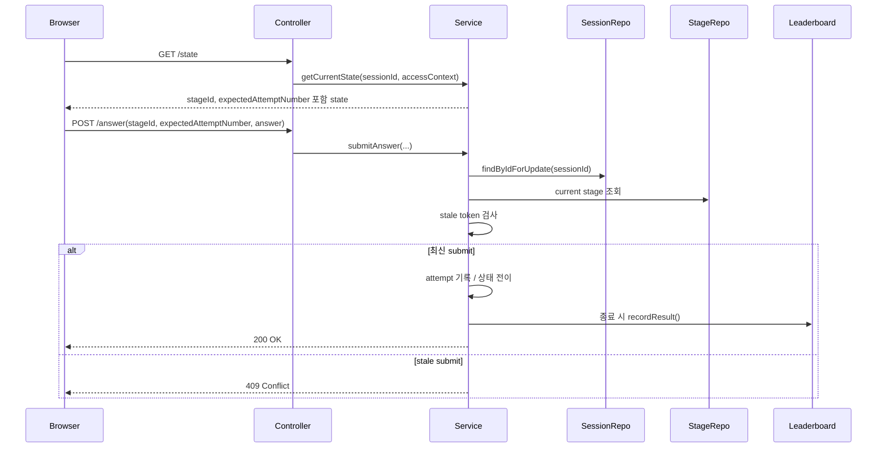

# 게임 write를 직렬화하고 stale submit을 막아 무결성 1차 닫기

## 왜 이 글을 쓰는가

이전 조각에서 `sessionId` ownership과 조기 결과 노출은 막았다.

그런데 아직 두 가지 문제가 남아 있었다.

1. 같은 Stage에 대한 중복 submit이 다시 오면 서버가 또 한 번 처리할 수 있다.
2. terminal 상태 submit race에서 leaderboard unique 충돌이 500으로 번질 수 있다.

즉, “이 세션을 누가 볼 수 있는가”는 막았지만,
“같은 요청이 두 번 들어오면 상태가 어떻게 되는가”는 아직 닫히지 않은 상태였다.

이번 조각의 목표는 여기를 작게 닫는 것이다.

## 이번 단계의 목표

- 같은 `sessionId`의 write path를 직렬화한다.
- 플레이 화면이 본 최신 Stage에만 답안을 제출하게 만든다.
- 같은 오답 payload 재전송이 life를 두 번 깎지 않게 만든다.
- terminal submit race에서도 leaderboard row가 한 번만 남게 만든다.

## 바뀐 파일

- `src/main/java/com/worldmap/game/common/application/GameSubmissionGuard.java`
- `src/main/java/com/worldmap/game/location/application/LocationGameService.java`
- `src/main/java/com/worldmap/game/capital/application/CapitalGameService.java`
- `src/main/java/com/worldmap/game/population/application/PopulationGameService.java`
- `src/main/java/com/worldmap/game/flag/application/FlagGameService.java`
- `src/main/java/com/worldmap/game/populationbattle/application/PopulationBattleGameService.java`
- 각 게임의 `*SessionRepository`
- 각 게임의 `*StateView`
- 각 게임의 `Submit*AnswerRequest`
- 각 게임의 `*ApiController`
- `src/main/java/com/worldmap/ranking/application/LeaderboardService.java`
- `src/main/resources/static/js/location-game.js`
- `src/main/resources/static/js/capital-game.js`
- `src/main/resources/static/js/population-game.js`
- `src/main/resources/static/js/flag-game.js`
- `src/main/resources/static/js/population-battle-game.js`
- 각 게임 flow integration test
- `src/test/java/com/worldmap/ranking/LeaderboardIntegrationTest.java`

## 문제 1. session ownership만으로는 중복 submit을 못 막는다

ownership 검사는 “남의 세션을 건드리지 못하게 하는 것”이다.

하지만 같은 브라우저에서 같은 버튼을 두 번 누르는 문제는 다른 층위다.

예를 들어 위치 게임의 기존 흐름은 대략 이랬다.

```text
submitAnswer(sessionId, stageNumber, answer)
-> session 조회
-> 현재 stage 조회
-> nextAttemptNumber 계산
-> stage.recordAttempt()
-> 필요하면 createNextStage()
-> attempt 저장
-> 필요하면 leaderboard 저장
```

이 구조에서는 같은 payload가 다시 오면,
특히 같은 Stage의 오답인 경우 life가 한 번 더 줄 수 있다.

## 설계 핵심 1. 같은 session의 write는 session row에서 줄 세운다

이번에는 각 게임의 session repository에 write 전용 조회를 하나씩 추가했다.

```java
@Lock(LockModeType.PESSIMISTIC_WRITE)
@Query("select session from LocationGameSession session where session.id = :sessionId")
Optional<LocationGameSession> findByIdForUpdate(UUID sessionId);
```

그리고 `submitAnswer()`와 `restartGame()`은 일반 `findById()`가 아니라
이 메서드로 세션을 읽는다.

즉, 같은 `sessionId`에 대한 write는 먼저 한 줄로 세운다.

이렇게 하면 아래 문제가 먼저 줄어든다.

- 두 요청이 같은 `attemptNumber`를 동시에 잡는 문제
- 정답 두 번이 동시에 들어와 다음 Stage를 두 번 만드는 문제
- restart 두 번이 동시에 들어와 stage 1을 다시 두 번 만드는 문제

중요한 점은 이 잠금이 컨트롤러가 아니라 서비스 write path에 있다는 것이다.

현재 프로젝트에서 상태 전이의 source of truth는 서비스/도메인이고,
잠금도 그 경계에서 잡아야 설명이 된다.

## 설계 핵심 2. 최신 Stage에만 답안을 제출하게 만든다

session lock만으로는 순차 재전송을 완전히 막을 수 없다.

예를 들어 첫 번째 오답이 반영된 뒤,
같은 오답 payload가 조금 늦게 한 번 더 도착하면
session lock만으로는 “새로운 두 번째 시도”처럼 보일 수 있다.

그래서 이번에는 플레이 화면이 `GET /state`에서 두 값을 같이 받도록 바꿨다.

- `stageId`
- `expectedAttemptNumber`

예를 들면 위치 게임 state는 이런 모양이 된다.

```json
{
  "sessionId": "...",
  "stageNumber": 3,
  "stageId": 42,
  "expectedAttemptNumber": 2
}
```

프론트는 이 값을 그대로 `POST /answer`에 다시 보낸다.

```json
{
  "stageNumber": 3,
  "stageId": 42,
  "expectedAttemptNumber": 2,
  "selectedOptionNumber": 1
}
```

서비스에서는 `GameSubmissionGuard`가 현재 stage와 비교한다.

```java
GameSubmissionGuard.assertFreshSubmission(
    stage.getId(),
    stageId,
    stage.nextAttemptNumber(),
    expectedAttemptNumber
);
```

즉, 서버가 보는 현재 stage id나 현재 시도 번호와
클라이언트가 들고 온 값이 다르면 stale submit으로 본다.

이 경우는 `409 Conflict`로 끊는다.

## 왜 `stageNumber`만으로는 부족했는가

이전 위치 게임 글에서도 `roundNumber` 기반 중복 제출 방지를 설명한 적이 있다.

하지만 지금 구조는 endless stage와 same-session restart가 있기 때문에,
`stageNumber` 하나로는 “정말 같은 Stage 인스턴스인가”를 끝까지 증명하기 어렵다.

그래서 이번 조각에서는 다음처럼 역할을 나눴다.

- `stageNumber`: 지금 몇 번째 문제인가
- `stageId`: DB에서 실제 어떤 Stage row인가
- `expectedAttemptNumber`: 이 Stage에서 지금 몇 번째 제출이어야 하는가

즉, 화면 표시용 번호와 서버 내부 상태 식별자를 분리한 것이다.

## 설계 핵심 3. leaderboard unique 충돌은 no-op로 본다

랭킹 저장도 원래는 이런 구조였다.

```text
findByRunSignature(runSignature)
-> 없으면 saveAndFlush()
```

이건 전형적인 TOCTOU다.

동시에 두 요청이 들어오면 둘 다 “없음”을 보고,
한쪽이 `run_signature` unique 제약에 걸릴 수 있다.

그래서 이번에는 pre-check는 유지하되,
실제 insert에서 `DataIntegrityViolationException`이 나면 no-op로 처리했다.

```java
try {
    record = leaderboardRecordRepository.saveAndFlush(...);
} catch (DataIntegrityViolationException ex) {
    log.debug("Leaderboard run {} was already recorded by another request", runSignature, ex);
    return;
}
```

여기서 중요한 해석은 이것이다.

- `runSignature`가 같다는 것은 이미 같은 종료 run이 기록됐다는 뜻이다.
- 그러면 두 번째 요청은 실패가 아니라 “이미 반영됨”으로 보는 편이 자연스럽다.

## 요청 흐름



## 테스트

이번 조각에서 직접 확인한 테스트는 다음이다.

- `compileJava`
- `compileTestJava`
- `git diff --check`
- `node --check` 5개 public 게임 JS
- `LocationGameFlowIntegrationTest.staleDuplicateWrongAnswerIsRejectedWithoutConsumingExtraLife`
- `CapitalGameFlowIntegrationTest.staleDuplicateWrongAnswerIsRejectedWithoutConsumingExtraLife`
- `PopulationGameFlowIntegrationTest.staleDuplicateWrongAnswerIsRejectedWithoutConsumingExtraLife`
- `FlagGameFlowIntegrationTest.staleDuplicateWrongAnswerIsRejectedWithoutConsumingExtraLife`
- `PopulationBattleGameFlowIntegrationTest.staleDuplicateWrongAnswerIsRejectedWithoutConsumingExtraLife`
- 각 게임의 `duplicateCorrectAnswerIsRejectedAfterStageAdvances`
- `LeaderboardIntegrationTest.gameOverRecordsLocationLeaderboardAndRendersRankingPage`

즉, 이번에는 “같은 stale payload를 다시 보내도 한 번만 반영되는가”와
“terminal duplicate submit 뒤에도 leaderboard row가 1개인가”를 확인했다.

## 이번 조각에서 일부러 안 한 것

아직 하지 않은 것도 있다.

restart 직후 늦게 도착한 오래된 packet을
완전히 다른 run으로 식별하려면 `run generation token`이나 restart nonce가 필요하다.

하지만 그건 이번 조각 범위를 넘는다.

이번 1차에서는 먼저 설명 가능한 최소 구조를 택했다.

- session write 직렬화
- stage token 검증
- leaderboard duplicate no-op

이 세 가지를 먼저 닫고, 다음 조각에서 restart nonce를 분리하는 편이 더 낫다.

## 면접에서 어떻게 설명할까

이렇게 설명하면 된다.

> 게임 무결성 1차에서는 같은 `sessionId`의 write를 session row lock으로 직렬화하고, 플레이 화면이 받은 `stageId`와 `expectedAttemptNumber`를 답안 제출 때 다시 보내게 만들었습니다. 서버는 이 값이 현재 Stage와 다르면 stale submit으로 보고 `409`를 반환해서 같은 오답 payload가 재전송돼도 life가 두 번 줄지 않게 했습니다. 또 leaderboard는 `runSignature` unique 충돌을 실패가 아니라 이미 반영된 run으로 해석해 no-op 처리해서 duplicate terminal submit이 와도 기록이 한 번만 남게 했습니다.
