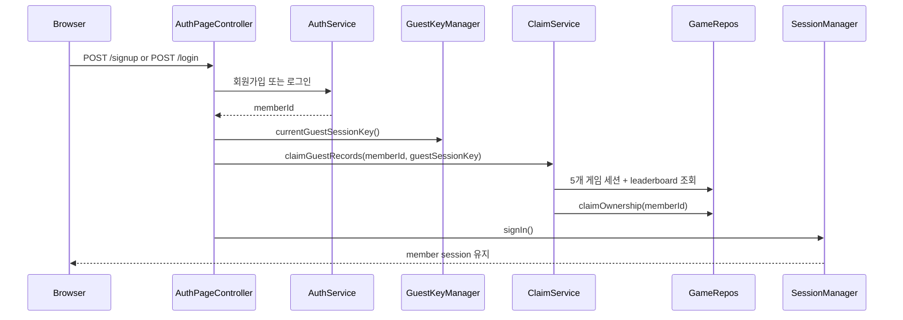

# guest 기록 귀속 범위를 5개 게임 전체로 확장하기

## 왜 이 글을 쓰는가

단순 계정 구조를 붙일 때 guest 기록 귀속은 이미 한 번 만들었다.

문제는 제품 범위가 커진 뒤에도 claim 범위가 그대로였다는 점이다.

이전 상태에서 `GuestProgressClaimService`는
위치 찾기와 인구수 맞추기 세션만 member 소유로 바꾸고 있었다.

그 뒤에 수도 맞히기, 국기 퀴즈, 인구 비교 퀵 배틀이 추가됐으니,
같은 브라우저에서 이 세 게임을 guest로 시작한 뒤 회원가입하거나 로그인하면
일부 세션은 member 소유가 되고 일부는 guest로 남는 틈이 생길 수 있었다.

이번 조각은 이 범위 불일치를 작게 닫는 작업이다.

## 이번 단계의 목표

- guest 기록 귀속 규칙을 5개 게임 전체로 맞춘다.
- `signup`과 `login` 경로 모두에서 같은 브라우저 guest 세션이 한 번에 claim되는지 확인한다.
- `playerNickname` snapshot은 유지하고 ownership만 바뀌게 둔다.

## 바뀐 파일

- `src/main/java/com/worldmap/auth/application/GuestProgressClaimService.java`
- `src/test/java/com/worldmap/auth/AuthFlowIntegrationTest.java`
- `src/test/java/com/worldmap/auth/GuestSessionOwnershipIntegrationTest.java`

## 문제: 계정 구조는 5개 게임인데 claim 서비스는 2개 게임만 보고 있었다

현재 계정 구조의 핵심은 간단하다.

- 비회원 플레이는 `guestSessionKey`로 묶는다.
- 로그인 사용자 플레이는 `memberId`로 묶는다.
- 로그인 직후 현재 브라우저의 guest 기록만 `memberId`로 전환한다.

그런데 실제 구현은 아래처럼 어긋나 있었다.

- 게임 시작은 5개 게임 모두 guest/member ownership을 저장할 수 있다.
- access context 검증도 5개 게임 모두에 붙어 있다.
- 하지만 claim 서비스는 location / population repository만 조회한다.

즉, “새 게임을 시작할 수 있는 범위”와
“로그인 후 계정으로 귀속되는 범위”가 서로 달랐던 것이다.

## 설계 핵심 1. guest claim은 인증 부가 기능이 아니라 ownership 전환 규칙이다

이번 조각에서 가장 중요한 판단은
이 로직을 여전히 `GuestProgressClaimService` 안에 두는 것이다.

`/signup`, `/login` 컨트롤러는

1. 인증을 성공시키고
2. 현재 브라우저의 `guestSessionKey`를 읽고
3. claim 서비스를 호출하고
4. member 세션을 연다

까지만 책임진다.

실제로 어떤 게임 세션을 조회하고,
어떤 조건에서 `memberId`를 채우고 `guestSessionKey`를 비울지는
서비스와 엔티티가 맡아야 설명 가능하다.

그래서 이번에는 컨트롤러 분기나 if 문을 늘리지 않고,
claim 서비스에 repository 3개를 더 주입해 범위만 넓혔다.

## 설계 핵심 2. 5개 게임 모두 같은 규칙으로 claim한다

바뀐 서비스 흐름은 단순하다.

```text
claimGuestRecords(memberId, guestSessionKey)
-> location sessions 조회
-> population sessions 조회
-> capital sessions 조회
-> flag sessions 조회
-> population-battle sessions 조회
-> leaderboard records 조회
-> 각 row에 claimOwnership(memberId) 적용
```

핵심은 “새 규칙을 만들지 않았다”는 점이다.

모든 게임 세션은 이미 `BaseGameSession`의 `claimOwnership()`을 재사용한다.
그래서 이번 작업은 게임별 예외 규칙을 늘린 것이 아니라,
기존 ownership 전환 규칙을 새 게임 3종에도 같은 방식으로 연결한 것이다.

## 요청 흐름



## 설계 핵심 3. 테스트는 signup/login 실제 경로에서 고정한다

이번 조각은 별도 단위 테스트보다 통합 테스트가 더 중요했다.

이유는 claim이 단순 서비스 메서드 하나가 아니라

- 현재 브라우저 세션의 `guestSessionKey`
- 회원가입/로그인 성공
- repository 조회
- entity ownership 전환
- member session 유지

가 연결된 흐름이기 때문이다.

그래서 테스트도 두 갈래로 고정했다.

1. `GuestSessionOwnershipIntegrationTest`
   같은 브라우저로 5개 게임을 시작하면 모두 같은 `guestSessionKey`를 공유하는지 확인한다.
2. `AuthFlowIntegrationTest`
   `signup`과 `login` 뒤에 5개 게임 세션이 전부 같은 `memberId`로 claim되는지 확인한다.

이렇게 해 두면 다음에 새 게임을 하나 더 추가했을 때도
“시작 ownership은 붙였는데 claim 범위는 안 늘렸다”는 회귀를 빨리 잡을 수 있다.

## 테스트

이번 조각에서 직접 확인한 테스트는 아래다.

- `./gradlew test --tests com.worldmap.auth.GuestSessionOwnershipIntegrationTest --tests com.worldmap.auth.AuthFlowIntegrationTest`

여기서 확인한 내용은 다음이다.

- 같은 브라우저 세션으로 시작한 5개 게임이 동일 `guestSessionKey`를 공유하는가
- 회원가입 후 5개 게임 세션이 모두 같은 `memberId`로 claim되는가
- 로그인 후에도 같은 claim 규칙이 동작하는가
- claim 뒤 `guestSessionKey`는 비워지고 `playerNickname` snapshot은 유지되는가

## 면접에서 어떻게 설명할까

이렇게 설명하면 된다.

> guest 기록 귀속은 로그인 부가 기능이 아니라 ownership 전환 규칙이라고 봤습니다. 그런데 새 게임 3종을 추가한 뒤 claim 서비스가 여전히 위치/인구수만 보고 있어서, 같은 브라우저에서 guest로 시작한 일부 세션이 로그인 후에도 guest 소유로 남을 수 있었습니다. 그래서 `GuestProgressClaimService`를 5개 게임 전체 repository로 확장하고, signup/login 통합 테스트로 모든 guest 세션이 같은 `memberId`로 한 번에 귀속되는지 고정했습니다.
