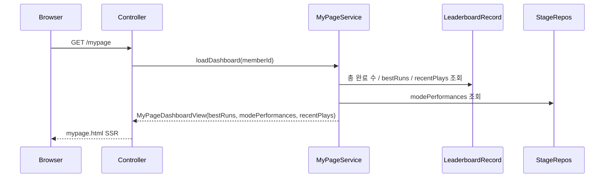

# 5개 게임 기준으로 `/mypage` read model을 다시 정리하고 현재 순위를 바로잡기

## 왜 이 글을 쓰는가

새 게임 3종이 추가된 뒤에도 `/mypage`는 여전히 위치 찾기와 인구수 맞추기 두 게임만 중심으로 보였다.

문제는 두 가지였다.

1. 최고 기록 카드와 플레이 성향 카드가 2개 게임 기준으로 고정돼 있었다.
2. 최근 플레이의 rank는 이름과 문서가 말하는 `당시 순위`가 아니라, 실제로는 read 시점에 다시 계산한 현재 순위였다.

즉, 쓰기 흐름과 계정 귀속은 5개 게임 전체로 넓어졌는데,
기록 허브와 설명 언어는 예전 2게임 시점에 머물러 있었던 것이다.

이번 조각은 이 어긋남을 작게 닫는다.

## 이번 단계의 목표

- `/mypage` read model을 5개 현재 게임 범위에 맞춘다.
- 고정 필드 DTO를 per-mode 리스트 구조로 바꾼다.
- 최근 플레이/베스트 카드의 rank 의미를 `현재 전체 순위`로 분명히 한다.

## 바뀐 파일

- `src/main/java/com/worldmap/mypage/application/MyPageDashboardView.java`
- `src/main/java/com/worldmap/mypage/application/MyPageBestRunView.java`
- `src/main/java/com/worldmap/mypage/application/MyPageRecentPlayView.java`
- `src/main/java/com/worldmap/mypage/application/MyPageService.java`
- `src/main/resources/templates/mypage.html`
- `src/test/java/com/worldmap/mypage/MyPageServiceIntegrationTest.java`
- `src/test/java/com/worldmap/web/MyPageControllerTest.java`

## 문제 1. read model이 2개 게임에 하드코딩돼 있었다

기존 대시보드 구조는 대략 이런 모양이었다.

```java
record MyPageDashboardView(
    String nickname,
    long totalCompletedRuns,
    MyPageBestRunView locationBest,
    MyPageBestRunView populationBest,
    MyPageModePerformanceView locationPerformance,
    MyPageModePerformanceView populationPerformance,
    List<MyPageRecentPlayView> recentPlays
)
```

이 구조에서는 `capitalBest`, `flagBest`, `populationBattleBest` 같은 필드를 계속 늘려야 한다.

즉, 새 게임이 늘어날수록

- DTO 필드
- 서비스 조합
- 템플릿 분기
- 테스트 fixture

가 같이 복붙되는 구조였다.

## 설계 핵심 1. 고정 필드 대신 per-mode 리스트로 바꾼다

이번에는 `MyPageDashboardView`를 아래처럼 바꿨다.

```java
record MyPageDashboardView(
    String nickname,
    long totalCompletedRuns,
    List<MyPageBestRunView> bestRuns,
    List<MyPageModePerformanceView> modePerformances,
    List<MyPageRecentPlayView> recentPlays
)
```

핵심은 “새 지표를 만든 것”이 아니라
기존 지표를 게임별 컬렉션으로 일반화한 것이다.

그래서 지금은

- 위치 찾기
- 수도 맞히기
- 국기 보고 나라 맞히기
- 인구 비교 퀵 배틀
- 인구수 맞추기

다섯 게임을 같은 템플릿 iteration으로 렌더링한다.

## 설계 핵심 2. 두 층 read model은 유지한다

이번 조각에서도 `/mypage`의 기본 구조는 그대로 유지했다.

- 결과 요약: `leaderboard_record`
- 플레이 성향: finished session의 raw stage 집계

즉, 최고 점수/최근 플레이는 `leaderboard_record`에서 만들고,
`클리어 Stage 수`, `1트 클리어율`, `평균 시도 수`는 각 게임 stage repository에서 만든다.

중요한 점은 이것을 템플릿에서 직접 조합하지 않았다는 것이다.

어떤 저장소를 어떤 순서로 읽어
어떤 게임을 현재 제품 범위로 볼지는
서비스가 source of truth가 되어야 설명할 수 있다.

그래서 `MyPageService`가 현재 5개 게임 순서를 정하고,
`bestRuns`, `modePerformances`, `recentPlays`를 모두 조립한다.

## 문제 2. `rankAtRecordTime`은 실제로 record-time 값이 아니었다

기존 이름은 `rankAtRecordTime`이었다.

하지만 `leaderboard_record`에는 당시 순위 snapshot 컬럼이 없다.

실제 동작은 이렇다.

```text
findAllByGameModeOrderByRankingScoreDescFinishedAtAsc(gameMode)
-> 현재 전체 보드에서 target record의 위치를 다시 찾음
```

즉, 이 값은 저장된 “당시 순위”가 아니라
현재 전체 보드 기준으로 다시 계산한 순위다.

그래서 이번에는 이름과 카피를 맞췄다.

- `rankAtRecordTime` -> `currentRank`
- UI 문구 -> `현재 #N`
- 문서 설명 -> `현재 전체 순위`

이건 저장 구조를 바꾸지 않는 가장 작은 정합성 수정이다.

만약 정말 당시 순위를 보여 주고 싶다면,
그건 read model rename이 아니라 write model 확장이다.
`leaderboard_record`에 rank snapshot을 저장해야 한다.

## 요청 흐름



## 테스트

이번 조각에서 직접 확인한 테스트는 아래다.

- `MyPageServiceIntegrationTest`
- `MyPageControllerTest`
- `AuthFlowIntegrationTest`

여기서 확인한 내용은 다음이다.

- 기존 위치/인구수 성향 지표 계산이 그대로 유지되는가
- 5개 게임이 `bestRuns`와 `modePerformances`에 모두 노출되는가
- `/mypage` HTML이 새 리스트 구조와 `현재 #N` 문구를 제대로 렌더링하는가
- 회원가입 직후 귀속된 기록이 `/mypage`에서 계속 보이는가

## 면접에서 어떻게 설명할까

이렇게 설명하면 된다.

> 새 게임 3종을 추가한 뒤에도 `/mypage`는 두 게임만 요약하는 DTO 구조에 머물러 있었습니다. 그래서 `MyPageDashboardView`를 고정 필드 대신 per-mode 리스트 구조로 바꾸고, `leaderboard_record` 기반 완료 run 요약과 raw stage 기반 플레이 성향 요약을 5개 게임 전체로 일반화했습니다. 또 recent rank는 저장된 당시 순위가 아니라 현재 전체 순위를 다시 계산한 값이었기 때문에, 이름과 UI 카피를 실제 동작에 맞게 정리했습니다.
