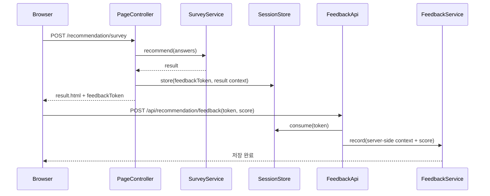

# 추천 피드백을 session token에 묶고 summary API를 admin 전용으로 닫기

## 왜 이 글을 쓰는가

추천 결과는 저장하지 않기로 했더라도,
피드백 저장에 필요한 문맥까지 클라이언트가 다시 보내게 두면 무결성이 깨진다.

기존 구조는 이랬다.

1. 결과 페이지가 `surveyVersion`, `engineVersion`, 답변 20개를 hidden field로 그대로 내려준다.
2. 브라우저가 그 값을 다시 `POST /api/recommendation/feedback`에 JSON으로 보낸다.
3. 서버는 그 값을 그대로 저장한다.

즉, 결과 자체는 DB에 저장하지 않지만,
피드백 문맥은 브라우저가 마음대로 바꿀 수 있는 상태였다.

게다가 버전별 만족도 summary API도 public으로 열려 있었다.

이번 조각은 이 두 경계를 서버 쪽에서 다시 잠근다.

## 이번 단계의 목표

- 피드백 요청이 더 이상 hidden field answer snapshot을 신뢰하지 않게 만든다.
- 추천 결과 1회분과 피드백을 `feedbackToken`으로 연결한다.
- 버전별 만족도 summary API를 admin session 전용으로 제한한다.

## 바뀐 파일

- `src/main/java/com/worldmap/recommendation/application/RecommendationFeedbackContext.java`
- `src/main/java/com/worldmap/recommendation/web/RecommendationFeedbackSessionStore.java`
- `src/main/java/com/worldmap/recommendation/application/RecommendationSurveyResultView.java`
- `src/main/java/com/worldmap/recommendation/application/RecommendationSurveyService.java`
- `src/main/java/com/worldmap/recommendation/web/RecommendationPageController.java`
- `src/main/java/com/worldmap/recommendation/web/RecommendationFeedbackRequest.java`
- `src/main/java/com/worldmap/recommendation/web/RecommendationFeedbackApiController.java`
- `src/main/resources/templates/recommendation/result.html`
- `src/test/java/com/worldmap/recommendation/RecommendationPageIntegrationTest.java`
- `src/test/java/com/worldmap/recommendation/RecommendationFeedbackIntegrationTest.java`

## 문제 1. hidden field로 다시 보낸 답변은 신뢰할 수 없다

이전 구현은 결과 페이지가 이런 값을 다 들고 있었다.

- `surveyVersion`
- `engineVersion`
- 설문 답변 20개

브라우저가 그 값을 그대로 다시 보내면,
사용자는 devtools로 얼마든지 바꿀 수 있다.

즉, 만족도 5점을 보내면서도

- 다른 surveyVersion
- 다른 engineVersion
- 다른 답변 스냅샷

을 섞어 운영 지표를 오염시킬 수 있었다.

## 설계 핵심 1. 결과 문맥은 서버 세션이 들고 있고, 브라우저는 token만 보낸다

이번에는 추천 결과를 만들 때 서버가 현재 세션에 문맥을 저장하게 바꿨다.

세션에 들어가는 값은 `RecommendationFeedbackContext`다.

```java
public record RecommendationFeedbackContext(
    String surveyVersion,
    String engineVersion,
    RecommendationSurveyAnswers answers
) {}
```

그리고 `RecommendationFeedbackSessionStore`가
`feedbackToken -> RecommendationFeedbackContext`를 현재 `HttpSession`에 저장한다.

결과 페이지는 더 이상 답변 20개를 hidden field로 내리지 않는다.

대신 아래 둘만 보낸다.

- `feedbackToken`
- `satisfactionScore`

즉, 브라우저는 “어느 결과 화면에 대한 피드백인가”를 token으로만 가리키고,
실제 저장에 필요한 문맥은 서버가 다시 복원한다.

## 왜 token이 필요했는가

단순히 “현재 세션의 마지막 결과”만 저장하면,
같은 브라우저에서 추천 결과를 여러 탭으로 열었을 때
오래된 탭의 피드백이 다른 결과에 붙을 수 있다.

그래서 이번에는 세션 안에서도 결과 1회분마다 별도 token을 발급했다.

이게 가장 작은 server-side fix다.

DB에 결과 snapshot 테이블을 새로 만들지 않아도 되고,
결과 1회분과 피드백 1회를 안정적으로 연결할 수 있다.

## 설계 핵심 2. 피드백 요청 DTO는 점수와 token만 받는다

기존 `RecommendationFeedbackRequest`는 거의 결과 문맥 전체를 받았다.

이번에는 아래 두 값만 받는다.

- `feedbackToken`
- `satisfactionScore`

그러면 컨트롤러/서비스 흐름은 이렇게 바뀐다.

```text
POST /api/recommendation/feedback
-> RecommendationFeedbackRequest(feedbackToken, satisfactionScore)
-> RecommendationFeedbackSessionStore.consume(session, token)
-> RecommendationFeedbackSubmission(surveyVersion, engineVersion, answers, score)
-> RecommendationFeedbackService.record()
```

성공적으로 저장하면 token은 세션에서 제거한다.

즉, 같은 token을 다시 써서 중복 제출하는 것도 서버가 막는다.

## 설계 핵심 3. summary API는 admin 전용이어야 한다

버전별 만족도 summary는 플레이어용 정보가 아니라 운영 정보다.

여기에는 아래 값이 들어 있다.

- `surveyVersion`
- `engineVersion`
- 응답 수
- 평균 만족도
- 1~5점 분포
- 마지막 제출 시각

이 정보는 `/dashboard/recommendation/feedback` 운영 화면이 읽는 데이터와 성격이 같다.

그래서 `GET /api/recommendation/feedback/summary`도
이제 admin session이 아니면 `403`을 돌리게 바꿨다.

중요한 점은 대시보드 SSR은 계속 같은 서비스를 직접 읽기 때문에,
public API를 닫아도 운영 화면 기능은 그대로 유지된다는 것이다.

## 요청 흐름



## 테스트

이번 조각에서 직접 확인한 테스트는 아래다.

- `RecommendationPageIntegrationTest`
- `RecommendationFeedbackIntegrationTest`
- `AdminPageIntegrationTest`

여기서 확인한 내용은 다음이다.

- 결과 페이지가 hidden answer snapshot 대신 `feedbackToken`만 내리는가
- 같은 세션에서 token을 발급받아야만 피드백 저장이 가능한가
- 잘못된 token은 `400`으로 거절되는가
- summary API는 admin session일 때만 열리는가

## 면접에서 어떻게 설명할까

이렇게 설명하면 된다.

> 추천 결과는 계속 저장하지 않았지만, 피드백 문맥은 hidden field로 다시 보내지 않도록 바꿨습니다. 설문 제출 직후 서버가 `feedbackToken`과 함께 `surveyVersion`, `engineVersion`, 답변 스냅샷을 세션에 저장하고, 피드백 API는 token과 점수만 받아 그 문맥을 복원해 저장합니다. 그래서 결과 저장 범위는 최소로 유지하면서도, 클라이언트 변조로 운영 지표가 오염되는 문제를 막을 수 있었습니다. 동시에 버전별 만족도 summary API도 admin session으로 제한해 운영 정보가 public API로 새지 않게 정리했습니다.
