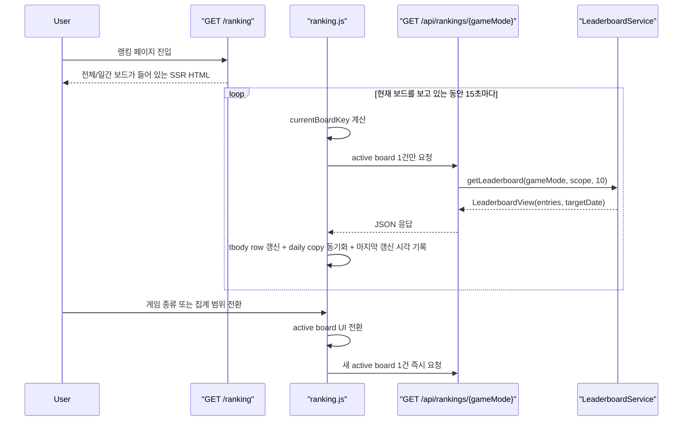

# 107. 랭킹 화면은 active board만 갱신하고 일간 카피도 같이 맞추기

## 왜 이 후속 조각이 필요했나

`/ranking` 화면은 한 번에 보드 하나만 보여줍니다.

그런데 이전 구현의 `ranking.js`는 15초마다
숨겨진 보드 9개까지 전부 다시 호출하고 있었습니다.

즉, 사용자는 `위치 · 전체` 하나만 보고 있어도
브라우저는 아래를 전부 다시 가져왔습니다.

- 위치 전체
- 위치 일간
- 수도 전체
- 수도 일간
- 국기 전체
- 국기 일간
- 배틀 전체
- 배틀 일간
- 인구 전체
- 인구 일간

문제는 이것만이 아니었습니다.

일간 보드의 rows는 polling으로 갱신돼도,
상단 설명 문구의 `기준 날짜`는 SSR 시점 값에 머물러
표 내용과 카피가 서로 다른 날짜를 가리킬 수 있었습니다.

그래서 이번 조각은
`실시간 전달 기술을 바꾸지 않고도 fan-out을 줄이고 metadata drift를 막는 것`
에 집중했습니다.

## 이번에 바뀐 파일

- [ranking.js](/Users/alex/project/worldmap/src/main/resources/static/js/ranking.js)
- [index.html](/Users/alex/project/worldmap/src/main/resources/templates/ranking/index.html)
- [LeaderboardIntegrationTest.java](/Users/alex/project/worldmap/src/test/java/com/worldmap/ranking/LeaderboardIntegrationTest.java)

## 1. 모든 보드를 polling하지 않고 현재 보드만 갱신한다

이전에는 `tbody[data-game-mode][data-scope]`를 전부 모아
`Promise.all(...)`로 10개 요청을 동시에 보냈습니다.

이번에는 관점을 바꿨습니다.

화면이 실제로 보여 주는 것은 언제나 `activeMode + activeScope` 조합 하나입니다.

그래서 `ranking.js`는 이제
현재 보드 key만 큐에 넣고 그 보드의 API만 호출합니다.

```js
queueRefresh(currentBoardKey(), false);
```

실제 fetch도 보드 하나 기준으로만 일어납니다.

```js
const payload = await fetchLeaderboard(tbody.dataset.gameMode, tbody.dataset.scope);
renderLeaderboardRows(tbody, payload.entries);
```

이렇게 하면 visible 탭 기준으로
`15초마다 10회` 호출이 `15초마다 1회` 호출로 줄어듭니다.

## 2. 보드를 바꾸면 그 보드만 즉시 새로 읽는다

호출 수만 줄이고 끝내면 다른 문제가 생깁니다.

사용자가 `위치 -> 수도`, `전체 -> 일간`으로 바꾸는 순간
새 보드가 아직 오래된 SSR 데이터만 보여줄 수 있기 때문입니다.

그래서 `switchMode()`와 `switchScope()`는
UI만 바꾸지 않고 새 active board를 바로 갱신합니다.

```js
function switchMode(nextMode) {
    activeMode = nextMode;
    syncActiveBoardUi();
    queueRefresh(currentBoardKey(), false);
}
```

즉, 자동 갱신은 active board 1개만,
사용자 전환 직후에도 active board 1개만 읽습니다.

API surface는 그대로 유지하면서
체감 freshness를 잃지 않는 방식입니다.

## 3. 이전 요청이 끝나기 전에 보드를 바꿔도 순서를 잃지 않게 했다

이 조각에서 같이 정리한 포인트가 하나 더 있습니다.

갱신 중에 사용자가 다른 보드로 전환하면,
기존 요청이 끝난 뒤 새 active board 갱신이 한 번 더 이어져야 합니다.

그래서 이번에는 `queuedRefresh`를 둬서
“지금 진행 중인 요청 하나”와
“다음에 이어서 갱신할 active board 하나”를 분리했습니다.

이렇게 하면:

1. 기존 active board 요청이 끝난다
2. 사용자가 방금 고른 새 board key가 queue에 남아 있다
3. `finally`에서 다음 refresh를 바로 실행한다

즉, 빠르게 탭을 바꿔도 마지막에 사용자가 보고 있는 board 기준으로 수렴합니다.

## 4. 일간 보드 설명의 `기준 날짜`도 응답 기준으로 다시 맞춘다

이번 조각에서 같이 잡은 잔여 버그는 daily copy drift입니다.

`LeaderboardView`는 이미 `targetDate`를 내려주고 있었는데,
기존 `ranking.js`는 rows만 다시 그리고
panel의 `data-copy`는 그대로 두고 있었습니다.

그래서 템플릿에 daily board용 `data-copy-base`를 추가했습니다.

예를 들면:

```html
<article
  class="panel ranking-board-panel"
  data-ranking-panel="location:DAILY"
  data-copy-base="오늘 기준 위치 찾기 랭킹입니다."
  th:data-copy="${'오늘 기준 위치 찾기 랭킹입니다. 기준 날짜: ' + locationDaily.targetDate}">
```

그리고 polling 응답을 받은 뒤
JS가 `targetDate`를 다시 붙여 줍니다.

```js
function syncPanelCopy(panel, payload) {
    if (!panel || payload.scope !== "DAILY") {
        return;
    }

    const copyBase = panel.dataset.copyBase;
    panel.dataset.copy = `${copyBase} 기준 날짜: ${payload.targetDate}`;
}
```

이제 daily rows와 설명 문구가
같은 날짜 기준을 가리키게 됩니다.

## 5. 오류 응답도 parser error 대신 사용자 메시지로 닫는다

기존 코드는 `response.ok`를 보기 전에 바로 `response.json()`을 호출했습니다.

이 경우 서버가 HTML 오류 페이지나 빈 응답을 보내면
사용자는 랭킹 오류가 아니라 JSON parser error를 만나기 쉽습니다.

이번에는 `content-type`을 먼저 보고
JSON일 때만 읽도록 바꿨습니다.

```js
async function readJsonSafely(response) {
    const contentType = response.headers.get("content-type") || "";

    if (!contentType.includes("application/json")) {
        return null;
    }

    try {
        return await response.json();
    } catch (error) {
        return null;
    }
}
```

그래서 오류 시에는 구현 세부 대신
`랭킹을 새로고침하지 못했습니다.` 같은 사용자 메시지로 닫힙니다.

## 요청 흐름은 어떻게 설명하면 되나



핵심은 서버 도메인 규칙을 바꾸지 않았다는 점입니다.

정렬 기준과 집계는 여전히 `LeaderboardService`가 맡고,
브라우저는 지금 보고 있는 read target 하나만 선택해 다시 읽습니다.

## 왜 이 로직이 서버가 아니라 프론트에 있어야 하는가

이번 조각에서 바뀐 것은
랭킹 점수 계산이나 Redis 저장이 아닙니다.

이미 있는 read model을
브라우저가 얼마나 효율적으로 다시 읽느냐의 문제입니다.

즉, 책임 분리는 이렇게 유지됩니다.

- 서버
  - 랭킹 집계
  - 동점 처리
  - Redis -> RDB fallback
  - `targetDate` 포함 API 응답 생성
- 프런트
  - 어떤 보드를 지금 active state로 볼지
  - 언제 다시 읽을지
  - 응답을 어느 `tbody`와 설명 카피에 반영할지

그래서 이번 조각은 컨트롤러/서비스를 거의 건드리지 않고
`ranking.js`와 `ranking/index.html`에서 닫는 편이 맞았습니다.

## 테스트는 무엇을 확인했나

이번에는 아래 검증을 돌렸습니다.

- `node --check src/main/resources/static/js/ranking.js`
- `./gradlew test --tests com.worldmap.ranking.LeaderboardIntegrationTest.gameOverRecordsLocationLeaderboardAndRendersRankingPage`
- `git diff --check`

`LeaderboardIntegrationTest`는
`/ranking` SSR이 여전히 정상 렌더링되고,
새 갱신 문구와 daily `data-copy-base` hook이 실제 HTML에 들어가는지 확인합니다.

아직 없는 것은 브라우저 네트워크 호출 수를 직접 세는 E2E입니다.
즉, 이번 조각은 JUnit + JS syntax check로 닫고,
실제 fan-out 감소 수치는 브라우저 network panel에서 확인하는 단계입니다.

## 이번 조각에서 기억할 포인트

1. 폴링을 유지한다고 해서 모든 보드를 계속 다시 읽을 필요는 없다.
2. 필터 UI가 이미 active board를 하나로 좁혀 준다면, 그 보드만 갱신하면 된다.
3. rows만 갱신하면 충분하지 않다. daily copy 같은 metadata도 함께 동기화해야 화면 설명이 틀리지 않는다.

## 다음에 이어서 보면 좋은 질문

- `/ranking` 첫 SSR도 10개 보드를 모두 렌더링할 필요가 있는가?
- 지금의 `SSR 전체 + active board polling` 조합이 실제 사용자 체감과 서버 비용 기준으로 충분한가?
- 필요하면 다음 단계에서 on-demand SSR 또는 SSE 재검토로 넘어갈 것인가?
