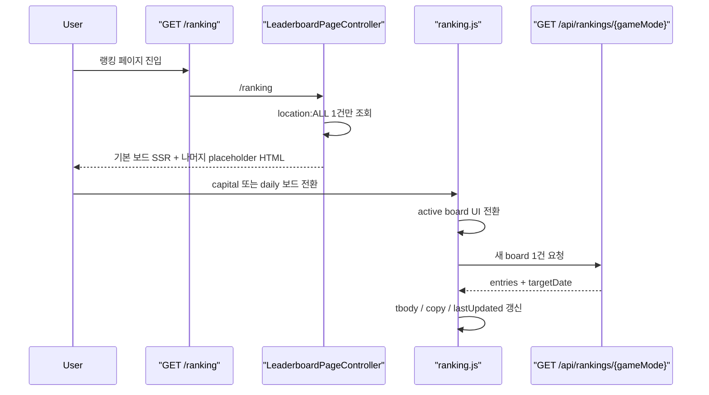

# 108. `/ranking` 첫 SSR은 기본 보드만 그리고 나머지는 지연 로드하기

## 왜 이 후속 조각이 필요했나

직전 조각에서 `/ranking`의 주기적 polling fan-out은 이미 줄였습니다.

즉, 화면을 보고 있는 동안에는
현재 active board 1개만 다시 읽습니다.

그런데 첫 진입 `GET /ranking`은 여전히 달랐습니다.

- 위치 전체
- 위치 일간
- 수도 전체
- 수도 일간
- 국기 전체
- 국기 일간
- 배틀 전체
- 배틀 일간
- 인구 전체
- 인구 일간

이 10개 보드를 컨트롤러가 모두 `LeaderboardService`에서 읽고 있었습니다.

즉, 브라우저 주기 비용은 줄였어도
첫 화면 TTFB와 SSR 모델 적재 비용은 그대로 남아 있던 셈입니다.

그래서 이번에는 `/ranking` 첫 SSR을
기본 보드 1개만 읽는 구조로 더 줄였습니다.

## 이번에 바뀐 파일

- [LeaderboardPageController.java](/Users/alex/project/worldmap/src/main/java/com/worldmap/ranking/web/LeaderboardPageController.java)
- [index.html](/Users/alex/project/worldmap/src/main/resources/templates/ranking/index.html)
- [ranking.js](/Users/alex/project/worldmap/src/main/resources/static/js/ranking.js)
- [LeaderboardPageControllerTest.java](/Users/alex/project/worldmap/src/test/java/com/worldmap/ranking/LeaderboardPageControllerTest.java)
- [LeaderboardIntegrationTest.java](/Users/alex/project/worldmap/src/test/java/com/worldmap/ranking/LeaderboardIntegrationTest.java)

## 1. 컨트롤러는 기본 보드 `location:ALL`만 읽는다

이전 컨트롤러는 `leaderboardService.getLeaderboard(...)`를 10번 호출했습니다.

이번에는 `LeaderboardPageController`를 이렇게 줄였습니다.

```java
@GetMapping("/ranking")
public String rankingPage(Model model) {
    model.addAttribute(
        "locationAll",
        leaderboardService.getLeaderboard(LeaderboardGameMode.LOCATION, LeaderboardScope.ALL, 10)
    );
    return "ranking/index";
}
```

중요한 점은 이것이 랭킹 규칙을 바꾸는 일이 아니라는 것입니다.

- 점수 계산: 그대로 서버 책임
- 정렬 규칙: 그대로 서버 책임
- Redis fallback: 그대로 서버 책임
- 첫 화면에 어떤 snapshot을 실어 보낼지: controller 책임

즉, 이번 조각은 도메인 로직이 아니라
SSR snapshot 범위를 줄인 것입니다.

## 2. 템플릿은 기본 보드만 SSR row를 갖고, 나머지는 placeholder로 둔다

`ranking/index.html`은 이제 두 종류의 보드를 가집니다.

### 기본 보드

기본 active 보드인 `location:ALL`만 실제 SSR row를 가집니다.

```html
<article
  class="panel ranking-board-panel"
  data-ranking-panel="location:ALL"
  data-initial-rendered="true">
```

### 나머지 보드

capital / flag / population / population-battle와 모든 daily 보드는
실제 row 대신 placeholder 한 줄만 내려갑니다.

```html
<tbody id="ranking-capital-all-body" data-game-mode="capital" data-scope="ALL">
  <tr>
    <td colspan="5">이 보드를 열면 최신 랭킹을 불러옵니다.</td>
  </tr>
</tbody>
```

즉, 서버는 처음부터 안 보이는 보드의 top 10을 굳이 채워 넣지 않습니다.

## 3. JS는 “SSR로 이미 렌더된 보드”와 “아직 안 읽은 보드”를 구분한다

이 변경에서 같이 손본 핵심은 [ranking.js](/Users/alex/project/worldmap/src/main/resources/static/js/ranking.js)입니다.

이전에는 모든 보드를 무조건 `SSR 초기 로드`로 취급했습니다.

이번에는 panel의 `data-initial-rendered`를 읽어
`boardRefreshMeta` 초기값을 나눴습니다.

```js
rankingPanels.forEach((panel) => {
    boardRefreshMeta.set(
        panel.dataset.rankingPanel,
        panel.dataset.initialRendered === "true"
            ? {date: initialRenderedAt, prefix: "SSR 초기 로드"}
            : {date: null, prefix: "아직 불러오지 않음"}
    );
});
```

그래서 non-default 보드를 처음 열면:

1. 상단 제목/설명은 바로 바뀐다
2. 마지막 갱신 시각은 `아직 불러오지 않음`으로 보인다
3. 즉시 `/api/rankings/{gameMode}` fetch가 나간다
4. 응답이 오면 row와 copy, 갱신 시각이 실제 데이터로 바뀐다

즉, “아직 안 읽은 board” 상태를 UI가 정직하게 표현하게 만든 것입니다.

## 4. daily 보드는 첫 fetch 전까지 generic copy만 보여 준다

이전에는 daily board도 SSR 시점 `targetDate`를 내려서
상단 copy에 날짜를 바로 찍었습니다.

이번에는 daily board 자체를 첫 SSR에 읽지 않으므로,
초기 copy는 generic 문구만 둡니다.

```html
<article
  data-ranking-panel="location:DAILY"
  data-copy-base="오늘 기준 위치 찾기 랭킹입니다."
  data-copy="오늘 기준 위치 찾기 랭킹입니다. 이 보드를 열면 최신 기준 날짜를 불러옵니다."
  data-initial-rendered="false">
```

그리고 실제 응답이 오면 기존처럼 JS가 `targetDate`를 붙입니다.

```js
panel.dataset.copy = `${copyBase} 기준 날짜: ${payload.targetDate}`;
```

즉, 지금은 “없는 날짜를 SSR에서 미리 찍는 것”보다
처음엔 generic copy를 보여 주고
실제 fetch 뒤에 정확한 날짜를 붙이는 쪽을 택했습니다.

## 요청 흐름은 어떻게 설명하면 되나



핵심은 서버 API를 새로 만들지 않았다는 점입니다.

이미 있는 `/api/rankings/{gameMode}`를 그대로 쓰고,
컨트롤러와 템플릿이 첫 SSR 범위만 줄였습니다.

## 왜 이 로직이 컨트롤러와 템플릿, JS에 나뉘어 있어야 하나

이번 조각의 책임은 세 층으로 나뉩니다.

- 컨트롤러
  - 첫 진입에 어떤 board snapshot을 실을지 결정
- 템플릿
  - 기본 보드와 defer 보드를 구분한 shell 렌더링
- JS
  - 아직 안 읽은 보드를 언제 hydrate할지 결정

이걸 전부 JS로만 미루면
기본 보드의 SSR 가치가 사라집니다.

반대로 전부 컨트롤러에서 해결하려고 하면
다시 10개 보드를 eager render하게 됩니다.

그래서 이번엔:

- 기본 보드는 SSR 유지
- 나머지는 defer

라는 절충이 가장 설명 가능했습니다.

## 테스트는 무엇을 확인했나

이번에는 테스트를 두 층으로 나눴습니다.

- `LeaderboardPageControllerTest`
  - `/ranking` 첫 진입이 `LeaderboardService.getLeaderboard(LOCATION, ALL, 10)` 한 번만 호출하는지 검증
- `LeaderboardIntegrationTest`
  - `/ranking`이 여전히 정상 렌더링되는지
  - 기본 보드만 model에 존재하고 나머지는 없는지
  - capital/flag/battle 보드 shell은 여전히 있는지 검증

그리고 프런트는:

- `node --check src/main/resources/static/js/ranking.js`
- `git diff --check`

로 닫았습니다.

## 이번 조각에서 기억할 포인트

1. polling 비용을 줄였다고 해서 첫 SSR 비용이 자동으로 줄어들지는 않는다.
2. SSR 페이지에서는 “처음에 꼭 보여줘야 하는 snapshot 하나”를 정하는 것이 중요하다.
3. 기본 보드 SSR + 나머지 defer load 구조는 서버 계약을 거의 안 건드리면서도 첫 진입 비용을 낮출 수 있다.

## 다음에 이어서 볼 질문

- 기본 보드를 `location:ALL`로 고정하는 대신 설정값이나 정책으로 뺄 필요가 있는가?
- 지금의 `기본 보드 SSR + defer board first-load + active board polling` 조합이 실제 TTFB와 UX 기준으로 충분한가?
- 필요하면 그 다음 단계에서 on-demand SSR이나 SSE를 다시 검토할 것인가?
