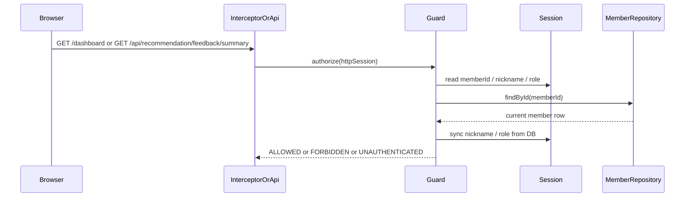

# admin 운영 접근을 session role이 아니라 현재 DB role로 다시 검증하기

## 왜 이 글을 쓰는가

`HttpSession`에 `ADMIN` 문자열을 저장해 두면 구현은 단순하다.

하지만 운영 권한은 한 번 부여한 뒤 나중에 회수할 수 있는 값이다.

기존 구조에서는 관리자가 한 번 로그인하면
세션에 남아 있는 `WORLDMAP_MEMBER_ROLE=ADMIN`만으로
`/dashboard`와 추천 운영 summary API를 계속 통과할 수 있었다.

즉, DB에서 그 회원 role이 이미 `USER`로 내려가도
기존 세션은 살아 있는 동안 admin처럼 보일 수 있었다.

이번 조각은 그 구멍을 작게 막는다.

## 이번 단계의 목표

- admin 접근 판단을 session role 문자열만으로 하지 않는다.
- session의 `memberId`로 현재 회원을 다시 조회해 `role`을 재검증한다.
- `/dashboard/**`와 `/api/recommendation/feedback/summary`가 같은 기준을 쓰게 만든다.

## 바뀐 파일

- `src/main/java/com/worldmap/auth/application/AdminAccessGuard.java`
- `src/main/java/com/worldmap/auth/application/MemberSessionManager.java`
- `src/main/java/com/worldmap/admin/web/AdminAccessInterceptor.java`
- `src/main/java/com/worldmap/recommendation/web/RecommendationFeedbackApiController.java`
- `src/test/java/com/worldmap/admin/AdminPageIntegrationTest.java`
- `src/test/java/com/worldmap/recommendation/RecommendationFeedbackIntegrationTest.java`
- `src/test/java/com/worldmap/auth/application/MemberSessionManagerTest.java`

## 기존 문제가 왜 생겼는가

기존 접근 흐름은 단순했다.

1. 로그인 시 `MemberSessionManager`가 세션에 `memberId`, `nickname`, `role`을 넣는다.
2. `AdminAccessInterceptor`는 세션에서 `role == ADMIN`인지 본다.
3. 추천 운영 summary API도 같은 세션 role을 직접 확인한다.

이 구조는 “로그인 직후 role”에는 맞지만
“지금 이 회원의 role”에는 맞지 않는다.

운영 권한처럼 회수 가능성이 있는 값은
캐시된 문자열이 아니라 현재 저장된 회원 row를 기준으로 판단해야 한다.

## 설계 핵심 1. 세션은 identity 힌트, 권한 source of truth는 member row

이번에는 `AdminAccessGuard`를 따로 추가했다.

guard가 보는 순서는 이렇다.

1. 세션에서 `memberId`를 읽는다.
2. `MemberRepository.findById()`로 현재 회원을 다시 읽는다.
3. 회원이 없으면 세션을 비우고 비로그인처럼 처리한다.
4. 회원이 있으면 세션 nickname/role을 현재 DB 값으로 다시 동기화한다.
5. 현재 role이 `ADMIN`일 때만 통과시킨다.

이렇게 하면 session role은 더 이상 권한 source가 아니라
“현재 로그인한 사용자를 가리키는 캐시” 정도의 역할만 남는다.

## 설계 핵심 2. admin 페이지와 운영 API가 같은 guard를 쓴다

이번 조각에서 중요한 점은
페이지와 API가 같은 기준을 쓰게 맞춘 것이다.

- `/dashboard/**`는 `AdminAccessInterceptor`가 `AdminAccessGuard`를 호출한다.
- `/api/recommendation/feedback/summary`는 controller 안에서 같은 guard를 호출한다.

즉,
페이지는 막히는데 API는 열리거나
반대로 API는 막히는데 페이지는 열리는 식의 엇갈림을 줄였다.

## 요청 흐름

## 세션을 왜 다시 동기화했는가

role을 다시 조회만 하고 세션은 그대로 두면
다음 SSR 화면이나 템플릿에서 stale nickname/role을 계속 볼 수 있다.

그래서 현재 회원 row를 찾은 경우에는
세션의 nickname, role도 함께 덮어쓴다.

예를 들어 기존 세션이 `ADMIN`이어도
DB role이 `USER`로 바뀌었다면
이번 admin 요청에서 바로 session role도 `USER`로 바뀐다.

## 테스트

이번 조각에서 확인한 테스트는 아래다.

- `AdminPageIntegrationTest`
- `RecommendationFeedbackIntegrationTest`
- `MemberSessionManagerTest`

핵심으로 확인한 내용은 다음이다.

- `/dashboard`가 실제 DB role이 `USER`로 바뀐 세션을 `403`으로 막는가
- `/api/recommendation/feedback/summary`도 같은 조건에서 `403`으로 막는가
- `MemberSessionManager.syncMember()`가 현재 회원 상태로 세션 값을 다시 덮는가

## 아직 남아 있는 점

이번 조각은 실제 admin 보호 경로를 막는 데 집중했다.

다만 public 헤더의 `Dashboard` 링크 노출은 아직 session role 문자열을 보고 있기 때문에,
권한이 회수된 직후 admin 경로를 한 번도 치지 않은 세션에서는
stale link가 잠깐 보일 수 있다.

실제 접근은 이미 막히지만,
전역 표시 일관성까지 맞추려면 current member resolver를 더 넓게 쓸지
별도 헤더 모델을 둘지 후속 판단이 필요하다.

## 면접에서 어떻게 설명할까

이렇게 설명하면 된다.

> admin 권한을 세션 문자열만 믿으면, DB에서 role을 회수한 뒤에도 기존 세션이 계속 admin처럼 동작할 수 있습니다. 그래서 이번에는 `AdminAccessGuard`를 두고, `/dashboard`와 운영 summary API가 들어올 때마다 session의 memberId로 현재 회원을 다시 조회하도록 바꿨습니다. 현재 DB role이 `ADMIN`일 때만 통과시키고, 아니면 바로 막으면서 세션 role 캐시도 현재 값으로 다시 맞췄습니다.
