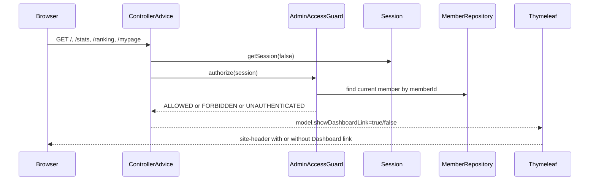

# public 헤더의 Dashboard 링크도 현재 DB role 기준으로 맞추기

## 왜 이 조각이 필요했는가

직전 조각에서 `/dashboard/**`와 운영 summary API는
이미 `AdminAccessGuard`를 통해 현재 DB role을 다시 확인하도록 바꿨다.

그런데 public 헤더는 아직 달랐다.

`site-header.html`이 세션의 `WORLDMAP_MEMBER_ROLE == 'ADMIN'`만 보고
`Dashboard` 링크를 렌더링하고 있었기 때문이다.

이 상태에서는 실제 접근은 막히더라도
홈, Stats, Ranking, My Page 헤더에 stale admin 링크가 잠깐 남을 수 있었다.

보안은 “막는 라우트”만 맞춘다고 끝나지 않는다.
사용자에게 보여 주는 진입점도 같은 기준을 써야 한다.

## 이번 단계의 목표

- public SSR 헤더의 `Dashboard` 링크도 현재 DB role 기준으로 계산한다.
- fragment 안에서 세션 문자열을 직접 보지 않게 바꾼다.
- 홈 / Stats / Ranking / My Page 같은 공통 shell이 실제 admin route와 같은 guard를 쓰게 만든다.

## 바뀐 파일

- `src/main/java/com/worldmap/web/SiteHeaderModelAdvice.java`
- `src/main/resources/templates/fragments/site-header.html`
- `src/test/java/com/worldmap/web/HomeControllerTest.java`
- `src/test/java/com/worldmap/stats/StatsPageControllerTest.java`
- `src/test/java/com/worldmap/web/MyPageControllerTest.java`
- `src/test/java/com/worldmap/ranking/LeaderboardPageControllerTest.java`
- `src/test/java/com/worldmap/web/SiteHeaderIntegrationTest.java`

## 설계 핵심

이번에는 새 서비스를 크게 만들지 않고
전역 SSR model advice 하나로 끝냈다.

`SiteHeaderModelAdvice`가 하는 일은 단순하다.

1. 현재 요청의 `HttpSession`을 `getSession(false)`로 읽는다.
2. `AdminAccessGuard.authorize(session)`를 호출한다.
3. 결과가 `ALLOWED`일 때만 `showDashboardLink=true`를 모델에 넣는다.

그리고 `site-header.html`은 더 이상 session role을 직접 보지 않고
`showDashboardLink`만 본다.

즉,
권한 판단은 여전히 `AdminAccessGuard`가 맡고,
헤더는 그 결과만 소비한다.

이렇게 하면 fragment 안에 보안 규칙을 새로 복붙하지 않아도 된다.

## 요청 흐름

## 왜 fragment에서 session 문자열을 직접 보면 안 되는가

fragment는 렌더링 코드라서 편하게 조건문을 넣기 쉽다.

하지만 여기서 session role 문자열을 직접 읽으면
실제 admin route가 쓰는 기준과 분리된다.

그 결과,

- route는 막히는데 링크는 보이거나
- route는 열리는데 링크는 안 보이는

엇갈림이 생길 수 있다.

이번 조각은 이 문제를 막기 위해
“보여 주는 기준도 실제 authorization source를 그대로 따른다”는 원칙으로 정리한 것이다.

## 테스트

이번에는 두 층으로 확인했다.

- `HomeControllerTest`, `StatsPageControllerTest`
  - 헤더가 `AdminAccessGuard` 결과를 따라 `Dashboard` 링크를 보이거나 숨기는지 확인
- `MyPageControllerTest`, `LeaderboardPageControllerTest`
  - 전역 `@ControllerAdvice`가 들어온 뒤에도 기존 SSR 테스트가 깨지지 않는지 확인
- `SiteHeaderIntegrationTest`
  - 실제 DB role이 `ADMIN -> USER`로 강등되면 홈 헤더에서 링크가 바로 사라지는지 확인
  - 실제 DB role이 `USER -> ADMIN`으로 승격되면 재로그인 없이도 홈 헤더에서 링크가 바로 나타나는지 확인

실행한 검증은 아래다.

- `./gradlew test --tests com.worldmap.web.HomeControllerTest --tests com.worldmap.stats.StatsPageControllerTest --tests com.worldmap.web.MyPageControllerTest --tests com.worldmap.ranking.LeaderboardPageControllerTest --tests com.worldmap.web.SiteHeaderIntegrationTest`
- `git diff --check`

## 배운 점

권한 판단은 “어디를 막을까”만의 문제가 아니다.

사용자가 보는 navigation도 권한 모델의 일부다.

특히 SSR 서비스에서는
전역 shell이 잘못된 권한 힌트를 보여 주면
실제 보안은 맞아도 제품 경험과 설명이 어긋난다.

그래서 route guard와 header link visibility가
같은 source of truth를 공유해야 한다.

## 면접에서 어떻게 설명할까

이렇게 설명하면 된다.

> `/dashboard` 접근은 이미 현재 DB role 기준으로 막고 있었지만, public 헤더는 세션의 `ADMIN` 문자열만 보고 링크를 보여 주고 있었습니다. 그래서 `SiteHeaderModelAdvice`를 추가해 모든 SSR 요청에서 `AdminAccessGuard`를 그대로 호출하고, 그 결과로만 `Dashboard` 링크를 렌더링하게 바꿨습니다. 이제 홈, Stats, Ranking, My Page에서 보이는 링크와 실제 admin route가 같은 현재 DB role 기준을 공유합니다.
