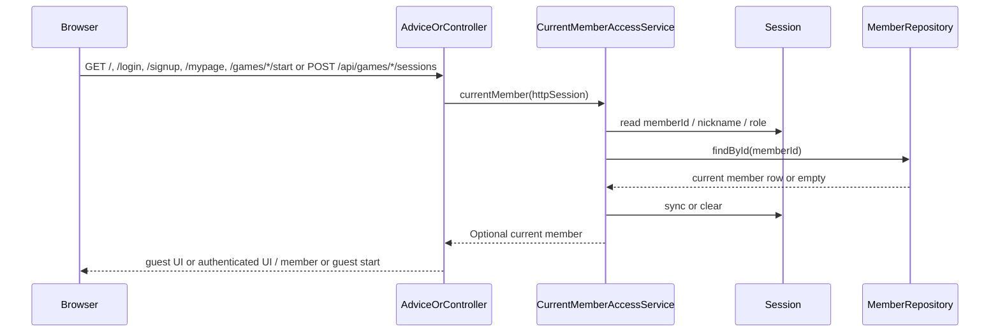

# public/auth SSR과 게임 시작도 현재 회원 기준으로 stale 세션 UI를 정리하기

## 왜 이 조각이 필요했는가

직전 조각에서 public 헤더의 `Dashboard` 링크는
이미 현재 DB role 기준으로 맞췄다.

하지만 로그인 상태 자체를 보여 주는 다른 public/auth SSR은 아직 달랐다.

- 홈 hero의 계정 연결 callout
- `/login`, `/signup`의 redirect 분기
- `/mypage`의 로그인 상태 판단
- 5개 게임 시작 페이지의 `authenticatedNickname`
- 새 게임 세션을 만드는 `POST /api/games/*/sessions`

이 곳들은 여전히 세션에 남아 있는 `memberId`, `nickname`, `role`만 보고 있었다.

그래서 DB에서 회원 row가 이미 삭제돼도
홈에는 “계정으로 기록을 이어서 남기고 있습니다”가 남고,
`/login`은 `/mypage`로 redirect될 수 있었고,
게임 시작 화면에는 stale 닉네임이 보일 수 있었으며,
새 게임도 member-owned 세션으로 열릴 수 있었다.

이번 조각은 이 stale 로그인 UI를 정리하는 일이다.

## 이번 단계의 목표

- public/auth SSR도 현재 회원 row를 다시 확인한다.
- 홈의 계정 CTA, `/login`, `/signup`, `/mypage`, 5개 게임 시작 페이지가 같은 기준으로 움직이게 만든다.
- 새 게임 세션 시작도 current member 기준으로 member/guest ownership을 결정하게 만든다.
- 삭제된 회원 세션은 guest처럼 자연스럽게 정리한다.

## 바뀐 파일

- `src/main/java/com/worldmap/auth/application/CurrentMemberAccessService.java`
- `src/main/java/com/worldmap/auth/application/GameSessionAccessContextResolver.java`
- `src/main/java/com/worldmap/web/HomeController.java`
- `src/main/resources/templates/home.html`
- `src/main/java/com/worldmap/auth/web/AuthPageController.java`
- `src/main/java/com/worldmap/web/MyPageController.java`
- `src/main/java/com/worldmap/game/location/web/LocationGameApiController.java`
- `src/main/java/com/worldmap/game/location/web/LocationGamePageController.java`
- `src/main/java/com/worldmap/game/capital/web/CapitalGameApiController.java`
- `src/main/java/com/worldmap/game/capital/web/CapitalGamePageController.java`
- `src/main/java/com/worldmap/game/population/web/PopulationGameApiController.java`
- `src/main/java/com/worldmap/game/population/web/PopulationGamePageController.java`
- `src/main/java/com/worldmap/game/flag/web/FlagGameApiController.java`
- `src/main/java/com/worldmap/game/flag/web/FlagGamePageController.java`
- `src/main/java/com/worldmap/game/populationbattle/web/PopulationBattleGameApiController.java`
- `src/main/java/com/worldmap/game/populationbattle/web/PopulationBattleGamePageController.java`
- `src/test/java/com/worldmap/auth/application/CurrentMemberAccessServiceTest.java`
- `src/test/java/com/worldmap/auth/application/GameSessionAccessContextResolverTest.java`
- `src/test/java/com/worldmap/auth/application/AdminAccessGuardTest.java`
- `src/test/java/com/worldmap/web/HomeControllerTest.java`
- `src/test/java/com/worldmap/web/MyPageControllerTest.java`
- `src/test/java/com/worldmap/stats/StatsPageControllerTest.java`
- `src/test/java/com/worldmap/ranking/LeaderboardPageControllerTest.java`
- `src/test/java/com/worldmap/auth/AuthFlowIntegrationTest.java`

## 설계 핵심

이번에는 새 보안 규칙을 추가한 것이 아니라
이미 있던 current member 확인 로직을 public/auth SSR에도 제대로 연결했다.

핵심 역할은 `CurrentMemberAccessService`가 맡는다.

이 서비스는 아래 순서로 동작한다.

1. 세션에서 `memberId`, `nickname`, `role`을 읽는다.
2. `MemberRepository.findById()`로 현재 회원 row를 다시 읽는다.
3. 회원 row가 있으면 세션 nickname/role을 현재 DB 값으로 동기화한다.
4. 회원 row가 없으면 세션을 비우고 empty를 반환한다.

즉, “현재 로그인한 회원이 실제로 존재하는가”를
홈 템플릿이나 auth 컨트롤러가 각자 판단하지 않게 만들었다.

## 어디에 적용했는가

### 1. 홈 hero 계정 callout

이전에는 `home.html`이 `session.WORLDMAP_MEMBER_ID`를 직접 봤다.

이제는 `HomeController`가 `currentMember` 모델을 넣고,
템플릿은 그 값이 있는지만 본다.

그래서 삭제된 회원 세션이면
홈도 즉시 guest CTA로 돌아간다.

### 2. `/login`, `/signup` GET 분기

이전에는 `AuthPageController`가 세션에 값이 있으면
무조건 `/mypage`로 redirect했다.

이제는 `CurrentMemberAccessService.currentMember(session)`가 실제 회원 row를 찾은 경우에만
로그인된 사용자로 취급한다.

즉, 이미 삭제된 회원 세션이면
로그인 페이지를 다시 정상적으로 열 수 있다.

### 3. 5개 게임 시작 페이지

이전에는 각 `*GamePageController.startPage()`가
세션에서 current member를 직접 읽고
`authenticatedNickname`을 채웠다.

이제는 모든 start 페이지가 아무것도 직접 계산하지 않는다.

`SiteHeaderModelAdvice`가 이미 `authenticatedNickname`을
`CurrentMemberAccessService` 기준으로 넣어 주기 때문이다.

즉, 삭제된 회원 세션이면
start 페이지도 로그인 안내 문장을 지우고 guest 안내 문구만 보여 준다.

### 4. 새 게임 세션 시작 API와 access context

이전에는 `POST /api/games/*/sessions`도
세션에 남아 있는 member 정보를 그대로 믿고
member-owned 게임 세션을 만들 수 있었다.

이제는 start API도 `CurrentMemberAccessService.currentMember(session)`를 먼저 본다.

그래서 삭제된 회원 세션이면
새 게임은 guest-owned로 시작한다.

또 `GameSessionAccessContextResolver`도 같은 current member source를 쓰게 바꿨다.

즉, stale memberId가 이후 `state`, `answer`, `restart`, `result` 접근 컨텍스트로
다시 흘러가지 않는다.

### 5. `/mypage`

이전에는 `MyPageController`도 세션만 보고
`isAuthenticated`와 `dashboard` 로딩 여부를 정했다.

이제는 current member를 다시 확인한 뒤에만
대시보드를 읽는다.

그래서 삭제된 회원 세션이면
오류나 stale 대시보드 대신 guest 안내 화면으로 떨어진다.

## 요청 흐름

## 왜 이 로직이 컨트롤러 안에 있으면 안 되는가

홈, 로그인, 회원가입, 마이페이지가
모두 같은 문제를 풀고 있다.

“이 세션이 지금도 유효한 회원을 가리키는가?”

이걸 각 컨트롤러가 따로 구현하면

- 어떤 화면은 guest로 떨어지고
- 어떤 화면은 stale 로그인 UI를 유지하고
- 어떤 화면은 예외가 나고

기준이 쉽게 갈라진다.

그래서 current member 확인은
`CurrentMemberAccessService` 한 군데로 모아야 한다.

## 테스트

이번에는 세 층으로 확인했다.

- `CurrentMemberAccessServiceTest`
  - 현재 회원 row가 있으면 세션 nickname/role을 다시 맞추는지
  - 회원 row가 없거나 role 문자열이 깨졌으면 세션을 비우는지
- `GameSessionAccessContextResolverTest`
  - current member source와 guest session key가 access context로 정확히 변환되는지
- `HomeControllerTest`, `MyPageControllerTest`, `StatsPageControllerTest`, `LeaderboardPageControllerTest`
  - 전역 advice가 제공한 current member 기준으로 public SSR이 guest/admin UI를 고르는지
- `AuthFlowIntegrationTest`
  - 삭제된 회원 세션으로 홈에 들어가면 guest CTA가 보이는지
  - 같은 세션으로 `/mypage`, `/login`은 stale 로그인 상태로 남지 않는지
  - 같은 세션으로 5개 `/games/*/start`에서 stale nickname 대신 guest 안내가 보이는지
  - 같은 세션으로 새 location 게임을 시작하면 guest-owned 세션이 생성되는지

실행한 검증은 아래다.

- `./gradlew compileJava compileTestJava`
- `./gradlew test --tests com.worldmap.auth.application.CurrentMemberAccessServiceTest --tests com.worldmap.auth.application.GameSessionAccessContextResolverTest --tests com.worldmap.web.HomeControllerTest --tests com.worldmap.web.MyPageControllerTest --tests com.worldmap.stats.StatsPageControllerTest --tests com.worldmap.ranking.LeaderboardPageControllerTest --tests com.worldmap.auth.AuthFlowIntegrationTest --tests com.worldmap.web.SiteHeaderIntegrationTest`
- `git diff --check`

## 아직 남아 있는 점

이번 조각은 SSR과 session start API까지 current member 기준을 맞췄다.

앞으로 client-side fragment나 더 비동기적인 진입점이 늘어나면,
브라우저 쪽에서도 같은 current member source를 어떻게 재사용할지 한 번 더 정리해야 한다.

## 면접에서 어떻게 설명할까

이렇게 설명하면 된다.

> admin 링크만 현재 DB role 기준으로 맞춘다고 끝나는 게 아니었습니다. 홈 계정 CTA, 로그인 redirect, 게임 시작 API가 세션 캐시만 믿으면 이미 삭제된 회원 세션이 계속 로그인된 것처럼 보이거나 member-owned 새 게임을 만들 수 있습니다. 그래서 `CurrentMemberAccessService`를 공통 current-member source로 두고, 홈·로그인·회원가입·마이페이지·게임 시작 페이지·세션 시작 API가 세션의 memberId로 현재 회원을 다시 확인하도록 바꿨습니다. 회원 row가 없으면 세션을 비우고 guest처럼 처리해서, 보이는 화면과 실제 ownership을 맞췄습니다.
