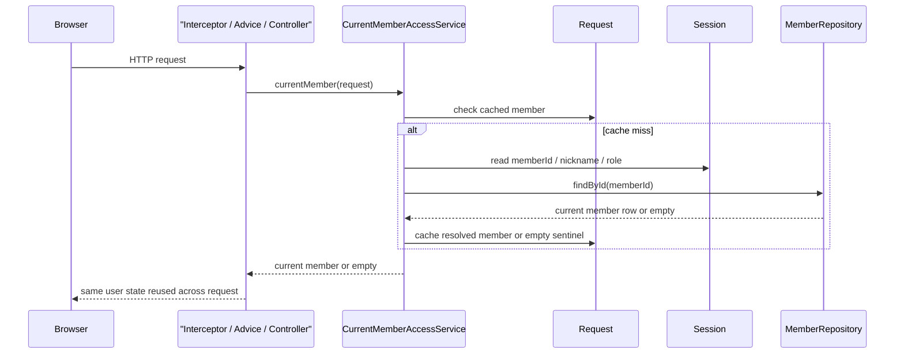

# current member 재검증을 request당 한 번만 하도록 정리하기

## 왜 이 조각이 필요했는가

직전 조각에서 `CurrentMemberAccessService`를
public/auth SSR과 게임 시작 경로의 공통 source로 올렸다.

덕분에 stale 회원 세션은 막혔지만,
같은 HTTP request 안에서 current member를 두 번 이상 다시 읽는 경로는 남아 있었다.

예를 들면 이런 식이다.

- `SiteHeaderModelAdvice`가 헤더용 `currentMember`를 만든다.
- 같은 request에서 auth 컨트롤러가 다시 로그인 여부를 확인한다.
- 또는 admin interceptor가 admin 권한을 확인하고,
  뒤이어 advice가 다시 같은 회원을 읽는다.
- SSR game play/result 페이지에서는 advice와 access context resolver가
  같은 현재 회원을 각각 다시 풀 수 있다.

규칙은 맞지만,
같은 request 안에서 session 파싱과 `member_account` 재조회가 겹치는 구조였다.

이번 조각은 이 중복을 request 범위에서만 줄이는 일이다.

## 이번 단계의 목표

- current member는 계속 DB 기준으로 재검증한다.
- 하지만 같은 HTTP request 안에서는 한 번만 푼다.
- interceptor, advice, controller, resolver가 같은 resolved member를 재사용하게 만든다.

## 바뀐 파일

- `src/main/java/com/worldmap/auth/application/CurrentMemberAccessService.java`
- `src/main/java/com/worldmap/auth/application/AdminAccessGuard.java`
- `src/main/java/com/worldmap/auth/application/GameSessionAccessContextResolver.java`
- `src/main/java/com/worldmap/auth/web/AuthPageController.java`
- `src/main/java/com/worldmap/admin/web/AdminAccessInterceptor.java`
- `src/main/java/com/worldmap/recommendation/web/RecommendationFeedbackApiController.java`
- `src/main/java/com/worldmap/web/SiteHeaderModelAdvice.java`
- `src/main/java/com/worldmap/game/location/web/LocationGameApiController.java`
- `src/main/java/com/worldmap/game/population/web/PopulationGameApiController.java`
- `src/main/java/com/worldmap/game/capital/web/CapitalGameApiController.java`
- `src/main/java/com/worldmap/game/flag/web/FlagGameApiController.java`
- `src/main/java/com/worldmap/game/populationbattle/web/PopulationBattleGameApiController.java`
- `src/test/java/com/worldmap/auth/application/CurrentMemberAccessServiceTest.java`
- `src/test/java/com/worldmap/auth/application/AdminAccessGuardTest.java`
- `src/test/java/com/worldmap/auth/application/GameSessionAccessContextResolverTest.java`
- `src/test/java/com/worldmap/auth/AuthFlowIntegrationTest.java`

## 설계 핵심

핵심은 `session cache`와 `request cache`를 구분하는 것이다.

### 세션 캐시는 왜 그대로 믿으면 안 되는가

세션에 남아 있는 `memberId`, `nickname`, `role`은 오래된 값일 수 있다.

- 회원 row가 이미 삭제됐을 수 있고
- role이 강등됐을 수 있고
- 닉네임이 바뀌었을 수 있다

그래서 request가 들어올 때마다
DB에서 current member를 다시 확인해야 한다.

### 그런데 왜 request 캐시는 허용해도 되는가

같은 HTTP request 안에서는
이미 한 번 current member를 DB와 대조했다면
그 결과를 다시 쓸 수 있다.

왜냐하면 그 request 안에서 source of truth가 바뀌는 일이 없기 때문이다.

즉,

- `session cache`는 오래될 수 있으니 매 request마다 재검증해야 하고
- `request cache`는 이미 재검증된 결과이므로 그 request 안에서는 재사용해도 된다

이번 조각은 이 둘을 분리한 것이다.

## 어떻게 바꿨는가

`CurrentMemberAccessService`에
`currentMember(HttpServletRequest)` 오버로드를 추가했다.

이 메서드는 아래 순서로 동작한다.

1. request attribute에 cached current member가 있는지 본다.
2. 있으면 그대로 반환한다.
3. 없으면 `request.getSession(false)`로 session을 읽는다.
4. 기존 `currentMember(HttpSession)` 규칙대로 DB를 다시 조회한다.
5. 결과를 request attribute에 저장한다.
   - 회원이 있으면 `AuthenticatedMemberSession`
   - 회원이 없으면 empty sentinel

즉, 같은 request 안의 두 번째 호출부터는
`MemberRepository.findById()`를 다시 타지 않는다.

## 어디에 연결했는가

### 1. 헤더 advice와 auth GET

`SiteHeaderModelAdvice`와 `AuthPageController`의
`/login`, `/signup` GET은 이제 같은 request 오버로드를 쓴다.

그래서 헤더가 먼저 current member를 확인해도,
auth 컨트롤러는 그 결과를 그대로 재사용한다.

### 2. admin interceptor와 운영 summary API

`AdminAccessGuard`에 `authorize(HttpServletRequest)`를 추가했다.

`AdminAccessInterceptor`와
`RecommendationFeedbackApiController.feedbackSummary()`는 이제
이 request 오버로드를 쓴다.

그래서 `/dashboard` request에서는
interceptor가 current member를 한 번 풀고,
뒤이어 SSR advice가 같은 request cache를 다시 쓴다.

### 3. 게임 access context와 세션 시작 API

`GameSessionAccessContextResolver`도
`currentMember(request)`를 사용한다.

SSR game play/result 페이지에서는
헤더 advice와 access context resolver가 같은 resolved member를 공유한다.

또 5개 게임 start API도 request 오버로드를 쓰게 바꿨다.

즉, 같은 request에서
“현재 회원인가?”
“guest key를 새로 만들어야 하는가?”
판단이 겹쳐도 current member 재조회는 한 번으로 끝난다.

## 요청 흐름

## 왜 이 로직이 서비스에 있어야 하는가

이걸 interceptor, advice, controller가 각자 구현하면
오히려 더 엉킨다.

- 어떤 계층은 request cache를 쓰고
- 어떤 계층은 session만 보고
- 어떤 계층은 DB를 다시 읽고

기준이 갈라지기 쉽다.

그래서 “현재 회원을 request 범위에서 어떻게 재사용하는가”는
`CurrentMemberAccessService`가 가져가야 한다.

각 계층은 그 결과만 쓰는 편이 맞다.

## 테스트

이번에는 아래 범위로 확인했다.

- `CurrentMemberAccessServiceTest`
  - request 기준으로 current member를 두 번 읽어도 `findById()`가 한 번만 호출되는지
- `GameSessionAccessContextResolverTest`
  - resolver가 session이 아니라 request 오버로드를 타는지
- `AdminAccessGuardTest`
  - admin guard도 request 오버로드로 current member를 읽을 수 있는지
- `HomeControllerTest`, `MyPageControllerTest`, `StatsPageControllerTest`, `LeaderboardPageControllerTest`
  - advice와 controller가 같은 request 기준으로 계속 렌더링되는지
- `AuthFlowIntegrationTest`, `AdminPageIntegrationTest`, `RecommendationFeedbackIntegrationTest`
  - stale session 정리와 admin 경로가 여전히 유지되는지

실행한 검증은 아래다.

- `./gradlew test --tests com.worldmap.auth.application.CurrentMemberAccessServiceTest --tests com.worldmap.auth.application.GameSessionAccessContextResolverTest --tests com.worldmap.auth.application.AdminAccessGuardTest --tests com.worldmap.web.HomeControllerTest --tests com.worldmap.web.MyPageControllerTest --tests com.worldmap.stats.StatsPageControllerTest --tests com.worldmap.ranking.LeaderboardPageControllerTest --tests com.worldmap.auth.AuthFlowIntegrationTest --tests com.worldmap.admin.AdminPageIntegrationTest --tests com.worldmap.recommendation.RecommendationFeedbackIntegrationTest`
- `git diff --check`

## 아직 남아 있는 점

이 캐시는 HTTP request 안에서만 유효하다.

즉,

- 브라우저의 다음 fetch
- 다음 page load
- polling request

에서는 다시 current member를 확인해야 하고,
그게 맞다.

어디까지를 “같은 identity를 공유해도 되는 범위”로 볼지
앞으로도 request 경계를 기준으로 분명히 잡아야 한다.

## 면접에서 어떻게 설명할까

이렇게 설명하면 된다.

> stale 세션을 막으려고 current member를 매 request마다 DB로 다시 확인하게 바꿨지만, 그러면 같은 request 안에서 interceptor, advice, controller가 같은 회원을 반복 조회할 수 있습니다. 그래서 `CurrentMemberAccessService`에 request-scope 캐시를 두고, 한 번 확인한 current member를 같은 HTTP request 안에서는 재사용하게 만들었습니다. source of truth는 계속 DB에 두면서도, `/dashboard`, auth page, 게임 play/result SSR처럼 계층이 겹치는 경로의 중복 read를 줄인 조각입니다.
