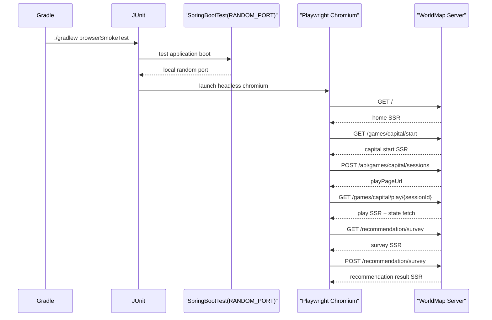

# Playwright로 public 핵심 흐름 브라우저 스모크 테스트 레일 추가하기

## 왜 이 조각이 필요했는가

지금까지 WorldMap은 테스트가 꽤 많았다.

- 게임 세션 상태 전이
- 추천 계산
- 랭킹 반영
- 권한 검증
- SSR 페이지 렌더링

하지만 이 대부분은 `MockMvc`나 서비스 통합 테스트였다.

즉 서버 로직은 많이 고정됐지만,
실제 브라우저에서 아래 흐름이 이어지는지는 자동으로 확인하지 못했다.

- home shell이 정상 렌더링되는가
- JS가 붙은 start form이 실제로 세션을 열고 redirect하는가
- 추천 설문이 실제 radio 선택과 form submit으로 결과 페이지까지 가는가

production-ready 품질로 올라가려면
이 “실제 사용자 경로”를 최소 한 번은 브라우저로 밟아 보는 레일이 필요했다.

## 이번 조각의 목표

- 브라우저 기반 smoke test를 추가한다.
- 하지만 기본 `./gradlew test`를 무겁게 만들지는 않는다.
- public 핵심 흐름 3개만 먼저 고정한다.

이번 첫 범위는 아래 셋이다.

1. `GET /` home shell
2. `GET /games/capital/start -> POST /api/games/capital/sessions -> /games/capital/play/{sessionId}`
3. `GET /recommendation/survey -> POST /recommendation/survey -> recommendation/result`

## 바뀐 파일

- [build.gradle](/Users/alex/project/worldmap/build.gradle)
- [BrowserSmokeE2ETest.java](/Users/alex/project/worldmap/src/test/java/com/worldmap/e2e/BrowserSmokeE2ETest.java)

문서도 함께 맞췄다.

- [README.md](/Users/alex/project/worldmap/README.md)
- [docs/PORTFOLIO_PLAYBOOK.md](/Users/alex/project/worldmap/docs/PORTFOLIO_PLAYBOOK.md)
- [docs/WORKLOG.md](/Users/alex/project/worldmap/docs/WORKLOG.md)

## 왜 Java Playwright로 갔는가

선택지는 크게 두 가지였다.

- Node 기반 Playwright 테스트를 별도 프로젝트로 붙이기
- 현재 Spring Boot test runtime 위에 Java Playwright를 얹기

이번에는 두 번째를 택했다.

이유는 단순하다.

- 이미 JUnit과 `@SpringBootTest`가 있다
- test profile의 H2 위에서 바로 서버를 띄울 수 있다
- 브라우저 smoke를 “현재 verification 레일의 일부”로 설명하기 쉽다

즉, 브라우저만 별도 도구로 열고
서버 부팅과 assertion은 지금 쓰는 Java 테스트 체계 안에 둔 것이다.

## build.gradle은 왜 별도 task를 만들었는가

핵심 설계는 이것이다.

```gradle
tasks.named('test') {
    useJUnitPlatform {
        excludeTags 'browser-smoke'
    }
}

tasks.register('browserSmokeTest', Test) {
    useJUnitPlatform {
        includeTags 'browser-smoke'
    }
}
```

중요한 점은
브라우저 테스트를 **추가**했지만
기존 `test`를 **느리게 만들지 않았다**는 것이다.

브라우저 레일은 비용이 크다.

- 브라우저 기동
- 실제 HTTP 서버 부팅
- 첫 실행 시 브라우저 바이너리 다운로드 가능성

이걸 매번 기본 `test`에 얹으면
개발 중 피드백 루프가 쉽게 무거워진다.

그래서 이번에는

- `test`: 빠른 단위/통합 피드백
- `browserSmokeTest`: 실제 브라우저 기반 smoke

로 verification lane을 분리했다.

## BrowserSmokeE2ETest는 무엇을 검증하는가

### 1. home shell

home에서는 아주 기본적인 사실을 본다.

- 타이틀이 정상인지
- 기본 theme이 light인지
- header shell이 뜨는지
- mode card가 기대 개수로 보이는지

이 테스트는 “첫 public 진입점이 SSR 기준으로 죽지 않았는가”를 보는 역할이다.

### 2. capital start -> play

첫 게임 smoke는 위치 게임이 아니라 수도 맞히기로 잡았다.

이유는 위치 게임은 WebGL, 지구본 렌더링, 정적 geo 자산까지 얽혀 있어서
브라우저 smoke의 첫 조각으로는 flaky surface가 더 넓기 때문이다.

반면 capital flow는 여전히 충분히 가치가 있다.

- start 페이지 SSR
- JS submit handler
- `/api/games/capital/sessions` POST
- session 생성
- play 페이지 redirect
- play 상태 fetch와 보기 4개 렌더링

즉, “실제 게임 시작 경로”를 검증하면서도
브라우저 불안정성은 더 적다.

### 3. recommendation survey -> result

추천 설문은 서버 기반 form submit 구조를 가장 잘 보여 준다.

- 질문 20개 렌더링
- radio 선택
- POST submit
- 결과 페이지 렌더링
- top 3 카드 노출

즉, JS 없는 기본 form과 결과 view가
실제 브라우저에서도 이어지는지 확인하는 데 적합하다.

## 요청 흐름은 이렇게 본다



핵심은 서버가 source of truth인 구조는 그대로라는 점이다.

Playwright는 그 위에서
“브라우저가 정말 이 흐름을 따라갈 수 있는가”만 검증한다.

## 왜 이 로직이 브라우저 테스트 클래스에 있어야 하는가

이걸 전부 MockMvc로 대체하면
브라우저 문제를 놓친다.

예를 들면 이런 것들이다.

- defer script가 실제로 붙는가
- submit handler가 브라우저에서 실행되는가
- redirect와 URL 전환이 이어지는가
- DOM이 최종적으로 어떤 상태가 되는가

반대로 이걸 브라우저 레일에 너무 많이 몰아넣으면
느리고 불안정해진다.

그래서 이번에는
**public 핵심 경로만 smoke test로 고정**했다.

즉,

- 상세 점수 정책과 예외 상태 전이는 기존 통합 테스트
- 실제 사용자 흐름은 Playwright smoke

로 책임을 나눈 셈이다.

## 테스트는 무엇을 돌렸는가

이번 조각에서 실제로 실행한 것은 아래다.

- `./gradlew compileTestJava`
- `./gradlew browserSmokeTest --tests com.worldmap.e2e.BrowserSmokeE2ETest`
- `./gradlew test --tests com.worldmap.web.HomeControllerTest`
- `git diff --check`

## 지금 남아 있는 한계

이번 레일이 완전히 self-contained한 것은 아니다.

현재 test profile은 Redis를 완전히 떼지 못했다.

그래서 이 머신에서는 통과했지만,
깨끗한 환경에서 `/stats`, `/ranking` 같은 Redis 경로를 바로 smoke에 넣는 것은 아직 이르다.

또 location globe는 WebGL/geo 자산 surface가 더 넓어서,
첫 브라우저 smoke 범위에는 일부러 넣지 않았다.

즉 다음 조각은 이런 방향이 된다.

- test profile에서 Redis 의존 더 줄이기
- `/stats`, `/ranking` smoke 추가 여부 판단
- modal focus/keyboard 흐름까지 실제 브라우저로 넓히기

## 면접에서는 어떻게 설명할까

이렇게 설명하면 된다.

> 서버 로직 테스트는 많이 있었지만, 실제 브라우저에서 SSR 화면, defer JS, form submit, redirect가 이어지는지는 자동으로 확인하지 못했습니다. 그래서 `build.gradle`에 `browserSmokeTest`를 따로 만들고, `BrowserSmokeE2ETest`에서 headless Chromium으로 home, 수도 게임 start -> play, 추천 설문 -> 결과를 직접 밟게 했습니다. 핵심은 브라우저 검증을 추가하되 기본 `test` 레일은 빠르게 유지하도록 분리했다는 점입니다.
