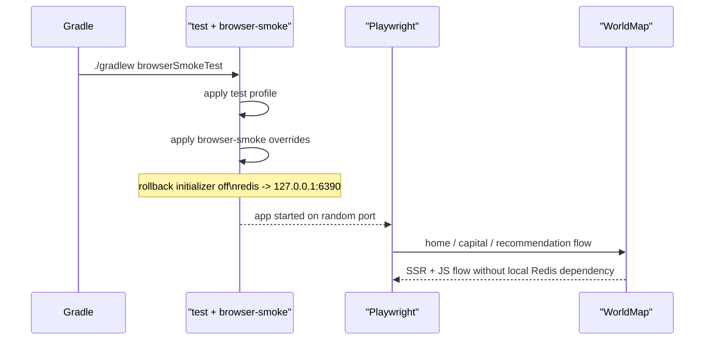

# browser smoke를 local Redis 없이도 뜨는 profile로 분리하기

## 왜 이 후속 조각이 필요했는가

직전 조각에서 Playwright 기반 browser smoke 레일은 생겼다.

하지만 그 상태만으로는 아직 조금 찜찜했다.

왜냐하면 브라우저 테스트가 통과한 이유가
정말로 smoke 범위가 self-contained해서인지,
아니면 이 머신의 Redis가 살아 있어서 우연히 지나간 것인지
구분이 선명하지 않았기 때문이다.

문제는 test profile 자체에 있었다.

- `application-test.yml`은 `worldmap.legacy.rollback.enabled=true`
- `GameLevelRollbackInitializer`는 startup 시 `StringRedisTemplate.keys()`와 `delete()`를 호출

즉, home / capital / recommendation 같은 경로는 Redis를 안 써도,
앱 시작 시점에 rollback initializer가 Redis를 건드릴 수 있었다.

그래서 이번 후속 조각은
브라우저 smoke가 자기 범위 밖 의존을 끌어오지 않게 만드는 데 집중했다.

## 이번 단계의 목표

- browser smoke는 계속 `test` 기반 H2 환경을 쓴다
- 하지만 startup에서 Redis를 건드리는 rollback initializer는 끈다
- Redis는 의도적으로 비어 있는 포트로 돌려, local Redis 6379에 기대지 않게 만든다

즉, “지금 browser smoke가 무엇에 의존하지 않도록 했는가”를
코드로 명시하는 것이 목표다.

## 바뀐 파일

- [application-browser-smoke.yml](/Users/alex/project/worldmap/src/main/resources/application-browser-smoke.yml)
- [BrowserSmokeE2ETest.java](/Users/alex/project/worldmap/src/test/java/com/worldmap/e2e/BrowserSmokeE2ETest.java)
- [BrowserSmokeProfileConfigTest.java](/Users/alex/project/worldmap/src/test/java/com/worldmap/common/config/BrowserSmokeProfileConfigTest.java)

## 무엇이 문제였나

startup에서 Redis를 직접 건드리는 코드는 [GameLevelRollbackInitializer.java](/Users/alex/project/worldmap/src/main/java/com/worldmap/common/config/GameLevelRollbackInitializer.java)에 있었다.

이 클래스는 원래 public product에서 제거한 legacy Level 2 데이터를
기존 local/test DB와 Redis에서 정리하기 위한 초기화 코드다.

즉 기능 자체는 맞다.

하지만 browser smoke의 목적은

- public shell
- start form
- survey submit

흐름을 검증하는 것이지,
legacy rollback을 검증하는 것이 아니다.

그래서 이 의존은 browser smoke에서 분리하는 편이 맞다.

## 어떻게 풀었나

### 1. browser-smoke profile 추가

새로 [application-browser-smoke.yml](/Users/alex/project/worldmap/src/main/resources/application-browser-smoke.yml)을 만들었다.

여기서 한 일은 두 가지다.

```yml
spring:
  data:
    redis:
      host: 127.0.0.1
      port: 6390

worldmap:
  legacy:
    rollback:
      enabled: false
```

핵심은:

- rollback initializer 비활성화
- Redis를 개발 기본 포트 6379가 아니라 비어 있는 6390으로 강제

라는 점이다.

즉 browser smoke가 local Redis에 기대면 바로 드러나게 만든 것이다.

### 2. BrowserSmokeE2ETest는 `test + browser-smoke`를 함께 쓴다

브라우저 테스트는 이제 이렇게 profile을 두 개 쓴다.

```java
@ActiveProfiles({"test", "browser-smoke"})
```

이 조합의 의미는 분명하다.

- `test`: H2, demo bootstrap off, servlet session 유지
- `browser-smoke`: rollback off, Redis 6390 override

즉 browser smoke는 test 기반이지만,
“브라우저용으로 꼭 필요한 추가 제약”만 따로 덮어쓴다.

## 왜 Redis를 그냥 안 쓰게만 하지 않고 6390으로 돌렸는가

여기서 중요한 포인트가 있다.

`worldmap.legacy.rollback.enabled=false`만 넣어도
현재 smoke 범위는 아마 통과할 가능성이 높다.

그런데 그러면 여전히

- local Redis가 켜져 있어도 모를 수 있고
- 어딘가가 실수로 Redis를 읽어도 그냥 지나갈 수 있다

이번에는 이걸 더 선명하게 하고 싶었다.

그래서 Redis를 일부러 비어 있는 `127.0.0.1:6390`으로 돌렸다.

이제 browser smoke가 통과했다는 뜻은,
현재 경로가 정말로 Redis를 건드리지 않았다는 뜻에 더 가깝다.

즉 이 설정은 단순 override가 아니라
**의존성 누수 감지 장치** 역할도 한다.

## config test는 왜 따로 추가했나

이번에는 [BrowserSmokeProfileConfigTest.java](/Users/alex/project/worldmap/src/test/java/com/worldmap/common/config/BrowserSmokeProfileConfigTest.java)도 추가했다.

검증하는 것은 단순하다.

- `worldmap.legacy.rollback.enabled=false`
- `spring.data.redis.host=127.0.0.1`
- `spring.data.redis.port=6390`

이 테스트가 필요한 이유는,
browser smoke의 안정성이 이제 코드뿐 아니라 profile 설정에도 달려 있기 때문이다.

즉 “이 test class에 profile annotation이 달려 있다”만으로는 부족하고,
그 profile 파일 자체가 어떤 값을 강제하는지 문서 대신 테스트로도 고정해야 한다.

## 요청 흐름은 어떻게 설명하면 되나



핵심은 browser smoke의 검증 범위와
그 바깥 의존을 코드로 분리했다는 점이다.

## 왜 이 로직이 profile 경계에 있어야 하는가

이걸 test class의 `properties = ...`로만 처리해도 동작은 할 수 있다.

하지만 이번에는 profile 파일로 뺐다.

이유는 의도를 남기기 위해서다.

`browser-smoke`라는 이름이 있으면
누가 봐도 “브라우저 smoke 전용 override”라는 사실이 드러난다.

즉,

- 어떤 테스트가
- 어떤 환경을 가정하고
- 어떤 외부 의존을 끊었는지

가 설정 파일 이름만 봐도 설명된다.

production-ready 품질 개선에서는 이런 명시성이 중요하다.

## 테스트는 무엇을 돌렸나

- `./gradlew compileTestJava`
- `./gradlew test --tests com.worldmap.common.config.BrowserSmokeProfileConfigTest`
- `./gradlew browserSmokeTest --tests com.worldmap.e2e.BrowserSmokeE2ETest`

이 마지막 테스트가 중요하다.

Redis를 `127.0.0.1:6390`으로 돌린 상태에서도
browser smoke가 실제로 통과했기 때문이다.

즉 현재 범위의 browser smoke는
적어도 local Redis 6379에 기대지 않는다.

## 아직 남은 점

이번 조각으로 모든 browser smoke 문제가 끝난 것은 아니다.

특히 아래는 아직 남아 있다.

- `/stats`
- `/ranking`

이 둘은 현재 `LeaderboardService`가 Redis를 직접 읽는 public 경로다.

그래서 다음 조각에서는

- fake/no-op leaderboard source를 둘지
- ephemeral Redis를 테스트 레일에 얹을지

를 결정해야 한다.

즉 이번은 “Redis-free 가능한 경로부터 확실히 분리한 조각”이다.

## 면접에서는 어떻게 설명할까

이렇게 설명하면 된다.

> Playwright browser smoke를 붙였다고 바로 self-contained 테스트가 되는 건 아니었습니다. 기존 test profile은 startup rollback initializer가 Redis를 건드려서, 로컬 Redis가 살아 있어서 통과하는 상태였기 때문입니다. 그래서 `browser-smoke` profile을 따로 만들고 legacy rollback을 끄고, Redis를 일부러 비어 있는 `127.0.0.1:6390`으로 돌렸습니다. 덕분에 현재 home, 수도 게임 start -> play, 추천 설문 -> 결과 브라우저 smoke는 local Redis 없이도 뜨는 레일이 됐고, 어떤 외부 의존을 끊었는지도 코드에서 바로 설명할 수 있게 됐습니다.
