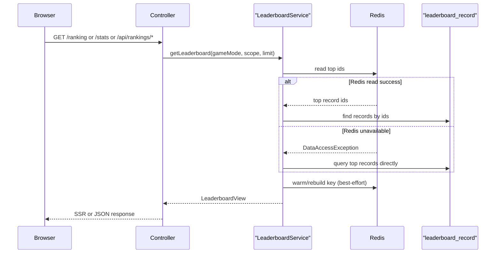

# Redis가 없어도 `/ranking`, `/stats`는 DB fallback으로 계속 읽히게 만들기

## 왜 이 후속 조각이 필요했는가

직전 조각에서 browser smoke는 local Redis 없이도 뜨는 profile 경계를 얻었다.

하지만 아직 한 가지가 남아 있었다.

- `home`
- `capital start -> play`
- `recommendation survey -> result`

같은 경로는 Redis 없이도 괜찮았지만,
`/ranking`, `/stats`, `/api/rankings/*`는 여전히
`LeaderboardService`가 Redis ZSET을 직접 읽다가 실패하면
public 화면이 그대로 죽을 수 있었다.

이건 browser smoke 범위 문제이기도 했지만,
더 근본적으로는 public read path의 장애 계약 문제였다.

이 프로젝트에서 source of truth는 RDB의 `leaderboard_record`다.
Redis는 leaderboard read model과 cache 역할이다.

그렇다면 Redis가 내려가 있어도
public 랭킹 화면과 Stats 화면은
DB 기반 top run으로 계속 읽혀야 했다.

이번 조각은 바로 그 경계를 코드로 고정하는 데 집중했다.

## 이번 단계의 목표

- Redis leaderboard read가 실패해도 `/api/rankings/*`는 계속 응답한다
- `/ranking` 첫 SSR도 DB fallback으로 계속 렌더링된다
- `/stats`의 daily top 보드도 Redis 없이 계속 열린다
- browser smoke 범위를 `/ranking`, `/stats`까지 넓혀도 local Redis 없이 통과한다

즉 “Redis는 빠르게 읽기 위한 read model이지, public 화면을 죽이는 단일 의존이 아니다”를
서비스 코드와 테스트로 함께 남기는 것이 목표다.

## 바뀐 파일

- [LeaderboardService.java](/Users/alex/project/worldmap/src/main/java/com/worldmap/ranking/application/LeaderboardService.java)
- [RedisUnavailableLeaderboardFallbackIntegrationTest.java](/Users/alex/project/worldmap/src/test/java/com/worldmap/ranking/RedisUnavailableLeaderboardFallbackIntegrationTest.java)
- [BrowserSmokeE2ETest.java](/Users/alex/project/worldmap/src/test/java/com/worldmap/e2e/BrowserSmokeE2ETest.java)

## 원래 어디서 실패했나

핵심은 [LeaderboardService.java](/Users/alex/project/worldmap/src/main/java/com/worldmap/ranking/application/LeaderboardService.java)의 `getLeaderboard(...)`다.

이 메서드는 public surface 세 군데가 같이 쓴다.

- [LeaderboardApiController.java](/Users/alex/project/worldmap/src/main/java/com/worldmap/ranking/web/LeaderboardApiController.java)
- [LeaderboardPageController.java](/Users/alex/project/worldmap/src/main/java/com/worldmap/ranking/web/LeaderboardPageController.java)
- [StatsPageController.java](/Users/alex/project/worldmap/src/main/java/com/worldmap/stats/web/StatsPageController.java)

즉 랭킹 API, `/ranking` SSR, `/stats` SSR은 모두
같은 leaderboard read contract를 공유한다.

기존 흐름은 대략 이랬다.

1. Redis ZSET에서 상위 record id를 읽는다
2. id 기준으로 RDB 상세 row를 다시 읽는다
3. Redis key가 비었으면 RDB 상위 row를 읽고 Redis를 다시 채운다

문제는 Redis read나 Redis 재구성 단계에서 예외가 나면
public 응답까지 같이 실패할 수 있다는 점이었다.

즉 source of truth는 DB라고 말하고 있었지만,
실제 장애 동작은 그렇게 보이지 않았다.

## 어떻게 풀었나

### 1. Redis read 실패를 `cache miss`처럼 본다

`topRecordIdsFromRedis(...)` 안의 RedisTemplate 호출을
`DataAccessException` 기준으로 감쌌다.

이제 Redis read가 실패하면 예외를 바깥으로 터뜨리지 않고,
그냥 빈 결과처럼 본다.

그 다음 흐름은 자연스럽게 DB fallback으로 내려간다.

```java
try {
    tuples = stringRedisTemplate.opsForZSet()
        .reverseRangeWithScores(redisKey(gameMode, scope, targetDate), 0, limit - 1);
} catch (DataAccessException ex) {
    log.warn("Failed to read leaderboard from redis. Falling back to database.", ex);
    return List.of();
}
```

핵심은 Redis failure를
“public 응답 실패”
가 아니라
“cache miss”
로 재정의한 것이다.

### 2. Redis warm-up / rebuild도 best-effort로만 둔다

Redis read가 실패해서 DB fallback으로 내려간 뒤에도
서비스는 기존처럼 Redis를 다시 채우려 한다.

여기서 또 예외가 나면,
결국 public 화면이 다시 500이 된다.

그래서 `syncRecordsToRedis(...)`와 `rebuildRedisKey(...)` 호출도
safe wrapper로 감쌌다.

즉:

- DB fallback 응답은 우선 살린다
- Redis 재수화는 가능하면 한다
- 재수화가 실패해도 public 응답은 그대로 보낸다

이게 source of truth를 RDB로 둔 구조와 더 맞는다.

## 왜 이 로직이 컨트롤러가 아니라 서비스에 있어야 하는가

이걸 `/ranking`, `/stats`, `/api/rankings/*` 각 컨트롤러에서 따로 처리할 수도 있다.

하지만 그렇게 하면 public surface마다 장애 계약이 달라질 수 있다.

- 어떤 화면은 Redis 장애를 흡수하고
- 어떤 API는 500이 나고
- 어떤 화면은 빈 상태로만 처리하는

식으로 흩어질 수 있다.

이번 문제는 화면 문제가 아니라
leaderboard read model의 도메인 계약 문제다.

그래서 `LeaderboardService`가

- Redis read
- DB fallback
- Redis warm/rebuild best-effort

를 한 군데에서 책임지는 편이 맞다.

즉 컨트롤러는 “leaderboard를 보여 달라”만 말하고,
실제로 어떤 저장소 조합으로 읽을지는 서비스가 결정한다.

## 요청 흐름은 어떻게 설명하면 되나



핵심은 컨트롤러가 실패 분기를 몰라도 된다는 점이다.

public surface는 그대로 `LeaderboardView`만 받는다.
Redis 장애 처리와 DB fallback은 서비스 안쪽 경계에 있다.

## 어떤 테스트로 고정했나

### 1. MockMvc 통합 테스트

[RedisUnavailableLeaderboardFallbackIntegrationTest.java](/Users/alex/project/worldmap/src/test/java/com/worldmap/ranking/RedisUnavailableLeaderboardFallbackIntegrationTest.java)를 새로 추가했다.

이 테스트는 Redis를 일부러 비어 있는 `127.0.0.1:6390`으로 두고,
`leaderboard_record`에 sample run을 직접 넣은 다음
세 경로를 검증한다.

- `GET /api/rankings/location`
- `GET /ranking`
- `GET /stats`

즉 브라우저가 아니라도
public read path 계약 자체가 Redis unavailable 상황에서 살아 있는지
먼저 서비스/웹 계층 통합 테스트로 닫은 것이다.

### 2. Playwright browser smoke

[BrowserSmokeE2ETest.java](/Users/alex/project/worldmap/src/test/java/com/worldmap/e2e/BrowserSmokeE2ETest.java)에는 두 흐름을 더 추가했다.

- `GET /ranking`
- `GET /stats`

이 테스트는 이미 `test + browser-smoke` profile 조합을 쓰고,
Redis는 `127.0.0.1:6390`으로 비어 있다.

즉 여기서 `/ranking`, `/stats`가 headless Chromium에서 실제로 뜬다는 뜻은,
public read path가 local Redis 없이도 동작한다는 강한 증거가 된다.

## 이번에 실행한 검증

- `./gradlew compileTestJava`
- `./gradlew test --tests com.worldmap.ranking.RedisUnavailableLeaderboardFallbackIntegrationTest`
- `./gradlew browserSmokeTest --tests com.worldmap.e2e.BrowserSmokeE2ETest`
- `git diff --check`

중요한 포인트는 browser smoke가
“Redis가 없는 환경에서도”
`/ranking`, `/stats`까지 통과했다는 점이다.

## 무엇이 더 production-ready에 가까워졌나

이번 조각으로 좋아진 것은 단순히 테스트 개수만이 아니다.

이제 public leaderboard read path는

- Redis가 있으면 빠르게 읽고
- Redis가 없으면 DB로 읽고
- Redis 재수화는 가능한 만큼만 시도하고
- public 응답은 계속 유지한다

라는 계약을 갖게 됐다.

이건 운영 관점에서 중요하다.

랭킹 read model이 잠깐 흔들린다고
서비스 홈에서 `랭킹 보기`, `서비스 현황 보기`가 전부 죽는 구조는
production-ready라고 말하기 어렵기 때문이다.

## 아직 남은 점

이번 조각이 public leaderboard read path를 닫아 줬지만,
production-ready 품질에서 아직 남은 건 있다.

- 모달 `Tab / Shift+Tab / Escape / focus return`까지 실제 브라우저 E2E로 넓히기
- `browserSmokeTest`를 CI verification job으로 올릴지 결정하기

즉 이제는 “Redis가 없으면 화면이 죽는가”보다는
“실제 브라우저 상호작용과 CI 레일을 어디까지 고정할 것인가”가 다음 질문이다.

## 면접에서는 어떻게 설명할까

이렇게 설명하면 된다.

> Redis를 랭킹 read model로 쓰더라도 public 화면이 Redis 하나에 묶여 있으면 production-ready라고 보기 어렵습니다. 그래서 이번에는 `LeaderboardService`가 Redis read 실패를 cache miss처럼 보고 DB의 `leaderboard_record` top run으로 바로 fallback하도록 바꿨습니다. 동시에 Redis warm-up과 rebuild는 best-effort로만 두어서 `/api/rankings`, `/ranking`, `/stats` 응답은 계속 살렸습니다. 그 결과 browser smoke도 local Redis 없이 이 경로들까지 검증할 수 있게 됐습니다.
