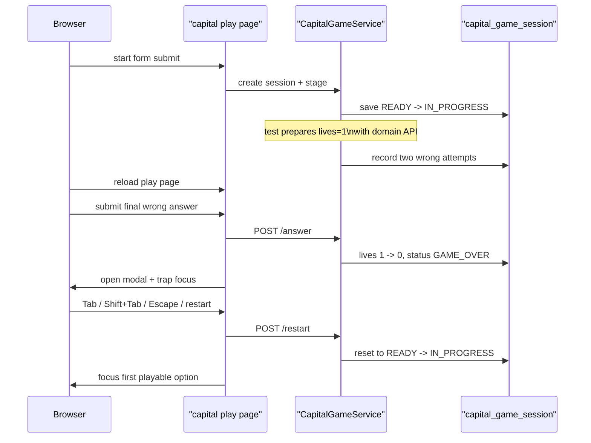

# capital 게임오버 모달 키보드 흐름을 실제 브라우저 E2E로 고정하기

## 왜 이 후속 조각이 필요했는가

이미 public 게임들의 game-over modal에는 접근성 보강이 들어가 있었다.

- `role="dialog"`
- `aria-describedby`
- `inert`
- focus trap
- restart 후 focus return

문제는 그다음이었다.

이 로직이 “코드에 있다”는 것과
“실제 브라우저에서 계속 맞게 동작한다”는 것은 다른 이야기다.

production-ready 품질을 말하려면
적어도 대표 게임 하나에서는

- `Tab`
- `Shift+Tab`
- `Escape`
- restart 뒤 focus return

이 전부가 실제 Chromium에서 검증되어야 했다.

이번 조각은 그 대표 게임으로 `capital`을 골라
browser smoke 레일에 넣는 데 집중했다.

## 왜 capital을 대표 게임으로 골랐나

위치 찾기 게임은 3D 지구본과 WebGL surface가 있어서
브라우저 E2E의 초점이 modal keyboard가 아니라 렌더링 환경으로 흩어질 수 있다.

반면 capital 게임은

- start
- state
- answer
- game over
- restart

흐름이 깔끔하고,
modal 구조도 다른 quiz 계열 게임과 거의 같은 패턴을 쓴다.

즉 modal keyboard 규칙을 대표로 검증하기에 가장 안전한 표본이다.

## 바뀐 파일

- [BrowserSmokeE2ETest.java](/Users/alex/project/worldmap/src/test/java/com/worldmap/e2e/BrowserSmokeE2ETest.java)

## 무엇을 브라우저에서 확인해야 하나

이번에 고정하려는 건 단순히 “모달이 보인다”가 아니다.

실제 확인 포인트는 이 네 가지다.

1. game over가 나면 restart 버튼으로 초점이 이동하는가
2. `Tab`과 `Shift+Tab`으로 모달 안에서만 초점이 순환하는가
3. `Escape`를 눌러도 모달이 닫히지 않고 restart 버튼으로 초점이 돌아오는가
4. restart 뒤 다시 playable input으로 초점이 돌아오는가

즉 이번 E2E의 핵심은 modal open 자체보다
**focus management contract**다.

## 전부 브라우저 클릭으로 game over를 만들지 않은 이유

처음에는 브라우저에서 일부러 세 번 틀려서
game over modal까지 가는 방식을 생각할 수 있다.

하지만 이 방식은 테스트의 초점을 흐릴 수 있다.

우리가 검증하려는 위험은
“반복 오답 루프가 자연스럽다”가 아니라
“modal keyboard flow가 유지된다”이기 때문이다.

그래서 이번에는 책임을 나눴다.

- 브라우저: 실제 세션 시작, 마지막 오답, modal 키보드 조작, restart 후 focus 확인
- 서버 도메인 API: 그 직전까지 lives를 `1`개 남은 상태로 준비

이 방식이 더 설명 가능하다.

테스트가 modal keyboard 품질을 보는 것이라면,
거기까지 가는 앞부분의 반복 오답은
도메인 API로 축약하는 편이 맞다.

## 어떻게 풀었나

### 1. 브라우저가 실제 capital 세션을 만든다

테스트는 먼저 capital start page를 연다.

```java
page.navigate(baseUrl() + "/games/capital/start");
page.locator("#capital-nickname").fill("browser-modal");
page.locator("#capital-start-submit").click();
page.waitForURL("**/games/capital/play/*");
```

즉 브라우저 세션과 서버 세션은 실제 제품과 같은 방식으로 열린다.

## 2. 서버 도메인 API로 lives를 1까지 줄인다

이후 테스트는 같은 session id와 `guestSessionKey`를 읽어
서버의 [CapitalGameService.java](/Users/alex/project/worldmap/src/main/java/com/worldmap/game/capital/application/CapitalGameService.java)를 직접 호출한다.

핵심은 [GameSessionAccessContext.java](/Users/alex/project/worldmap/src/main/java/com/worldmap/game/common/application/GameSessionAccessContext.java)다.

브라우저가 만든 세션의 `guestSessionKey`를 그대로 써서
같은 ownership 문맥 안에서 두 번 오답을 기록한다.

```java
GameSessionAccessContext accessContext = GameSessionAccessContext.forGuest(guestSessionKey);

capitalGameService.submitAnswer(sessionId, 1, wrongOptionNumber, accessContext);
capitalGameService.submitAnswer(sessionId, 1, wrongOptionNumber, accessContext);
```

이제 capital session은 `livesRemaining = 1` 상태가 된다.

브라우저는 play page를 다시 로드해
최신 state를 받는다.

## 3. 마지막 오답 1회만 브라우저가 보낸다

이제부터가 modal E2E의 핵심이다.

브라우저는 마지막 오답 한 번을 실제로 제출한다.

그 결과 `GAME_OVER`가 나고,
[capital-game.js](/Users/alex/project/worldmap/src/main/resources/static/js/capital-game.js)의 `showGameOverModal(...)`이 실행된다.

이 함수는

- summary 문구 채우기
- modal open
- `.page-shell.inert = true`
- document keydown listener 연결
- restart button focus

를 맡는다.

즉 browser smoke가 여기서부터는
진짜 제품의 modal focus 경로를 그대로 밟는다.

## 요청 흐름은 어떻게 설명하면 되나



핵심은 서버 상태 준비와 브라우저 interaction 검증이
서로 다른 책임으로 나뉜다는 점이다.

## 실제로 무엇을 assert 했나

브라우저 테스트는 아래를 확인한다.

### 1. modal open 직후 restart button focus

```java
assertThat(page.evaluate("() => document.activeElement?.id"))
    .isEqualTo("capital-restart-button");
```

### 2. `Tab`은 홈 링크로, `Shift+Tab`은 다시 restart로 순환

```java
page.keyboard().press("Tab");
assertThat(page.evaluate("() => document.activeElement?.getAttribute('href')"))
    .isEqualTo("/");

page.keyboard().press("Shift+Tab");
assertThat(page.evaluate("() => document.activeElement?.id"))
    .isEqualTo("capital-restart-button");
```

즉 focus trap이 실제로 modal 안에서만 돈다는 뜻이다.

### 3. `Escape`는 dismiss가 아니라 restart focus return

이 제품의 game-over modal은
`Escape`로 닫히지 않는다.

대신 restart button으로 focus를 되돌린다.

```java
page.keyboard().press("Escape");
assertThat(page.evaluate("() => !document.getElementById('capital-game-over-modal').hidden"))
    .isEqualTo(true);
assertThat(page.evaluate("() => document.activeElement?.id"))
    .isEqualTo("capital-restart-button");
```

즉 keyboard 사용자가 실수로 modal을 닫아 버리는 흐름을 막고,
다음 액션인 restart 쪽으로 다시 안내하는 규칙을 고정했다.

### 4. restart 뒤 첫 playable input으로 focus 복귀

restart 버튼 클릭 뒤에는
단순히 modal이 닫히는 것만으로는 부족하다.

사용자가 바로 다음 선택을 이어갈 수 있어야 한다.

그래서 마지막에는 첫 번째 수도 보기 input에 focus가 돌아오는지 확인한다.

```java
page.waitForFunction(
    "() => document.getElementById('capital-game-over-modal').hidden "
        + "&& document.activeElement?.matches('#capital-options input[name=\"capital-option\"]')"
);
```

이게 바로 “restart 후 focus return” 계약이다.

## 왜 이 조각이 production-ready에 가깝나

이번 작업은 새 기능을 만든 것이 아니다.

그런데도 production-ready 품질에는 꽤 중요하다.

왜냐하면 접근성 로직은

- 코드에 한 번 넣는 것
- 회귀 없이 유지하는 것

사이 차이가 크기 때문이다.

특히 modal focus는
작은 JS 수정이나 DOM 순서 변경만으로도 쉽게 깨질 수 있다.

이번 E2E가 붙고 나면
capital 대표 게임에서는 이 위험이 실제 브라우저에서 잡힌다.

즉 “접근성 문구가 있다”가 아니라
“실제 키보드 흐름이 검증된다”로 한 단계 올라간 셈이다.

## 테스트는 무엇을 돌렸나

- `./gradlew compileTestJava`
- `./gradlew browserSmokeTest --tests com.worldmap.e2e.BrowserSmokeE2ETest.capitalGameOverModalSupportsKeyboardTrapAndRestartFocusReturn`
- `./gradlew browserSmokeTest --tests com.worldmap.e2e.BrowserSmokeE2ETest`
- `git diff --check`

## 아직 남은 점

이번에는 capital 대표 게임 1개만 닫았다.

즉 아직 남아 있는 후속은 있다.

- 같은 modal keyboard E2E를 다른 quiz/battle 게임까지 넓히기
- `browserSmokeTest`를 CI verification job으로 올리기

즉 이제 질문은
“이 modal이 되나?”
가 아니라
“이 browser smoke 레일을 어디까지 확장하고 어디서 자동으로 막을 것인가?”
에 더 가깝다.

## 면접에서는 어떻게 설명할까

이렇게 설명하면 된다.

> 접근성 로직이 코드에 있다고 해서 실제 브라우저에서 계속 맞게 동작하는 건 아닙니다. 그래서 이번에는 capital 게임의 game-over modal을 대표로 골라, `Tab / Shift+Tab / Escape / restart 후 focus return`을 Playwright browser smoke로 직접 고정했습니다. 앞부분의 두 번 오답은 서버 도메인 API로 lives를 1개 남은 상태까지 준비하고, 마지막 오답과 modal keyboard 조작만 브라우저로 밟게 해서, 테스트의 초점을 modal 품질에 정확히 맞춘 점이 핵심입니다.
