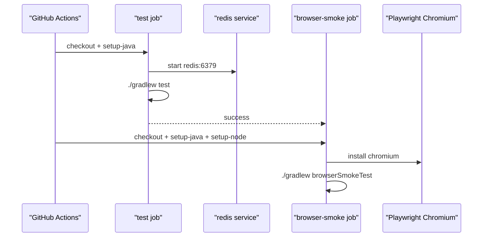

# GitHub Actions에 `test -> browserSmokeTest` verify 레일 올리기

## 왜 이 후속 조각이 필요했는가

로컬에서는 이미 두 가지 검증 레일이 있었다.

- `./gradlew test`
- `./gradlew browserSmokeTest`

하지만 이 상태만으로는 production-ready라고 말하기 어렵다.

이유는 간단하다.

개발자 머신에서만 수동으로 돌리는 테스트는
회귀를 막는 장치가 아니라
그냥 “돌려볼 수 있는 명령”에 가깝기 때문이다.

특히 browser smoke는 최근에 많이 좋아졌다.

- local Redis 없이도 돌 수 있는 `browser-smoke` profile
- `/ranking`, `/stats`의 DB fallback
- capital game-over modal keyboard E2E

여기까지 왔다면 이제는 GitHub Actions가
이 레일을 자동으로 다시 밟아 줘야 했다.

이번 조각의 목표는
`test`와 `browserSmokeTest`를
CI에서 같은 계약으로 재현하는 것이었다.

## 이번 단계의 목표

- GitHub Actions에 verify workflow를 추가한다
- 일반 `test` job은 Redis service를 명시적으로 띄운다
- browser smoke job은 Playwright Chromium 설치 뒤 별도 레일로 실행한다
- workflow를 만들면서 드러난 self-contained하지 않은 테스트도 같이 정리한다

즉 “YAML만 추가”가 아니라
**실제로 green이 되는 verification baseline**을 만드는 것이 목표다.

## 바뀐 파일

- [verify.yml](/Users/alex/project/worldmap/.github/workflows/verify.yml)
- [RedisSessionConfigurationIntegrationTest.java](/Users/alex/project/worldmap/src/test/java/com/worldmap/common/config/RedisSessionConfigurationIntegrationTest.java)
- [LocationGameFlowIntegrationTest.java](/Users/alex/project/worldmap/src/test/java/com/worldmap/game/location/LocationGameFlowIntegrationTest.java)
- [CapitalGameFlowIntegrationTest.java](/Users/alex/project/worldmap/src/test/java/com/worldmap/game/capital/CapitalGameFlowIntegrationTest.java)
- [PopulationGameFlowIntegrationTest.java](/Users/alex/project/worldmap/src/test/java/com/worldmap/game/population/PopulationGameFlowIntegrationTest.java)
- [FlagGameFlowIntegrationTest.java](/Users/alex/project/worldmap/src/test/java/com/worldmap/game/flag/FlagGameFlowIntegrationTest.java)
- [PopulationBattleGameFlowIntegrationTest.java](/Users/alex/project/worldmap/src/test/java/com/worldmap/game/populationbattle/PopulationBattleGameFlowIntegrationTest.java)

## verify workflow는 어떻게 구성했나

새 workflow는 [.github/workflows/verify.yml](/Users/alex/project/worldmap/.github/workflows/verify.yml)이다.

이 workflow에는 job이 두 개 있다.

### 1. `test` job

이 job은 일반 단위/통합 테스트 레일이다.

핵심은 Redis service를 같이 띄운다는 점이다.

```yml
services:
  redis:
    image: redis:8-alpine
    ports:
      - 6379:6379
```

왜 필요한가?

현재 `application-test.yml`은 여전히
`spring.data.redis.host=localhost`
`spring.data.redis.port=6379`
를 전제로 하기 때문이다.

즉 이 레일은 원래부터 Redis-backed integration 전제를 가진다.

그 전제를 CI에서 숨기지 않고
job 안에 명시적으로 적어 둔 것이다.

이후 실행은 단순하다.

```yml
./gradlew test
```

### 2. `browser-smoke` job

이 job은 browser E2E 전용이다.

여기서는 반대로 Redis service를 따로 띄우지 않는다.

대신 Playwright Chromium을 설치한 뒤
`./gradlew browserSmokeTest`를 돌린다.

```yml
- uses: actions/setup-node@v4
- run: npx -y playwright@1.58.0 install --with-deps chromium
- run: ./gradlew browserSmokeTest
```

이 job은 `needs: test` 뒤에 둬서
일반 테스트가 이미 깨졌으면
브라우저 비용을 먼저 쓰지 않게 했다.

즉 core test가 먼저,
브라우저 smoke는 그 다음이다.

## 왜 두 레일을 한 job에 합치지 않았나

겉보기에는 한 job에서 다 돌려도 된다.

하지만 그러면 두 전제가 섞인다.

- 일반 `test`: Redis-backed integration 전제
- browser smoke: Redis-free `browser-smoke` profile 전제

이 둘을 한꺼번에 섞으면
어떤 전제가 어떤 테스트를 위한 것인지 흐려진다.

이번 조각은 오히려 그걸 분리하는 데 의미가 있다.

즉 verification lane도
“무슨 환경에서 어떤 계약을 검증하는가”가
job 이름과 설정만 봐도 드러나야 한다.

## workflow를 추가했더니 무엇이 드러났나

재미있는 지점은 여기였다.

처음에는 verify workflow만 추가하면 끝날 것처럼 보였다.

그런데 실제로 같은 명령을 로컬에서 다시 돌려 보니
두 종류의 문제가 바로 드러났다.

### 1. prod session config 테스트가 self-contained하지 않았다

[RedisSessionConfigurationIntegrationTest.java](/Users/alex/project/worldmap/src/test/java/com/worldmap/common/config/RedisSessionConfigurationIntegrationTest.java)는
prod profile에서 Redis-backed session repository가 켜지는지만 보고 싶어 했다.

그런데 prod profile의 `ddl-auto=validate`까지 그대로 끌고 와서
H2에 schema가 없으면 context가 뜨지 않는 문제가 있었다.

이번에는 이 테스트에만

```java
"spring.jpa.hibernate.ddl-auto=create-drop"
```

override를 추가했다.

즉 이 테스트는 이제
“prod session config가 Redis repository를 켜는가”
만 본다.

schema validation 자체는 이 테스트의 책임이 아니다.

### 2. 일부 game flow 테스트가 현재 하트 규칙보다 예전 기대값을 들고 있었다

다섯 게임 중 몇몇 result/restart 테스트는
현재 life 규칙과 맞지 않는 오답 횟수를 기대하고 있었다.

예를 들어:

- 1스테이지에서 이미 하트 하나를 잃고
- 2스테이지에서 세 번 더 오답을 넣는

식으로, 실제 서버 규칙보다 한 번 많은 submit을 기대하고 있었다.

이건 앱 회귀가 아니라 테스트 기대값의 문제였다.

그래서 location/capital/population/flag/population-battle flow test의
오답 횟수와 restart 전 terminal 상태 기대값을
현재 서버 규칙에 맞게 정리했다.

즉 verify workflow를 만들면서
기존 테스트 baseline도 같이 현실과 다시 맞춘 셈이다.

## 요청 흐름은 어떻게 설명하면 되나



핵심은 두 레일이 서로 다른 전제를 갖지만
verify workflow 안에서 순서 있게 재현된다는 점이다.

## 실제로 무엇을 검증했나

이번 조각에서는 workflow 파일만 만든 것이 아니라,
로컬에서 workflow와 같은 조건을 다시 재현했다.

### 1. YAML 파싱

`.github/workflows/verify.yml`이 최소한 구조적으로는 맞는지
Ruby YAML loader로 확인했다.

### 2. `./gradlew test`

로컬 Redis 6379를 임시로 띄운 뒤
실제로 `./gradlew test`를 다시 돌렸다.

이 과정에서 위에서 말한

- RedisSessionConfigurationIntegrationTest
- 여러 game flow 테스트 기대값

문제를 찾아서 함께 고쳤다.

### 3. `./gradlew browserSmokeTest`

browser smoke도 다시 전체 실행했다.

즉 verify workflow가 돌릴 두 레일이
로컬에서도 실제로 green인지까지 확인한 셈이다.

## 왜 이 조각이 production-ready에 중요하나

이번 작업은 기능 추가처럼 보이지 않을 수 있다.

하지만 production-ready에서 중요한 건
“문제가 생기면 누가 자동으로 잡아 주는가”다.

이제는 최소한

- core test
- browser smoke

두 레일이 GitHub Actions에 올라갈 준비가 됐다.

즉 테스트가 “있다”에서
“CI가 다시 밟는다”로 한 단계 올라간 것이다.

## 테스트는 무엇을 돌렸나

- `ruby -e 'require "yaml"; data = YAML.load_file(".github/workflows/verify.yml"); abort("missing jobs") unless data["jobs"]; puts data["jobs"].keys.join(",")'`
- `./gradlew test`
- `./gradlew browserSmokeTest`
- `git diff --check`

## 아직 남은 점

이번에 verify workflow는 만들었지만,
아직 GitHub에서 required check로 강제한 상태는 아니다.

또한 browser smoke 범위도 여전히 대표 경로 중심이다.

즉 다음 질문은 이렇다.

- 이 verify workflow를 PR required check로 걸 것인가
- capital 외 다른 게임 modal keyboard E2E도 더 넣을 것인가

## 면접에서는 어떻게 설명할까

이렇게 설명하면 된다.

> 이번에는 `test`와 `browserSmokeTest`를 GitHub Actions verify workflow로 올렸습니다. 핵심은 두 레일의 전제를 분리해, 일반 통합 테스트는 Redis service를 명시적으로 띄우고 browser smoke는 계속 Redis-free profile로 돌리게 한 점입니다. 그리고 workflow를 만들면서 prod session config 테스트와 여러 게임 flow 테스트의 오래된 기대값도 같이 정리해서, CI에서 실제로 초록색이 되는 verification baseline을 만들었습니다.
