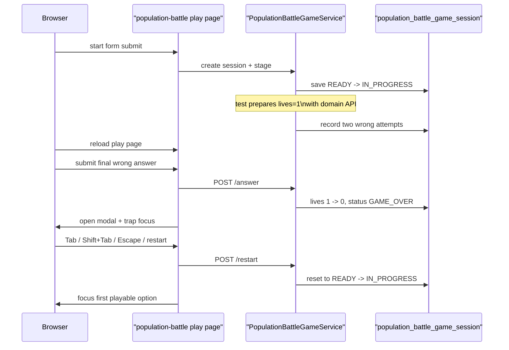

# population-battle 게임오버 모달 키보드 흐름도 실제 브라우저 E2E로 고정하기

## 왜 이 후속 조각이 필요했는가

직전 조각에서 capital 게임의 game-over modal keyboard flow는
실제 Chromium으로 고정했다.

그런데 그 표본 하나만으로는 아직 조금 아쉬웠다.

capital은 4-choice quiz형 게임이다.

반면 이 프로젝트에는
`population-battle`처럼 좌우 2-choice compare shell도 있다.

즉 modal contract는 같아도
플레이 화면의 입력 구조와 HUD 리듬은 다르다.

그래서 이번 후속 조각은
같은 keyboard modal 규칙이
2-choice battle 표면에서도 유지되는지
실제 브라우저로 확인하는 데 집중했다.

## 이번 단계의 목표

- population-battle start -> play를 실제 브라우저로 연다
- game over modal을 실제 브라우저에서 띄운다
- `Tab`, `Shift+Tab`, `Escape`, restart 후 focus return을 검증한다
- capital에 이어 다른 UI 패턴 하나까지 representative browser E2E를 넓힌다

즉 이번 목표는 새 기능이 아니라
browser smoke의 **대표성 확대**다.

## 바뀐 파일

- [BrowserSmokeE2ETest.java](/Users/alex/project/worldmap/src/test/java/com/worldmap/e2e/BrowserSmokeE2ETest.java)

## 왜 population-battle를 다음 표본으로 골랐나

location 게임은 WebGL 지구본이 들어가서
브라우저 E2E의 초점이 modal보다 렌더링 환경으로 퍼질 수 있다.

population과 flag는 capital과 꽤 비슷한 quiz 계열이다.

반면 population-battle은

- 좌우 2-choice input
- compare question prompt
- 다른 HUD copy

를 가진다.

즉 “capital과는 다른 UI 패턴인데, modal contract는 같은가?”를 보기에 더 좋은 표본이다.

## 어떻게 풀었나

### 1. 브라우저가 실제 battle 세션을 만든다

테스트는 먼저 start page를 열고
population-battle 세션을 실제로 만든다.

```java
page.navigate(baseUrl() + "/games/population-battle/start");
page.locator("#population-battle-nickname").fill("browser-battle-modal");
page.locator("#population-battle-start-submit").click();
page.waitForURL("**/games/population-battle/play/*");
```

즉 browser session과 game session은
제품과 같은 방식으로 열린다.

### 2. 서버 도메인 API로 lives를 1개 남은 상태까지 준비한다

이번에도 테스트 초점은
modal keyboard flow다.

그래서 앞부분의 반복 오답 두 번은
서버 도메인 API로 축약했다.

테스트는 session row에서 `guestSessionKey`를 읽고,
[GameSessionAccessContext.java](/Users/alex/project/worldmap/src/main/java/com/worldmap/game/common/application/GameSessionAccessContext.java)로 같은 ownership 문맥을 만든다.

그 뒤 [PopulationBattleGameService.java](/Users/alex/project/worldmap/src/main/java/com/worldmap/game/populationbattle/application/PopulationBattleGameService.java)의 `submitAnswer(...)`를 두 번 호출해
lives를 `3 -> 1`로 줄인다.

즉 브라우저는 마지막 오답과 modal interaction에만 집중한다.

### 3. 마지막 오답 1회는 브라우저가 직접 제출한다

여기서부터는 browser E2E의 핵심이다.

브라우저가 좌우 보기 중 오답 하나를 선택하고 제출하면
`GAME_OVER`가 되고,
[population-battle-game.js](/Users/alex/project/worldmap/src/main/resources/static/js/population-battle-game.js)의 `showGameOverModal(...)`이 실행된다.

이 함수는

- summary 문구 채우기
- modal open
- `.page-shell.inert = true`
- keydown listener 연결
- restart button focus

를 담당한다.

즉 테스트는 실제 브라우저에서
진짜 modal focus scope를 그대로 밟는다.

## 요청 흐름은 어떻게 설명하면 되나



핵심은 capital 때와 같다.

상태 준비는 서버가,
실제 키보드 interaction은 브라우저가 맡는다.

## 실제로 무엇을 assert 했나

테스트는 아래 네 가지를 확인한다.

### 1. modal open 직후 restart button focus

```java
assertThat(page.evaluate("() => document.activeElement?.id"))
    .isEqualTo("population-battle-restart-button");
```

### 2. `Tab` / `Shift+Tab` focus trap

restart button에서 `Tab`을 누르면 홈 링크,
`Shift+Tab`을 누르면 다시 restart button으로 돌아와야 한다.

즉 modal 밖으로 focus가 새지 않아야 한다.

### 3. `Escape`는 dismiss가 아니라 restart focus return

population-battle도 capital과 같은 제품 규칙을 쓴다.

즉 `Escape`는 modal close가 아니라
restart button focus return이다.

이 규칙을 real browser로 고정했다.

### 4. restart 뒤 첫 playable option으로 focus return

restart 후에는
modal이 닫히는 것만으로 충분하지 않다.

바로 다음 compare choice를 할 수 있어야 한다.

그래서 마지막에는 첫 번째
`population-battle-option` input에 focus가 돌아오는지 확인했다.

## 왜 이 조각이 production-ready에 의미가 있나

capital 하나만 있으면
“quiz형 모달은 된다” 정도까지만 말할 수 있다.

이번에 population-battle까지 붙으면서

- 4-choice quiz
- 2-choice compare battle

두 다른 플레이 셸에서
같은 modal keyboard contract가 유지된다고 설명할 수 있게 됐다.

즉 browser smoke가
단순히 숫자만 늘어난 것이 아니라
대표성이 좋아진 셈이다.

## 테스트는 무엇을 돌렸나

- `./gradlew compileTestJava`
- `./gradlew browserSmokeTest --tests com.worldmap.e2e.BrowserSmokeE2ETest.populationBattleGameOverModalSupportsKeyboardTrapAndRestartFocusReturn`
- `./gradlew browserSmokeTest`
- `git diff --check`

## 아직 남은 점

이번에도 representative game 한 개를 더 닫은 것이다.

즉 아직 남은 후속은 있다.

- location modal browser E2E
- population / flag modal browser E2E
- verify workflow를 required check로 걸지 결정

즉 이제 질문은
“modal keyboard browser E2E가 있나?”
가 아니라
“대표 표본을 어디까지 더 넓힐 것인가?”
에 가깝다.

## 면접에서는 어떻게 설명할까

이렇게 설명하면 된다.

> capital에 이어 population-battle도 game-over modal keyboard E2E를 붙였습니다. 핵심은 브라우저가 세션을 실제로 만든 뒤, 서버 도메인 API로 lives를 1개 남은 상태까지 준비하고 마지막 오답과 `Tab / Shift+Tab / Escape / restart 후 focus return`만 실제 Chromium으로 검증하게 한 점입니다. 덕분에 4-choice quiz뿐 아니라 2-choice battle 셸에서도 같은 modal 접근성 규칙이 유지된다고 설명할 수 있게 됐습니다.
