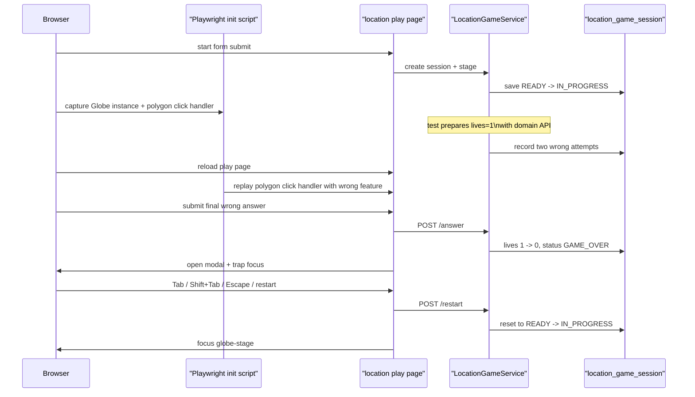

# location 게임오버 모달 키보드 흐름도 실제 브라우저 E2E로 고정하기

## 왜 이 후속 조각이 필요했는가

capital, population, population-battle까지
game-over modal keyboard flow를
실제 Chromium으로 고정해 둔 상태였다.

하지만 `location`은 아직 비어 있었다.

이유는 분명했다.

location은

- WebGL 지구본
- 국가 polygon 선택
- radio/card가 아닌 3D play surface

를 가진다.

즉 modal contract는 같아도
마지막 오답을 만드는 방식은
다른 게임과 전혀 다르다.

그래서 이번 후속 조각은
지구본 좌표 클릭 flaky함에 끌려가지 않으면서도,
같은 keyboard modal 규칙이
location 셸에서도 유지되는지
실제 브라우저로 확인하는 데 집중했다.

## 이번 단계의 목표

- location start -> play를 실제 브라우저로 연다
- game over modal을 실제 브라우저에서 띄운다
- `Tab`, `Shift+Tab`, `Escape`, restart 후 focus return을 검증한다
- WebGL 지구본 셸에도 representative browser E2E를 넓힌다

즉 이번 목표는 새 기능이 아니라
browser smoke의 **표면 확장**이다.

## 바뀐 파일

- [BrowserSmokeE2ETest.java](/Users/alex/project/worldmap/src/test/java/com/worldmap/e2e/BrowserSmokeE2ETest.java)

## 왜 location은 다른 접근이 필요했나

capital, population, population-battle은
브라우저가 마지막 오답을 만들 때
그냥 radio나 label을 클릭하면 됐다.

하지만 location은 아니다.

마지막 오답을 실제 UI 경로로 만들려면
지구본 위 좌표를 안정적으로 클릭해야 한다.

그런데 browser E2E의 핵심 위험은
좌표 hit test가 아니라
modal keyboard contract다.

그래서 이번에는
픽셀 좌표 click 자체를 검증 대상으로 삼지 않고,
브라우저 안에서 실제 polygon click handler를 재사용하는 seam을 만들었다.

## 어떻게 풀었나

### 1. 브라우저가 실제 location 세션을 만든다

테스트는 먼저 start page를 열고
location 세션을 실제로 만든다.

```java
page.navigate(baseUrl() + "/games/location/start");
page.locator("#nickname").fill("browser-location-modal");
page.locator("#location-start-submit").click();
page.waitForURL("**/games/location/play/*");
```

즉 browser session과 game session은
제품과 같은 방식으로 열린다.

### 2. Playwright init script가 `window.Globe` 생성만 살짝 감싼다

핵심은 production JS를 바꾸지 않는 것이다.

그래서 테스트는 페이지 로드 전에
init script를 넣어 `window.Globe` setter를 감싼다.

그 뒤 location play page가

```js
Globe()(globeStage)
```

로 실제 지구본을 만들면,
테스트 훅은

- 생성된 globe instance
- `onPolygonClick(...)`에 등록된 실제 handler

를 `window.__worldmapBrowserSmoke`에 저장한다.

즉 브라우저는 여전히 같은 JS를 쓰고,
테스트만 deterministic한 selection seam을 얻는다.

### 3. 서버 도메인 API로 lives를 1개 남은 상태까지 준비한다

이번에도 테스트 초점은
modal keyboard flow다.

그래서 앞부분의 반복 오답 두 번은
서버 도메인 API로 축약했다.

테스트는 session row에서 `guestSessionKey`를 읽고,
[GameSessionAccessContext.java](/Users/alex/project/worldmap/src/main/java/com/worldmap/game/common/application/GameSessionAccessContext.java)로 같은 ownership 문맥을 만든다.

그 뒤 [LocationGameService.java](/Users/alex/project/worldmap/src/main/java/com/worldmap/game/location/application/LocationGameService.java)의 `submitAnswer(...)`를 두 번 호출해
lives를 `3 -> 1`로 줄인다.

즉 브라우저는 마지막 오답과 modal interaction에만 집중한다.

### 4. 마지막 오답 선택은 브라우저 안에서 실제 polygon click handler를 호출한다

여기서부터가 location 조각의 핵심이다.

테스트는 브라우저 안에서
앞서 잡아 둔 polygon click handler를 다시 호출해
wrong feature 하나를 선택한다.

즉 location-game.js의
`handleCountrySelection(...)`으로 이어지는
실제 브라우저 선택 경로를 재사용한다.

그 다음 브라우저가 submit button을 누르면
`GAME_OVER`가 되고,
[location-game.js](/Users/alex/project/worldmap/src/main/resources/static/js/location-game.js)의 `showGameOverModal(...)`이 실행된다.

이 함수는

- summary 문구 채우기
- modal open
- `.page-shell.inert = true`
- keydown listener 연결
- restart button focus

를 담당한다.

즉 테스트는 실제 브라우저에서
진짜 modal focus scope를 그대로 밟는다.

## 요청 흐름은 어떻게 설명하면 되나



핵심은 이렇다.

- 상태 준비는 서버가 맡고
- 지구본 선택은 브라우저 안의 실제 handler를 재사용하고
- modal keyboard interaction은 Chromium이 끝까지 밟는다

## 실제로 무엇을 assert 했나

테스트는 아래 다섯 가지를 확인한다.

### 1. 실제 location 세션이 브라우저에서 열린다

play page URL과 stage status card가 보이는지 먼저 확인한다.

### 2. modal open 직후 restart button focus

```java
assertThat(page.evaluate("() => document.activeElement?.id"))
    .isEqualTo("location-restart-button");
```

### 3. `Tab` / `Shift+Tab` focus trap

restart button에서 `Tab`을 누르면 홈 링크,
`Shift+Tab`을 누르면 다시 restart button으로 돌아와야 한다.

즉 modal 밖으로 focus가 새지 않아야 한다.

### 4. `Escape`는 dismiss가 아니라 restart focus return

location도 다른 게임과 같은 제품 규칙을 쓴다.

즉 `Escape`는 modal close가 아니라
restart button focus return이다.

이 규칙을 real browser로 고정했다.

### 5. restart 뒤 첫 playable surface는 `#globe-stage`

location은 radio input이 아니라
지구본 자체가 primary play surface다.

그래서 restart 뒤에는
`#globe-stage`로 focus가 돌아와야 한다.

이 부분을 다른 게임과 구분해서 고정했다.

## 왜 이 조각이 production-ready에 의미가 있나

지금까지의 modal E2E는
주로 카드/보기 기반 셸이었다.

이번에 location까지 붙으면서

- 4-choice fact quiz
- 4-choice range estimation arcade
- 2-choice compare battle
- WebGL globe mission

네 다른 play surface에서
같은 modal keyboard contract가 유지된다고 설명할 수 있게 됐다.

특히 이번 조각은
브라우저 테스트도 “무조건 픽셀 클릭”이 아니라
어떤 contract를 검증할지에 맞는 seam을 고를 수 있어야 한다는 점을 보여준다.

## 테스트는 무엇을 돌렸나

- `./gradlew compileTestJava`
- `./gradlew browserSmokeTest --tests com.worldmap.e2e.BrowserSmokeE2ETest.locationGameOverModalSupportsKeyboardTrapAndRestartFocusReturn`
- `./gradlew browserSmokeTest`
- `git diff --check`

## 아직 남은 점

이제 대표 modal E2E는 많이 넓어졌다.

그래도 아직 남은 후속은 있다.

- flag modal browser E2E
- verify workflow를 required check로 걸지 결정
- 반복된 modal focus 로직을 공용 helper로 올릴지 판단

즉 이제 질문은
“real-browser modal E2E가 있나?”
가 아니라
“대표 표면을 어디까지 더 넓힐 것인가?”
에 가깝다.

## 면접에서는 어떻게 설명할까

이렇게 설명하면 된다.

> location 게임도 game-over modal keyboard E2E를 붙였습니다. 핵심은 브라우저가 세션을 실제로 만들고 서버 도메인 API로 lives를 1개 남은 상태까지 준비한 뒤, 마지막 오답 선택은 Playwright init script가 잡아 둔 `Globe` polygon click handler를 브라우저 안에서 재사용하게 한 점입니다. 덕분에 WebGL 지구본 셸에서도 `Tab / Shift+Tab / Escape / restart 후 focus return`이 실제 Chromium에서 유지된다고 설명할 수 있게 됐습니다.
