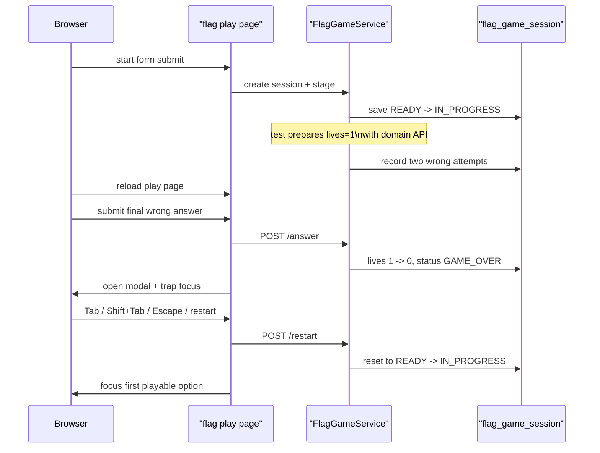

# flag 게임오버 모달 키보드 흐름도 실제 브라우저 E2E로 고정하기

## 왜 이 후속 조각이 필요했는가

location, capital, population, population-battle까지
game-over modal keyboard flow를
실제 Chromium으로 고정해 둔 상태였다.

하지만 `flag`는 아직 비어 있었다.

flag는 표면상으로는
4-choice quiz라서 capital이나 population과 비슷해 보인다.

그런데 실제 플레이 경험은 조금 다르다.

- 이미지 자산 로딩
- 국기 display card
- 국가명 선택 카드

가 함께 들어간다.

즉 이번 조각은
새로운 종류의 기술 문제를 푸는 것보다,
대표 표본을 마지막 하나까지 닫아
public 게임 5종 전체를 real-browser modal E2E 범위 안에 넣는 데 의미가 있었다.

## 이번 단계의 목표

- flag start -> play를 실제 브라우저로 연다
- game over modal을 실제 브라우저에서 띄운다
- `Tab`, `Shift+Tab`, `Escape`, restart 후 focus return을 검증한다
- public 게임 5종 전체의 terminal modal keyboard contract를 닫는다

즉 이번 목표는 새 기능이 아니라
browser smoke의 **범위 마감**이다.

## 바뀐 파일

- [BrowserSmokeE2ETest.java](/Users/alex/project/worldmap/src/test/java/com/worldmap/e2e/BrowserSmokeE2ETest.java)

## 왜 flag까지 확인해야 했나

capital, population만 있으면
텍스트 중심 4-choice quiz만 본 셈이 된다.

location은 WebGL,
population-battle은 2-choice battle이었다.

그런데 제품에는
이미지 중심 4-choice shell인 flag가 있다.

즉 마지막으로 필요한 것은
“국기 이미지 + 선택 카드” 표면에서도
같은 modal keyboard contract가 유지되는가였다.

## 어떻게 풀었나

### 1. 브라우저가 실제 flag 세션을 만든다

테스트는 먼저 start page를 열고
flag 세션을 실제로 만든다.

```java
page.navigate(baseUrl() + "/games/flag/start");
page.locator("#flag-nickname").fill("browser-flag-modal");
page.locator("#flag-start-submit").click();
page.waitForURL("**/games/flag/play/*");
```

즉 browser session과 game session은
제품과 같은 방식으로 열린다.

### 2. 서버 도메인 API로 lives를 1개 남은 상태까지 준비한다

이번에도 초점은
modal keyboard flow다.

그래서 앞부분의 반복 오답 두 번은
서버 도메인 API로 축약했다.

테스트는 session row에서 `guestSessionKey`를 읽고,
[GameSessionAccessContext.java](/Users/alex/project/worldmap/src/main/java/com/worldmap/game/common/application/GameSessionAccessContext.java)로 같은 ownership 문맥을 만든다.

그 뒤 [FlagGameService.java](/Users/alex/project/worldmap/src/main/java/com/worldmap/game/flag/application/FlagGameService.java)의 `submitAnswer(...)`를 두 번 호출해
lives를 `3 -> 1`로 줄인다.

즉 브라우저는 마지막 오답과 modal interaction에만 집중한다.

### 3. 마지막 오답 1회는 브라우저가 직접 제출한다

여기서부터가 browser E2E의 핵심이다.

브라우저가 오답 보기 하나를 선택하고 제출하면
`GAME_OVER`가 되고,
[flag-game.js](/Users/alex/project/worldmap/src/main/resources/static/js/flag-game.js)의 `showGameOverModal(...)`이 실행된다.

이 함수는

- summary 문구 채우기
- modal open
- `.page-shell.inert = true`
- keydown listener 연결
- restart button focus

를 담당한다.

즉 테스트는 실제 브라우저에서
진짜 modal focus scope를 그대로 밟는다.

## 요청 흐름은 어떻게 설명하면 되나



핵심은 capital, population 때와 같다.

상태 준비는 서버가,
실제 키보드 interaction은 브라우저가 맡는다.

## 실제로 무엇을 assert 했나

테스트는 아래 네 가지를 확인한다.

### 1. modal open 직후 restart button focus

```java
assertThat(page.evaluate("() => document.activeElement?.id"))
    .isEqualTo("flag-restart-button");
```

### 2. `Tab` / `Shift+Tab` focus trap

restart button에서 `Tab`을 누르면 홈 링크,
`Shift+Tab`을 누르면 다시 restart button으로 돌아와야 한다.

즉 modal 밖으로 focus가 새지 않아야 한다.

### 3. `Escape`는 dismiss가 아니라 restart focus return

flag도 다른 게임과 같은 제품 규칙을 쓴다.

즉 `Escape`는 modal close가 아니라
restart button focus return이다.

이 규칙을 real browser로 고정했다.

### 4. restart 뒤 첫 playable option으로 focus return

restart 후에는
modal이 닫히는 것만으로 충분하지 않다.

바로 다음 국가 보기를 고를 수 있어야 한다.

그래서 마지막에는 첫 번째
`flag-option` input에 focus가 돌아오는지 확인했다.

## 왜 이 조각이 production-ready에 의미가 있나

이번 flag 조각으로

- WebGL globe mission
- 4-choice fact quiz
- 4-choice range estimation arcade
- 2-choice compare battle
- 이미지 기반 4-choice flag quiz

다섯 다른 public 게임 셸에서
같은 terminal modal keyboard contract가 유지된다고 말할 수 있게 됐다.

즉 이제 modal browser E2E는
“대표 표본이 있다” 수준이 아니라
“현재 public 제품 범위를 다 닫았다” 수준이 됐다.

## 테스트는 무엇을 돌렸나

- `./gradlew compileTestJava`
- `./gradlew browserSmokeTest --tests com.worldmap.e2e.BrowserSmokeE2ETest.flagGameOverModalSupportsKeyboardTrapAndRestartFocusReturn`
- `./gradlew browserSmokeTest`
- `git diff --check`

## 아직 남은 점

이제 질문은 modal coverage가 아니라
운영 규칙으로 넘어간다.

남은 후속은 주로 이쪽이다.

- verify workflow를 required check로 걸지 결정
- 반복된 modal focus 로직을 공용 helper로 올릴지 판단
- 국기 게임 자산/난이도 확장 전략 정리

즉 modal E2E 자체는 이번 조각으로
public 게임 범위를 사실상 닫은 셈이다.

## 면접에서는 어떻게 설명할까

이렇게 설명하면 된다.

> flag 게임도 game-over modal keyboard E2E를 붙였습니다. 브라우저가 세션을 실제로 만든 뒤 서버 도메인 API로 lives를 1개 남은 상태까지 준비하고, 마지막 오답과 `Tab / Shift+Tab / Escape / restart 후 focus return`만 실제 Chromium으로 검증하게 했습니다. 이로써 location, capital, population, population-battle, flag까지 public 게임 5종의 terminal modal keyboard contract를 모두 real browser로 설명할 수 있게 됐습니다.
