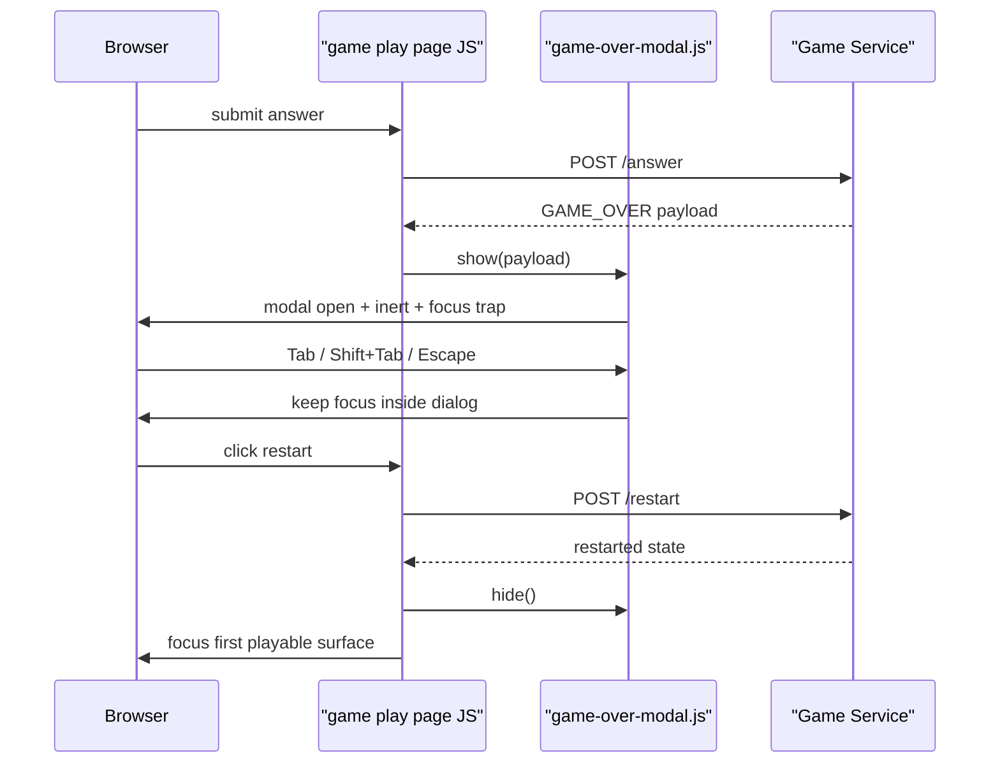

# public 게임들의 게임오버 모달 focus 규칙을 공용 helper로 정리하기

## 왜 이 후속 조각이 필요했는가

이전 조각들에서
location, capital, population, population-battle, flag의
game-over modal keyboard flow를
실제 Chromium으로 전부 고정했다.

즉 계약 자체는 이미 닫혀 있었다.

문제는 그 다음이었다.

다섯 게임 JS 안에

- modal open
- `.page-shell.inert`
- `Tab` trap
- `Escape` restart focus return
- modal close

로직이 거의 같은 형태로 반복되고 있었다.

production-ready 기준에서는
테스트가 있다는 것만으로는 부족하다.

같은 규칙이 한 곳에 모여 있어야
나중에 수정도 안전하고 설명도 쉽다.

그래서 이번 후속 조각은
이미 real-browser E2E로 고정한 modal contract를
공용 helper로 올리는 데 집중했다.

## 이번 단계의 목표

- game-over modal keyboard contract를 한 곳으로 모은다
- 각 게임은 summary 문구와 focus return 차이만 남긴다
- browser smoke가 그대로 초록인지 확인한다

즉 이번 목표는 새 기능이 아니라
**검증이 끝난 규칙을 구조로 정리하는 것**이다.

## 바뀐 파일

- [game-over-modal.js](/Users/alex/project/worldmap/src/main/resources/static/js/game-over-modal.js)
- [capital-game.js](/Users/alex/project/worldmap/src/main/resources/static/js/capital-game.js)
- [population-game.js](/Users/alex/project/worldmap/src/main/resources/static/js/population-game.js)
- [flag-game.js](/Users/alex/project/worldmap/src/main/resources/static/js/flag-game.js)
- [population-battle-game.js](/Users/alex/project/worldmap/src/main/resources/static/js/population-battle-game.js)
- [location-game.js](/Users/alex/project/worldmap/src/main/resources/static/js/location-game.js)
- 5개 게임의 start/play 템플릿 자산 버전

## 왜 지금 helper로 올리는 게 맞았나

공용화는 빨리 한다고 좋은 게 아니다.

먼저 알아야 할 건 이거다.

1. 무엇이 정말 공통 규칙인가
2. 무엇이 게임마다 다른가

이번에는 이미 browser E2E로 다음 계약이 고정돼 있었다.

- modal이 뜨면 `page-shell`은 `inert`
- `Tab`과 `Shift+Tab`은 dialog 안에서만 돈다
- `Escape`는 dismiss가 아니라 restart button focus return
- modal entry focus는 restart button

반면 각 게임이 달랐던 것은 이것뿐이었다.

- summary 문구
- restart 뒤 어디로 focus를 돌릴지

그래서 이제 helper로 올려도
설명과 회귀 검증이 가능해진 상태였다.

## 어떻게 풀었나

### 1. `game-over-modal.js`에 공통 controller를 만들었다

새 helper는
`window.createGameOverModalController(...)`를 제공한다.

이 controller는 아래를 맡는다.

- modal open
- summary text 주입
- `.page-shell.inert = true/false`
- `keydown` listener 연결/해제
- `Tab` / `Shift+Tab` focus trap
- `Escape` restart focus return

즉 modal keyboard contract의 공통 부분만 모았다.

### 2. 각 게임은 필요한 차이만 주입한다

예를 들어 capital은 이렇게 바뀐다.

```js
const gameOverModalController = window.createGameOverModalController({
    modal: gameOverModal,
    panel: gameOverPanel,
    summaryTarget: gameOverSummary,
    restartButton,
    pageShell,
    buildSummaryText: (payload) =>
        `Stage ${payload.stageNumber}에서 탈락했습니다. 현재 총점 ${payload.totalScore}점, 다시 시작하면 같은 세션으로 Stage 1부터 이어집니다.`
});
```

그리고 각 게임의 `showGameOverModal()`은
이제 거의 wrapper만 남는다.

```js
function showGameOverModal(payload) {
    gameOverModalController.show(payload);
}
```

즉 각 게임은

- 어떤 summary 문구를 보여줄지
- restart 뒤 어떤 play surface에 focus를 돌릴지

만 신경 쓰면 된다.

### 3. restart 뒤 focus는 게임별로 그대로 유지했다

여기서 억지 공통화를 하면 오히려 구조가 나빠진다.

예를 들어

- location은 `#globe-stage`
- capital/population/flag/population-battle는 첫 playable option input

으로 돌아가야 한다.

즉 restart 뒤 focus return은
게임별 play surface의 일부다.

그래서 이 부분은 helper로 올리지 않고
각 게임 JS에 남겨 두었다.

## 요청 흐름은 어떻게 설명하면 되나



즉 상태 전이는 계속 서버가 맡고,
helper는 브라우저 modal contract만 담당한다.

## 왜 이 로직이 컨트롤러나 서비스가 아니라 JS helper에 있어야 하나

이번 로직은

- HTTP 요청 흐름
- 점수 계산
- 세션 상태 전이

가 아니다.

이건 브라우저 안의
focus scope와 keyboard behavior 규칙이다.

즉 서버가 아니라
브라우저 표현 계층의 책임이다.

다만 그 책임이 다섯 파일에 흩어져 있으면
같은 규칙을 수정할 때 일관성이 깨지기 쉽다.

그래서 “서비스로 올린다”가 아니라
“브라우저 helper로 모은다”가 맞았다.

## 테스트는 무엇을 돌렸나

- `node --check src/main/resources/static/js/game-over-modal.js`
- `node --check src/main/resources/static/js/capital-game.js`
- `node --check src/main/resources/static/js/population-game.js`
- `node --check src/main/resources/static/js/flag-game.js`
- `node --check src/main/resources/static/js/population-battle-game.js`
- `node --check src/main/resources/static/js/location-game.js`
- `./gradlew browserSmokeTest`
- `git diff --check`

핵심은 helper를 만들었다고
새 테스트를 따로 추가하기보다,
이미 있던 real-browser E2E 계약이 그대로 초록인지 보는 것이었다.

## 왜 이 조각이 production-ready에 의미가 있나

이전까지는
“browser E2E는 있다”가 강점이었다.

이번 조각 이후에는
“그 browser E2E로 고정한 계약이 실제 코드 구조에도 반영돼 있다”가 된다.

즉 테스트와 구조가 서로 맞물린 상태가 됐다.

이건 production-ready 설명에서 중요하다.

왜냐하면 나중에 접근성 정책을 바꿔야 할 때
다섯 파일을 따로 찾지 않고
한 곳에서 규칙을 바꿀 수 있기 때문이다.

## 아직 남은 점

이제 남은 건 modal contract보다
제품 polish 쪽이다.

- 국기 게임 난이도/자산 전략
- 홈/랭킹/Stats 문구 밀도 조정
- future modal까지 같은 helper를 어디까지 확장할지 판단

즉 지금부터는
보안이나 회귀 방어보다
구조와 제품 완성도 마감이 중심이 된다.

## 면접에서는 어떻게 설명할까

이렇게 설명하면 된다.

> public 게임 5종의 game-over modal keyboard 규칙을 `game-over-modal.js` helper로 공통화했습니다. 핵심은 먼저 Playwright로 `Tab / Shift+Tab / Escape / restart 후 focus return` 계약을 고정한 뒤, 그 계약이 확인된 부분만 helper로 올렸다는 점입니다. 그래서 이제는 모달 접근성 규칙을 한 곳에서 수정할 수 있고, summary 문구와 restart 뒤 focus target만 게임별로 다르게 유지한다고 설명할 수 있습니다.
