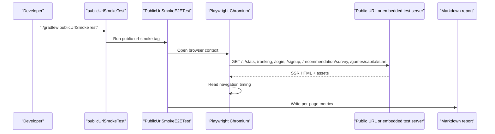

# 공개 URL smoke와 초기 진입 수치를 같은 레일에서 재기

## 왜 이 후속 조각이 필요했는가

production-ready 마감에서
남은 질문은 꽤 단순했다.

- 실제 공개 URL에서 홈이 잘 뜨는가
- `/stats`, `/ranking`도 읽히는가
- 첫 진입이 너무 느리지는 않은가

문제는 이걸 아직 코드로 남기지 않았다는 점이었다.

지금까지는

- `browserSmokeTest`로 local/test 기반 public 흐름
- `verify` workflow로 CI 회귀

까지는 닫혀 있었지만,

**실제 공개 URL을 같은 형식으로 측정하는 레일**은 없었다.

그래서 이번 조각은
배포 URL만 주면 바로 돌릴 수 있는
별도 smoke/performance 레일을 만드는 데 집중했다.

## 이번 단계의 목표

- 공개 URL을 대상으로 public read-only 페이지를 브라우저로 연다
- status, title, 대표 heading을 함께 확인한다
- `TTFB`, `DOMContentLoaded`, `load`를 같은 report로 남긴다
- URL이 아직 없을 때도 로컬에서 먼저 같은 레일을 검증할 수 있게 한다

즉 이번 목표는
새 게임이 아니라
**배포 후 검증을 반복 가능한 코드로 만드는 것**이다.

## 바뀐 파일

- [build.gradle](/Users/alex/project/worldmap/build.gradle)
- [PublicUrlSmokeE2ETest.java](/Users/alex/project/worldmap/src/test/java/com/worldmap/e2e/PublicUrlSmokeE2ETest.java)
- [README.md](/Users/alex/project/worldmap/README.md)
- [PORTFOLIO_PLAYBOOK.md](/Users/alex/project/worldmap/docs/PORTFOLIO_PLAYBOOK.md)
- [WORKLOG.md](/Users/alex/project/worldmap/docs/WORKLOG.md)

## 어떻게 풀었나

### 1. `publicUrlSmokeTest` task를 따로 만들었다

[build.gradle](/Users/alex/project/worldmap/build.gradle)에
`publicUrlSmokeTest`를 추가했다.

이 task는 `public-url-smoke` tag만 실행한다.

즉 기본 `test`나 기존 `browserSmokeTest`와 섞지 않고,
“배포 URL을 재는 전용 레일”을 따로 둔 셈이다.

실행 형태는 이렇다.

```bash
WORLDMAP_PUBLIC_BASE_URL=https://example.com ./gradlew publicUrlSmokeTest
```

또는

```bash
./gradlew publicUrlSmokeTest
```

두 번째 경우에는
내장 `test + browser-smoke` 서버가 기본값으로 사용된다.

즉 production URL이 아직 없어도
레일 자체를 먼저 검증할 수 있다.

### 2. 읽기 전용 public 페이지만 측정 대상으로 잡았다

[PublicUrlSmokeE2ETest.java](/Users/alex/project/worldmap/src/test/java/com/worldmap/e2e/PublicUrlSmokeE2ETest.java)는
아래 경로를 차례로 연다.

- `/`
- `/stats`
- `/ranking`
- `/login`
- `/signup`
- `/recommendation/survey`
- `/games/capital/start`

여기서 중요한 판단은
**write path를 일부러 제외했다**는 점이다.

실제 운영 URL에 붙일 때
게임 세션 생성, 답안 제출, 랭킹 기록을 남기면
운영 데이터를 괜히 흔들 수 있다.

그래서 이번 레일은
public shell과 read-only start page만 열어

- 공개 화면이 실제로 뜨는가
- 첫 진입이 어느 정도 빠른가

만 확인하게 했다.

### 3. 지표는 Navigation Timing에서 뽑았다

각 페이지는 Playwright로 열고,
그 뒤 브라우저 안에서 `performance.getEntriesByType("navigation")[0]`를 읽는다.

여기서 report에 남기는 값은 세 가지다.

- `responseStart`
- `domContentLoadedEventEnd`
- `loadEventEnd`

report에는 각각

- `TTFB`
- `DOMContentLoaded`
- `Load`

로 적었다.

엄밀히 말하면 `TTFB`는 서버 단독 지표가 아니라
브라우저 기준 `responseStart` 근사치다.

하지만 “사용자가 실제로 페이지를 여는 기준”에선
이 값이 오히려 설명하기 쉽다.

### 4. 결과는 Markdown report로 남긴다

실행 결과는
[build/reports/public-url-smoke/public-url-smoke.md](/Users/alex/project/worldmap/build/reports/public-url-smoke/public-url-smoke.md)
에 쌓인다.

형식은 이렇게 단순하다.

```md
# Public URL Smoke Report

- Base URL: ...
- Generated At: ...
- Metric Note: ...

| Path | Status | Title | H1 | TTFB (ms) | DOMContentLoaded (ms) | Load (ms) |
```

핵심은
“눈으로 보고 끝”이 아니라
**경로별 수치가 파일로 남는다**는 점이다.

## 요청 흐름은 어떻게 지나가는가

이번 조각의 시작점은 HTTP controller가 아니라
Gradle verification task다.



즉 상태가 바뀌는 곳은
서비스 DB가 아니라
`build/reports/public-url-smoke/public-url-smoke.md`
같은 검증 산출물이다.

## 왜 이 로직이 서비스가 아니라 테스트 레일에 있어야 하나

이건 사용자 기능이 아니다.

운영 검증 규칙이다.

그래서 controller나 service에
“성능 측정” 코드를 섞으면 안 된다.

그 책임은

- [build.gradle](/Users/alex/project/worldmap/build.gradle)의 verification task
- [PublicUrlSmokeE2ETest.java](/Users/alex/project/worldmap/src/test/java/com/worldmap/e2e/PublicUrlSmokeE2ETest.java)

가 맡는 편이 맞다.

즉 앱은 그대로 두고,
**검증 방법만 코드로 남긴 것**이다.

## 실제로 무엇을 검증했나

이번에는 우선
내장 `test + browser-smoke` 서버 기준으로
레일 자체가 동작하는지 확인했다.

실행한 검증:

```bash
./gradlew compileTestJava
./gradlew publicUrlSmokeTest --tests com.worldmap.e2e.PublicUrlSmokeE2ETest
git diff --check
```

생성된 local report 기준 예시는 이랬다.

- `/` TTFB `309ms`
- `/stats` TTFB `307ms`
- `/ranking` TTFB `19ms`
- `/login` TTFB `18ms`
- `/signup` TTFB `9ms`
- `/recommendation/survey` TTFB `14ms`
- `/games/capital/start` TTFB `6ms`

즉 레일 자체는 이미 동작하고 있고,
이제 실제 배포 URL만 확보되면
같은 형식으로 production report를 바로 남길 수 있다.

## 이번 조각에서 아직 남은 것

현재 저장소와 GitHub metadata에서는
실제 공개 URL을 찾지 못했다.

- GitHub `homepageUrl` 비어 있음
- deployment/environment record 없음
- deploy workflow 실행 이력 없음

그래서 첫 production report는
실제 ECS/ALB URL을 확보한 뒤
한 번 더 남겨야 한다.

즉 이번 조각은
“실측을 끝냈다”보다
**실측을 반복 가능한 코드로 만들었다**에 더 가깝다.

## 면접에서 이렇게 설명하면 된다

> production-ready 마감에서 배포 URL smoke를 수동 체크리스트로 남기지 않고, `publicUrlSmokeTest`라는 별도 verification task로 만들었습니다. 이 task는 공개 read-only 페이지들을 실제 Chromium으로 열고 status, heading, 그리고 browser-side `TTFB / DOMContentLoaded / load`를 Markdown report로 남깁니다. 핵심은 배포 URL만 생기면 같은 명령으로 바로 production 수치를 다시 재서 비교할 수 있게 만든 점입니다.
