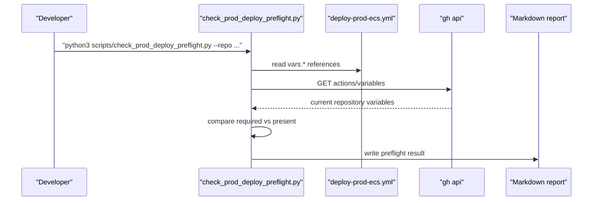

# 첫 ECS 배포 전에 GitHub Actions 입력부터 먼저 점검하기

## 왜 이 후속 조각이 필요했는가

이제 저장소에는 이미 있다.

- ECS deploy workflow
- sample task definition
- render script
- prod profile

문제는 그 다음이었다.

**첫 배포 버튼을 눌러도 되는 상태인지**
한 번에 알려 주는 장치가 없었다.

지금 repository는 실제로
GitHub Actions variables가 하나도 없다.

이 상태에서 바로 workflow를 실행하면
실패는 하겠지만,

- 뭐가 빠졌는지
- 얼마나 빠졌는지
- 다음에 뭘 채워야 하는지

를 너무 늦게 알게 된다.

그래서 이번 조각은
첫 ECS 배포 전에
GitHub Actions 입력과 필수 파일 준비 상태를
한 번에 점검하는 preflight를 추가하는 데 집중했다.

## 이번 단계의 목표

- `deploy-prod-ecs.yml`이 실제로 요구하는 변수 목록을 읽는다
- 현재 GitHub repository variables와 비교한다
- 필수 파일 존재 여부도 같이 본다
- 결과를 Markdown report로 남긴다

즉 이번 목표는
배포 자체가 아니라
**배포 입력 계약을 먼저 검증하는 것**이다.

## 바뀐 파일

- [check_prod_deploy_preflight.py](/Users/alex/project/worldmap/scripts/check_prod_deploy_preflight.py)
- [ProdDeployPreflightScriptTest.java](/Users/alex/project/worldmap/src/test/java/com/worldmap/common/config/ProdDeployPreflightScriptTest.java)
- [README.md](/Users/alex/project/worldmap/README.md)
- [DEPLOYMENT_RUNBOOK_AWS_ECS.md](/Users/alex/project/worldmap/docs/DEPLOYMENT_RUNBOOK_AWS_ECS.md)
- [PORTFOLIO_PLAYBOOK.md](/Users/alex/project/worldmap/docs/PORTFOLIO_PLAYBOOK.md)
- [WORKLOG.md](/Users/alex/project/worldmap/docs/WORKLOG.md)

## 어떻게 풀었나

### 1. required variable 목록을 workflow에서 직접 읽는다

핵심은
[deploy-prod-ecs.yml](/Users/alex/project/worldmap/.github/workflows/deploy-prod-ecs.yml)이다.

preflight 스크립트는
여기서 `${{ vars.NAME }}` 패턴을 읽어
required variable 목록을 만든다.

즉 아래 값을 스크립트에 따로 복사하지 않는다.

- `AWS_REGION`
- `AWS_ACCOUNT_ID`
- `AWS_GITHUB_ACTIONS_ROLE_ARN`
- `ECR_REPOSITORY`
- `ECS_CLUSTER`
- `ECS_SERVICE`
- `ECS_EXECUTION_ROLE_ARN`
- `ECS_TASK_ROLE_ARN`
- `RDS_ENDPOINT`
- `ELASTICACHE_ENDPOINT`
- `CLOUDWATCH_LOG_GROUP`
- `SPRING_DATASOURCE_PASSWORD_SECRET_ARN`
- `ADMIN_BOOTSTRAP_PASSWORD_PARAMETER_ARN`

이렇게 한 이유는 단순하다.

source of truth는 문서가 아니라
**실제로 배포를 돌리는 workflow 파일**이어야 하기 때문이다.

### 2. GitHub repository variables와 바로 비교한다

스크립트는 기본적으로

```bash
gh api repos/<repo>/actions/variables
```

를 호출해서
현재 repo에 실제로 등록된 variable 이름을 읽는다.

그리고 workflow가 요구하는 목록과 비교해

- present
- missing

을 report에 남긴다.

지금 실제 저장소 상태에서는
variables가 0개라서
전부 missing으로 나온다.

이건 버그가 아니라
지금 정확히 어떤 입력을 먼저 채워야 하는지
보여 주는 신호다.

### 3. 필수 파일과 `workflow_dispatch`도 같이 확인한다

변수만 있다고 끝은 아니다.

배포에 필요한 파일이 빠져 있어도 안 된다.

그래서 같이 본다.

- [deploy-prod-ecs.yml](/Users/alex/project/worldmap/.github/workflows/deploy-prod-ecs.yml)
- [task-definition.prod.sample.json](/Users/alex/project/worldmap/deploy/ecs/task-definition.prod.sample.json)
- [render_ecs_task_definition.py](/Users/alex/project/worldmap/scripts/render_ecs_task_definition.py)

그리고 첫 배포는 자동 push deploy가 아니라
수동 실행이 맞기 때문에
`workflow_dispatch:`가 실제로 있는지도 같이 본다.

### 4. 결과는 Markdown report로 남긴다

출력 파일은
[prod-deploy-preflight.md](/Users/alex/project/worldmap/build/reports/deploy-preflight/prod-deploy-preflight.md)
이다.

report에는

- repository
- workflow path
- ready 여부
- workflow_dispatch 존재 여부
- required variable별 present/missing
- required file별 present/missing
- 다음 액션

이 같이 들어간다.

즉 “실패했다”보다
**왜 아직 첫 배포를 누르면 안 되는지**
바로 읽을 수 있다.

## 요청 흐름은 어떻게 지나가는가



즉 이 조각은
앱 request flow가 아니라
**배포 readiness flow**를 코드로 만든 것이다.

## 왜 이 로직이 앱 서비스가 아니라 script여야 하나

이건 사용자 기능이 아니다.

운영 입력 검증이다.

그래서 controller나 service에 넣을 이유가 없다.

배포 workflow와 가장 가까운 곳,
즉 [scripts/check_prod_deploy_preflight.py](/Users/alex/project/worldmap/scripts/check_prod_deploy_preflight.py)가
맡는 편이 맞다.

앱은 그대로 두고
배포 준비 상태만 별도로 검사하는 것이다.

## 어떻게 테스트했나

테스트는 두 갈래로 나눴다.

1. 빈 variable JSON이면 실패하는가
2. 모든 variable이 있으면 통과하는가

[ProdDeployPreflightScriptTest.java](/Users/alex/project/worldmap/src/test/java/com/worldmap/common/config/ProdDeployPreflightScriptTest.java)는
실제 `python3` 프로세스로 스크립트를 실행한다.

여기서 중요한 점은
외부 GitHub API에 의존하지 않도록
`--variables-json` 옵션을 따로 둔 것이다.

즉 테스트에서는 fake API 응답 파일만으로도
두 경로를 모두 고정할 수 있다.

실행한 검증:

```bash
python3 -m py_compile scripts/check_prod_deploy_preflight.py
./gradlew test --tests com.worldmap.common.config.ProdDeployPreflightScriptTest --tests com.worldmap.common.config.GitHubActionsDeployWorkflowTemplateTest --tests com.worldmap.common.config.RenderEcsTaskDefinitionScriptTest
python3 scripts/check_prod_deploy_preflight.py --repo answndud/world_map_game
```

마지막 실제 실행 결과는
지금 repo 상태답게 실패했고,
missing variable 13개를 바로 보여 줬다.

## 이 다음엔 무엇을 하면 되나

이제 순서는 훨씬 단순하다.

1. GitHub repository variables를 채운다
2. preflight를 다시 실행해 초록으로 만든다
3. GitHub Actions `deploy-prod-ecs`를 수동 실행한다
4. 첫 배포가 끝나면 ALB DNS를 public URL로 잡는다
5. 그 URL로 `publicUrlSmokeTest`를 실행한다

즉 이번 조각은
배포의 첫 단추를 더 작고 설명 가능하게 만든 셈이다.

## 면접에서 이렇게 설명하면 된다

> 첫 ECS 배포 전에 GitHub Actions 입력이 다 준비됐는지 확인하는 preflight 스크립트를 만들었습니다. 핵심은 required variable 목록을 문서에 따로 적어 두지 않고, 실제 `deploy-prod-ecs.yml`의 `vars.*` 참조를 읽어서 현재 repository variables와 비교하게 한 점입니다. 그래서 이제는 배포 버튼을 누르기 전에 어떤 입력이 빠졌는지 Markdown report로 바로 설명할 수 있습니다.
