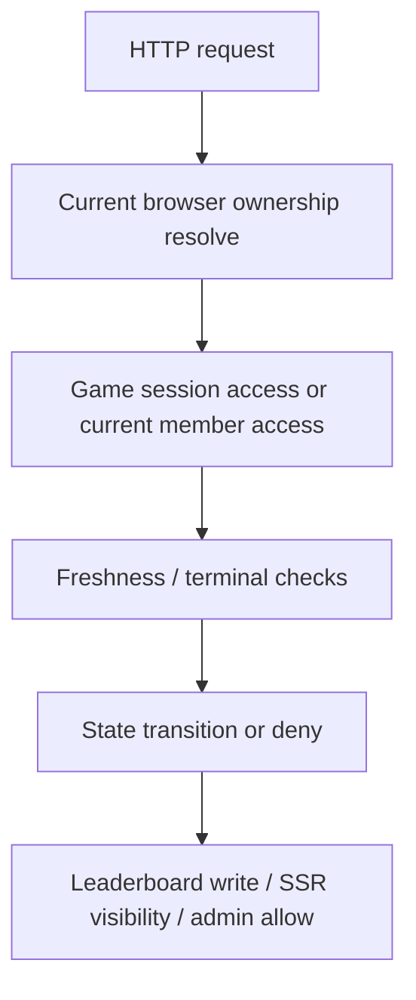
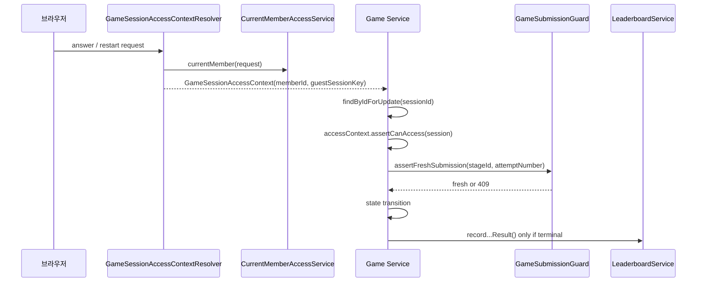
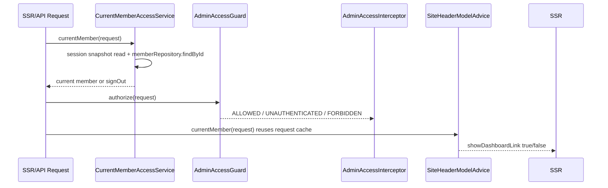

# [Spring Boot 게임 플랫폼 포트폴리오] 17. game integrity와 current member/current role 재검증을 어떻게 production hardening으로 닫았는가

## 1. 이번 글에서 풀 문제

게임 기능이 많아져도 아래가 느슨하면 이 프로젝트를 `서버 주도 게임 플랫폼`이라고 부르기 어렵습니다.

- `sessionId`만 알면 남의 게임 state, answer, restart, result에 접근할 수 있는가
- 게임이 아직 진행 중인데 result 페이지와 result API가 열리는가
- 더블 클릭이나 늦게 도착한 이전 요청이 하트와 점수를 두 번 바꾸는가
- 로그인 세션에 저장된 role 문자열만 믿고 admin을 판정하는가
- 회원이 삭제되거나 강등된 뒤에도 예전 세션이 계속 admin처럼 동작하는가
- SSR 헤더의 `Dashboard` 링크와 실제 admin 접근 규칙이 서로 다른가

WorldMap은 이 문제를 “보안 기능 몇 개 추가”가 아니라
**게임 무결성과 인증 무결성을 각각 현재 서버 상태 기준으로 다시 판정하는 구조**로 풀었습니다.

이 글의 목표는 단순히 “guard가 있다”가 아니라,
현재 저장소에서 hardening이 정확히 어디서 일어나고 어떤 테스트가 그것을 고정하는지
다시 구현할 수 있게 설명하는 것입니다.

## 2. 먼저 알아둘 개념

### 2-1. ownership은 `sessionId`가 아니라 현재 브라우저 컨텍스트다

게임 세션 식별자는 `sessionId`지만,
권한 기준은 `sessionId`가 아닙니다.

현재 브라우저의 소유권 정보는 아래 둘 중 하나입니다.

- 로그인 사용자: `memberId`
- 비회원 사용자: `guestSessionKey`

즉 `sessionId`는 “어떤 세션을 찾을지”만 말하고,
그 세션을 읽거나 갱신할 수 있는지는 현재 브라우저의 ownership이 결정합니다.

### 2-2. result는 상태가 아니라 terminal resource다

result를 세션의 아무 때나 볼 수 있는 조회로 취급하면,
진행 중 정답, 시도 이력, stage 상태가 먼저 노출됩니다.

그래서 WorldMap은 result를 이렇게 봅니다.

- `READY`, `IN_PROGRESS`
  - 아직 result resource가 존재하지 않음
- `GAME_OVER`, `FINISHED`
  - 이제 result resource가 생김

즉 result는 “세션에 속한 부가 화면”이 아니라
**게임 종료 후에만 생성되는 terminal resource**입니다.

### 2-3. stale submit은 클라이언트 버그가 아니라 서버 무결성 문제다

사용자가 더블 클릭을 하거나,
네트워크 지연으로 예전 answer packet이 늦게 도착할 수 있습니다.

이때 서버가 stage/attempt freshness를 다시 검증하지 않으면
아래 문제가 생깁니다.

- life가 두 번 줄어듦
- 이미 넘어간 stage에 다시 정답이 반영됨
- leaderboard가 중복 기록됨

즉 stale submit은 “프론트에서 조심하면 된다”가 아니라
**서버가 충돌로 끊어야 하는 문제**입니다.

### 2-4. current member/current role은 세션 문자열보다 DB row를 더 신뢰한다

세션에는 아래 정보가 남아 있습니다.

- `WORLDMAP_MEMBER_ID`
- `WORLDMAP_MEMBER_NICKNAME`
- `WORLDMAP_MEMBER_ROLE`

하지만 이 문자열은 과거 snapshot일 뿐입니다.

문제는 아래 상황입니다.

- 사용자가 DB에서 삭제됨
- 닉네임이 바뀜
- `ADMIN -> USER`로 강등됨
- 세션 role 문자열이 malformed 상태로 남음

이때 세션만 믿으면 stale 권한이 유지됩니다.

그래서 WorldMap은 현재 request마다
가능한 한 **현재 member row를 다시 읽고 세션을 동기화**합니다.

### 2-5. 접근 제어와 UI 노출은 같은 source of truth를 봐야 한다

admin interceptor는 막는데 헤더에는 `Dashboard` 링크가 보이면 이상합니다.
반대로 헤더는 숨기는데 실제로는 들어갈 수 있으면 그것도 이상합니다.

그래서 아래 둘은 같은 기준을 봐야 합니다.

- `/dashboard/**` 접근 허용/거부
- public SSR header의 `Dashboard` 링크 노출 여부

즉 hardening은 API만이 아니라 **SSR shell까지 포함한 일관성 문제**입니다.

## 3. 이번 글에서 다룰 파일

```text
- src/main/java/com/worldmap/game/common/application/GameSessionAccessContext.java
- src/main/java/com/worldmap/game/common/application/GameSubmissionGuard.java
- src/main/java/com/worldmap/auth/application/GameSessionAccessContextResolver.java
- src/main/java/com/worldmap/auth/application/CurrentMemberAccessService.java
- src/main/java/com/worldmap/auth/application/AdminAccessGuard.java
- src/main/java/com/worldmap/auth/application/MemberSessionManager.java
- src/main/java/com/worldmap/common/exception/GlobalApiExceptionHandler.java
- src/main/java/com/worldmap/admin/web/AdminAccessInterceptor.java
- src/main/java/com/worldmap/web/SiteHeaderModelAdvice.java
- src/main/java/com/worldmap/recommendation/web/RecommendationFeedbackApiController.java
- src/main/java/com/worldmap/game/location/application/LocationGameService.java
- src/main/java/com/worldmap/game/capital/application/CapitalGameService.java
- src/main/java/com/worldmap/game/population/application/PopulationGameService.java
- src/main/java/com/worldmap/game/flag/application/FlagGameService.java
- src/main/java/com/worldmap/game/populationbattle/application/PopulationBattleGameService.java
- src/main/java/com/worldmap/ranking/application/LeaderboardService.java
- src/test/java/com/worldmap/game/common/application/GameSessionAccessContextTest.java
- src/test/java/com/worldmap/auth/application/GameSessionAccessContextResolverTest.java
- src/test/java/com/worldmap/auth/application/CurrentMemberAccessServiceTest.java
- src/test/java/com/worldmap/auth/application/AdminAccessGuardTest.java
- src/test/java/com/worldmap/web/SiteHeaderIntegrationTest.java
- src/test/java/com/worldmap/admin/AdminPageIntegrationTest.java
- src/test/java/com/worldmap/recommendation/RecommendationFeedbackIntegrationTest.java
- src/test/java/com/worldmap/game/location/LocationGameFlowIntegrationTest.java
- src/test/java/com/worldmap/game/capital/CapitalGameFlowIntegrationTest.java
- src/test/java/com/worldmap/game/population/PopulationGameFlowIntegrationTest.java
- src/test/java/com/worldmap/game/flag/FlagGameFlowIntegrationTest.java
- src/test/java/com/worldmap/game/populationbattle/PopulationBattleGameFlowIntegrationTest.java
```

## 4. 시작 상태

이 hardening을 넣기 전에는 프로젝트가 기능적으로는 거의 완성돼 있어도,
아래 설명이 약했습니다.

- 게스트/회원 ownership이 실제로 어떻게 세션 접근을 통제하는가
- result 페이지는 왜 종료 후에만 열려야 하는가
- duplicate submit을 어떻게 막는가
- admin 권한은 왜 세션 문자열이 아니라 current DB role로 다시 봐야 하는가

즉 이 글의 출발점은 “게임이 돌아간다”가 아니라,
**누가 어떤 상태를 읽고 바꿀 수 있는가를 서버가 끝까지 책임지게 만드는 것**입니다.

## 5. 최종 도착 상태

이 글까지 구현하고 나면 아래를 보장할 수 있어야 합니다.

1. 게임 세션 접근은 `sessionId`만으로 허용되지 않는다
2. play/state/answer/restart/result는 현재 브라우저 ownership과 일치하는 세션만 읽는다
3. result는 `READY`, `IN_PROGRESS`에서 404가 난다
4. 현재 public answer contract가 보내는 stale submit은 409 Conflict로 끊는다
5. duplicate terminal submit은 leaderboard write에서 no-op가 된다
6. 로그인/SSR/admin 요청은 current member row를 다시 읽는다
7. admin 접근은 current DB role 기준으로 허용한다
8. public 헤더의 `Dashboard` 링크도 같은 current member/current role source를 기준으로 노출한다

## 6. 설계 구상



hardening을 한 덩어리로 보지 않고,
아래 두 층으로 나눠 보는 것이 중요합니다.

### 6-1. 게임 무결성 층

- current browser ownership
- session row lock
- stage/attempt freshness
- terminal result gating
- duplicate leaderboard write 방지

### 6-2. 인증/권한 무결성 층

- current member row 재확인
- stale session 동기화/정리
- current role 기준 admin access
- SSR header visibility 일치

이 둘을 나눠 두면 테스트도 깔끔해집니다.

- 게임 테스트는 `state transition + session ownership + 409/404`
- 인증 테스트는 `current member sync + admin forbid/allow + header visibility`

## 7. ownership contract를 어디에 두었는가

### 7-1. `GameSessionAccessContext`

핵심 entrypoint는 [GameSessionAccessContext.java](../src/main/java/com/worldmap/game/common/application/GameSessionAccessContext.java)입니다.

```java
public record GameSessionAccessContext(
	Long memberId,
	String guestSessionKey
) {
	public void assertCanAccess(BaseGameSession session) { ... }
}
```

이 record는 아래 세 가지 생성 경로를 가집니다.

- `of(memberId, guestSessionKey)`
- `forMember(memberId)`
- `forGuest(guestSessionKey)`
- `anonymous()`

그리고 `assertCanAccess(BaseGameSession session)`는 아래 규칙만 봅니다.

1. `memberId`가 있고 세션의 `memberId`와 같으면 허용
2. 그렇지 않더라도 `guestSessionKey`가 있고 세션의 `guestSessionKey`와 같으면 허용
3. 둘 다 아니면 `SessionAccessDeniedException`

이 구현의 장점은 단순합니다.

- controller마다 ownership 조건문을 복붙하지 않는다
- 다섯 게임이 모두 같은 access rule을 쓴다
- guest -> member claim 직후 같은 브라우저에서 이어지는 시나리오도 설명 가능하다

### 7-2. 왜 `sessionId` 기반 권한 검사를 금지했는가

만약 `sessionId`만으로 state, answer, result를 열게 하면
session UUID를 안 사람은 누구든지 접근할 수 있습니다.

즉 `sessionId`는 식별자일 뿐, 권한이 아닙니다.

이 문장을 면접에서 정확히 말할 수 있어야 합니다.

> `sessionId`는 어떤 세션을 찾을지 알려 줄 뿐이고, 그 세션을 읽거나 갱신할 수 있는지는 현재 브라우저의 ownership이 결정합니다.

### 7-3. 이 contract를 증명하는 최소 테스트

[GameSessionAccessContextTest.java](../src/test/java/com/worldmap/game/common/application/GameSessionAccessContextTest.java)는 가장 작은 단위에서 이 규칙을 고정합니다.

- member context는 owned member session을 허용
- guest context는 owned guest session을 허용
- guest key mismatch는 `SessionAccessDeniedException`

즉 가장 밑바닥의 rule은 여기서 이미 고정됩니다.

## 8. 현재 브라우저 ownership을 어떻게 해석하는가

### 8-1. `GameSessionAccessContextResolver`

[GameSessionAccessContextResolver.java](../src/main/java/com/worldmap/auth/application/GameSessionAccessContextResolver.java)는
HTTP request를 현재 ownership으로 바꾸는 entrypoint입니다.

흐름은 아래와 같습니다.

1. `request.getSession(false)`
2. 세션이 없으면 `GameSessionAccessContext.anonymous()`
3. 세션이 있으면 `CurrentMemberAccessService.currentMember(request)`로 current member 확인
4. 같은 세션에서 `GuestSessionKeyManager.currentGuestSessionKey(httpSession)` 확인
5. 둘을 합쳐 `GameSessionAccessContext.of(memberId, guestSessionKey)` 반환

즉 이 resolver는 “로그인 사용자면 guest key는 버린다”가 아닙니다.
필요하면 둘 다 들고 갑니다.

이 설계가 중요한 이유는 다음과 같습니다.

- 로그인 직후 same-browser guest 세션을 계속 이어서 읽을 수 있다
- claim 전/후 transitional 상태를 자연스럽게 설명할 수 있다
- current member/current guest session key 모두 request에서 다시 읽는다는 점이 분명하다

### 8-2. 왜 `CurrentMemberAccessService`를 resolver 안에서 다시 쓰는가

resolver가 세션 attribute만 직접 읽지 않고
`CurrentMemberAccessService`를 호출하는 이유는,
게임 접근도 결국 stale member session을 정리한 뒤 current member를 기준으로 움직여야 하기 때문입니다.

즉 auth hardening과 game hardening은 분리돼 있지만,
**현재 회원을 해석하는 source of truth는 하나**여야 합니다.

### 8-3. 이 resolver를 고정하는 테스트

[GameSessionAccessContextResolverTest.java](../src/test/java/com/worldmap/auth/application/GameSessionAccessContextResolverTest.java)는
세 가지 경우를 확인합니다.

- 인증된 회원이 있으면 `memberId`가 들어간 context
- 회원이 없고 guest session만 있으면 `guestSessionKey` context
- 세션 자체가 없으면 anonymous context

즉 request -> context 변환 규칙은 여기서 이미 정해집니다.

## 9. 게임 서비스는 ownership을 어디서 강제하는가

### 9-1. `getSession(...)`와 `getSessionForUpdate(...)`

대표 예시로 [LocationGameService.java](../src/main/java/com/worldmap/game/location/application/LocationGameService.java)를 보면
모든 게임 서비스가 거의 같은 패턴을 씁니다.

```java
private LocationGameSession getSession(UUID sessionId, GameSessionAccessContext accessContext) {
	LocationGameSession session = getSession(sessionId);
	accessContext.assertCanAccess(session);
	return session;
}

private LocationGameSession getSessionForUpdate(UUID sessionId, GameSessionAccessContext accessContext) {
	LocationGameSession session = locationGameSessionRepository.findByIdForUpdate(sessionId)
		.orElseThrow(...);
	accessContext.assertCanAccess(session);
	return session;
}
```

즉 규칙은 간단합니다.

- read path는 `findById + assertCanAccess`
- write path는 `findByIdForUpdate + assertCanAccess`

다섯 게임 모두 같은 패턴을 씁니다.

- [LocationGameService.java](../src/main/java/com/worldmap/game/location/application/LocationGameService.java)
- [CapitalGameService.java](../src/main/java/com/worldmap/game/capital/application/CapitalGameService.java)
- [PopulationGameService.java](../src/main/java/com/worldmap/game/population/application/PopulationGameService.java)
- [FlagGameService.java](../src/main/java/com/worldmap/game/flag/application/FlagGameService.java)
- [PopulationBattleGameService.java](../src/main/java/com/worldmap/game/populationbattle/application/PopulationBattleGameService.java)

### 9-2. 왜 page controller에서도 같은 검사를 거치는가

예를 들어 [LocationGamePageController.java](../src/main/java/com/worldmap/game/location/web/LocationGamePageController.java)는
`/games/location/play/{sessionId}` SSR 페이지 진입에서도 아래를 수행합니다.

```java
locationGameService.assertSessionAccessible(sessionId, gameSessionAccessContextResolver.resolve(request));
```

즉 API만 막고 play/result SSR 페이지를 열어두지 않습니다.

이 선택이 중요한 이유는,
브라우저에서 사용자가 처음 보는 surface가 API가 아니라 SSR page일 수도 있기 때문입니다.

### 9-3. 이 설계가 막는 문제

이 패턴으로 막는 문제는 아래와 같습니다.

- 남의 sessionId를 URL에 넣어 play page 열기
- 남의 sessionId로 state API 읽기
- 남의 sessionId로 answer/restart 보내기
- 남의 sessionId로 result page/API 읽기

즉 ownership은 API만이 아니라
**SSR 입구와 API 입구 모두에서 같은 방식으로 적용**됩니다.

## 10. result를 terminal resource로 어떻게 고정했는가

### 10-1. 서비스 내부의 terminal gate

다시 [LocationGameService.java](../src/main/java/com/worldmap/game/location/application/LocationGameService.java)를 보면
`getSessionResult(...)` 안에서 `assertResultAccessible(session)`를 호출합니다.

그 구현은 아래입니다.

```java
private void assertResultAccessible(LocationGameSession session) {
	if (session.getStatus() == GameSessionStatus.READY || session.getStatus() == GameSessionStatus.IN_PROGRESS) {
		throw new ResourceNotFoundException("게임 결과를 찾을 수 없습니다: " + session.getId());
	}
}
```

즉 terminal gate는 controller가 아니라 service 안에 있습니다.

이게 맞는 이유는 result 접근 가능 여부가
화면 정책이 아니라 **도메인 상태 규칙**이기 때문입니다.

### 10-2. 왜 403이 아니라 404인가

이 경우는 “권한은 있지만 아직 결과가 없다”에 가깝습니다.
그래서 WorldMap은 403보다 404에 가깝게 다룹니다.

현재 API 레벨에서는 [GlobalApiExceptionHandler.java](../src/main/java/com/worldmap/common/exception/GlobalApiExceptionHandler.java)가
`ResourceNotFoundException`을 `404`로 매핑합니다.

이 선택의 의미는 아래와 같습니다.

- 진행 중 result는 아직 존재하지 않는다
- result URL을 알아도 지금은 열 수 없다

즉 terminal contract를 더 명확하게 전달합니다.

### 10-3. 이 규칙을 고정하는 테스트

예를 들어 [LocationGameFlowIntegrationTest.java](../src/test/java/com/worldmap/game/location/LocationGameFlowIntegrationTest.java)는
게임이 아직 `IN_PROGRESS`일 때

```java
GET /api/games/location/sessions/{sessionId}/result
```

가 `404`를 돌려야 한다고 고정합니다.

같은 계약이 다른 네 게임 테스트에도 반복됩니다.

- [CapitalGameFlowIntegrationTest.java](../src/test/java/com/worldmap/game/capital/CapitalGameFlowIntegrationTest.java)
- [PopulationGameFlowIntegrationTest.java](../src/test/java/com/worldmap/game/population/PopulationGameFlowIntegrationTest.java)
- [FlagGameFlowIntegrationTest.java](../src/test/java/com/worldmap/game/flag/FlagGameFlowIntegrationTest.java)
- [PopulationBattleGameFlowIntegrationTest.java](../src/test/java/com/worldmap/game/populationbattle/PopulationBattleGameFlowIntegrationTest.java)

즉 “result는 terminal resource다”라는 말은 문서 문장이 아니라,
각 게임 flow test가 반복해서 고정하는 계약입니다.

## 11. stale submit을 어떻게 409 Conflict로 끊는가

### 11-1. 클라이언트가 무엇을 다시 보내는가

state 응답은 단순히 다음 문제만 주지 않습니다.
각 게임 state view에는 아래 정보가 들어갑니다.

- `stageId`
- `expectedAttemptNumber`

예를 들어 location state view도 이 값을 포함합니다.

이 값의 목적은 단순 추적이 아니라
**클라이언트가 answer 제출 시 freshness를 증명하게 하는 것**입니다.

중요한 점은 이 계약이 request DTO에서 nullable이라는 사실입니다.
즉 API 레벨에서 “반드시 보내야 한다”고 강제하기보다,
현재 public 클라이언트가 항상 echo하도록 맞춰 두고 서버가 있으면 더 강하게 검사하는 구조입니다.

이건 아래처럼 이해하는 편이 정확합니다.

- best-effort 보강이 아니라 실제 public 클라이언트 계약
- 하지만 DTO 타입만 보면 강제 필수 필드는 아님
- 즉 현재 shipped browser client 기준으로는 stale submit을 강하게 끊지만, lower-level service overload가 `null` freshness 값을 받지 못하게 타입 차원에서 막고 있지는 않다

### 11-2. `GameSubmissionGuard`

[GameSubmissionGuard.java](../src/main/java/com/worldmap/game/common/application/GameSubmissionGuard.java)는
아주 작은 유틸이지만 hardening의 핵심입니다.

```java
public static void assertFreshSubmission(
	Long actualStageId,
	Long expectedStageId,
	Integer actualAttemptNumber,
	Integer expectedAttemptNumber
) { ... }
```

규칙은 아래 두 줄뿐입니다.

- expected stage id가 현재 stage id와 다르면 stale
- expected attempt number가 현재 attempt number와 다르면 stale

그리고 stale이면 `IllegalStateException`을 던집니다.

### 11-3. 409 mapping은 어디서 하는가

`IllegalStateException`은 [GlobalApiExceptionHandler.java](../src/main/java/com/worldmap/common/exception/GlobalApiExceptionHandler.java)에서
`409 CONFLICT`로 매핑됩니다.

즉 stale submit은 “조용히 무시”가 아니라
**현재 public answer contract 안에서는 클라이언트가 새로고침해야 한다는 사실을 분명히 알리는 충돌**입니다.

### 11-4. service는 언제 freshness를 검사하는가

각 게임 service의 `submitAnswer(...)`는 대체로 아래 순서를 따릅니다.

1. `getSessionForUpdate(sessionId, accessContext)`
2. `session.getStatus() == IN_PROGRESS` 확인
3. `session.getCurrentStageNumber() == stageNumber` 확인
4. 현재 stage 조회
5. `GameSubmissionGuard.assertFreshSubmission(...)`
6. 그 다음에야 정답 판정/점수/생명 차감/다음 stage 생성

즉 freshness 검사는 “계산이 끝난 뒤 결과 검증”이 아니라,
**상태 변이 직전에 제일 먼저 하는 gate**입니다.

### 11-5. 왜 row lock과 같이 가야 하는가

`findByIdForUpdate()`가 없으면 두 요청이 동시에 들어와
둘 다 같은 `nextAttemptNumber()`를 보고 지나갈 수 있습니다.

그래서 stale guard는 아래와 한 세트입니다.

- session row lock
- expected stage/attempt echo

둘 중 하나만 있으면 설명이 약해집니다.

## 12. write path에서 왜 `findByIdForUpdate()`를 쓰는가

### 12-1. write 전용 repository 메서드

각 게임 session repository에는 `findByIdForUpdate()`가 있습니다.

- [LocationGameSessionRepository.java](../src/main/java/com/worldmap/game/location/domain/LocationGameSessionRepository.java)
- [CapitalGameSessionRepository.java](../src/main/java/com/worldmap/game/capital/domain/CapitalGameSessionRepository.java)
- [PopulationGameSessionRepository.java](../src/main/java/com/worldmap/game/population/domain/PopulationGameSessionRepository.java)
- [FlagGameSessionRepository.java](../src/main/java/com/worldmap/game/flag/domain/FlagGameSessionRepository.java)
- [PopulationBattleGameSessionRepository.java](../src/main/java/com/worldmap/game/populationbattle/domain/PopulationBattleGameSessionRepository.java)

이 메서드는 read path에서는 쓰지 않고
answer/restart 같은 write path에서만 씁니다.

### 12-2. 이 lock이 막는 문제

이 row lock은 아래 문제를 먼저 줄입니다.

- 동시에 두 answer가 들어와 state가 꼬임
- restart와 answer가 동시에 와서 stage/attempt/score가 뒤섞임
- 다음 stage 생성과 이전 stage의 마지막 answer가 충돌

즉 stale guard가 “무슨 요청인지”를 검사한다면,
row lock은 “같은 session write를 한 줄로 세운다”는 역할입니다.

## 13. duplicate terminal submit과 leaderboard race는 어떻게 막는가

### 13-1. terminal write는 run signature를 쓴다

[LeaderboardService.java](../src/main/java/com/worldmap/ranking/application/LeaderboardService.java)의
`recordResult(...)`는 먼저 `runSignature`를 계산합니다.

```java
String runSignature = runSignature(gameMode, sessionId, finishedAt);
if (leaderboardRecordRepository.findByRunSignature(runSignature).isPresent()) {
	return;
}
```

즉 같은 run이면 먼저 no-op로 빠집니다.

### 13-2. unique 충돌도 다시 no-op로 삼는다

동시성 상황에서 두 요청이 거의 같은 타이밍에 들어오면,
위의 선행 조회를 통과한 뒤 DB save에서 unique 충돌이 날 수 있습니다.

그래서 save는 `try/catch DataIntegrityViolationException`으로 감쌉니다.

```java
} catch (DataIntegrityViolationException ex) {
	log.debug("Leaderboard run {} was already recorded by another request", runSignature, ex);
	return;
}
```

즉 duplicate terminal submit은 leaderboard를 두 번 쓰지 못하고,
500도 내지 않고 그냥 no-op로 끝납니다.

### 13-3. 왜 이 책임이 game service가 아니라 leaderboard service인가

중복 leaderboard write 방지는 location만의 문제가 아닙니다.
다섯 게임이 공유하는 종료 write 규칙입니다.

그래서 이 책임은 각 게임 controller/service에 흩어지지 않고
**공용 `LeaderboardService`**가 맡는 편이 맞습니다.

## 14. current member를 어떻게 다시 읽는가

### 14-1. `MemberSessionManager`는 세션 snapshot만 읽는다

[MemberSessionManager.java](../src/main/java/com/worldmap/auth/application/MemberSessionManager.java)는
세션 attribute를 읽고 씁니다.

- `signIn(HttpServletRequest, Member)`
  - `changeSessionId()`
  - 세션 attribute sync
- `syncMember(HttpSession, Member)`
  - id/nickname/role 갱신
- `signOut(HttpSession)`
  - 세 attribute 제거
- `currentMember(HttpSession)`
  - 세션 snapshot 해석

즉 이 클래스는 `세션 저장소` 역할이지,
현재 DB 기준 권한 판단은 하지 않습니다.

### 14-2. 실제 hardening source of truth는 `CurrentMemberAccessService`

[CurrentMemberAccessService.java](../src/main/java/com/worldmap/auth/application/CurrentMemberAccessService.java)는
세션 snapshot을 그대로 믿지 않고 다시 DB row를 읽습니다.

흐름은 아래와 같습니다.

1. 세션 snapshot을 `MemberSessionManager.currentMember()`로 읽는다
2. malformed session이면 sign out
3. `memberRepository.findById(memberId)`로 현재 member row 조회
4. row가 없으면 sign out
5. row가 있으면 `memberSessionManager.syncMember(...)`로 nickname/role을 현재 값으로 맞춘다
6. 현재 member session 반환

즉 current member는 “세션에 적힌 사용자”가 아니라
**지금 DB에 실제로 존재하는 사용자**입니다.

### 14-3. request scope cache를 왜 두는가

이 서비스는 `currentMember(HttpServletRequest)`도 제공합니다.
여기서는 request attribute cache를 씁니다.

핵심 필드는 아래입니다.

- `CURRENT_MEMBER_REQUEST_ATTRIBUTE`
- `NO_CURRENT_MEMBER`

같은 request 안에서 아래 계층이 겹칠 수 있습니다.

- `AdminAccessInterceptor`
- `SiteHeaderModelAdvice`
- auth controller
- game access context resolver

이때 매번 DB를 다시 읽으면 중복 조회가 생깁니다.
그래서 request 단위로는 한 번만 current member를 해석합니다.

이 설계의 장점은 두 가지입니다.

- source of truth는 계속 DB다
- 같은 request 안에서만 중복 read를 줄인다

즉 캐시는 “권한 캐시”가 아니라
**request-local memoization**입니다.

### 14-4. 이 service를 고정하는 테스트

[CurrentMemberAccessServiceTest.java](../src/test/java/com/worldmap/auth/application/CurrentMemberAccessServiceTest.java)는
아래를 확인합니다.

- persisted member 닉네임/role이 바뀌면 세션도 sync된다
- 회원 row가 사라지면 세션이 sign out된다
- malformed session role이면 세션이 정리된다
- 같은 request에서 두 번 불러도 repository는 한 번만 조회된다

즉 이 hardening은 단순 설명이 아니라
세션 동기화, 세션 정리, request cache까지 테스트로 고정돼 있습니다.

## 15. 로그인 시 session fixation은 어떻게 줄였는가

### 15-1. `MemberSessionManager.signIn()`

`signIn(HttpServletRequest, Member)`는 첫 줄에서

```java
request.changeSessionId();
```

를 호출합니다.

즉 회원가입/로그인 성공 후 기존 세션 ID를 그대로 재사용하지 않습니다.

### 15-2. 왜 Spring Security 전체 도입 전에도 이건 먼저 해야 하는가

이 프로젝트는 full Spring Security stack을 얹기보다,
기존 session 구조 위에서 필요한 hardening을 작은 조각으로 넣는 전략을 택했습니다.

그렇더라도 아래는 먼저 막아야 합니다.

- 로그인 성공 후 기존 세션 ID가 그대로 유지되는 문제

즉 `changeSessionId()`는
현재 세션 기반 구조에서도 비용 대비 효과가 큰 최소 hardening입니다.

## 16. admin 접근은 어떻게 current role 기준으로 다시 판정하는가

### 16-1. `AdminAccessGuard`

[AdminAccessGuard.java](../src/main/java/com/worldmap/auth/application/AdminAccessGuard.java)는
아래 enum으로 결과를 돌려줍니다.

- `ALLOWED`
- `UNAUTHENTICATED`
- `FORBIDDEN`

핵심은 authorize가 세션 role 문자열을 직접 보지 않는다는 점입니다.

```java
var currentMember = currentMemberAccessService.currentMember(request or session);
if (currentMember.isEmpty()) return UNAUTHENTICATED;
if (currentMember.get().role() != MemberRole.ADMIN) return FORBIDDEN;
return ALLOWED;
```

즉 admin 판단은 언제나 current member/current role 기준입니다.

### 16-2. 왜 `authorize(HttpSession)`와 `authorize(HttpServletRequest)`를 둘 다 두는가

사용처가 두 종류이기 때문입니다.

- session만 있는 곳
- request-scope current member cache를 재사용할 수 있는 곳

예를 들어 SSR/header/interceptor처럼 같은 request 안에서 여러 계층이 current member를 볼 수 있으면
request overload가 더 좋습니다.

## 17. `/dashboard/**`는 어떻게 막는가

### 17-1. `AdminAccessInterceptor`

[AdminAccessInterceptor.java](../src/main/java/com/worldmap/admin/web/AdminAccessInterceptor.java)는
모든 admin route 입구에서 아래 순서를 따릅니다.

1. 세션이 없으면 `/login?returnTo=...`로 redirect
2. `adminAccessGuard.authorize(request)`
3. `UNAUTHENTICATED`면 login redirect
4. `FORBIDDEN`면 403
5. `ALLOWED`만 통과

이 설계가 좋은 이유는,
admin 접근 규칙이 controller 메서드마다 흩어지지 않고
**라우트 입구에서 공통 정책으로 닫히기 때문**입니다.

### 17-2. `returnTo`가 중요한 이유

로그인 전 admin URL로 직접 들어간 사용자는
로그인 후 다시 원래 admin 화면으로 돌아와야 합니다.

그래서 interceptor는 `request.getRequestURI()`를 `returnTo` query로 인코딩해 붙입니다.

### 17-3. 이 인터셉터를 고정하는 테스트

[AdminPageIntegrationTest.java](../src/test/java/com/worldmap/admin/AdminPageIntegrationTest.java)는
아래를 확인합니다.

- 비로그인 사용자는 `/login?returnTo=/dashboard`로 redirect
- 일반 USER 세션은 403
- 예전에 ADMIN이었지만 current DB role이 USER로 강등되면 403
- legacy `/admin`은 `/dashboard`로 redirect

즉 이 인터셉터는 “로그인만 했는가”가 아니라
**current role 기준 admin 진입 정책**을 고정합니다.

## 18. admin API도 같은 guard를 쓰는가

네. 대표 예시가 [RecommendationFeedbackApiController.java](../src/main/java/com/worldmap/recommendation/web/RecommendationFeedbackApiController.java)입니다.

`GET /api/recommendation/feedback/summary`는 아래처럼 동작합니다.

1. `requireAdmin(request)`
2. 내부에서 `adminAccessGuard.authorize(request)`
3. `ALLOWED`가 아니면 `403 FORBIDDEN`

즉 admin SSR 페이지와 admin API summary가 같은 guard를 공유합니다.

이게 중요한 이유는,
운영 화면은 막히는데 운영 API는 열려 있거나,
반대로 API는 막히는데 화면만 노출되는 식의 불일치를 피하기 위해서입니다.

### 18-1. 이 API contract를 고정하는 테스트

[RecommendationFeedbackIntegrationTest.java](../src/test/java/com/worldmap/recommendation/RecommendationFeedbackIntegrationTest.java)는
아래를 확인합니다.

- admin session은 summary API 성공
- USER session은 403
- 강등된 stale admin session도 current role 기준으로 403

즉 dashboard SSR과 feedback summary API가 같은 current role 규칙을 공유합니다.

## 19. public SSR 헤더는 어떻게 current role에 맞추는가

### 19-1. `SiteHeaderModelAdvice`

[SiteHeaderModelAdvice.java](../src/main/java/com/worldmap/web/SiteHeaderModelAdvice.java)는
모든 SSR 요청에서 current member를 model에 넣습니다.

핵심은 아래 한 줄입니다.

```java
model.addAttribute("showDashboardLink", currentMember != null && currentMember.role() == MemberRole.ADMIN);
```

즉 헤더는 더 이상 세션 문자열 `WORLDMAP_MEMBER_ROLE == 'ADMIN'`을 직접 보지 않습니다.
current member/current role이라는 같은 source of truth를 다시 씁니다.

### 19-2. 왜 이게 중요한가

admin 접근은 current DB role 기준으로 막는데,
헤더는 예전 세션 문자열을 기준으로 `Dashboard`를 보여 주면 이상합니다.

WorldMap은 이 둘을 current member/current role로 통일했습니다.

즉 public shell도 hardening의 일부입니다.

다만 여기서 정직하게 말해야 할 점도 있습니다.

- `/dashboard/**`와 admin API는 `AdminAccessGuard`를 직접 호출
- 헤더 visibility는 `SiteHeaderModelAdvice` 안에서 `CurrentMemberAccessService`가 돌려준 current member를 보고 `role == ADMIN`을 다시 검사

즉 “같은 current member source를 본다”는 점은 맞지만,
“같은 policy method를 한 번만 호출한다”까지는 아직 아닙니다.

### 19-3. 이 visibility contract를 고정하는 테스트

[SiteHeaderIntegrationTest.java](../src/test/java/com/worldmap/web/SiteHeaderIntegrationTest.java)는
두 가지를 확인합니다.

- ADMIN이 USER로 강등되면 다음 SSR 요청에서 `Dashboard` 링크가 사라진다
- USER가 ADMIN으로 승격되면 다음 SSR 요청에서 `Dashboard` 링크가 나타난다

그리고 세션 role attribute도 현재 값으로 sync됩니다.

즉 헤더 visibility는 로그인 시점 snapshot이 아니라
**다음 SSR request에서 다시 계산되는 current role**입니다.

## 20. 전체 요청 흐름을 한 번에 보면

### 20-1. 게임 API write path



### 20-2. admin / SSR path



이 두 흐름을 같이 봐야 17단계의 핵심이 보입니다.

- 게임 쪽은 ownership + freshness + terminal result
- 인증 쪽은 current member + current role + SSR visibility

## 21. 테스트 맵

### 21-1. 가장 작은 rule

- [GameSessionAccessContextTest.java](../src/test/java/com/worldmap/game/common/application/GameSessionAccessContextTest.java)
  - owned member/guest session 허용
  - mismatch는 `SessionAccessDeniedException`

### 21-2. request/session current member 해석

- [GameSessionAccessContextResolverTest.java](../src/test/java/com/worldmap/auth/application/GameSessionAccessContextResolverTest.java)
  - member vs guest vs anonymous context
- [CurrentMemberAccessServiceTest.java](../src/test/java/com/worldmap/auth/application/CurrentMemberAccessServiceTest.java)
  - nickname/role sync
  - deleted member sign-out
  - malformed role cleanup
  - request-scope cache

### 21-3. admin allow/deny

- [AdminAccessGuardTest.java](../src/test/java/com/worldmap/auth/application/AdminAccessGuardTest.java)
  - current admin allow
  - current non-admin forbid
  - no current member unauthenticated

### 21-4. SSR/admin UI consistency

- [AdminPageIntegrationTest.java](../src/test/java/com/worldmap/admin/AdminPageIntegrationTest.java)
  - `/dashboard` redirect / forbid / revoke
- [SiteHeaderIntegrationTest.java](../src/test/java/com/worldmap/web/SiteHeaderIntegrationTest.java)
  - `Dashboard` link hide/show on role revoke/promotion
- [RecommendationFeedbackIntegrationTest.java](../src/test/java/com/worldmap/recommendation/RecommendationFeedbackIntegrationTest.java)
  - admin summary API forbid/revoke

### 21-5. 다섯 게임 flow regression

각 게임 flow integration test는 공통으로 아래를 고정합니다.

- 진행 중 result 404
- current public client가 echo하는 freshness 값 기준 stale duplicate wrong answer -> 409, extra life 미소모
- current public client가 echo하는 freshness 값 기준 duplicate correct answer after stage advance -> 409

대표 파일:

- [LocationGameFlowIntegrationTest.java](../src/test/java/com/worldmap/game/location/LocationGameFlowIntegrationTest.java)
- [CapitalGameFlowIntegrationTest.java](../src/test/java/com/worldmap/game/capital/CapitalGameFlowIntegrationTest.java)
- [PopulationGameFlowIntegrationTest.java](../src/test/java/com/worldmap/game/population/PopulationGameFlowIntegrationTest.java)
- [FlagGameFlowIntegrationTest.java](../src/test/java/com/worldmap/game/flag/FlagGameFlowIntegrationTest.java)
- [PopulationBattleGameFlowIntegrationTest.java](../src/test/java/com/worldmap/game/populationbattle/PopulationBattleGameFlowIntegrationTest.java)

즉 17단계는 location 한 게임만 hardening한 것이 아니라
**공통 contract를 다섯 게임에 반복 적용하고 테스트로 고정한 단계**입니다.

## 22. 실패 케이스 / 예외 처리

### 22-1. 남의 sessionId를 들고 온다

- `GameSessionAccessContext.assertCanAccess`
- mismatch면 `SessionAccessDeniedException`
- API는 403

### 22-2. result를 너무 빨리 본다

- `assertResultAccessible`
- `READY`, `IN_PROGRESS`는 `ResourceNotFoundException`
- API는 404

### 22-3. stale submit이 온다

- `GameSubmissionGuard.assertFreshSubmission`
- `IllegalStateException`
- API는 409

### 22-4. duplicate terminal submit이 온다

- `runSignature` 선조회
- unique 충돌 `DataIntegrityViolationException` catch
- leaderboard는 no-op

### 22-5. 세션 role이 깨져 있다

- `MemberSessionManager.currentMember()`에서 `MemberRole.valueOf(...)`
- `CurrentMemberAccessService`가 `IllegalArgumentException` catch
- 세션 sign out

### 22-6. 회원 row가 삭제됐다

- `memberRepository.findById(...)` empty
- 세션 sign out
- admin도 unauthenticated 취급

### 22-7. 강등된 admin session이 남아 있다

- current member row 재조회
- role sync
- `/dashboard/**`는 403
- header `Dashboard` 링크도 사라짐

## 23. 왜 이 로직이 controller가 아니라 guard/service에 있어야 하는가

### 23-1. ownership은 endpoint 장식이 아니라 도메인 접근 규칙이다

play, state, answer, restart, result마다
controller에서 if문으로 memberId/guestSessionKey를 비교하면
반드시 drift가 납니다.

그래서 ownership은

- `GameSessionAccessContext`
- `GameSessionAccessContextResolver`
- 각 game service의 `getSession(...)`

같은 공용 계층에 있어야 합니다.

### 23-2. current member/current role도 화면 규칙이 아니라 인증 정책이다

헤더 visibility, admin API, dashboard route는 모두 서로 다른 표면이지만
같은 current role rule을 써야 합니다.

그래서 이 규칙도 controller 복붙이 아니라

- `CurrentMemberAccessService`
- `AdminAccessGuard`

같은 공용 계층으로 모읍니다.

즉 17단계의 핵심은
“보안 로직을 넣었다”보다
**무결성 판단을 공용 source of truth로 올렸다**는 데 있습니다.

## 24. 현재 구현의 한계

이 단계가 production hardening을 많이 올린 것은 맞지만,
여전히 범위를 정직하게 말해야 합니다.

### 24-1. 감사 로그나 공격 탐지까지는 하지 않는다

지금 구조는 ownership mismatch, stale submit, revoked admin을 막지만
별도 audit trail이나 intrusion detection까지 제공하지는 않습니다.

### 24-2. restart nonce / run generation token은 아직 없다

현재 stale guard는 `stageId + expectedAttemptNumber`로 상당수를 막습니다.
하지만 장기적으로는 restart 세대 구분 token을 추가하면 더 명시적일 수 있습니다.

이건 실제로 [PORTFOLIO_PLAYBOOK.md](../docs/PORTFOLIO_PLAYBOOK.md)에도
후속 아이디어로 남아 있습니다.

### 24-3. current member 재검증은 request 기반이다

강등/삭제를 실시간 push로 브라우저에 알리는 구조는 아닙니다.
대신 다음 request 시점에 current row를 다시 읽어 세션을 정리합니다.

즉 SSR/session 기반 앱에 맞는 hardening이지,
실시간 권한 강제 push 시스템은 아닙니다.

### 24-4. request cache는 request 단위일 뿐이다

`CurrentMemberAccessService`의 cache는 `HttpServletRequest` attribute cache입니다.
즉 같은 request 안에서는 DB를 한 번만 읽지만,
새 request가 오면 다시 current member를 조회합니다.

이건 의도된 선택입니다.

- stale 권한을 오래 캐시하지 않는다
- 대신 request 하나당 한 번의 DB read는 감수한다

### 24-5. malformed session cleanup에도 결이 두 가지 있다

완전히 잘못된 enum role처럼 `MemberSessionManager.currentMember()`가 예외를 던지는 경우에는
`CurrentMemberAccessService`가 세션을 비웁니다.

반면 단순히 attribute가 비어 있거나 타입이 달라 `Optional.empty()`가 되는 경우는
비로그인처럼 취급되지만 항상 적극적으로 세션 전체를 청소하는 것은 아닙니다.

즉 현재 hardening은 충분히 실용적이지만,
세션 sanitation을 더 공격적으로 가져갈 여지는 남아 있습니다.

## 25. 실행 / 검증 명령

대표적으로 아래 명령으로 이 단계를 다시 확인할 수 있습니다.

```bash
./gradlew test \
  --tests com.worldmap.game.common.application.GameSessionAccessContextTest \
  --tests com.worldmap.auth.application.GameSessionAccessContextResolverTest \
  --tests com.worldmap.auth.application.CurrentMemberAccessServiceTest \
  --tests com.worldmap.auth.application.AdminAccessGuardTest \
  --tests com.worldmap.web.SiteHeaderIntegrationTest \
  --tests com.worldmap.admin.AdminPageIntegrationTest \
  --tests com.worldmap.recommendation.RecommendationFeedbackIntegrationTest \
  --tests com.worldmap.game.location.LocationGameFlowIntegrationTest
```

실제로는 아래 나머지 게임 flow test도 함께 보는 편이 맞습니다.

```bash
./gradlew test \
  --tests com.worldmap.game.capital.CapitalGameFlowIntegrationTest \
  --tests com.worldmap.game.population.PopulationGameFlowIntegrationTest \
  --tests com.worldmap.game.flag.FlagGameFlowIntegrationTest \
  --tests com.worldmap.game.populationbattle.PopulationBattleGameFlowIntegrationTest
```

## 26. 산출물 체크리스트

이 글의 hardening이 제대로 닫혔다면 아래를 만족해야 합니다.

- `sessionId`만으로는 남의 게임 세션을 읽을 수 없다
- `READY`, `IN_PROGRESS`에서는 result가 404다
- stale duplicate submit은 현재 public client freshness contract 안에서 409이고 life/score를 두 번 바꾸지 못한다
- duplicate terminal submit은 leaderboard를 두 번 쓰지 못한다
- 삭제되거나 malformed한 member session은 request 시점에 정리된다
- admin 접근과 header visibility가 모두 current member/current role source를 기준으로 다시 계산된다

## 27. 취업 포인트

### 27-1. 1문장 답변

WorldMap은 `sessionId` 기반 조회를 ownership 기반 접근으로 바꾸고, stale submit과 stale role을 current 서버 상태 기준으로 다시 판정해 게임과 운영 surface의 무결성을 닫았습니다.

### 27-2. 30초 답변

게임 API는 `GameSessionAccessContextResolver`가 현재 브라우저의 `memberId` 또는 `guestSessionKey`를 해석하고, 각 game service가 `findByIdForUpdate + assertCanAccess + GameSubmissionGuard` 순서로 write를 처리합니다. 그래서 남의 세션 접근, 진행 중 result 노출, 그리고 현재 public client가 보내는 freshness 값 기준 stale submit 중복 반영을 막을 수 있습니다. 인증 쪽은 `CurrentMemberAccessService`가 current member row를 다시 읽어 세션 닉네임/role을 동기화하고, `AdminAccessGuard`가 `/dashboard/**`와 admin summary API를 current DB role 기준으로 막습니다. public 헤더의 `Dashboard` 링크는 같은 current member source를 재사용해 별도로 계산합니다.

### 27-3. 예상 꼬리 질문

- 왜 `sessionId`를 알면 권한이 생긴다고 보면 안 되나요?
- 왜 stale submit을 조용히 무시하지 않고 409로 처리했나요?
- 왜 admin role을 세션에만 두면 안 되나요?
- 왜 UI 링크 노출과 실제 접근 제어를 같은 source of truth로 맞춰야 하나요?

## 28. 회고

17단계의 핵심은 새 기능을 넣은 것이 아니라,
기존 기능을 **서버가 끝까지 책임지는 구조로 다시 닫은 것**입니다.

이 프로젝트는 처음부터 서버 주도 게임 플랫폼을 표방했는데,
그 말이 진짜가 되려면 아래도 서버가 판단해야 합니다.

- 누가 이 세션을 볼 수 있는가
- 이 제출이 아직 유효한가
- 이 결과가 지금 존재하는가
- 이 admin 세션이 아직 admin인가

즉 hardening은 부가 기능이 아니라,
이 프로젝트의 정체성을 완성하는 단계였습니다.

## 29. 글 종료 체크포인트

이 글을 다 읽고 나면 아래 질문에 답할 수 있어야 합니다.

- 왜 ownership은 `sessionId`가 아니라 current browser context 기준인가
- 왜 result를 terminal resource라고 부르는가
- 왜 stale submit은 현재 public client contract에서 409 Conflict로 다루는가
- 왜 current member/current role을 request 시점마다 다시 읽는가
- 왜 admin 접근과 헤더 `Dashboard` 링크가 같은 source of truth를 봐야 하는가
