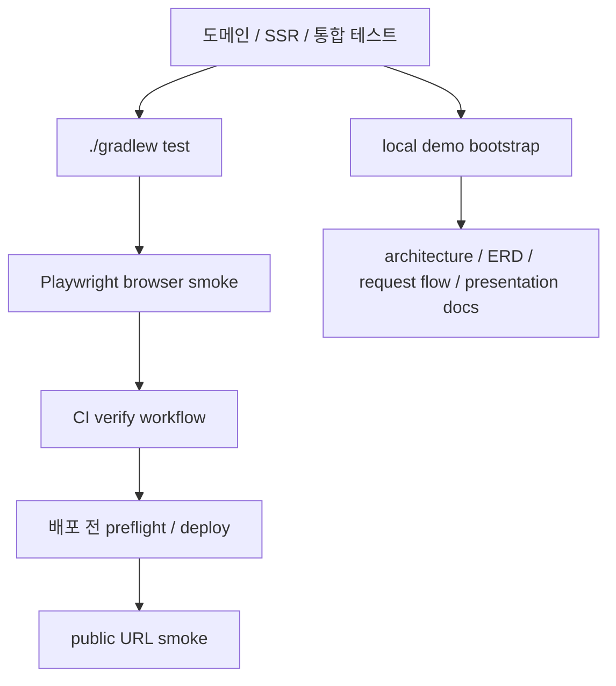

# [Spring Boot 게임 플랫폼 포트폴리오] 18. production verification과 demo/interview pack을 어떻게 하나의 마감 패키지로 묶었는가

## 1. 이번 글에서 풀 문제

프로젝트를 끝까지 만들었다고 해서 바로 production-ready가 되는 것은 아닙니다.

마지막 단계에서 실제로 남는 질문은 아래와 같습니다.

- `./gradlew test`가 초록이면 충분한가
- 실제 브라우저로 public 화면을 어디까지 확인했는가
- 배포 후에는 어떤 주소를 어떤 순서로 확인해야 하는가
- local에서 시연할 때 어떤 계정과 데이터가 기본으로 떠야 하는가
- 면접에서 시스템 구조, 요청 흐름, 운영 전략을 어떤 문서로 빠르게 설명할 것인가

WorldMap은 이 문제를 아래 다섯 조각으로 나눠 닫았습니다.

1. 코드 회귀를 보는 `test`
2. 실제 Chromium으로 public 계약을 보는 `browserSmokeTest`
3. 공개 URL의 status와 timing을 재는 `publicUrlSmokeTest`
4. local 시연용 데이터 상태를 고정하는 demo bootstrap
5. 구조/ERD/요청 흐름/발표 스크립트를 묶는 interview pack

이 글의 목표는 “검증 레일이 있다” 수준이 아니라,
**현재 저장소의 마지막 검증/시연 패키지를 다시 만들 수 있을 정도로 정확하게 설명하는 것**입니다.

## 2. 먼저 알아둘 개념

### 2-1. verification lane은 하나가 아니라 역할별로 나눈다

검증을 하나의 거대한 E2E로 몰아넣으면 느리고, flaky하고, 실패 원인이 흐려집니다.

그래서 WorldMap은 검증을 세 층으로 나눕니다.

- `test`
  - 단위 테스트와 서버 중심 통합 테스트
  - DB/Redis-backed 계약, 도메인 규칙, SSR 컨트롤러 검증
- `browserSmokeTest`
  - Playwright Chromium으로 public 핵심 경로와 modal keyboard 계약 확인
  - 하지만 모든 게임을 브라우저만으로 처음부터 끝까지 플레이하는 full E2E는 아님
- `publicUrlSmokeTest`
  - 실제 공개 URL 또는 local fallback 서버의 status/title/h1/navigation timing 확인
  - post-deploy 확인용

### 2-2. browser smoke fallback과 Redis fallback은 다른 문제다

이 둘은 자주 섞여 보이지만 전혀 다릅니다.

- browser/public smoke의 fallback
  - 공개 URL이 없을 때 test 서버의 random port로 대신 붙는 것
- ranking/stats의 Redis fallback
  - Redis read가 실패해도 DB top run으로 `/ranking`, `/stats`, `/api/rankings/*`를 계속 읽게 하는 것

즉 하나는 **검증 레일의 입력 URL 선택**이고,
다른 하나는 **서비스 read model의 장애 대응 전략**입니다.

### 2-3. verify workflow와 required check는 같은 말이 아니다

[verify.yml](../.github/workflows/verify.yml)은 저장소 안에 있는 CI workflow 정의입니다.
여기에는 `test`와 `browser-smoke` job만 있습니다.

반면 “required check”는 GitHub branch protection의 운영 설정입니다.
즉 저장소 코드가 아니라 GitHub 설정 영역입니다.

이 차이를 구분해야 아래 질문에 정확히 답할 수 있습니다.

- 저장소에 어떤 CI가 정의돼 있는가
- main 머지 전에 GitHub가 실제로 무엇을 강제하는가

### 2-4. demo bootstrap은 더미 데이터가 아니라 local read model baseline이다

local 시연에서 바로 보여 줘야 하는 화면은 생각보다 많습니다.

- `/stats`
- `/ranking`
- `/mypage`
- `/dashboard`
- `/dashboard/recommendation/feedback`

이 화면들을 매번 손으로 만들지 않기 위해,
startup 시점에 **설명 가능한 최소 샘플 상태**를 자동으로 만들어 둡니다.

### 2-5. interview pack은 코드 외부의 “설명 레일”이다

코드와 테스트가 있어도 면접에서 3분 안에 설명하려면 별도 문서가 필요합니다.

WorldMap은 아래 문서를 core interview pack으로 봅니다.

- [LOCAL_DEMO_BOOTSTRAP.md](../docs/LOCAL_DEMO_BOOTSTRAP.md)
- [ARCHITECTURE_OVERVIEW.md](../docs/ARCHITECTURE_OVERVIEW.md)
- [ERD.md](../docs/ERD.md)
- [REQUEST_FLOW_GUIDE.md](../docs/REQUEST_FLOW_GUIDE.md)
- [PRESENTATION_PREP.md](../docs/PRESENTATION_PREP.md)

여기에 [DEPLOYMENT_RUNBOOK_AWS_ECS.md](../docs/DEPLOYMENT_RUNBOOK_AWS_ECS.md)는
core interview material이라기보다 **deployment/ops appendix**로 붙습니다.

## 3. 이번 글에서 다룰 파일

```text
- build.gradle
- src/main/resources/application-browser-smoke.yml
- src/test/java/com/worldmap/e2e/BrowserSmokeE2ETest.java
- src/test/java/com/worldmap/e2e/PublicUrlSmokeE2ETest.java
- src/test/java/com/worldmap/common/config/BrowserSmokeProfileConfigTest.java
- src/test/java/com/worldmap/ranking/RedisUnavailableLeaderboardFallbackIntegrationTest.java
- .github/workflows/verify.yml
- src/main/java/com/worldmap/demo/application/DemoBootstrapInitializer.java
- src/main/java/com/worldmap/demo/application/DemoBootstrapService.java
- src/test/java/com/worldmap/demo/DemoBootstrapIntegrationTest.java
- docs/LOCAL_DEMO_BOOTSTRAP.md
- docs/ARCHITECTURE_OVERVIEW.md
- docs/ERD.md
- docs/REQUEST_FLOW_GUIDE.md
- docs/PRESENTATION_PREP.md
- docs/DEPLOYMENT_RUNBOOK_AWS_ECS.md
```

## 4. 시작 상태

이 글을 읽기 시작하는 시점의 전제는 아래와 같습니다.

- public 게임 5종은 이미 동작한다
- `/ranking`, `/stats`, `/mypage`, `/dashboard`가 이미 있다
- session ownership, stale submit, terminal result, current member/role 재검증 같은 hardening이 끝나 있다
- 추천 엔진, 피드백, admin review loop도 이미 있다

즉 이 글은 기능을 새로 만드는 단계가 아니라,
**이미 구현된 기능을 어떻게 검증하고 시연 가능한 패키지로 닫을 것인가**를 설명합니다.

## 5. 최종 도착 상태

이 글까지 읽고 나면 아래를 설명할 수 있어야 합니다.

1. 왜 `test`, `browserSmokeTest`, `publicUrlSmokeTest`를 하나로 합치지 않았는가
2. `browserSmokeTest`가 실제로 무엇을 보고, 무엇은 의도적으로 안 보는가
3. 공개 URL이 없을 때 `publicUrlSmokeTest`가 어디로 붙는가
4. Redis가 내려가 있어도 `/ranking`, `/stats`가 왜 계속 보이는가
5. verify workflow 안에는 어떤 job만 있고, required check는 왜 repo 밖 설정인가
6. local 데모를 켜면 어떤 계정/샘플 run/guest 세션/추천 피드백이 생기는가
7. 면접 직전에 어떤 문서를 어떤 순서로 읽어야 하는가

## 6. 설계 구상



핵심은 아래 두 줄입니다.

- 검증은 `코드 회귀 -> 브라우저 계약 -> 공개 URL 확인`으로 위계를 나눈다
- 시연은 `재현 가능한 local 데이터 상태 -> 설명 문서 세트`로 닫는다

즉 이 글의 중심은 비즈니스 엔티티가 아니라
**프로젝트를 믿고 보여 줄 수 있게 만드는 운영 구조**입니다.

## 7. `build.gradle`에서 verification lane을 어떻게 나눴는가

### 7-1. `test`는 기본 레일이지만 browser/public smoke는 포함하지 않는다

[build.gradle](../build.gradle)에서 `test` task는 JUnit Platform 기준으로 아래 태그를 제외합니다.

```groovy
tasks.named('test') {
	useJUnitPlatform {
		excludeTags 'browser-smoke'
		excludeTags 'public-url-smoke'
	}
}
```

즉 기본 `./gradlew test`는

- 단위 테스트
- 서버 통합 테스트
- 컨트롤러/SSR 테스트
- DB/Redis fallback 검증

을 담당하지만,
실제 Playwright 브라우저를 띄우는 레일은 여기 섞지 않습니다.

이렇게 나눈 이유는 두 가지입니다.

1. 기본 피드백 속도를 지키기 위해
2. “어느 층에서 깨졌는가”를 바로 설명하기 위해

### 7-2. `browserSmokeTest`는 `@Tag("browser-smoke")`만 실행한다

같은 파일에서 별도 verification task를 추가합니다.

```groovy
tasks.register('browserSmokeTest', Test) {
	group = 'verification'
	description = 'Runs browser-based smoke tests against a real Spring Boot server.'
	testClassesDirs = sourceSets.test.output.classesDirs
	classpath = sourceSets.test.runtimeClasspath
	useJUnitPlatform {
		includeTags 'browser-smoke'
	}
	shouldRunAfter(tasks.named('test'))
}
```

즉 이 레일의 source of truth는
`@Tag("browser-smoke")`가 붙은 테스트 클래스입니다.

현재 대표 구현은 아래입니다.

- [BrowserSmokeE2ETest.java](../src/test/java/com/worldmap/e2e/BrowserSmokeE2ETest.java)

### 7-3. `publicUrlSmokeTest`는 `@Tag("public-url-smoke")`만 실행한다

공개 URL용 smoke도 별도 task입니다.

```groovy
tasks.register('publicUrlSmokeTest', Test) {
	group = 'verification'
	description = 'Runs browser-based smoke and timing checks against a configured public base URL.'
	testClassesDirs = sourceSets.test.output.classesDirs
	classpath = sourceSets.test.runtimeClasspath
	useJUnitPlatform {
		includeTags 'public-url-smoke'
	}
	def publicBaseUrl = System.getProperty('worldmap.publicBaseUrl')
	if (publicBaseUrl != null) {
		systemProperty 'worldmap.publicBaseUrl', publicBaseUrl
	}
	shouldRunAfter(tasks.named('browserSmokeTest'))
}
```

핵심은 이 레일이 CI 기본 job이 아니라는 점입니다.

- `browserSmokeTest`
  - 저장소 자체가 띄운 app에 대한 Playwright smoke
- `publicUrlSmokeTest`
  - 실제 공개 주소가 있으면 그 주소에 대한 smoke
  - 주소가 없으면 local random-port app으로 fallback

즉 목적이 다릅니다.

### 7-4. `DemoBootstrapIntegrationTest`는 별도 lane이 아니라 focused confidence check다

아래 명령은 자주 함께 쓰지만, 새로운 verification lane은 아닙니다.

```bash
./gradlew test --tests com.worldmap.demo.DemoBootstrapIntegrationTest
```

이건 `test` lane 안에서 demo baseline만 빠르게 재확인하는
**focused check**입니다.

즉 아래처럼 이해해야 합니다.

- `test`
  - 전체 단위/통합 테스트
- `browserSmokeTest`
  - 브라우저 smoke
- `publicUrlSmokeTest`
  - 공개 URL smoke
- `test --tests ...DemoBootstrapIntegrationTest`
  - 특정 baseline만 빠르게 보는 집중 실행

## 8. 왜 browser smoke에 별도 profile이 필요한가

### 8-1. `application-browser-smoke.yml`은 “Redis-free browser lane”을 강제한다

[application-browser-smoke.yml](../src/main/resources/application-browser-smoke.yml)은 매우 짧지만 의미가 큽니다.

```yaml
spring:
  data:
    redis:
      host: 127.0.0.1
      port: 6390

worldmap:
  legacy:
    rollback:
      enabled: false
```

여기서 중요한 건 두 줄입니다.

- Redis host/port를 일부러 비어 있는 `127.0.0.1:6390`로 둔다
- legacy rollback initializer를 끈다

즉 browser smoke는 우연히 떠 있는 local Redis나
과거 local data cleanup 흐름에 기대지 않습니다.

### 8-2. 이 profile이 없으면 어떤 문제가 생기는가

browser smoke는 원래 public surface를 확인하는 레일입니다.
그런데 이 레일이 local Redis 상태에 따라 성공/실패하면 CI에서 믿기 어렵습니다.

문제가 되는 경우는 아래와 같습니다.

- 내 로컬에서는 Redis가 떠 있어서 green
- CI runner에는 Redis가 없어서 실패
- 누군가 이전 local DB/Redis를 유지한 상태에서만 보이는 테스트 통과

그래서 browser smoke는 오히려
**Redis가 없다는 전제에서 public page가 어떻게 견디는가**를 보게 만듭니다.

### 8-3. 이 설정 자체도 테스트로 고정한다

관련 검증은 아래 파일이 받칩니다.

- [BrowserSmokeProfileConfigTest.java](../src/test/java/com/worldmap/common/config/BrowserSmokeProfileConfigTest.java)

즉 “browser smoke profile이 그렇게 동작한다”는 말도
문서 설명이 아니라 테스트로 다시 확인할 수 있습니다.

## 9. `BrowserSmokeE2ETest`는 실제로 무엇을 검증하는가

### 9-1. 클래스 수준 계약

[BrowserSmokeE2ETest.java](../src/test/java/com/worldmap/e2e/BrowserSmokeE2ETest.java)는 아래 전제를 가집니다.

- `@SpringBootTest(webEnvironment = RANDOM_PORT)`
- `@ActiveProfiles({"test", "browser-smoke"})`
- `@Tag("browser-smoke")`
- Playwright Chromium headless browser 사용

즉 테스트 서버는 Spring Boot가 직접 띄우고,
브라우저는 그 random port로 붙습니다.

### 9-2. 현재 커버리지 표

이 클래스가 현재 고정하는 public surface는 아래와 같습니다.

| 테스트 메서드 | 무엇을 보는가 | 왜 필요한가 |
| --- | --- | --- |
| `homePageRendersExpectedShellInRealBrowser()` | 홈 title, light theme 기본값, header shell, mode card 수, hero support link | 앱 첫 진입점이 SSR + JS hydrate 이후에도 깨지지 않는지 확인 |
| `capitalStartPageCreatesPlayableGuestSessionInRealBrowser()` | `/games/capital/start -> play` 이동, 문제 텍스트, 4지선다, 상태 카드 | 대표 game start flow가 브라우저에서 실제 session을 만드는지 확인 |
| `recommendationSurveySubmitsAndRendersTopThreeResultCards()` | 설문 20문항 입력, 결과 페이지 title, top 3 result card | recommendation public flow가 실제 form submit 기준으로 살아 있는지 확인 |
| `rankingPageRendersInRealBrowserWithoutRedis()` | `/ranking` title, active title, 기본 tbody 렌더 | Redis 없는 browser-smoke profile에서도 ranking SSR shell이 사는지 확인 |
| `statsPageRendersInRealBrowserWithoutRedis()` | `/stats` title, stat card, CTA link | stats public read model이 Redis 부재에도 렌더되는지 확인 |
| `capitalGameOverModalSupportsKeyboardTrapAndRestartFocusReturn()` | game-over modal focus trap, Escape 유지, restart focus return | keyboard accessibility contract 고정 |
| `locationGameOverModalSupportsKeyboardTrapAndRestartFocusReturn()` | location modal keyboard contract + restart 뒤 globe focus 복귀 | WebGL stage가 있는 게임의 focus 복귀 계약 고정 |
| `flagGameOverModalSupportsKeyboardTrapAndRestartFocusReturn()` | flag modal keyboard contract | public modal helper 계약의 한 변형 고정 |
| `populationGameOverModalSupportsKeyboardTrapAndRestartFocusReturn()` | population modal keyboard contract | 4-choice 모달 keyboard 계약 고정 |
| `populationBattleGameOverModalSupportsKeyboardTrapAndRestartFocusReturn()` | population-battle modal keyboard contract | 2-choice battle shell의 keyboard contract 고정 |

### 9-2.5. 현재 browser smoke가 의도적으로 안 보는 것

현재 `BrowserSmokeE2ETest`는 아래까지는 아직 고정하지 않습니다.

- 로그인/회원가입 form validation과 redirect 세부 계약
- `/mypage`, `/dashboard`, `/dashboard/recommendation/feedback`의 브라우저 렌더
- recommendation feedback 제출 UI 자체의 실제 브라우저 흐름
- 다섯 게임을 브라우저만으로 처음부터 끝까지 도는 full playthrough
- 공개 URL 기준의 실제 timing

즉 browser smoke는 “public surface 전부”가 아니라
**대표 public 진입 경로 + ranking/stats shell + terminal modal keyboard contract**를 보는 레일입니다.

### 9-3. 이건 “모든 게임 full browser playthrough”가 아니다

여기서 중요한 제한을 정확히 말해야 합니다.

다섯 게임 modal 테스트는 대부분 아래 순서를 씁니다.

1. 브라우저로 start page에서 session을 만든다
2. 서버 service를 직접 호출해 lives를 1개 남은 상태까지 민다
3. 브라우저를 reload한다
4. 마지막 오답 제출과 modal interaction만 Chromium으로 밟는다

예를 들어 capital 테스트는 아래처럼 진행됩니다.

- 브라우저로 `/games/capital/start`에서 시작
- service에서 오답 2번 제출
- 브라우저 reload
- 마지막 오답 1번은 브라우저에서 클릭
- modal focus trap / Escape / restart focus return 확인

즉 이 테스트들의 목표는
“다섯 게임을 브라우저만으로 처음부터 끝까지 돌린다”가 아니라,
**가장 깨지기 쉬운 terminal modal keyboard contract를 real browser로 고정한다**입니다.

이 경계가 오히려 좋습니다.

- 도메인 상태 준비는 서버 service가 책임진다
- focus/inert/restart UX는 브라우저가 책임진다

그래서 실패했을 때도 원인을 더 빨리 좁힐 수 있습니다.

### 9-4. location만 조금 다른 이유

location은 단순 4-choice가 아니라 globe interaction이 있습니다.
그래서 이 테스트는 `window.__worldmapBrowserSmoke` hook을 심어
`window.Globe`의 polygon click handler를 가로챕니다.

즉 location test는 좌표 클릭 자체를 믿지 않고,
마지막 wrong selection이 실제 브라우저 안에서 적용되는 경로만 고정합니다.

이 역시 목적이 “그래픽까지 full E2E”가 아니라
**terminal modal contract 검증**이기 때문에 취한 선택입니다.

## 10. Redis fallback과 public URL fallback을 어떻게 구분하는가

### 10-1. Redis fallback: 서비스 read model의 장애 대응

[RedisUnavailableLeaderboardFallbackIntegrationTest.java](../src/test/java/com/worldmap/ranking/RedisUnavailableLeaderboardFallbackIntegrationTest.java)는
Redis read가 깨질 때 아래 경로가 계속 살아 있는지 봅니다.

- `/api/rankings/location`
- `/ranking`
- `/stats`

즉 source of truth는 여전히 `leaderboard_record`이고,
Redis는 top-N index/cache에 가깝습니다.

그래서 public 읽기 경로는 아래처럼 동작합니다.

1. Redis read 시도
2. Redis miss 또는 `DataAccessException` 발생
3. DB top run fallback
4. 가능하면 best-effort로 warm/rebuild 시도

이 fallback은 **서비스 계약**입니다.

### 10-2. public URL fallback: smoke test 입력 URL 결정

반면 [PublicUrlSmokeE2ETest.java](../src/test/java/com/worldmap/e2e/PublicUrlSmokeE2ETest.java)는
아래 규칙으로 base URL을 고릅니다.

1. `-Dworldmap.publicBaseUrl=...`
2. `WORLDMAP_PUBLIC_BASE_URL=...`
3. 둘 다 없으면 `http://127.0.0.1:${randomPort}`

즉 이 fallback은
**“어느 주소를 대상으로 smoke를 돌릴 것인가”를 정하는 테스트 편의 계약**입니다.

둘을 섞어서 말하면 안 됩니다.

- Redis fallback
  - 앱 read model의 복원력
- public URL fallback
  - smoke runner의 대상 주소 선택

## 11. `PublicUrlSmokeE2ETest`는 무엇을 남기는가

### 11-1. 확인 페이지

현재 [PublicUrlSmokeE2ETest.java](../src/test/java/com/worldmap/e2e/PublicUrlSmokeE2ETest.java)는 아래 페이지를 확인합니다.

- `/`
- `/stats`
- `/ranking`
- `/login`
- `/signup`
- `/recommendation/survey`
- `/games/capital/start`

즉 이 레일은 “읽기 가능한 public surface와 진입 페이지”를 먼저 확인합니다.

아직 로그인 후 mutation flow나 게임 전체 플레이를 여기 넣지 않은 이유는,
이 레일의 목적이 **배포 직후 빠르게 열리는가/느리지 않은가**를 보는 것이기 때문입니다.

### 11-2. 측정 값

각 페이지마다 아래를 기록합니다.

- HTTP status
- `document.title`
- 첫 번째 heading text
- `TTFB`
- `DOMContentLoaded`
- `load`

여기서 `TTFB`는 서버 APM 수치가 아니라
브라우저 Navigation Timing의 `responseStart` 기준 근사치입니다.

또 이 레일은 어디까지나 navigation-level smoke입니다.

- heading/title이 기대한 페이지와 맞는가
- entry page가 4xx 없이 열리는가
- 브라우저 timing snapshot이 대략 어떤가

반대로 아래까지는 아직 보지 않습니다.

- 로그인 이후 인증 상태 변화
- 각 페이지 내부 API 호출의 세부 payload
- 게임 진행이나 recommendation feedback 제출 같은 mutation flow

### 11-3. 보고서 출력 경로

결과는 Markdown으로 남습니다.

- `build/reports/public-url-smoke/public-url-smoke.md`

즉 이 테스트는 콘솔에서 한 줄 보고 끝나는 게 아니라,
**post-deploy timing snapshot**을 아티팩트로 남기는 역할까지 합니다.

### 11-4. 실제 production 주소가 없을 때도 레일 자체는 검증할 수 있다

이 프로젝트는 아직 공개 URL이 없더라도,
`publicUrlSmokeTest` 자체는 local random-port 서버에 붙어 green 여부를 확인할 수 있습니다.

즉 아래 두 단계가 분리됩니다.

1. 레일 자체가 깨지지 않는지 local에서 확인
2. 나중에 ALB DNS나 도메인이 생기면 같은 레일을 production 주소에 다시 실행

여기서도 범위를 분명히 해야 합니다.

- local fallback으로 생성한 timing report는 레일 자체가 동작하는지 확인하는 artifact다
- production 주소에 붙여서 만든 timing report만이 배포 표면의 실제 snapshot이다

즉 local fallback 결과를 production 성능 근거처럼 말하면 안 됩니다.

## 12. `verify.yml`은 어디까지 자동화하는가

### 12-1. workflow 자체는 세 trigger와 두 job을 가진다

[verify.yml](../.github/workflows/verify.yml)은 현재 아래 trigger를 가집니다.

- `pull_request`
- `push` to `main`, `master`
- `workflow_dispatch`

그리고 실제 verification job은 아래 두 개뿐입니다.

1. `test`
2. `browser-smoke`

`publicUrlSmokeTest`는 여기 포함되지 않습니다.

그 이유는 단순합니다.

- `test`
  - 저장소 내부만으로 재현 가능한 기본 회귀
- `browserSmokeTest`
  - 저장소 내부 app + Playwright만 있으면 되는 real browser smoke
- `publicUrlSmokeTest`
  - 실제 공개 주소가 있어야 가치가 커지는 post-deploy check

즉 `publicUrlSmokeTest`는 CI 기본선이 아니라
**배포 후 사람이 다시 돌릴 레일**입니다.

### 12-2. `test` job의 책임

`test` job은 아래 전제로 동작합니다.

- ubuntu runner
- Redis service `redis:8-alpine`
- Java 25
- `./gradlew test`

여기서 Redis service를 띄우는 이유는
browser-smoke profile과 달리 기본 통합 테스트는
실제 Redis-backed 동작도 포함하기 때문입니다.

### 12-3. `browser-smoke` job의 책임

`browser-smoke` job은 아래 순서를 가집니다.

1. checkout
2. Java 25 setup
3. Node.js 22 setup
4. Playwright Chromium install
5. `./gradlew browserSmokeTest`

즉 이 job은 “브라우저 테스트라서 Node만 있으면 된다”가 아닙니다.
Spring Boot app도 같이 띄워야 하므로 Java와 Gradle이 같이 필요합니다.

### 12-4. required check는 workflow 파일이 아니라 GitHub 설정이다

이 저장소에서 설명할 수 있는 repo-truth는 아래뿐입니다.

- `verify` workflow가 있다
- 그 안에 `test`, `browser-smoke` job이 있다

반면 “main에서 required check로 막고 있다”는 사실은
GitHub branch protection의 운영 설정입니다.

즉 면접에서 이렇게 말하는 것이 정확합니다.

> 저장소 안에는 `verify` workflow로 `test`, `browser-smoke` 두 job이 정의돼 있고, 실제 머지 게이트는 GitHub branch protection에서 따로 건다.

## 13. local demo bootstrap은 정확히 어떤 baseline을 만드는가

### 13-1. initializer 순서가 중요하다

[LOCAL_DEMO_BOOTSTRAP.md](../docs/LOCAL_DEMO_BOOTSTRAP.md)에 따르면
local profile에서는 startup 시 아래 순서로 initializer가 뜹니다.

1. `CountrySeedInitializer`
2. `AdminBootstrapInitializer`
3. `RecommendationFeedbackLegacyColumnInitializer`
4. `GameLevelRollbackInitializer`
5. `DemoBootstrapInitializer`

이 순서를 지키는 이유는 분명합니다.

- 먼저 country seed가 있어야 game/recommendation demo data가 국가 row를 참조할 수 있다
- admin 계정이 먼저 있어야 dashboard 진입 baseline이 생긴다
- legacy feedback column과 old level-2 흔적을 먼저 정리해야 demo bootstrap이 깨끗한 상태에서 돌 수 있다
- 그다음에야 local demo user, run, feedback를 넣는다

### 13-2. 기본 계정

현재 기본 계정은 아래입니다.

| 역할 | 닉네임 | 비밀번호 |
| --- | --- | --- |
| ADMIN | `worldmap_admin` | `secret123` |
| USER | `orbit_runner` | `secret123` |

이 baseline은 [DemoBootstrapIntegrationTest.java](../src/test/java/com/worldmap/demo/DemoBootstrapIntegrationTest.java)에서 실제로 검증됩니다.

### 13-3. 완료된 demo run 5개

local demo baseline은 `orbit_runner` 기준으로 아래 finished run 다섯 개를 만듭니다.

- 위치 찾기 1개
- 인구수 퀴즈 1개
- 수도 맞히기 1개
- 국기 퀴즈 1개
- 인구 비교 퀵 배틀 1개

`DemoBootstrapIntegrationTest`는 이 사실을 `runSignature` 기준으로 고정합니다.

- `demo:location:orbit_runner:1`
- `demo:population:orbit_runner:1`
- `demo:capital:orbit_runner:1`
- `demo:flag:orbit_runner:1`
- `demo:population-battle:orbit_runner:1`

즉 local demo는 “랭킹이 뭔가 떠 있다” 정도가 아니라,
**어떤 run이 있어야 하는지까지 식별 가능한 baseline**입니다.

### 13-4. 진행 중 guest 세션 1개

finished run만 있는 것이 아닙니다.

demo baseline은 아래 guest live session도 같이 만듭니다.

- `guestSessionKey = demo-guest-live`
- 위치 게임
- `status = IN_PROGRESS`

이 값은 `/mypage` 설명이 아니라
guest/session ownership, access context, live session 설명에도 중요합니다.

### 13-5. 현재 추천 버전 피드백 샘플

추천 운영 화면도 비어 있으면 데모 가치가 떨어집니다.
그래서 current recommendation feedback sample도 같이 넣습니다.

- 기준 버전: `survey-v4 / engine-v20`
- target count: 최소 5개
- dashboard review 기대 메모: `현재 엔진 유지`

실제 상수는 [DemoBootstrapService.java](../src/main/java/com/worldmap/demo/application/DemoBootstrapService.java)의
`DEMO_CURRENT_FEEDBACK_TARGET = 5`입니다.

fresh local DB에서 처음 bootstrap이 도는 경우에는
점수 `5, 4, 4, 5, 4`의 샘플 다섯 개가 들어가므로 평균 만족도는 약 `4.4`입니다.
하지만 이미 current version feedback가 일부 있는 상태에서 다시 부팅하면
서비스는 부족분만 top-up 하므로, rerun 이후의 count와 평균은 “정확히 5개/4.4”가 아니라 `>= 5`로 읽어야 합니다.

또 [DemoBootstrapIntegrationTest.java](../src/test/java/com/worldmap/demo/DemoBootstrapIntegrationTest.java)는 아래를 같이 봅니다.

- current version response count `>= 5`
- `priorityActionTitle() == "현재 엔진 유지"`
- `priorityScenarioIds()` empty

즉 local demo는 추천 운영 화면까지 바로 설명 가능한 상태를 목표로 합니다.

### 13-6. demo bootstrap은 idempotent하게 다시 만들 수 있어야 한다

이 baseline은 한 번 넣고 끝나는 seed가 아닙니다.
DB와 Redis를 날리고 local profile로 다시 띄워도 같은 상태가 재생성돼야 합니다.

현재 규칙은 아래와 같습니다.

- `runSignature`
  - finished run 중복 생성 방지
- `guestSessionKey`
  - live session 중복 생성 방지
- `nickname`
  - demo member 재사용
- current feedback count
  - 현재 버전 응답 수가 5개 미만일 때만 부족분만 보충

즉 demo bootstrap은 “매번 새로 넣는다”보다
**설명 가능한 baseline을 계속 유지한다**는 쪽에 가깝습니다.

### 13-7. 이 baseline으로 바로 보여 줄 화면

이 상태로 local app을 띄우면 아래를 바로 시연할 수 있습니다.

- `/stats`
- `/ranking`
- `/mypage`
- `/dashboard`
- `/dashboard/recommendation/feedback`

즉 demo bootstrap은 한 기능의 seed가 아니라
**local demo 전체의 공통 read model baseline**입니다.

## 14. interview pack 문서는 각각 무엇을 담당하는가

### 14-1. `LOCAL_DEMO_BOOTSTRAP.md`: local 재현 시작점

[LOCAL_DEMO_BOOTSTRAP.md](../docs/LOCAL_DEMO_BOOTSTRAP.md)는
local 시연 상태를 다시 만드는 entrypoint입니다.

이 문서가 중요한 이유는 아래 두 질문에 답하기 때문입니다.

- local에서 어떤 계정과 샘플 데이터가 떠야 하는가
- 데이터가 날아가면 어떤 순서로 다시 같은 상태를 만들 것인가

즉 demo/interview pack의 출발점은 이 문서입니다.

### 14-2. `ARCHITECTURE_OVERVIEW.md`: 한 장 구조 설명

[ARCHITECTURE_OVERVIEW.md](../docs/ARCHITECTURE_OVERVIEW.md)는
면접 초반 1분 설명에서 가장 먼저 꺼내기 좋은 문서입니다.

여기서는 아래를 빠르게 보여 줄 수 있습니다.

- browser / SSR / JS shell
- Spring Boot controller / application / domain / infra
- PostgreSQL / Redis
- admin/public surface 분리

즉 “이 프로젝트가 전체적으로 어떤 모양인가”를 한 장으로 설명합니다.

### 14-3. `ERD.md`: durable state의 shape

[ERD.md](../docs/ERD.md)는
아래처럼 장기 상태를 설명할 때 씁니다.

- `country`
- `leaderboard_record`
- `member`
- 각 game session/stage/attempt
- `recommendation_feedback`

구조 설명이 필요할 때 아키텍처 개요만으로는 부족하고,
ERD가 있어야 entity boundary를 더 선명하게 보여 줄 수 있습니다.

### 14-4. `REQUEST_FLOW_GUIDE.md`: 면접용 요청 흐름 3개

[REQUEST_FLOW_GUIDE.md](../docs/REQUEST_FLOW_GUIDE.md)는
길게 설명하지 않고 대표 흐름 세 개만 고정합니다.

- 위치 게임
- guest -> login -> claim
- recommendation -> feedback -> dashboard review

즉 이 문서는 “지금 바로 1분 안에 하나 설명해 보라”는 질문에 대응하기 좋습니다.

### 14-5. `PRESENTATION_PREP.md`: 실제 답변 스크립트

[PRESENTATION_PREP.md](../docs/PRESENTATION_PREP.md)는
기술 문서라기보다 발표/면접 대응 자료입니다.

여기서는 아래가 중요합니다.

- 3분 소개
- 10분 기술 설명 순서
- 예상 질문
- 약한 부분 정리
- 발표 직전 체크리스트

즉 코드를 많이 읽지 않고도 마지막 발표 리허설을 돌릴 수 있게 합니다.

### 14-6. `DEPLOYMENT_RUNBOOK_AWS_ECS.md`: deployment/ops appendix

[DEPLOYMENT_RUNBOOK_AWS_ECS.md](../docs/DEPLOYMENT_RUNBOOK_AWS_ECS.md)는
core interview pack이라기보다 ops appendix에 가깝습니다.

왜냐하면 면접의 중심은 보통
시스템 구조, 요청 흐름, 검증 전략, 하드닝이기 때문입니다.

하지만 아래 질문이 나오면 이 문서가 필요합니다.

- AWS에 올릴 때 어떤 순서로 확인하는가
- ALB, ECS, RDS, Redis, GitHub Actions input은 어떻게 연결되는가
- preflight에서 어떤 값이 비어 있으면 배포를 막는가

## 15. local에서 이 패키지를 다시 세우는 순서

### 15-1. baseline 인프라 실행

```bash
docker compose down -v
docker compose up -d
```

이 단계는 PostgreSQL/Redis 같은 local 개발 인프라를 올립니다.

### 15-2. local profile로 서버 실행

```bash
set -a
source .env.local
set +a
./gradlew bootRun --args='--spring.profiles.active=local'
```

그러면 아래가 자동으로 이어집니다.

1. country seed
2. admin bootstrap
3. legacy feedback column 완화
4. legacy level-2 purge
5. demo bootstrap

### 15-3. local baseline 확인 순서

local 시연 직전에는 보통 아래 순서가 가장 자연스럽습니다.

1. 홈 `/`
2. `/stats`
3. `/ranking`
4. `/login`
5. `/mypage`
6. `/dashboard`
7. `/dashboard/recommendation/feedback`

즉 public surface를 먼저 보여 준 뒤,
member/admin read model로 넘어가는 흐름입니다.

## 16. verification lane 실행 순서

### 16-1. 코드 회귀

```bash
./gradlew test
```

이 명령은 기본 단위/통합 테스트를 돕니다.
단, `browser-smoke`, `public-url-smoke` 태그는 제외됩니다.

### 16-2. 브라우저 smoke

```bash
./gradlew browserSmokeTest
```

이 명령은 Playwright Chromium 기반 public smoke를 실행합니다.
browser-smoke profile을 함께 태워 Redis-free 조건에서 검증합니다.

### 16-3. demo baseline 집중 확인

```bash
./gradlew test --tests com.worldmap.demo.DemoBootstrapIntegrationTest
```

이 명령은 전체 lane이 아니라,
local demo baseline이 아직 설명 가능한 상태인지 빠르게 확인하는 focused check입니다.

### 16-4. 공개 URL smoke

배포 주소가 아직 없으면 아래만 돌려도 레일 자체는 확인됩니다.

```bash
./gradlew publicUrlSmokeTest
```

배포 주소가 생기면 이렇게 실행합니다.

```bash
WORLDMAP_PUBLIC_BASE_URL=http://<alb-dns> ./gradlew publicUrlSmokeTest
```

또는 JVM property로도 가능합니다.

```bash
./gradlew publicUrlSmokeTest -Dworldmap.publicBaseUrl=https://<public-url>
```

## 17. post-deploy에서 확인해야 할 순서

현재 프로젝트는 아직 공개 URL이 없는 상태여도 레일 자체는 준비돼 있습니다.
나중에 실제 ALB DNS나 도메인이 생기면 아래 순서로 확인하면 됩니다.

1. `deploy-prod-ecs`로 배포
2. ALB DNS 확보
3. `publicUrlSmokeTest`로 status/title/h1/timing 측정
4. `/ranking`, `/stats` 첫 화면 확인
5. `/login`, `/signup`, `/recommendation/survey`, `/games/capital/start` 확인
6. 필요하면 수동으로 로그인 / admin / mypage / dashboard 점검

이때 중요한 점은 `publicUrlSmokeTest`가 아직 CI job이 아니라는 점입니다.
즉 배포 후 이 단계는 **사람이 의식적으로 실행해야 하는 post-deploy step**입니다.

## 18. 실패 케이스와 어디를 먼저 의심해야 하는가

### 18-1. `./gradlew test`는 green인데 `browserSmokeTest`가 깨진다

먼저 아래를 의심합니다.

- SSR shell이나 JS hydrate가 깨졌는가
- modal focus helper가 깨졌는가
- browser-smoke profile에서 Redis-free 조건을 견디지 못하는 public surface가 생겼는가

즉 도메인 규칙보다 브라우저 표현 계층 쪽을 먼저 봐야 합니다.

### 18-2. `browserSmokeTest`는 green인데 `publicUrlSmokeTest`가 깨진다

먼저 아래를 의심합니다.

- 실제 공개 URL이 잘못됐다
- ALB/도메인/forwarded header 설정이 다르다
- 배포된 정적 자산 버전이 어긋났다
- 공개 환경에서만 title/h1/redirect가 달라졌다

즉 repo 내부 검증이 아니라 **배포 표면 문제**일 가능성이 높습니다.

### 18-3. `/ranking`, `/stats`만 production에서 죽는다

이 경우 먼저 Redis fallback 계약을 의심해야 합니다.

- `LeaderboardService` DB fallback이 예상대로 타는가
- Redis connectivity 오류가 `DataAccessException`으로 처리되는가
- browser smoke에서만 green이고 실제 prod read path에서만 깨지는가

즉 public URL fallback이 아니라
**서비스 read model fallback** 문제일 확률이 높습니다.

### 18-4. local demo가 비어 있다

아래를 순서대로 봅니다.

1. local profile로 올렸는가
2. `worldmap.demo.bootstrap.enabled=true`인가
3. country seed가 먼저 들어갔는가
4. demo 계정 nickname/password override가 유효한가
5. 이전 local DB/Redis를 재사용하며 예상치 못한 legacy 상태가 남았는가

### 18-5. demo dashboard review가 `현재 엔진 유지`가 아니다

이 경우는 아래를 의심합니다.

- current `survey-v4 / engine-v20` 기준 feedback sample이 5개 이상 채워졌는가
- admin review threshold나 scenario baseline이 바뀌었는가
- recommendation tuning 글과 demo bootstrap이 서로 다른 version을 가리키는가

## 19. 이 글에서 꼭 기억해야 할 설계 선택

### 19-1. 왜 full E2E 대신 smoke 전략을 택했는가

WorldMap은 서버 주도 게임 플랫폼입니다.
핵심 복잡성은 브라우저 전체 자동화보다

- game state ownership
- stale submit
- terminal result
- leaderboard write/read split
- recommendation feedback integrity

같은 서버 계약에 있습니다.

그래서 브라우저 검증은
“사용자에게 바로 보이는 public surface 계약”만 강하게 고정하는 쪽이 더 맞았습니다.

### 19-2. 왜 demo bootstrap을 코드와 같은 수준으로 다루는가

시연은 프로젝트의 일부가 아니라 마지막에 덧붙는 쇼가 아닙니다.
이 프로젝트에서는 `/stats`, `/ranking`, `/mypage`, `/dashboard`가
**샘플 데이터 없이는 설명력이 급격히 떨어집니다.**

그래서 demo bootstrap도 테스트와 문서로 같이 고정해야 합니다.

### 19-3. 왜 architecture/interview docs를 따로 유지하는가

코드와 테스트만 있으면 재현은 가능해도,
면접에서 짧게 설명하기는 어렵습니다.

그래서 이 프로젝트는

- architecture overview
- ERD
- request flow guide
- presentation prep

을 별도 문서로 유지합니다.

즉 “만든다”와 “설명한다”를 끝까지 분리하지 않습니다.

## 20. 실행 명령 모음

### 20-1. 기본 검증

```bash
./gradlew test
./gradlew browserSmokeTest
```

### 20-2. demo baseline만 빠르게 확인

```bash
./gradlew test --tests com.worldmap.demo.DemoBootstrapIntegrationTest
```

### 20-3. 공개 URL smoke

```bash
./gradlew publicUrlSmokeTest
WORLDMAP_PUBLIC_BASE_URL=http://<alb-dns> ./gradlew publicUrlSmokeTest
./gradlew publicUrlSmokeTest -Dworldmap.publicBaseUrl=https://<public-url>
```

### 20-4. local demo 재생성

```bash
docker compose down -v
docker compose up -d
set -a
source .env.local
set +a
./gradlew bootRun --args='--spring.profiles.active=local'
```

## 21. 산출물 체크리스트

이 글이 설명하는 production-ready 마감 패키지는 아래를 만족해야 합니다.

- `test`와 `browserSmokeTest`의 역할 차이를 설명할 수 있다
- `publicUrlSmokeTest`가 언제 local fallback을 쓰고 언제 실제 공개 URL을 쓰는지 설명할 수 있다
- Redis fallback과 public URL fallback을 구분할 수 있다
- verify workflow 안에 어떤 job이 있고, required check는 어디서 정하는지 설명할 수 있다
- local demo baseline의 계정, run signature, guest live session, recommendation feedback sample을 말할 수 있다
- architecture/interview docs를 어떤 순서로 읽어야 하는지 설명할 수 있다

## 22. 취업 포인트

### 22-1. 1문장 답변

WorldMap은 test, browser smoke, public URL smoke, local demo bootstrap, architecture/interview 문서를 하나의 production-ready 마감 패키지로 묶었습니다.

### 22-2. 30초 답변

이 프로젝트는 `./gradlew test` 하나에 모든 걸 몰지 않고, 기본 회귀는 `test`, 실제 public 브라우저 계약은 Playwright `browserSmokeTest`, 배포 후 status와 timing은 `publicUrlSmokeTest`로 나눴습니다. 동시에 local profile에서 `worldmap_admin`, `orbit_runner`, 다섯 finished demo run, 진행 중 guest 세션, 현재 추천 피드백 샘플을 자동으로 만드는 demo bootstrap을 두고, architecture/ERD/request flow/presentation 문서를 따로 유지해 시연과 면접을 같은 패키지로 닫았습니다.

### 22-3. 예상 꼬리 질문

- 왜 `publicUrlSmokeTest`를 CI required lane으로 두지 않았나요?
- 왜 browser smoke는 모든 게임을 full browser playthrough로 만들지 않았나요?
- Redis fallback과 public smoke fallback은 어떻게 다르나요?
- local demo baseline은 왜 SQL seed 대신 startup service로 만들었나요?
- 면접 직전에 어떤 문서 다섯 개만 보면 되나요?

## 23. 현재 구현의 한계

production-ready 마감 패키지를 많이 정리한 것은 맞지만,
이 글도 보장 범위를 정직하게 말해야 합니다.

### 23-1. browser smoke는 representative browser lane이지 full browser product proof가 아니다

현재 [BrowserSmokeE2ETest.java](../src/test/java/com/worldmap/e2e/BrowserSmokeE2ETest.java)는

- 대표 public 진입 경로
- `/ranking`, `/stats` shell
- 다섯 게임의 terminal modal keyboard contract

까지만 real browser로 고정합니다.

로그인/회원가입 전체 브라우저 흐름,
`/mypage`와 `/dashboard`의 브라우저 렌더,
다섯 게임 full playthrough 전체를 대신하는 것은 아닙니다.

### 23-2. public URL smoke의 local fallback timing은 production benchmark가 아니다

[PublicUrlSmokeE2ETest.java](../src/test/java/com/worldmap/e2e/PublicUrlSmokeE2ETest.java)는
공개 URL이 없으면 local embedded server로 fallback합니다.

이 fallback은 smoke 레일 자체가 깨지지 않게 하려는 장치이지,
local timing report를 production latency 근거로 쓰라는 뜻이 아닙니다.

즉 실제 공개 URL이 생기기 전까지는
navigation timing 구조만 검증하고,
production 성능 수치는 아직 비어 있다고 봐야 합니다.

### 23-3. verify workflow와 required check는 함께 있어야 닫힌다

저장소 안의 [verify.yml](../.github/workflows/verify.yml)은
`test`와 `browser-smoke` 레일을 코드로 남깁니다.

하지만 merge gate는 GitHub branch protection 설정에 달려 있습니다.

즉 repository workflow만 있다고 해서
자동으로 required check 강제가 끝나는 것은 아닙니다.

이 차이는 [blog/16-production-runtime-redis-session-and-ecs-deploy-prep.md](./16-production-runtime-redis-session-and-ecs-deploy-prep.md),
[blog/17-game-integrity-current-member-and-role-revalidation.md](./17-game-integrity-current-member-and-role-revalidation.md)와
같은 톤으로 읽어야 합니다.

### 23-4. demo bootstrap은 local demo baseline이지 운영 seed가 아니다

[DemoBootstrapService.java](../src/main/java/com/worldmap/demo/application/DemoBootstrapService.java)는
local demo에서 설명 가능한 baseline을 만드는 역할입니다.

`worldmap_admin`, `orbit_runner`, 다섯 finished run,
진행 중 guest session, recommendation feedback sample을
항상 비슷한 상태로 보여 주기 위한 장치일 뿐,
production 환경에 그대로 들어갈 seed 전략은 아닙니다.

즉 demo bootstrap은 "설명과 시연을 빠르게 반복하기 위한 local baseline"으로 이해해야 합니다.

## 24. 회고

production-ready 단계에서 중요한 건
“무엇을 더 만들었는가”보다
“지금 있는 시스템을 얼마나 믿고 보여 줄 수 있는가”였습니다.

이 프로젝트는 그 문제를 아래처럼 나눠 풀었습니다.

- 코드는 `test`로
- 브라우저 계약은 `browserSmokeTest`로
- 공개 표면 timing은 `publicUrlSmokeTest`로
- local 시연 baseline은 demo bootstrap으로
- 설명 가능성은 architecture/interview pack으로

즉 마지막 단계의 산출물은 기능이 아니라
**검증과 설명의 구조**였습니다.

## 25. 글 종료 체크포인트

이 글을 다 읽었다면 아래 질문에 답할 수 있어야 합니다.

- 왜 `test`, `browserSmokeTest`, `publicUrlSmokeTest`를 분리했는가
- browser smoke가 실제로 어디까지 보고, 어디부터는 의도적으로 안 보는가
- Redis fallback과 public URL fallback은 어떻게 다른가
- verify workflow와 required check는 왜 다른 레이어인가
- local demo baseline은 어떤 계정과 어떤 run으로 구성되는가
- 면접 직전에 어떤 문서 순서로 프로젝트를 다시 떠올리면 되는가

## 26. 무료 공개용 demo-lite를 왜 full app와 분리해서 보아야 하는가

production-ready를 정리하고 나면 종종 이런 질문이 나옵니다.

> 이 앱을 무료 플랜에 바로 올릴 수는 없을까?

WorldMap의 현재 구조에서는 답이 단순하지 않습니다.

왜냐하면 지금 public 제품은 아래를 함께 전제하기 때문입니다.

- Spring Boot always-on runtime
- PostgreSQL source of truth
- Redis leaderboard / prod session
- auth와 guest ownership claim
- `/mypage`, `/stats`, `/dashboard`
- recommendation feedback 저장과 운영 review

즉 이 앱은 "게임 몇 개가 있다"보다
`저장되는 기록과 운영 surface가 같이 있는 서버 주도 플랫폼`에 가깝습니다.

그래서 무료 공개를 하려면
현재 앱을 조금 가볍게 만드는 수준이 아니라,
**무엇을 public free demo로 남길지 다시 정의해야 합니다.**

### 26-1. safest path는 main을 유지하고 demo-lite를 별도 트랙으로 두는 것이다

처음 떠올리기 쉬운 방법은 아래입니다.

- 같은 Spring Boot 앱에서 `demo-lite=true` 같은 flag로 반쪽 기능만 켠다
- auth, ranking, stats, admin을 if문으로 끈다

하지만 현재 저장소는 그렇게 생기지 않았습니다.

예를 들어 아래는 서로 강하게 엮여 있습니다.

- [SiteHeaderModelAdvice.java](../src/main/java/com/worldmap/web/SiteHeaderModelAdvice.java)
- [CurrentMemberAccessService.java](../src/main/java/com/worldmap/auth/application/CurrentMemberAccessService.java)
- [LocationGameService.java](../src/main/java/com/worldmap/game/location/application/LocationGameService.java)
- [CapitalGameService.java](../src/main/java/com/worldmap/game/capital/application/CapitalGameService.java)
- [LeaderboardService.java](../src/main/java/com/worldmap/ranking/application/LeaderboardService.java)

게임 service는 DB session/stage/attempt와 leaderboard write를 함께 전제하고,
공통 header는 current member와 dashboard visibility를 전제합니다.

즉 free 공개 요구 때문에 main app에 conditional bean을 광범위하게 퍼뜨리면,
오히려 현재 full app의 integrity를 흔들 가능성이 큽니다.

그래서 더 안전한 길은 아래입니다.

- main: 지금처럼 유지
- demo-lite: 별도 공개 트랙

### 26-2. demo-lite는 무엇을 남기고 무엇을 버려야 하는가

free 공개용 `demo-lite`는 아래 정도만 남기는 것이 현실적입니다.

- 홈
- 수도 맞히기
- 국기 맞히기
- 인구 비교 배틀
- 추천 설문 결과

반대로 아래는 제거합니다.

- 로그인/회원가입
- guest ownership claim
- `/mypage`
- `/ranking`
- `/stats`
- `/dashboard`
- recommendation feedback 저장

중요한 점은,
여기서 빠지는 기능이 "덜 중요한 기능"이어서가 아니라
**저장과 운영을 필요로 하는 기능이기 때문**입니다.

즉 free demo는 기능 가치보다 인프라 요구 조건을 기준으로 다시 정의하는 셈입니다.

### 26-3. extraction 순서도 main 보호 기준으로 잡아야 한다

이때 가장 먼저 봐야 할 hot spot은 아래 순서입니다.

1. 공통 header와 auth 상태
2. ranking / stats / mypage / admin
3. recommendation feedback loop
4. game service의 leaderboard write와 ownership 전제
5. deploy/test lane

이 순서가 중요한 이유는,
겉보기에는 `/ranking`과 `/stats`를 지우는 게 쉬워 보여도
실제로는 공통 navigation과 game write path가 더 큰 충돌 지점이기 때문입니다.

즉 free demo는 "화면부터 줄이기"보다
**공통 의존성부터 잘라 내는 순서**가 더 중요합니다.

### 26-4. 그래서 문서를 먼저 남겨야 한다

이 질문에 답하기 위해 이번 단계에서는 먼저 아래 두 문서를 만들었습니다.

- [docs/DEMO_LITE_SCOPE_PLAN.md](../docs/DEMO_LITE_SCOPE_PLAN.md)
- [docs/DEMO_LITE_DECOMPOSITION_PLAN.md](../docs/DEMO_LITE_DECOMPOSITION_PLAN.md)

첫 문서는
"free 공개용으로 어떤 surface만 남길 것인가"를 고정하고,

둘째 문서는
"현재 코드 기준으로 무엇부터 분리해야 main이 안 흔들리는가"를 정리합니다.

즉 demo-lite 작업도 코드를 먼저 줄이는 것이 아니라,
**제품 범위와 충돌 순서를 먼저 문서로 닫는 것**부터 시작해야 합니다.
