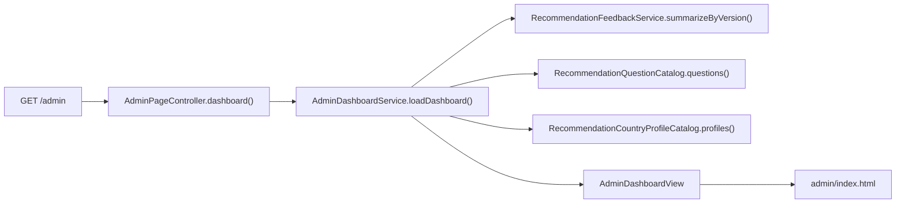
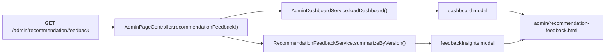

# [Spring Boot 포트폴리오] 20. public 운영 정보를 `/admin` read-only 화면으로 옮기기

## 이번 글의 핵심 질문

public 화면 문구를 제품 언어로 바꿨더라도, 내부 운영 화면이 여전히 `/recommendation/feedback-insights` 같은 public 경로에 남아 있으면 정보 구조는 완전히 분리됐다고 보기 어렵다.

이번 단계의 질문은 이것이다.

“추천 만족도 집계와 현재 운영 상태를 플레이어 화면에서 떼어내고, `/admin` read-only 화면으로 옮기려면 어디까지를 컨트롤러가 아니라 서비스가 맡아야 할까?”

이번에는 `/admin` 대시보드와 `/admin/recommendation/feedback`를 추가하고, 기존 public route는 admin 쪽으로 redirect하도록 바꿨다.

## 왜 이 단계가 필요한가

player 화면과 운영 화면은 보여 주는 데이터보다도 “어떤 언어와 목적”으로 보이느냐가 더 중요하다.

같은 만족도 집계 데이터라도:

- public에서는 불필요한 내부 정보다.
- admin에서는 다음 설문 버전을 고르기 위한 핵심 지표다.

즉, 추천 만족도 집계는 `RecommendationFeedbackService`가 그대로 계산하더라도, 그 결과를 보여 주는 라우트와 화면은 별도로 분리해야 한다.

## 이번 글에서 다룰 파일

- `/Users/alex/project/worldmap/src/main/java/com/worldmap/admin/application/AdminDashboardService.java`
- `/Users/alex/project/worldmap/src/main/java/com/worldmap/admin/application/AdminDashboardView.java`
- `/Users/alex/project/worldmap/src/main/java/com/worldmap/admin/web/AdminPageController.java`
- `/Users/alex/project/worldmap/src/main/java/com/worldmap/recommendation/web/RecommendationPageController.java`
- `/Users/alex/project/worldmap/src/main/resources/templates/fragments/admin-header.html`
- `/Users/alex/project/worldmap/src/main/resources/templates/admin/index.html`
- `/Users/alex/project/worldmap/src/main/resources/templates/admin/recommendation-feedback.html`
- `/Users/alex/project/worldmap/src/test/java/com/worldmap/admin/AdminPageIntegrationTest.java`
- `/Users/alex/project/worldmap/src/test/java/com/worldmap/recommendation/RecommendationFeedbackIntegrationTest.java`

## 설계에서 먼저 나눈 경계

이번 단계에서는 두 가지 경계를 분명하게 잡았다.

### 1. public route와 admin route를 분리한다

- public:
  - `/`
  - `/recommendation/survey`
  - `/recommendation/result`
- admin:
  - `/admin`
  - `/admin/recommendation/feedback`

기존 `/recommendation/feedback-insights`는 바로 지우지 않고 `/admin/recommendation/feedback`으로 redirect하게 했다.

이유는 두 가지다.

1. 기존 북마크나 테스트를 한 번에 깨지 않기 위해서
2. 지금 단계의 목표가 “보안 완료”가 아니라 “정보 구조 분리”이기 때문

### 2. 운영용 조합 로직은 컨트롤러에 두지 않는다

`/admin` 화면은 단순한 정적 페이지가 아니다.

한 화면에서 아래 정보를 같이 보여 준다.

- 현재 survey version
- 현재 engine version
- 설문 문항 수
- 추천 후보 국가 수
- 누적 만족도 응답 수
- 평균 만족도
- 운영 바로 가기

이 값을 컨트롤러에서 직접 조합하면 화면이 늘어날수록 책임이 퍼진다.

그래서 `AdminDashboardService`를 따로 두고, admin 화면에서 공통으로 필요한 운영 요약을 한 번에 만들게 했다.

## 클래스는 어떻게 나눴는가

### `AdminDashboardService`

이 서비스는 추천 도메인 안의 여러 값을 admin 화면용으로 다시 묶는다.

- `RecommendationFeedbackService.summarizeByVersion()`
- `RecommendationQuestionCatalog.questions().size()`
- `RecommendationCountryProfileCatalog.profiles().size()`
- `RecommendationSurveyService.SURVEY_VERSION`
- `RecommendationSurveyService.ENGINE_VERSION`

즉, 집계 계산 자체는 기존 서비스가 맡고, admin 화면에 필요한 운영 요약 조합만 이 서비스가 맡는다.

### `AdminPageController`

컨트롤러는 두 route만 연다.

- `GET /admin`
- `GET /admin/recommendation/feedback`

역할은 명확하다.

- 대시보드 화면 진입
- 추천 만족도 운영 화면 진입
- 모델에 view data 담기

점수 계산, 버전 비교, 집계 계산은 모두 서비스로 내려 보냈다.

### `RecommendationPageController`

기존 public controller에서는 만족도 집계 화면을 직접 렌더링하지 않는다.

대신 아래처럼 redirect만 한다.

- `GET /recommendation/feedback-insights`
  - `redirect:/admin/recommendation/feedback`

이렇게 하면 public과 admin의 역할 경계가 코드에도 바로 드러난다.

## 실제 요청 흐름

추천 만족도 운영 화면은 조금 더 단순하다.

## 왜 이 로직은 컨트롤러보다 서비스에 있어야 하는가

이번 단계에서 가장 중요한 질문은 “admin 화면은 view만 다르면 되는가?”가 아니다.

실제로는 운영 화면도 하나의 읽기 모델이다.

예를 들어 `/admin` 대시보드는 아래 값을 동시에 알아야 한다.

- 지금 공개 설문 버전
- 지금 공개 엔진 버전
- 현재 문항 수
- 현재 후보 국가 수
- 지금까지 쌓인 만족도 개수
- 평균 만족도

이건 템플릿에 값을 1개씩 꽂아 넣는 문제가 아니라, 여러 도메인 값을 “운영 요약”이라는 한 문맥으로 다시 묶는 문제다.

그래서 이 조합 책임은 컨트롤러보다 `AdminDashboardService`에 두는 편이 맞다.

## 테스트는 무엇을 확인했는가

### 1. `AdminPageIntegrationTest`

- `/admin`이 정상 렌더링되는지
- `admin/index` view가 맞는지
- `survey-v2`, `engine-v2`, `추천 운영 상태` 같은 운영 정보가 나오는지
- `/admin/recommendation/feedback`가 버전 조합 표를 렌더링하는지

### 2. `RecommendationFeedbackIntegrationTest`

- 기존 `/recommendation/feedback-insights` 요청이 더 이상 public view를 렌더링하지 않고
- `/admin/recommendation/feedback`으로 redirect되는지

즉, 이번 테스트는 “집계 계산”보다 “운영 정보가 public route에서 분리됐는가”를 보여 준다.

## 회고

이번 단계에서 중요한 건 보안이 아니라 정보 구조를 먼저 분리한 점이다.

아직은 `/admin`도 인증 없이 접근 가능하다.

하지만 지금 필요한 설명은 이것이다.

- player에게 보일 화면과
- 운영자가 볼 화면을
- 라우트, 컨트롤러, 템플릿 기준으로 먼저 나눴다

이 경계가 있어야 다음 8단계에서 인증과 권한을 붙일 때도 훨씬 자연스럽다.

## 면접에서는 이렇게 설명하면 된다

“추천 만족도 집계는 계속 서버 서비스가 계산하지만, 그 정보를 플레이어 화면에 직접 노출하지 않도록 `/admin` read-only 화면으로 분리했습니다. `/admin` 대시보드는 현재 survey/engine 버전과 피드백 현황을 한 번에 보여 주고, 추천 운영 화면은 버전 조합별 만족도 표를 별도 route로 분리했습니다. 컨트롤러는 진입만 맡고, 운영 요약 조합은 `AdminDashboardService`가 맡도록 경계를 분명히 잡았습니다.”

## 다음 글

다음 단계는 여기서 멈추지 않고, `persona baseline`, `build 상태`, `helper text 보정`까지 admin과 추천 품질 개선 루프를 더 연결하는 것이다.
