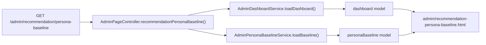
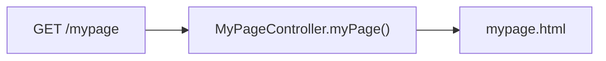

# [Spring Boot 포트폴리오] 21. 추천 baseline 운영 화면과 public 헤더를 정리하기

## 이번 글의 핵심 질문

추천 운영 화면을 `/admin`으로 옮겼더라도, 오프라인 페르소나 baseline은 여전히 문서와 테스트 안에만 남아 있었다.

그리고 public 헤더에는 게임별 직접 이동이 계속 남아 있어서, 홈 화면과 본문 CTA가 하는 역할이 조금 겹쳤다.

이번 단계의 질문은 이것이다.

“추천 품질 baseline도 admin에서 읽게 만들고, public 헤더는 더 단순한 이동 구조로 줄일 수 있을까?”

이번에는 `/admin/recommendation/persona-baseline`을 추가하고, public 헤더는 `Home / My Page`만 남기도록 정리했다.

## 왜 이 단계가 필요한가

운영 화면은 “만족도 집계”만 있다고 끝나지 않는다.

추천 기능을 실제로 개선하려면 아래 두 가지를 같이 봐야 한다.

1. 실사용자 만족도
2. 오프라인 페르소나 baseline

또 public 헤더도 너무 많은 직접 이동이 있으면 오히려 구조가 흐려진다.

지금은 홈 본문에 이미:

- 위치 미션 시작
- 인구수 퀴즈 시작
- 나라 추천 받기
- 랭킹 보기

CTA가 따로 있으므로, 상단 헤더까지 게임 모드 링크를 전부 둘 필요가 줄었다.

## 이번 글에서 다룰 파일

- `/Users/alex/project/worldmap/src/main/java/com/worldmap/admin/application/AdminPersonaBaselineService.java`
- `/Users/alex/project/worldmap/src/main/java/com/worldmap/admin/application/AdminPersonaBaselineView.java`
- `/Users/alex/project/worldmap/src/main/java/com/worldmap/admin/web/AdminPageController.java`
- `/Users/alex/project/worldmap/src/main/java/com/worldmap/web/MyPageController.java`
- `/Users/alex/project/worldmap/src/main/resources/templates/admin/recommendation-persona-baseline.html`
- `/Users/alex/project/worldmap/src/main/resources/templates/fragments/site-header.html`
- `/Users/alex/project/worldmap/src/main/resources/templates/home.html`
- `/Users/alex/project/worldmap/src/main/resources/templates/mypage.html`
- `/Users/alex/project/worldmap/src/test/java/com/worldmap/admin/AdminPageIntegrationTest.java`
- `/Users/alex/project/worldmap/src/test/java/com/worldmap/web/HomeControllerTest.java`
- `/Users/alex/project/worldmap/src/test/java/com/worldmap/web/MyPageControllerTest.java`

## 설계 구상

이번 단계는 두 갈래다.

### 1. admin baseline 화면

운영자가 바로 봐야 하는 정보는 전체 18개 시나리오 원문이 아니라 아래다.

- baseline 총 시나리오 수
- 현재 품질 하한 `15 / 18`
- weak scenario 3개
- active-signal 비교 시나리오 4개

그래서 이번에는 full fixture를 그대로 렌더링하지 않고, 운영용으로 압축한 `AdminPersonaBaselineService`를 따로 만들었다.

### 2. public 헤더 단순화

헤더는 모든 모드를 다 나열하는 대신 아래만 남겼다.

- `Home`
- `My Page`

게임 이동은 홈과 각 화면 본문 CTA로 맡긴다.

즉, 헤더는 “공통 이동”, 본문은 “행동 유도”로 역할을 분리한 것이다.

## 클래스 설계

### `AdminPersonaBaselineService`

이 서비스는 오프라인 평가 자산 전체를 다시 계산하지는 않는다.

대신 운영자가 지금 봐야 하는 baseline 요약만 뽑는다.

- 총 시나리오 수
- 현재 기준선
- weak scenario 목록
- active-signal scenario 목록

이걸 컨트롤러에 하드코딩하지 않고 서비스로 둔 이유는, baseline 화면이 커질수록 운영 읽기 모델도 하나의 도메인처럼 관리해야 하기 때문이다.

### `MyPageController`

`/mypage`는 아직 인증이 붙지 않았기 때문에 실제 사용자 데이터를 보여 주지 않는다.

이번 단계의 역할은 단 하나다.

- public 헤더에 둘 `My Page` 진입점 고정

즉, 지금은 placeholder shell이고, 실제 인증/전적은 8단계에서 붙인다.

## 실제 흐름

### admin baseline 화면

### My Page

## 왜 이 로직은 컨트롤러보다 서비스에 있어야 하는가

`/admin/recommendation/persona-baseline`은 단순 텍스트 페이지가 아니다.

한 화면에서:

- `15 / 18`
- weak scenario 3개
- active-signal 4개
- 각 시나리오의 기대 후보 / 현재 후보 / 개선 포인트

를 함께 보여 준다.

이건 단순 route mapping이 아니라 “운영 요약 모델”이므로 컨트롤러보다 `AdminPersonaBaselineService`가 맡는 편이 맞다.

반대로 `/mypage`는 아직 placeholder라 서비스가 필요 없다.

지금은 상태 변화가 없고, 단순히 SSR 화면을 여는 역할만 하므로 컨트롤러 하나로 충분하다.

## 홈 화면과 헤더에서 무엇을 바꿨는가

### 제거한 것

- 헤더의 `Location`
- 헤더의 `Population`
- 헤더의 `Recommend`
- 헤더의 `Ranking`
- 홈 hero 우측의 `오늘의 추천 플레이`

### 추가한 것

- 헤더의 `My Page`
- `/mypage` placeholder 화면

이렇게 바꾸면 상단은 훨씬 단순해지고, 실제 플레이 유도는 홈 본문 CTA가 맡게 된다.

## 테스트는 무엇을 확인했는가

### `AdminPageIntegrationTest`

- `/admin/recommendation/persona-baseline`이 정상 렌더링되는지
- `P04`, `P15`, `15 / 18` 같은 baseline 핵심 정보가 나오는지

### `HomeControllerTest`

- 홈 화면에서 `오늘의 추천 플레이`가 사라졌는지
- 헤더에 `My Page`가 보이는지
- `Location`, `Population` 같은 헤더 직접 이동이 사라졌는지

### `MyPageControllerTest`

- `/mypage`가 정상 렌더링되는지
- placeholder shell이 뜨는지

## 회고

이번 단계는 큰 기능을 추가한 것보다, 화면의 역할을 더 선명하게 만든 작업에 가깝다.

- admin은 운영 판단을 위한 화면
- public 헤더는 공통 이동
- 본문 CTA는 실제 플레이 유도

이렇게 나눠야 이후 인증과 전적 기능을 붙일 때도 구조가 덜 흔들린다.

## 면접에서는 이렇게 설명하면 된다

“추천 품질 개선을 위해서는 만족도 집계뿐 아니라 오프라인 baseline도 운영 화면에서 같이 봐야 해서 `/admin/recommendation/persona-baseline`을 추가했습니다. 반대로 public 헤더는 게임별 직접 이동을 줄이고 `Home / My Page`만 남겨 역할을 단순화했습니다. `My Page`는 아직 placeholder지만, 8단계 인증과 전적 기능이 들어올 진입점을 먼저 고정해 둔 상태입니다.”

## 다음 글

다음 단계는 이 baseline 화면을 바탕으로 실제 `budget / welfare / climate` helper text와 penalty를 조정하고, 만족도와 baseline을 같이 보며 추천 품질을 한 단계 더 끌어올리는 것이다.
