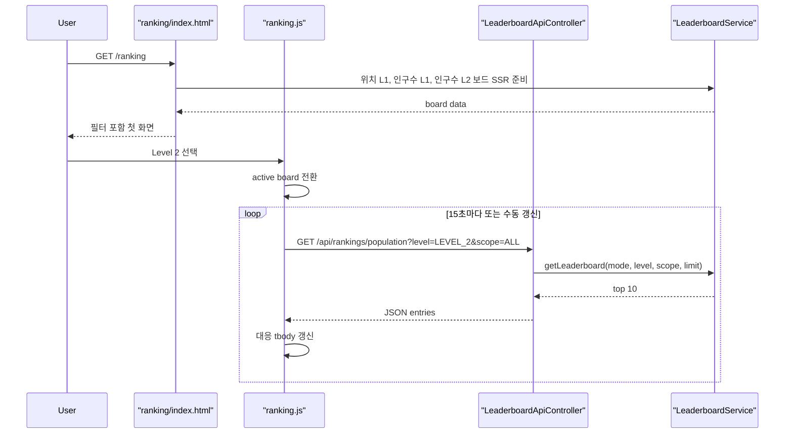

# 인구수 게임 Level 2 결과를 공개 랭킹에 노출하기

## 왜 이 작업이 필요했는가

이전 조각에서 인구수 게임 Level 2는 이미 동작했다.

- 시작 화면에서 `Level 1 / Level 2`를 고를 수 있고
- Level 2는 직접 수치를 입력해 오차율로 판정하며
- 결과는 `leaderboard_record.game_level=LEVEL_2`로 저장됐다

문제는 여기서 public 화면이 끊겼다는 점이다.

사용자는 Level 2를 플레이할 수 있었지만,
공개 `/ranking`에서는 여전히 Level 1 기록만 볼 수 있었다.

즉,
`저장은 level-aware 한데 조회 화면은 level-blind`한 상태였다.

이번 조각의 목표는 이 간극을 닫는 것이다.

## 이번 조각의 핵심 질문

`이미 gameLevel까지 저장되는 랭킹 구조에서,
public /ranking 화면만 Level 2를 설명 가능하게 확장하려면 무엇을 바꿔야 할까?`

답은 세 가지다.

1. 랭킹 조회 서비스가 `gameLevel`을 이해해야 한다.
2. 공개 `/ranking`이 인구수 게임에서 `Level 1 / Level 2`를 고를 수 있어야 한다.
3. 이 변화가 Redis key, DB fallback, SSR 초기 렌더링까지 모두 일관되게 이어져야 한다.

## 어떤 파일이 바뀌는가

- [LeaderboardGameLevel.java](/Users/alex/project/worldmap/src/main/java/com/worldmap/ranking/domain/LeaderboardGameLevel.java)
- [LeaderboardService.java](/Users/alex/project/worldmap/src/main/java/com/worldmap/ranking/application/LeaderboardService.java)
- [LeaderboardApiController.java](/Users/alex/project/worldmap/src/main/java/com/worldmap/ranking/web/LeaderboardApiController.java)
- [LeaderboardPageController.java](/Users/alex/project/worldmap/src/main/java/com/worldmap/ranking/web/LeaderboardPageController.java)
- [ranking/index.html](/Users/alex/project/worldmap/src/main/resources/templates/ranking/index.html)
- [ranking.js](/Users/alex/project/worldmap/src/main/resources/static/js/ranking.js)
- [LeaderboardIntegrationTest.java](/Users/alex/project/worldmap/src/test/java/com/worldmap/ranking/LeaderboardIntegrationTest.java)

## 무엇을 바꿨는가

### 1. 랭킹 조회 서비스가 level을 받도록 확장했다

기존 `LeaderboardService`는 public 조회에서 사실상 `LEVEL_1`을 하드코딩하고 있었다.

이번에는 아래처럼 바꿨다.

- `gameMode`
- `gameLevel`
- `scope`
- `limit`

를 함께 받아서 Redis key와 DB fallback 둘 다 같은 level 기준으로 조회한다.

즉,
`저장 때만 level-aware`한 구조에서
`조회도 level-aware`한 구조로 맞춘 것이다.

## 왜 이 로직이 컨트롤러가 아니라 서비스에 있어야 하는가

`LEVEL_2`를 어디서 볼 수 있게 할지 결정하는 것은 화면 문제처럼 보이지만,
실제 핵심은 조회 규칙이다.

서비스는 지금 아래를 같이 책임진다.

- Redis key 생성 규칙
- DB fallback 규칙
- `gameMode + gameLevel + scope` 조합별 top 10 계산
- 응답에 어떤 `gameLevel`을 내려줄지 결정

이건 HTTP 파라미터 해석보다
랭킹 read model 규칙에 가깝다.

그래서 컨트롤러는 request param을 받아 전달만 하고,
실제 조회 기준은 `LeaderboardService`가 맡는 편이 맞다.

## 2. 공개 `/ranking`에 Level 필터를 붙였다

이번 조각에서 public 화면은 이렇게 바뀌었다.

- 위치 찾기
  - 현재는 `Level 1`만 제공
- 인구수 맞추기
  - `Level 1`
  - `Level 2`

즉,
모든 게임에 Level 2를 다 붙인 것이 아니라
이미 준비된 인구수 게임에만 level filter를 연 것이다.

이게 중요한 이유는
범위를 불필요하게 키우지 않았기 때문이다.

위치 찾기 Level 2는 아직 없는데 화면만 미리 열어 두면 오히려 설명이 꼬인다.

## 3. ranking.js는 3축 상태를 관리하게 됐다

기존에는 랭킹 화면이 아래 두 축만 알면 됐다.

- 게임 종류
- 집계 범위

이번에는 여기에

- 게임 레벨

이 추가됐다.

그래서 현재 active board key는 아래처럼 잡는다.

- `location:LEVEL_1:ALL`
- `population:LEVEL_1:ALL`
- `population:LEVEL_2:ALL`
- ...

중요한 점은
`level` 필터가 생겼다고 해서
랭킹 계산이 프론트로 간 것은 아니라는 점이다.

프론트는 여전히
“어떤 보드를 보여줄지”
만 알고,
실제 정렬은 서버 API 결과를 그대로 쓴다.

## 요청 흐름은 어떻게 지나가는가

핵심은
SSR과 polling 모두 같은 `gameLevel` 기준을 쓴다는 점이다.

## Redis key는 어떻게 달라졌는가

기존에는 public 조회 key가 사실상 `l1` 고정이었다.

이번 조각 이후에는 level token까지 같이 들어간다.

예:

- `...:all:population:l1`
- `...:all:population:l2`

이렇게 해야 Level 1과 Level 2가 서로 덮어쓰지 않는다.

즉,
화면 필터 하나를 붙였지만
실제 중요한 것은
`조회 key space도 level별로 분리`한 것이다.

## 무엇을 테스트했는가

### 1. `LeaderboardIntegrationTest`

Level 2 세션을 실제로 시작하고,

- 1 Stage는 정확 입력으로 정답 처리
- 2 Stage는 3번 틀려 `GAME_OVER`
- `LEVEL_2` 랭킹 저장
- Redis key 삭제 후 DB fallback
- `/api/rankings/population?level=LEVEL_2`

까지 한 번에 확인했다.

즉,
`저장 -> fallback -> 조회`
가 Level 2에서도 이어지는지 통합 테스트로 고정했다.

### 2. `/ranking` SSR 확인

같은 테스트에서 아래도 같이 확인했다.

- `게임 레벨` 필터가 보이는가
- `Level 2` 문구가 SSR에 내려오는가
- `populationLevel2All` 모델이 존재하는가

즉,
JS 없이도 첫 화면이 이미 Level 2 보드를 설명할 수 있는지 확인했다.

## 이번 조각에서 일부러 하지 않은 것

이번에는 아래를 같이 하지 않았다.

- 위치 찾기 Level 2 랭킹
- 인구수 Level 2 전용 상세 설명 패널
- SSE / WebSocket

이유는 간단하다.

9단계를 너무 크게 열면
설명 가능성이 떨어지기 때문이다.

이번 조각은
`이미 저장되는 Level 2 데이터를 public에서 읽을 수 있게 한다`
에만 집중했다.

## 면접에서는 이렇게 설명하면 된다

인구수 게임 Level 2는 이미 `leaderboard_record`에 `LEVEL_2`로 저장되고 있었지만,
public `/ranking`은 여전히 Level 1만 보여 주고 있었습니다.
그래서 이번에는 랭킹 조회 서비스를 `gameMode + gameLevel + scope` 기준으로 확장하고,
public `/ranking`에 인구수 게임 Level 1 / Level 2 필터를 붙였습니다.
핵심은 화면만 바꾼 것이 아니라 Redis key와 DB fallback까지 같은 level 기준으로 맞춰서,
저장 구조와 조회 구조를 일관되게 만든 점입니다.
