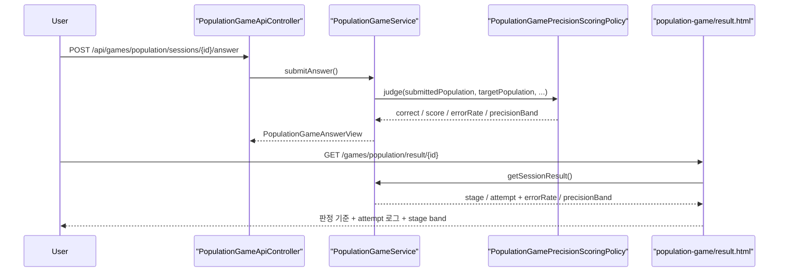

# 인구수 게임 Level 2 결과 화면에 오차율과 점수 band를 설명하기

## 왜 이 작업이 필요했는가

직전 조각까지 오면 인구수 게임 Level 2는 이미 동작한다.

- 직접 숫자를 입력할 수 있고
- 서버가 오차율을 계산하고
- 점수도 오차율 band에 따라 다르게 준다
- Level 2 결과는 공개 랭킹에도 반영된다

그런데 결과 화면만 보면 아직 한 가지가 부족했다.

`왜 내가 이 점수를 받았는지`
를 사용자가 바로 읽기 어려웠다.

즉,
계산은 정확하지만 설명력이 부족한 상태였다.

이번 조각은 그 간극을 메우는 작업이다.

## 이번 글의 핵심 질문

`이미 계산되는 Level 2 오차율과 점수 band를
결과 화면과 feedback에 어떻게 드러내야 사용자가 설명 가능해질까?`

## 어떤 파일이 바뀌는가

- [PopulationGamePrecisionBand.java](/Users/alex/project/worldmap/src/main/java/com/worldmap/game/population/application/PopulationGamePrecisionBand.java)
- [PopulationAnswerJudgement.java](/Users/alex/project/worldmap/src/main/java/com/worldmap/game/population/application/PopulationAnswerJudgement.java)
- [PopulationGamePrecisionScoringPolicy.java](/Users/alex/project/worldmap/src/main/java/com/worldmap/game/population/application/PopulationGamePrecisionScoringPolicy.java)
- [PopulationGameService.java](/Users/alex/project/worldmap/src/main/java/com/worldmap/game/population/application/PopulationGameService.java)
- [PopulationGameAnswerView.java](/Users/alex/project/worldmap/src/main/java/com/worldmap/game/population/application/PopulationGameAnswerView.java)
- [PopulationGameStageResultView.java](/Users/alex/project/worldmap/src/main/java/com/worldmap/game/population/application/PopulationGameStageResultView.java)
- [PopulationGameAttemptResultView.java](/Users/alex/project/worldmap/src/main/java/com/worldmap/game/population/application/PopulationGameAttemptResultView.java)
- [population-game/result.html](/Users/alex/project/worldmap/src/main/resources/templates/population-game/result.html)
- [population-game.js](/Users/alex/project/worldmap/src/main/resources/static/js/population-game.js)
- [PopulationGameFlowIntegrationTest.java](/Users/alex/project/worldmap/src/test/java/com/worldmap/game/population/PopulationGameFlowIntegrationTest.java)
- [PopulationGamePrecisionScoringPolicyTest.java](/Users/alex/project/worldmap/src/test/java/com/worldmap/game/population/application/PopulationGamePrecisionScoringPolicyTest.java)

## 무엇을 바꿨는가

### 1. precision band를 이름 있는 개념으로 올렸다

이번 조각 전에는 `errorRatePercent`만 있었다.

즉,
서버는 `5%`, `12%`, `20%` 기준을 알고 있었지만
그 결과를 사람이 읽기 좋은 이름으로 내리지는 않았다.

그래서 이번에는 `PopulationGamePrecisionBand`를 추가했다.

- `PRECISE_HIT`
- `CLOSE_HIT`
- `SAFE_HIT`
- `MISS`

각 band는

- 화면에 보여 줄 이름
- 기준 문구

를 같이 가진다.

## 왜 이 로직이 policy에 있어야 하는가

band는 화면 장식이 아니라
점수 계산 규칙의 일부다.

즉,

- 어떤 오차율이 정답인가
- 어떤 오차율이 최고 점수 band인가
- 어디서부터 오답인가

를 한 곳에서 관리해야 한다.

그래서 `PopulationGamePrecisionScoringPolicy`가

- `judge()`
- `resolveBand()`

를 같이 가진다.

컨트롤러나 템플릿이 threshold를 다시 계산하기 시작하면
화면과 서버 규칙이 어긋나기 쉽다.

## 2. answer view와 result view가 band를 함께 내려준다

이번 조각 이후

- `PopulationGameAnswerView`
- `PopulationGameStageResultView`
- `PopulationGameAttemptResultView`

는 Level 2일 때

- 오차율
- precision band

를 같이 가진다.

즉,
플레이 중 feedback과
최종 결과 페이지가
같은 기준을 공유한다.

## 요청 흐름은 어떻게 지나가는가

핵심은
오차율 기준을 템플릿이 새로 계산하지 않는다는 점이다.

## 3. 결과 화면에 판정 기준 패널을 추가했다

Level 2 결과 화면은 이제
상단에 `Level 2 판정 기준` 패널을 보여 준다.

- 오차율 5% 이하: 정밀 적중
- 오차율 12% 이하: 근접 적중
- 오차율 20% 이하: 허용 범위 정답
- 오차율 20% 초과: 오답

즉,
사용자는 결과 테이블을 읽기 전에
판정 규칙부터 볼 수 있다.

## 4. Attempt 로그도 설명형으로 바뀌었다

이전에는 Level 2도 사실상
“무슨 값을 넣었는가”만 볼 수 있었다.

이제는 각 attempt가 이렇게 보인다.

- 몇 차 시도였는가
- 내가 어떤 수치를 넣었는가
- 오차율이 몇 %였는가
- 어떤 band였는가
- 하트가 몇 개 남았는가

즉,
“틀렸습니다”가 아니라
`얼마나 비슷했는가`
를 읽을 수 있다.

## 무엇을 테스트했는가

### 1. policy 단위 테스트

[PopulationGamePrecisionScoringPolicyTest.java](/Users/alex/project/worldmap/src/test/java/com/worldmap/game/population/application/PopulationGamePrecisionScoringPolicyTest.java)

- 5% 이내면 `PRECISE_HIT`
- 20% 초과면 `MISS`

를 고정했다.

### 2. flow integration test

[PopulationGameFlowIntegrationTest.java](/Users/alex/project/worldmap/src/test/java/com/worldmap/game/population/PopulationGameFlowIntegrationTest.java)

확인한 것:

- exact answer 응답에 `precisionBand`가 들어가는가
- far wrong answer 응답에 `precisionBand=MISS`가 들어가는가
- 결과 페이지 HTML에 `Level 2 판정 기준`, `정밀 적중`, `오차율`, `허용 범위 정답`이 실제로 렌더링되는가

즉,
API와 SSR 둘 다 설명력이 생겼는지 확인했다.

## 이번 조각이 중요한 이유

이 작업은 기능을 새로 만든 것이 아니라
기능을 `설명 가능하게 만든 것`에 가깝다.

포트폴리오에서는 이런 단계가 중요하다.

왜냐하면 면접에서

> Level 2는 정확히 어떤 기준으로 맞았다고 판단하나요?

라는 질문이 나오면,
이제 결과 화면과 코드, 테스트가 모두 같은 언어로 답해 주기 때문이다.

## 면접에서는 이렇게 설명하면 된다

인구수 게임 Level 2는 오차율로 정답과 점수를 판정하지만,
이전에는 그 기준이 코드 안에만 있었습니다.
그래서 이번에는 `PopulationGamePrecisionBand`를 도입해
오차율 기준을 이름 있는 도메인 개념으로 올리고,
answer/result view에 같이 내려주도록 바꿨습니다.
그 결과 플레이 중 feedback과 결과 화면이
`정밀 적중 / 근접 적중 / 허용 범위 정답 / 오답`
기준을 같은 언어로 보여 줄 수 있게 됐습니다.
