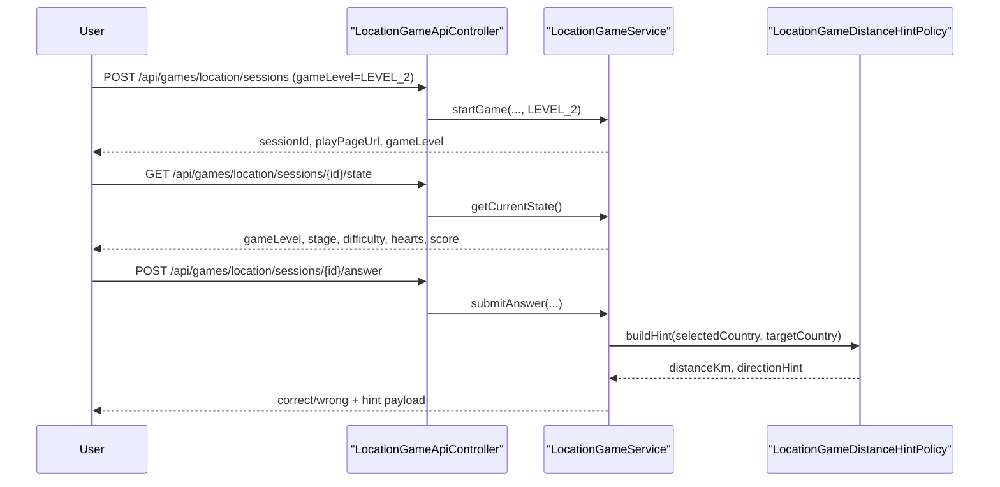

# 위치 찾기 Level 2를 거리 힌트 모드로 시작하기

직전 글에서는 위치 게임 Level 2를 어떻게 열지 설계 기준만 고정했다.

- 같은 `세션 / Stage / Attempt / 하트 / endless run` 구조를 유지한다
- 입력 방식은 다시 만들지 않는다
- 타이머보다 `오답 시 거리 + 방향 힌트`를 먼저 붙인다

이번 조각에서는 그 설계를 실제 코드로 옮겼다.

핵심 질문은 이것이었다.

`Level 1을 다시 만들지 않고, 어떤 작은 변경으로 Level 2를 실제 플레이 가능한 상태로 열 수 있을까?`

정답은
`session에 gameLevel을 저장하고, 오답 answer payload에 서버 힌트를 추가하는 것`
이었다.

## 이번 조각에서 만든 것

1. 시작 화면에서 `Level 1 / Level 2` 선택
2. `LocationGameSession.gameLevel` 저장
3. Level 2 전용 difficulty label 분리
4. 오답 시 서버가 `distanceKm + directionHint` 계산
5. 플레이 화면 feedback에 힌트 표시
6. 위치 게임 랭킹 레코드도 `LEVEL_1 / LEVEL_2`로 저장

즉, 이번 구현은
`새 게임 추가`가 아니라
`기존 게임 루프 위에 Level 2 규칙 하나를 얹는 작업`
이다.

## 왜 이 방향이 맞는가

위치 게임은 이미 구현 리스크가 컸다.

- 3D 지구본 렌더링
- 국가 선택 판정
- 하트 기반 재시도
- endless run
- 서버 주도 정답 판정

여기서 Level 2를 시작한다고 해서
타이머, 194개 전체 자산, 소국/영토, 연속 정답 bonus까지 한 번에 열면 설명 가능성이 급격히 떨어진다.

반면 이번 조각은

- 프론트 입력은 그대로 두고
- 서버가 세션 level을 저장하고
- 오답 때 힌트 payload만 추가

하는 방식이라 범위를 통제할 수 있다.

## 어떤 파일이 바뀌는가

핵심 변경 파일은 아래다.

- [LocationGameLevel.java](/Users/alex/project/worldmap/src/main/java/com/worldmap/game/location/domain/LocationGameLevel.java)
- [LocationGameSession.java](/Users/alex/project/worldmap/src/main/java/com/worldmap/game/location/domain/LocationGameSession.java)
- [LocationGameDistanceHintPolicy.java](/Users/alex/project/worldmap/src/main/java/com/worldmap/game/location/application/LocationGameDistanceHintPolicy.java)
- [LocationGameDifficultyPolicy.java](/Users/alex/project/worldmap/src/main/java/com/worldmap/game/location/application/LocationGameDifficultyPolicy.java)
- [LocationGameService.java](/Users/alex/project/worldmap/src/main/java/com/worldmap/game/location/application/LocationGameService.java)
- [LocationGameApiController.java](/Users/alex/project/worldmap/src/main/java/com/worldmap/game/location/web/LocationGameApiController.java)
- [LeaderboardService.java](/Users/alex/project/worldmap/src/main/java/com/worldmap/ranking/application/LeaderboardService.java)
- [start.html](/Users/alex/project/worldmap/src/main/resources/templates/location-game/start.html)
- [play.html](/Users/alex/project/worldmap/src/main/resources/templates/location-game/play.html)
- [location-game.js](/Users/alex/project/worldmap/src/main/resources/static/js/location-game.js)

## 요청 흐름

핵심은
힌트 계산도 프론트가 아니라 서버가 한다는 점이다.

## 왜 힌트 계산은 서비스/정책이어야 하는가

프론트도 거리와 방향을 계산할 수는 있다.

하지만 그렇게 하면 안 된다.

이유:

- 정답 국가 기준 좌표는 서버가 이미 가지고 있다
- 어떤 상황에서 힌트를 줄지 결정하는 것도 게임 규칙이다
- 나중에 `hint debt`로 감점하거나 결과 로그를 계산하려면
  힌트와 판정이 같은 쪽에 있어야 한다

그래서 이번 조각에서는
distance / direction 계산을 [LocationGameDistanceHintPolicy.java](/Users/alex/project/worldmap/src/main/java/com/worldmap/game/location/application/LocationGameDistanceHintPolicy.java) 로 분리했다.

## 세션과 랭킹은 어떻게 바뀌는가

이번 조각에서 가장 중요한 persistence 변화는 하나다.

- `location_game_session.game_level`

이제 위치 게임 세션은 `LEVEL_1 / LEVEL_2`를 저장한다.

그 결과:

- start response가 `gameLevel`을 같이 내려줄 수 있고
- state / answer / result view도 현재 level을 설명할 수 있고
- leaderboard record도 `LEVEL_1 / LEVEL_2`로 구분 저장할 수 있다

즉, 이번 조각은 단순 UI 모드 추가가 아니라
`도메인 상태 확장`
이다.

## Level 2 difficulty를 어떻게 열었는가

첫 조각에서는 “입력은 그대로, 출제 풀만 더 넓게”로 갔다.

- Level 1: 상위 72개 주요 국가
- Level 2: 더 넓은 후보 풀 + `Vector` difficulty label

이건 완전한 최종 난이도 설계가 아니다.
하지만 `Level 1과 완전히 같은 게임`처럼 보이지 않게 만들기에는 충분하다.

## 프론트는 무엇만 바뀌었는가

프론트는 서버 규칙을 새로 만들지 않는다.

이번에 한 일은:

- start 화면에 Level 선택 카드 추가
- play HUD에 `Level 1 / Level 2` 표시
- Level 2에서 오답이면 feedback 카드에
  `약 1,240km 북동쪽` 같은 힌트 문구 표시

즉,
프론트는 여전히 입력과 표현만 맡고,
정답/오답/힌트 계산은 서버가 맡는다.

## 테스트는 무엇을 고정했는가

### 1. hint policy 단위 테스트

[LocationGameDistanceHintPolicyTest.java](/Users/alex/project/worldmap/src/test/java/com/worldmap/game/location/application/LocationGameDistanceHintPolicyTest.java) 에서

- 아르헨티나 -> 브라질 기준
- 거리 값이 양수인지
- 방향이 `북동쪽`인지

를 확인했다.

### 2. Level 2 answer 통합 테스트

[LocationGameFlowIntegrationTest.java](/Users/alex/project/worldmap/src/test/java/com/worldmap/game/location/LocationGameFlowIntegrationTest.java) 에서

- `LEVEL_2`로 세션 시작
- state에 `gameLevel=LEVEL_2`
- wrong answer 응답에 `distanceKm`
- wrong answer 응답에 `directionHint`

를 고정했다.

## 이번 조각으로 설명할 수 있는 것

이제 면접에서는 이렇게 짧게 설명할 수 있다.

> 위치 게임 Level 2는 새 게임을 다시 만든 게 아니라, 기존 세션/Stage/Attempt 구조 위에 `gameLevel`과 힌트 정책만 추가한 첫 확장입니다. 사용자는 여전히 지구본에서 나라를 클릭하지만, 오답일 때는 서버가 거리와 방향을 계산해 다시 추적할 힌트를 내려줍니다. 그래서 프론트 입력 리스크를 늘리지 않으면서도 Level 1과 분명히 다른 규칙을 만들 수 있었습니다.

## 다음 단계

이제 남은 선택지는 세 가지다.

1. Level 2 결과 화면에 attempt별 거리/방향 힌트를 다시 계산해 보여 주기
2. 위치 게임 Level 2 run을 공개 `/ranking`까지 분리 노출하기
3. 힌트를 본 Stage에는 `hint debt`를 점수에 반영하기

다음 작은 조각으로는 `결과 화면 read model에 힌트 로그 붙이기`가 가장 안전하다.
