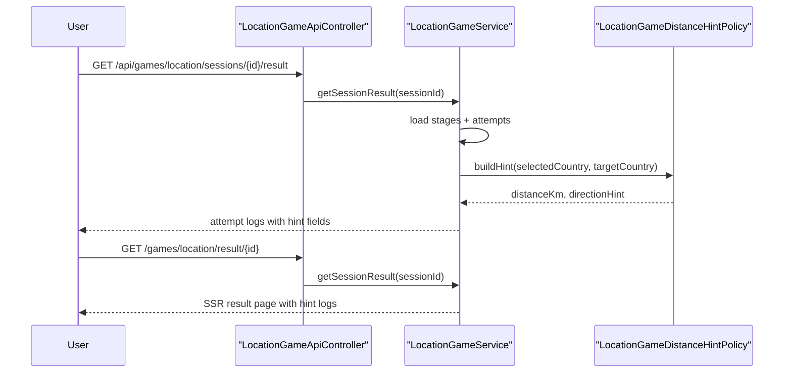

# 위치 찾기 Level 2 결과 화면에 거리/방향 힌트 로그 남기기

직전 글에서는 위치 찾기 Level 2를 시작하면서

- `LocationGameSession.gameLevel` 저장
- 오답 answer payload에 `distanceKm + directionHint` 추가
- play 화면 feedback에 서버 힌트 표시

까지 만들었다.

하지만 이 상태만으로는 하나가 부족했다.

사용자가 플레이 중 힌트 overlay를 놓치면,
결과 화면에서는 **어느 시도에서 얼마나 빗나갔는지**를 다시 설명할 수 없었다.

이번 조각은 그 빈틈을 메운 작업이다.

핵심 질문은 이것이었다.

`힌트를 DB에 새 컬럼으로 저장하지 않고도, 결과 화면에서 다시 설명할 수 있을까?`

정답은
`결과 read model이 같은 policy를 재사용해 힌트를 다시 계산하는 것`
이었다.

## 이번 조각에서 만든 것

1. `LocationGameAttemptResultView`에 `distanceKm`, `directionHint` 추가
2. `LocationGameService.getSessionResult()`가 attempt 로그를 만들 때 Level 2 오답만 다시 계산
3. 결과 API `/api/games/location/sessions/{id}/result`가 attempt별 힌트 로그 제공
4. 결과 SSR 화면 `/games/location/result/{id}`에 `거리 힌트 약 1240km 북동쪽` 같은 로그 표시

즉, 이번 구현은
`write model 확장`이 아니라
`read model 설명력 보강`
이다.

## 왜 이 조각이 필요한가

Level 2의 차별점은 단순히 오답을 알려 주는 것이 아니라

- 얼마나 멀리 빗나갔는지
- 어느 방향으로 틀렸는지

를 서버가 설명해 준다는 점이다.

그런데 이 정보가 answer payload에만 있으면,

- 사용자가 overlay를 못 봤을 때
- 나중에 결과 화면을 다시 볼 때
- 면접에서 “결과 페이지에서 어떤 데이터를 다시 보여 주는가”를 설명할 때

흐름이 끊긴다.

그래서 이번에는 결과 조회 흐름에서도
같은 policy를 재사용하도록 바꿨다.

## 어떤 파일이 바뀌는가

- [LocationGameAttemptResultView.java](/Users/alex/project/worldmap/src/main/java/com/worldmap/game/location/application/LocationGameAttemptResultView.java)
- [LocationGameService.java](/Users/alex/project/worldmap/src/main/java/com/worldmap/game/location/application/LocationGameService.java)
- [result.html](/Users/alex/project/worldmap/src/main/resources/templates/location-game/result.html)
- [LocationGameFlowIntegrationTest.java](/Users/alex/project/worldmap/src/test/java/com/worldmap/game/location/LocationGameFlowIntegrationTest.java)

## 요청 흐름

핵심은
플레이 중 answer 흐름과
결과 조회 흐름이
같은 hint policy를 공유한다는 점이다.

## 왜 템플릿이 아니라 서비스가 다시 계산해야 하는가

결과 화면 템플릿이 직접 계산하면 안 된다.

이유:

- 대상 국가는 `stage.countryId` 기준이다
- 사용자가 고른 국가는 `attempt.selectedCountryIso3Code` 기준이다
- 어떤 시도에만 힌트를 붙일지 (`LEVEL_2` + `오답`) 규칙이 필요하다
- JSON result API와 SSR result 화면이 같은 값을 봐야 한다

즉,
이건 단순 문자열 조합이 아니라
**도메인 read model 규칙**이다.

그래서 [LocationGameService.java](/Users/alex/project/worldmap/src/main/java/com/worldmap/game/location/application/LocationGameService.java) 가

1. country lookup map을 만들고
2. attempt마다 `toAttemptResultView(...)`를 만들고
3. 그 안에서 [LocationGameDistanceHintPolicy.java](/Users/alex/project/worldmap/src/main/java/com/worldmap/game/location/application/LocationGameDistanceHintPolicy.java) 를 다시 호출

하도록 두었다.

## 저장 구조를 왜 안 늘렸는가

이번 조각에서는 DB 컬럼을 늘리지 않았다.

이유는 이미 필요한 정보가 있기 때문이다.

- 정답 국가: `LocationGameStage.countryId`
- 사용자가 고른 국가: `LocationGameAttempt.selectedCountryIso3Code`

이 둘만 있으면 결과 조회 시점에
거리와 방향을 다시 계산할 수 있다.

즉,
이번 문제는 persistence 부족이 아니라
read model 부족이었다.

그래서 새 컬럼 없이 해결하는 편이 더 단순하고 설명 가능하다.

## 결과 화면은 어떻게 바뀌는가

이전:

- `1차: 일본 / Wrong / 하트 2`

이후:

- `1차: 일본 / Wrong / 하트 2 / 거리 힌트 약 1240km 북동쪽`

정답 시도나 Level 1 시도에는
이 힌트가 붙지 않는다.

즉,
결과 로그만 봐도
사용자가 어떤 추적 과정을 거쳤는지 다시 읽을 수 있다.

## 테스트는 무엇을 고정했는가

이번에는 통합 테스트 한 개가 핵심이다.

[LocationGameFlowIntegrationTest.java](/Users/alex/project/worldmap/src/test/java/com/worldmap/game/location/LocationGameFlowIntegrationTest.java)

여기서

1. `LEVEL_2` 세션 시작
2. 첫 Stage에서 일부러 오답 제출
3. `/api/games/location/sessions/{id}/result` JSON에
   - `distanceKm`
   - `directionHint`
   가 들어가는지 확인
4. `/games/location/result/{id}` HTML에
   - `거리 힌트`
   문구가 실제 렌더링되는지 확인

즉,
API와 SSR이 같은 read model을 쓰고 있다는 점을 같이 고정했다.

## 이번 조각으로 설명할 수 있는 것

이제 면접에서는 이렇게 설명할 수 있다.

> 위치 게임 Level 2는 오답 시 거리와 방향 힌트를 줍니다. 이전에는 이 값이 answer payload에만 있어서 결과 화면만 보면 힌트가 사라졌는데, 이번에는 결과 read model이 stage의 정답 국가와 attempt의 선택 국가를 다시 비교해서 힌트를 재계산하도록 바꿨습니다. 그래서 DB 컬럼을 늘리지 않고도 결과 API와 SSR 화면 모두에서 같은 추적 로그를 보여 줄 수 있게 됐습니다.

## 다음 단계

이제 다음 선택지는 세 가지다.

1. 위치 게임 Level 2 run을 공개 `/ranking`까지 분리 노출하기
2. 힌트를 본 Stage에는 `hint debt`를 점수에 반영하기
3. `/mypage`나 `/stats`에 Level 2 하이라이트를 일부 노출하기

가장 작은 다음 조각은
`공개 랭킹에서 위치 찾기 Level 2 보드 열기`
다.
