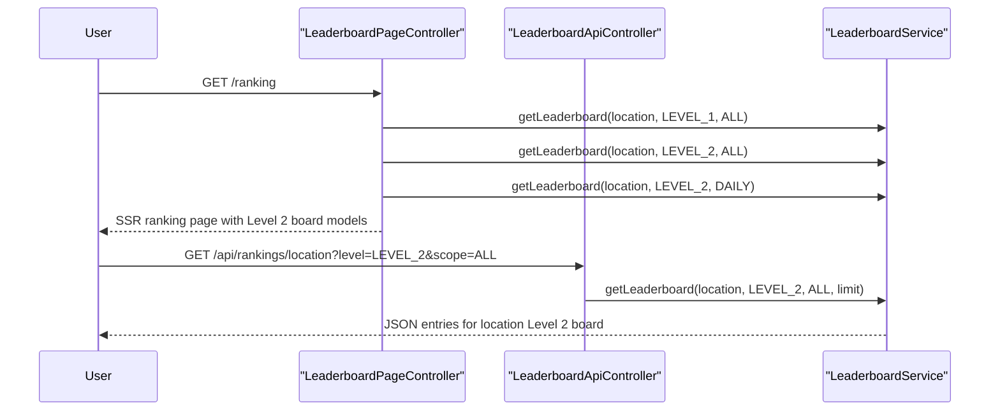

# 위치 찾기 Level 2를 공개 랭킹에 노출하기

직전 글에서는 위치 찾기 Level 2 결과 화면이
attempt별 거리/방향 힌트 로그를 다시 보여 주도록 read model을 보강했다.

하지만 아직 하나가 비어 있었다.

`Level 2 run은 저장되는데, public /ranking에서는 안 보이는 상태`
였다.

이번 조각의 목표는 단순하다.

`위치 게임 Level 2 기록도 public 랭킹에서 Level 1과 나란히 보이게 만들기`

즉, 이번 작업은
새 점수 규칙을 만드는 조각이 아니라
이미 저장되는 Level 2 run을 public read model까지 연결하는 조각이다.

## 왜 이 조각이 필요한가

위치 게임 Level 2는 이미 아래를 갖고 있었다.

- `LocationGameSession.gameLevel`
- `leaderboard_record.game_level`
- Level 2 오답 힌트
- 결과 화면 attempt 로그

그런데 `/ranking`에서는 여전히
위치 게임은 `Level 1`만 보여 줬다.

이 상태는 설명상 어색하다.

- 저장은 되고
- 결과 화면도 있고
- 운영 화면도 이해할 수 있는데
- public 랭킹만 Level 1에 멈춰 있음

그래서 이번에는
**write model과 public read model의 간극**
을 닫았다.

## 어떤 파일이 바뀌는가

- [LeaderboardPageController.java](/Users/alex/project/worldmap/src/main/java/com/worldmap/ranking/web/LeaderboardPageController.java)
- [index.html](/Users/alex/project/worldmap/src/main/resources/templates/ranking/index.html)
- [ranking.js](/Users/alex/project/worldmap/src/main/resources/static/js/ranking.js)
- [LeaderboardIntegrationTest.java](/Users/alex/project/worldmap/src/test/java/com/worldmap/ranking/LeaderboardIntegrationTest.java)

## 요청 흐름



핵심은
SSR 첫 로드와
폴링 API 갱신이
같은 `gameMode + gameLevel + scope` 규칙을 공유한다는 점이다.

## 왜 서비스 기준은 그대로 두고 표면만 확장했는가

좋은 점은 이미 기반이 있었다는 것이다.

[LeaderboardService.java](/Users/alex/project/worldmap/src/main/java/com/worldmap/ranking/application/LeaderboardService.java)
는 이전부터

- `gameMode`
- `gameLevel`
- `scope`

를 기준으로 Redis key와 DB fallback을 읽을 수 있었다.

즉 이번 조각의 병목은
저장 구조나 조회 로직이 아니라
**public 화면이 그 구조를 아직 사용하지 않는 것**
이었다.

그래서 이번에는

- page controller에 `locationLevel2All`, `locationLevel2Daily` 추가
- ranking 템플릿에 위치 게임 Level 2 board 두 개 추가
- ranking.js에서 위치 게임 `LEVEL_2` 버튼 비활성화 제거

만으로 public surface를 열었다.

## 템플릿은 무엇이 달라졌는가

이전:

- 위치 찾기: Level 1만
- 인구수 맞추기: Level 1 / Level 2

이후:

- 위치 찾기: Level 1 / Level 2
- 인구수 맞추기: Level 1 / Level 2

그리고 위치 게임 Level 2 보드 copy는

- `거리/방향 힌트형 Level 2 전체 누적 랭킹`
- `Level 2 기준 오늘 위치 찾기 랭킹`

처럼 현재 규칙을 바로 읽을 수 있게 맞췄다.

## JS는 무엇이 바뀌는가

[ranking.js](/Users/alex/project/worldmap/src/main/resources/static/js/ranking.js)
에서는 원래 위치 게임 `LEVEL_2` 버튼을 막는 분기가 있었다.

```js
if (activeMode === "location" && nextLevel === "LEVEL_2") {
    return;
}
```

이번에는 이 제한을 제거했다.

그리고 hint 문구도

- 이전: `위치 찾기 랭킹은 현재 Level 1만 제공합니다`
- 이후: `위치 찾기는 Level 1 기본 모드와 Level 2 거리 힌트 모드 기록을 각각 볼 수 있습니다`

로 바꿨다.

즉, JS가 새 비즈니스 규칙을 만든 것은 아니고
기존 서비스를 public filter가 제대로 따라가게 정리한 것이다.

## 테스트는 무엇을 고정했는가

핵심은 [LeaderboardIntegrationTest.java](/Users/alex/project/worldmap/src/test/java/com/worldmap/ranking/LeaderboardIntegrationTest.java)다.

이번에는 새 테스트 하나를 추가했다.

`locationLevelTwoLeaderboardAppearsOnPublicRanking()`

이 테스트에서

1. `LEVEL_2` 위치 세션 시작
2. 일부러 3번 오답으로 game over
3. `/api/rankings/location?level=LEVEL_2` 응답 확인
4. `/ranking` SSR 모델에
   - `locationLevel2All`
   - `locationLevel2Daily`
   가 있는지 확인
5. Redis key `location:l2`도 실제로 채워졌는지 확인

즉,
저장, API, SSR, Redis key가
한꺼번에 맞물리는지 봤다.

## 이번 조각으로 설명할 수 있는 것

이제 면접에서는 이렇게 설명할 수 있다.

> 위치 게임 Level 2는 이미 저장과 결과 화면까지 구현돼 있었지만, public 랭킹은 Level 1만 보여 주고 있었습니다. 그래서 이번에는 `/ranking`과 polling API를 `location + LEVEL_2`까지 이해하도록 확장해, 거리/방향 힌트형 run을 별도 보드로 조회할 수 있게 만들었습니다. 핵심은 화면만 늘린 것이 아니라 `gameMode + gameLevel + scope` 기준 read model을 SSR과 polling에 일관되게 적용한 점입니다.

## 다음 단계

이제 위치 게임 Level 2에서 남은 작은 조각은 크게 두 가지다.

1. `hint debt`를 실제 점수 감점으로 반영하기
2. `/mypage`나 `/stats`에 Level 2 하이라이트를 일부 끌어올리기

다음으로는
`힌트를 본 Stage에는 점수를 얼마나 깎을 것인가`
를 다루는 조각이 가장 자연스럽다.
