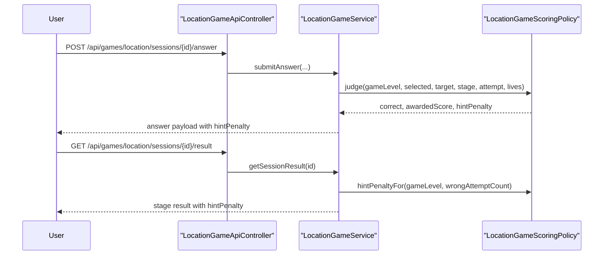

# 위치 찾기 Level 2 힌트를 점수 감점으로 연결하기

직전 글까지의 위치 찾기 Level 2는 이미 꽤 많이 닫혀 있었다.

- 세션이 `LEVEL_1 / LEVEL_2`를 저장하고
- 오답이면 서버가 `distanceKm + directionHint`를 내려주고
- 결과 화면에도 attempt별 힌트 로그가 남고
- public `/ranking`에서도 Level 2 run을 볼 수 있었다

그런데도 한 가지가 비어 있었다.

`힌트를 봐도 최종 점수는 Level 1과 거의 같은 방식으로 계산된다`
는 점이다.

이번 조각의 목표는 이것이다.

`Level 2의 힌트를 실제 점수 trade-off로 연결해, Level 1과 다른 규칙으로 설명 가능하게 만들기`

## 이번 조각에서 만든 것

1. `LocationGameScoringPolicy`가 Level 2 힌트 감점 계산
2. 정답 전까지 본 힌트 수만큼 `hintPenalty` 적용
3. answer payload에 `hintPenalty` 포함
4. 결과 화면 stage 점수 영역에도 `힌트 감점 -15` 표시

즉,
이번 조각은
`힌트를 보여 준다`
에서
`힌트는 도움이 되지만 점수는 깎인다`
로 규칙을 한 단계 닫은 작업이다.

## 왜 이 조각이 필요한가

Level 2의 차별점은 거리/방향 힌트다.

그런데 힌트를 봐도 최종 점수가 똑같다면,
사용자 입장에서는

- 그냥 더 친절한 Level 1
- 오답하면 다시 한 번 알려 주는 모드

정도로 느껴질 수 있다.

그래서 이번에는 힌트 사용을
실제 score trade-off로 연결했다.

규칙은 단순하다.

- Level 1: 힌트 없음, 감점 없음
- Level 2:
  - 첫 시도 정답: 감점 없음
  - 한 번 틀리고 정답: `-15`
  - 두 번 틀리고 정답: `-30`

이렇게 하면
Level 2를 “힌트가 있지만 공짜는 아닌 모드”로 설명할 수 있다.

## 어떤 파일이 바뀌는가

- [LocationAnswerJudgement.java](/Users/alex/project/worldmap/src/main/java/com/worldmap/game/location/application/LocationAnswerJudgement.java)
- [LocationGameScoringPolicy.java](/Users/alex/project/worldmap/src/main/java/com/worldmap/game/location/application/LocationGameScoringPolicy.java)
- [LocationGameAnswerView.java](/Users/alex/project/worldmap/src/main/java/com/worldmap/game/location/application/LocationGameAnswerView.java)
- [LocationGameStageResultView.java](/Users/alex/project/worldmap/src/main/java/com/worldmap/game/location/application/LocationGameStageResultView.java)
- [LocationGameService.java](/Users/alex/project/worldmap/src/main/java/com/worldmap/game/location/application/LocationGameService.java)
- [location-game.js](/Users/alex/project/worldmap/src/main/resources/static/js/location-game.js)
- [result.html](/Users/alex/project/worldmap/src/main/resources/templates/location-game/result.html)

## 요청 흐름

핵심은
play 중 answer와
끝난 뒤 result가
같은 scoring policy를 공유한다는 점이다.

## 왜 감점 계산은 서비스가 아니라 scoring policy여야 하는가

감점은 화면 효과가 아니라
점수 규칙 자체다.

그래서

- JS에서 점수를 빼면 안 되고
- 템플릿에서 `attemptCount - 1`로 대충 계산해도 안 된다

이유는 단순하다.

- answer payload와 result read model이 같은 규칙을 봐야 한다
- 이후 `distanceKm` 기반 가변 감점 같은 변화가 생겨도 한 곳에서 바꿔야 한다
- Level 1 / Level 2 차이를 정책 단위로 설명할 수 있어야 한다

그래서 이번에는
[LocationGameScoringPolicy.java](/Users/alex/project/worldmap/src/main/java/com/worldmap/game/location/application/LocationGameScoringPolicy.java)
가

- `judge(...)`
- `hintPenaltyFor(...)`

를 같이 맡도록 만들었다.

## 감점 규칙은 어떻게 계산하는가

이번 버전 규칙은 아주 작고 설명 가능해야 했다.

그래서

`hintPenalty = (attemptNumber - 1) * 15`

를 썼다.

단,

- `LEVEL_2`일 때만 적용
- 정답일 때만 적용
- Level 1은 항상 0

이다.

예:

- Stage 1, 첫 시도 정답
  - base 100 + life 30 + attempt bonus 30 = 160
  - hintPenalty 0
  - 최종 160

- Stage 1, 한 번 틀리고 두 번째 시도 정답
  - base 100 + life 20 + attempt bonus 10 = 130
  - hintPenalty 15
  - 최종 115

즉,
오답으로 하트를 잃는 것과
힌트를 본 대가를
별도로 같이 설명할 수 있다.

## 결과 화면은 무엇이 달라지는가

이전:

- 점수 컬럼에 `115`

이후:

- 점수 컬럼에 `115`
- 그 아래 `힌트 감점 -15`

즉,
결과 화면만 봐도
“왜 Level 2 점수가 생각보다 낮은가”를 바로 다시 설명할 수 있다.

play 중 feedback도 마찬가지로

- `획득 점수: 115`
- `힌트 감점: -15`

를 같이 보여 준다.

## 테스트는 무엇을 고정했는가

### 1. scoring policy 단위 테스트

[LocationGameScoringPolicyTest.java](/Users/alex/project/worldmap/src/test/java/com/worldmap/game/location/application/LocationGameScoringPolicyTest.java)

여기서

- Level 1 정답은 `hintPenalty = 0`
- Level 2 두 번째 시도 정답은 `hintPenalty = 15`, `awardedScore = 115`

를 고정했다.

### 2. flow 통합 테스트

[LocationGameFlowIntegrationTest.java](/Users/alex/project/worldmap/src/test/java/com/worldmap/game/location/LocationGameFlowIntegrationTest.java)

여기서

1. Level 2 세션 시작
2. 일부러 한 번 오답
3. 같은 Stage에서 두 번째 시도에 정답
4. answer payload에서
   - `hintPenalty = 15`
   - `awardedScore = 115`
5. result JSON에서
   - `stages[0].hintPenalty = 15`
6. 결과 HTML에서
   - `힌트 감점 -15`

까지 같이 확인했다.

즉,
정책, API, 결과 화면이 모두 같은 규칙을 읽는다는 점을 검증했다.

## 이번 조각으로 설명할 수 있는 것

이제 면접에서는 이렇게 설명할 수 있다.

> 위치 게임 Level 2는 오답 시 거리와 방향 힌트를 주지만, 힌트가 공짜면 Level 1과 점수 구조가 너무 비슷해집니다. 그래서 이번에는 정답 전까지 본 힌트 수만큼 점수를 감점하는 `hint debt`를 `LocationGameScoringPolicy`에 넣고, answer response와 결과 화면이 그 감점을 같이 보여 주도록 바꿨습니다. 그 결과 Level 2를 ‘힌트가 있지만 점수 trade-off가 있는 모드’로 설명할 수 있게 됐습니다.

## 다음 단계

이제 위치 게임 Level 2에서 남은 작은 조각은 이런 것들이다.

1. `/mypage`나 `/stats`에 Level 2 하이라이트 노출
2. `distanceKm` 규모나 difficulty에 따라 가변 감점 실험
3. `타이머`, `소국/영토`, `streak` 중 다음 규칙 하나 열기

가장 작은 다음 조각은
`/mypage` 또는 `/stats`에서 Level 2 기록을 더 잘 드러내는 것`
이다.
