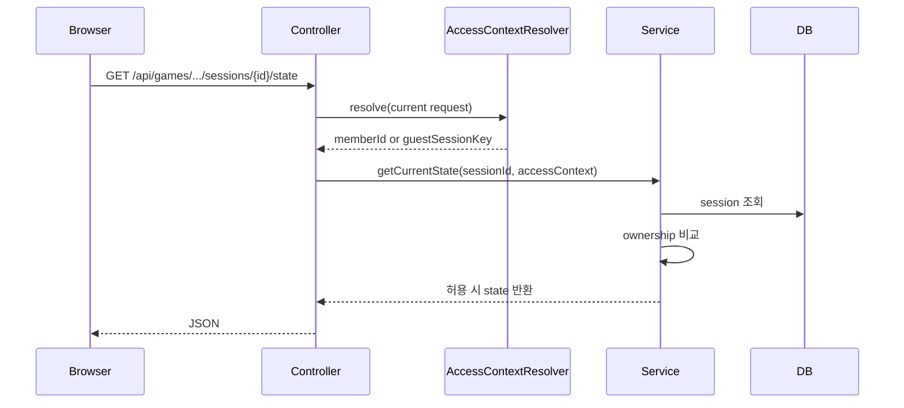

# 현재 브라우저에만 게임 세션을 열고 결과는 종료 후에만 노출하기

## 왜 이 글을 쓰는가

이번 조각에서 드러난 문제는 두 가지였다.

1. `sessionId`만 알면 다른 브라우저에서도 게임 세션을 읽고 답안을 보낼 수 있었다.
2. 게임이 아직 진행 중이어도 `/result`로 정답과 시도 기록을 먼저 볼 수 있었다.

둘 다 “서버 주도 게임 플랫폼”이라는 현재 프로젝트 방향과 맞지 않는다.

서버가 정답 판정과 게임 상태를 책임진다면,
결과 노출 시점과 세션 접근 권한도 서버가 같이 막아야 한다.

## 이번 단계의 목표

- 현재 브라우저가 소유한 세션만 읽게 만든다.
- 진행 중인 세션에는 결과 리소스를 열어 주지 않는다.
- 단순 세션 로그인 구조는 유지하되, 로그인/회원가입 성공 시 session fixation 위험을 줄인다.

## 바뀐 파일

- `src/main/java/com/worldmap/game/common/application/GameSessionAccessContext.java`
- `src/main/java/com/worldmap/auth/application/GameSessionAccessContextResolver.java`
- `src/main/java/com/worldmap/common/exception/SessionAccessDeniedException.java`
- `src/main/java/com/worldmap/common/exception/GlobalApiExceptionHandler.java`
- `src/main/java/com/worldmap/auth/application/MemberSessionManager.java`
- `src/main/java/com/worldmap/auth/web/AuthPageController.java`
- `src/main/java/com/worldmap/game/location/application/LocationGameService.java`
- `src/main/java/com/worldmap/game/capital/application/CapitalGameService.java`
- `src/main/java/com/worldmap/game/population/application/PopulationGameService.java`
- `src/main/java/com/worldmap/game/flag/application/FlagGameService.java`
- `src/main/java/com/worldmap/game/populationbattle/application/PopulationBattleGameService.java`
- 각 게임의 `*ApiController`, `*PageController`
- `src/test/java/com/worldmap/game/common/application/GameSessionAccessContextTest.java`
- `src/test/java/com/worldmap/auth/application/MemberSessionManagerTest.java`
- `src/test/java/com/worldmap/auth/application/GameSessionAccessContextResolverTest.java`
- 각 게임 flow integration test와 `AuthFlowIntegrationTest`

## 설계 핵심 1. 세션 ID는 권한이 아니다

기존에는 서비스가 그냥 `sessionId`로 세션을 조회했다.

즉, 이런 흐름이었다.

```text
GET /api/games/location/sessions/{sessionId}/state
-> service.findById(sessionId)
-> 상태 반환
```

이 구조에서는 UUID가 충분히 길더라도,
한 번 노출된 `sessionId`를 다른 브라우저가 재사용하는 순간 방어 수단이 없다.

그래서 이번에는 `GameSessionAccessContext`를 추가했다.

이 값은 두 가지 중 하나만 가진다.

- 로그인 사용자면 `memberId`
- 게스트면 현재 브라우저의 `guestSessionKey`

그리고 실제 세션 엔티티의 ownership 필드와 비교한다.

```java
accessContext.assertCanAccess(session);
```

이 검사는 컨트롤러의 if문이 아니라 서비스 진입에서 다시 수행한다.

이유는 간단하다.

- 컨트롤러는 현재 요청에서 access context를 해석한다.
- 서비스는 “이 세션을 현재 요청이 읽을 수 있는가”라는 도메인 경계를 책임진다.

즉, 웹과 도메인의 책임을 반으로 나눈 것이다.

## 설계 핵심 2. 결과는 종료 후에만 존재하는 리소스다

기존에는 `getSessionResult()`가 `IN_PROGRESS` 상태도 그대로 반환했다.

그래서 플레이어가 중간에 `/result`를 호출하면
현재까지의 stage와 정답 정보를 먼저 볼 수 있었다.

이번에는 결과를 “언제든 볼 수 있는 상태 스냅샷”이 아니라
“종료된 run의 요약 리소스”로 다시 정의했다.

즉,

- `state`는 진행 중 세션용
- `result`는 `GAME_OVER` 또는 `FINISHED`용

으로 분리한다.

서비스에서는 이렇게 막는다.

```java
if (session.getStatus() == GameSessionStatus.READY || session.getStatus() == GameSessionStatus.IN_PROGRESS) {
    throw new ResourceNotFoundException("게임 결과를 찾을 수 없습니다: " + session.getId());
}
```

여기서 `404`를 택한 이유는,
결과 리소스가 아직 만들어지지 않았다고 설명할 수 있기 때문이다.

## 설계 핵심 3. 단순 세션 로그인도 세션 ID 회전은 해야 한다

이 프로젝트는 아직 Spring Security 전체를 붙이지 않았다.

그래도 로그인/회원가입 성공 순간 기존 세션 ID를 그대로 쓰면
session fixation 위험이 남는다.

그래서 `MemberSessionManager.signIn()`에서 `changeSessionId()`를 먼저 호출하도록 바꿨다.

이 방법의 장점은 단순하다.

- 기존 세션 기반 구조를 버리지 않는다.
- 세션 attribute 모델도 유지한다.
- 그래도 인증 성공 직후 세션 식별자는 바뀐다.

## 요청 흐름



결과 페이지도 같은 구조다.

단, `result`는 ownership 검사 뒤에 terminal 상태인지 한 번 더 본다.

## 테스트

이번 조각에서 바로 실행한 테스트는 다음이다.

- `GameSessionAccessContextTest`
- `MemberSessionManagerTest`
- `GameSessionAccessContextResolverTest`
- `compileJava`, `compileTestJava` 강제 재컴파일

로컬에서는 위 테스트가 통과했다.

추가로 각 게임 flow integration test와 `AuthFlowIntegrationTest`도 같이 수정했지만,
현재 `test` profile이 `localhost:6379` Redis에 의존하고 있어서 이 머신에서는 전체 통합 테스트를 끝까지 실행하지 못했다.

## 면접에서 어떻게 설명할까

이렇게 설명하면 된다.

> 게임 세션은 UUID만 알면 열리는 식별자가 아니라, 현재 브라우저가 실제 owner인지 확인해야 하는 리소스로 봤습니다. 그래서 로그인 사용자는 `memberId`, 게스트는 `guestSessionKey`를 access context로 만들고, 서비스 진입 시 세션 ownership과 비교해 state/answer/restart/result를 모두 보호했습니다. 또 결과는 종료된 run에만 존재하는 리소스로 다시 정의해서 진행 중 세션에서 `/result`로 정답이 노출되던 치팅 경로를 닫았고, 로그인과 회원가입 성공 시에는 `changeSessionId()`로 session fixation도 같이 줄였습니다.
