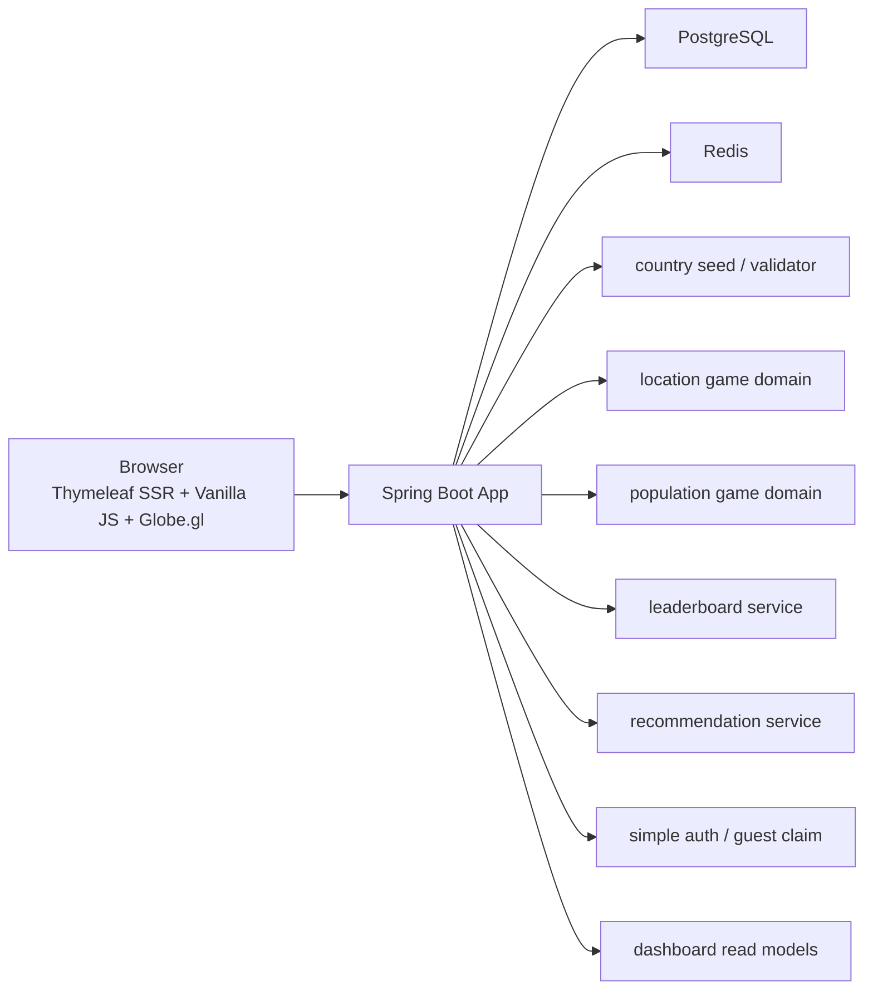

# 아키텍처 개요

## 한 줄 요약

WorldMap은 `SSR + API 혼합 구조` 위에서, 게임 상태와 정답 판정을 Spring Boot 서버가 주도적으로 관리하는 백엔드 중심 게임 플랫폼이다.

## 시스템 구성

## 왜 이 구조를 썼는가

### SSR + API 혼합

- 홈, 시작 화면, 결과 화면, 랭킹은 SSR로 첫 진입 속도와 구조를 단순하게 가져간다.
- 게임 플레이 중 상태 갱신과 제출은 API로 처리한다.
- 이렇게 하면 SPA를 따로 두지 않고도 서버 주도 게임 흐름을 설명하기 쉽다.

### 서버 주도 게임

- 프론트는 입력과 표현을 맡는다.
- 서버는 문제 생성, 정답 판정, 점수 계산, 하트 감소, 다음 Stage 생성을 맡는다.

즉, 이 프로젝트의 핵심은 "멋진 프론트"보다 `상태를 가진 백엔드 서비스`다.

## 계층별 책임

### Controller

- HTTP 요청 진입점
- 입력 검증과 SSR 모델 전달
- 세션/쿠키에서 필요한 값만 꺼내 서비스에 전달

### Service

- 게임 규칙
- 추천 점수 계산
- 랭킹 read model 조합
- guest -> member 기록 귀속

### Repository

- JPA 기반 영속성
- Redis Sorted Set 기반 랭킹 조회

### Initializer / Bootstrap

- 국가 시드 동기화
- admin bootstrap
- local demo 데이터 생성
- legacy schema / legacy Level 2 data cleanup

## 핵심 도메인 축

### 1. 게임

- 위치 찾기: `session -> stage -> attempt`
- 인구수 맞추기: `session -> stage -> attempt`

둘 다 하트 3개, 같은 Stage 재시도, endless run 구조를 공유한다.

### 2. 랭킹

- `leaderboard_record`에 완료 run을 저장
- Redis Sorted Set은 빠른 상위 N 조회용
- Redis miss 시 RDB fallback 후 key 재구성

### 3. 추천

- 런타임 LLM 호출 없음
- 설문 답변 -> 서버 점수 계산 -> top 3 추천
- 결과는 저장하지 않고 만족도만 저장

### 4. 계정

- guest는 `guestSessionKey`로 즉시 플레이
- 회원은 `memberId`로 기록 유지
- 로그인 직후 현재 브라우저의 guest 기록을 account로 귀속

## 대표 저장소 선택 이유

### PostgreSQL

- 국가 데이터
- 게임 세션 / Stage / Attempt
- 완료 run
- 회원 계정
- 추천 만족도 피드백

### Redis

- 실시간 랭킹 top N read model
- 빠른 조회용 캐시 성격

## 현재 실시간성 결정

- 랭킹은 `15초 polling` 유지
- 이유는 [REALTIME_DELIVERY_DECISION.md](/Users/alex/project/worldmap/docs/REALTIME_DELIVERY_DECISION.md) 참조

## 지금 구조에서 가장 설명하기 좋은 포인트

1. 프론트가 아니라 서버가 게임 규칙을 가진다.
2. Redis는 점수 저장소가 아니라 랭킹 조회용 read model이다.
3. 추천은 LLM이 아니라 서버 계산이며, AI는 오프라인 문항 개선에만 쓴다.
4. 계정은 커뮤니티가 아니라 기록 유지 목적의 단순 구조다.
