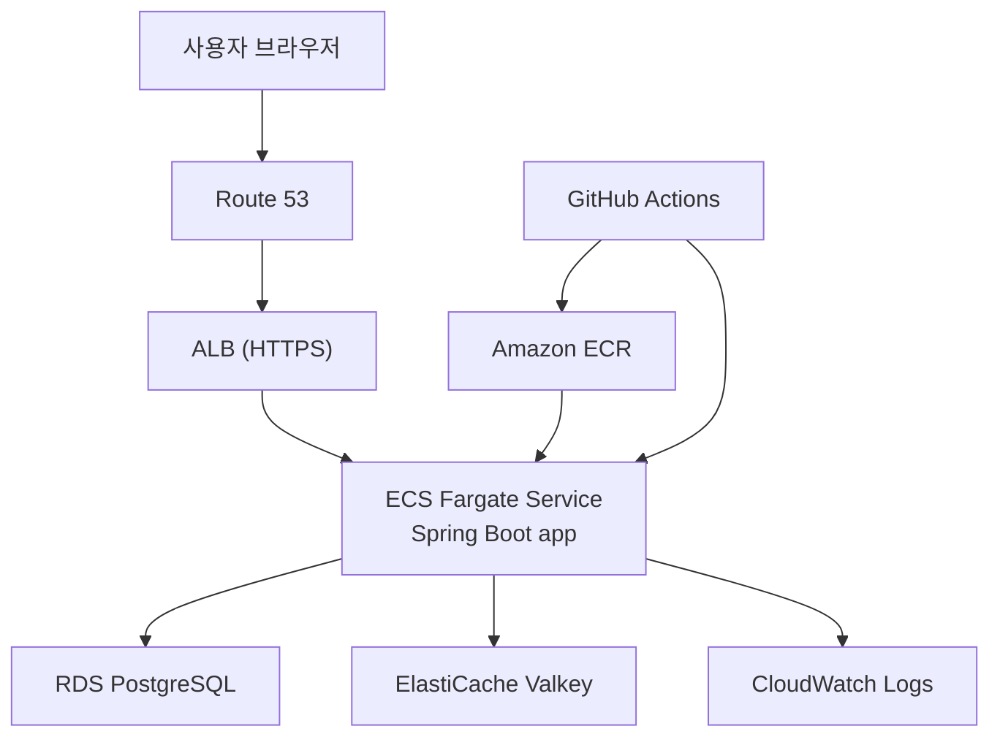

# WorldMap AWS ECS 배포 런북

최종 업데이트: 2026-03-29

## 1. 이 문서의 목적

이 문서는 `Spring Boot 백엔드 개발자 취업 포트폴리오` 관점에서 WorldMap 프로젝트를 어떻게 배포할지, 초보자도 처음부터 끝까지 따라갈 수 있게 정리한 실행 문서다.

이 문서 하나로 아래를 끝내는 것을 목표로 한다.

- AWS 계정 생성과 기본 보안 설정
- 어떤 인프라 구성을 선택해야 하는지 판단
- 시나리오별 예상 비용 비교
- 실제 배포 순서와 체크리스트
- 배포 후 운영, 모니터링, 롤백 방법

## 2. 결론 먼저

이 프로젝트의 최종 추천 배포 방식은 아래다.

- 앱 서버: `AWS ECS Fargate`
- 컨테이너 이미지 저장소: `Amazon ECR`
- DB: `Amazon RDS for PostgreSQL`
- 캐시/랭킹/세션 후보: `Amazon ElastiCache for Valkey`
- 도메인/HTTPS: `Route 53 + ACM + ALB`
- CI/CD: `GitHub Actions -> ECR push -> ECS deploy`

이 구성이 취업 포트폴리오에 유리한 이유는 다음과 같다.

1. `Spring Boot + PostgreSQL + Redis` 구조를 표준적인 서버 아키텍처로 설명할 수 있다.
2. 단일 PaaS보다 `컨테이너`, `managed DB`, `managed cache`, `ALB`, `CI/CD`, `헬스체크`, `로그`를 함께 설명할 수 있다.
3. 게임 세션, 랭킹, 추천 피드백, 회원 기능을 모두 `서버 중심 상태 관리`로 보여 주는 현재 프로젝트 구조와 잘 맞는다.

## 3. 이 프로젝트 기준 현재 제약

배포 전에 반드시 이해해야 할 현재 코드 상태는 아래와 같다.

### 3.1 세션은 아직 `HttpSession` 중심이다

현재 코드에는 `HttpSession`에 의존하는 흐름이 넓게 존재한다.

- 로그인 상태: `MemberSessionManager`
- 게스트 식별: `GuestSessionKeyManager`
- admin/dashboard 접근 제어
- 게임 시작 시 member / guest 분기

즉, `ECS task 2개 이상`으로 바로 시작하면 세션이 task 사이에서 끊길 수 있다.

그래서 **첫 배포는 `desiredCount=1`로 시작**해야 한다.

그 다음 아래 작업을 끝낸 뒤에만 `desiredCount=2`로 올린다.

- `Spring Session + Redis` 적용
- session cookie / TTL / 보안 속성 점검

### 3.2 일부 배포 전용 설정은 아직 없다

현재 저장소 기준으로는 아래가 아직 없다.

- `server.forward-headers-strategy`
- JVM 메모리 옵션
- graceful shutdown 설정
- `Flyway`
- `Spring Session Redis`
- `/actuator/health/readiness`, `/actuator/health/liveness`

즉, AWS 리소스를 먼저 만드는 것보다 **배포 준비 코드 조각을 먼저 구현하는 것**이 맞다.

반대로 이번 기준으로 이미 있는 것은 아래다.

- multi-stage `Dockerfile`
- `.dockerignore`
- Docker 내부 `bootJar` 기반 self-contained image build 검증
- `application-prod.yml`
  - datasource / redis / demo bootstrap off / forwarded header 기준 분리

### 3.3 현재는 `Java 25`를 사용한다

현재 `build.gradle` 기준 toolchain은 `Java 25`다.

이 말은 배포 전에 아래 중 하나를 먼저 결정해야 한다는 뜻이다.

1. `Java 25`를 유지하고, 실제로 사용 가능한 runtime base image를 확정한다.
2. `Java 21 LTS`로 낮춰서 배포 호환성과 실무 표준성을 우선한다.

현재 저장소에는 `eclipse-temurin:25-jdk`, `eclipse-temurin:25-jre` 기반 Dockerfile이 들어갔고, 실제 `docker build`까지 통과했다.

즉, 지금 기준에서는 `Java 25 유지` 경로가 일단 검증된 상태다. 다만 이력서/실무 표준성을 더 우선하면 이후 `Java 21 LTS`로 내리는 판단도 열어 둘 수 있다.

### 3.4 local/demo bootstrap과 prod bootstrap은 분리해야 한다

현재 local에서는 아래 bootstrap을 쓴다.

- demo 계정
- demo sample run
- admin bootstrap

prod에서는 아래가 원칙이다.

- `WORLDMAP_DEMO_BOOTSTRAP_ENABLED=false`
- admin bootstrap은 최초 1회만 사용하거나, 운영 정책에 맞게 제한

## 4. 왜 ECS Fargate가 가장 유리한가

### 4.1 App Runner보다 좋은 점

App Runner도 쉽게 배포할 수 있지만, 이 프로젝트는 아래를 같이 설명해야 한다.

- SSR + API 혼합 구조
- PostgreSQL + Redis 분리
- 컨테이너 이미지 빌드/배포
- 네트워크와 보안 그룹
- ALB 헬스체크와 점진 배포

이 경우 ECS Fargate가 백엔드 포트폴리오 설명력에서 더 좋다.

### 4.2 Kubernetes보다 좋은 점

EKS는 지금 단계에서 과하다.

- 운영 복잡도가 너무 크다.
- 현재 프로젝트 규모보다 클러스터 운영 설명이 더 커진다.

즉, **“쿠버네티스를 할 줄 안다”를 보여 주는 것보다 “Spring Boot 서비스를 안정적으로 배포하고 운영한다”를 보여 주는 편이 더 낫다.**

## 5. 추천 아키텍처

### 5.1 네트워크 권장 구조

- VPC 1개
- Public subnet 2개
  - ALB
  - ECS task
- Private subnet 2개
  - RDS PostgreSQL
  - ElastiCache Valkey

### 5.2 왜 ECS task를 public subnet에 두는가

초보자/포트폴리오 기준으로는 `NAT Gateway 비용`이 너무 크다.

- NAT Gateway 1개만 써도 월 비용이 대략 `32~33 USD+` 수준으로 뛴다.
- 이 프로젝트는 초기엔 `task 1개`로도 충분하다.

그래서 첫 배포는 아래처럼 간다.

- ALB: public subnet
- ECS task: public subnet + public IP
- RDS/ElastiCache: private subnet
- ECS security group inbound는 `ALB security group`에서만 허용

이 방식은 production-hardening의 최종형은 아니지만, **초기 포트폴리오 배포에서 비용과 설명 가능성의 균형이 가장 좋다.**

## 6. 시나리오별 예상 비용

모든 금액은 `USD / month` 기준의 대략적인 추정치다.

가정:

- 리전: `ap-northeast-2 (Seoul)`
- 한 달: `730시간`
- ALB: `1개`
- ALB LCU: `1개 수준`
- ECR 이미지 저장: `2GB`
- Route 53 hosted zone: `1개`
- 데이터 전송량, 도메인 등록비, NAT Gateway, 과도한 CloudWatch 로그 비용은 **제외**

즉, 아래 표는 `인프라 고정비 중심 추정치`다. 실제 청구액은 트래픽과 로그 양에 따라 더 올라갈 수 있다.

### 6.1 시나리오 A - 비용 최소화 공개 데모

추천 대상:

- 일단 URL을 열어 포트폴리오를 보여 주고 싶은 상태
- 아직 `Spring Session Redis`를 적용하지 않은 상태
- 운영보다 공개 데모가 우선인 상태

구성:

- ECS Fargate `1 task`
  - x86 `0.5 vCPU / 1GB`
- RDS PostgreSQL
  - `db.t4g.micro`
  - Single-AZ
  - GP3 `20GB`
- ElastiCache Valkey
  - `cache.t4g.micro`
- ALB 1개
- Public IPv4
  - ALB `2개`
  - ECS task `1개`
- Route 53 hosted zone 1개
- ECR 2GB

예상 월 비용:

| 항목 | 예상 비용 |
| --- | ---: |
| ECS Fargate `0.5 vCPU / 1GB x 1` | `20.67` |
| ALB + 1 LCU | `22.27` |
| RDS `db.t4g.micro` | `18.25` |
| RDS GP3 `20GB` | `2.62` |
| ElastiCache Valkey `t4g.micro` | `14.02` |
| Public IPv4 `3개` | `10.95` |
| Route 53 hosted zone | `0.50` |
| ECR `2GB` | `0.20` |
| 합계 | `약 89.53` |

현실적인 예산:

- 월 `95~110 USD` 정도로 잡는 것이 안전하다.

### 6.2 시나리오 B - 취업 포트폴리오 최종 추천안

추천 대상:

- 면접/포트폴리오 제출용으로 가장 균형이 좋은 구조를 원할 때
- session externalization 이후 `task 2개`를 운영하고 싶을 때

구성:

- ECS Fargate `2 task`
  - x86 `0.5 vCPU / 1GB`
- RDS PostgreSQL
  - `db.t4g.small`
  - Single-AZ
  - GP3 `50GB`
- ElastiCache Valkey
  - `cache.t4g.small`
- ALB 1개
- Public IPv4
  - ALB `2개`
  - ECS task `2개`
- Route 53 hosted zone 1개
- ECR 2GB

예상 월 비용:

| 항목 | 예상 비용 |
| --- | ---: |
| ECS Fargate `0.5 vCPU / 1GB x 2` | `41.34` |
| ALB + 1 LCU | `22.27` |
| RDS `db.t4g.small` | `37.23` |
| RDS GP3 `50GB` | `6.55` |
| ElastiCache Valkey `t4g.small` | `27.45` |
| Public IPv4 `4개` | `14.60` |
| Route 53 hosted zone | `0.50` |
| ECR `2GB` | `0.20` |
| 합계 | `약 150.24` |

현실적인 예산:

- 월 `155~180 USD` 정도로 보는 것이 안전하다.

### 6.3 시나리오 C - production-like 학습용

추천 대상:

- 실제 production에 더 가까운 구성을 연습하고 싶을 때
- Multi-AZ와 더 큰 인스턴스를 써 보고 싶을 때

구성:

- ECS Fargate `2 task`
  - x86 `1 vCPU / 2GB`
- RDS PostgreSQL
  - `db.t4g.medium`
  - Multi-AZ
  - GP3 `100GB`
- ElastiCache Valkey
  - `cache.t4g.small x 2`
- ALB 1개
- Public IPv4
  - ALB `2개`
  - ECS task `2개`
- Route 53 hosted zone 1개
- ECR 2GB

예상 월 비용:

| 항목 | 예상 비용 |
| --- | ---: |
| ECS Fargate `1 vCPU / 2GB x 2` | `82.68` |
| ALB + 1 LCU | `22.27` |
| RDS `db.t4g.medium` Multi-AZ | `148.19` |
| RDS GP3 `100GB` Multi-AZ | `26.20` |
| ElastiCache Valkey `t4g.small x 2` | `54.90` |
| Public IPv4 `4개` | `14.60` |
| Route 53 hosted zone | `0.50` |
| ECR `2GB` | `0.20` |
| 합계 | `약 350.48` |

현실적인 예산:

- 월 `360~410 USD` 정도로 잡는 것이 안전하다.

### 6.4 비용 해석

포트폴리오 기준으로는 아래 순서가 가장 합리적이다.

1. 처음 공개: `시나리오 A`
2. 배포 구조 설명 정리 후: `시나리오 B`
3. production-like 연습은 필요할 때만: `시나리오 C`

추가로 아래 비용은 선택에 따라 더 붙는다.

- `Secrets Manager`
  - secret 1개당 월 `0.40 USD`
  - 보통 DB 비밀번호, admin bootstrap 비밀번호, 기타 외부 키를 넣으면 `0.80~1.20 USD` 수준
- `NAT Gateway`
  - 1개만 써도 월 `32~33 USD+` 수준
  - 데이터 처리 비용은 별도
- `CloudWatch Logs`
  - 로그가 많으면 눈에 띄게 증가할 수 있다.

## 7. 이 프로젝트 기준 최종 추천안

가장 현실적인 추천 경로는 아래다.

### 7.1 1차 공개 배포

- 시나리오 A
- ECS `1 task`
- 세션은 현재 방식 유지
- public URL 확보
- dashboard, stats, ranking, 5개 게임, 추천, mypage까지 공개 확인

### 7.2 이력서/포트폴리오 제출 직전 최종형

- Spring Session Redis 적용
- `desiredCount=2`
- 시나리오 B
- GitHub Actions 자동 배포 연결
- 헬스체크/로그/알람 정리

즉, **“처음부터 완벽한 구조”보다 “1-task로 먼저 열고, 세션 외부화 이후 2-task로 승급한다”가 이 프로젝트에 맞는 전략**이다.

## 8. 실제로 먼저 구현해야 할 코드 조각

AWS 콘솔 작업보다 먼저 아래를 구현해야 한다.

### 필수

1. forwarded header 지원
   - `server.forward-headers-strategy=native` 또는 `framework`
2. JVM 메모리 옵션
   - 예: `-XX:MaxRAMPercentage=75.0`
3. graceful shutdown
4. `Actuator health/readiness/liveness`
5. 비밀 정보 분리
   - `Secrets Manager` 또는 `SSM Parameter Store`

### 시나리오 B로 가기 전에 필수

6. `Spring Session + Redis`
7. secure cookie / same-site / session timeout 정리

### 권장

8. `Flyway`
9. CloudWatch용 log pattern 점검
10. ECR lifecycle policy

## 9. 처음부터 끝까지 실제 배포 순서

### 9.1 AWS 계정 만들기

1. AWS 계정 생성
2. root 계정 MFA 활성화
3. billing alert 이메일 연결
4. `AWS Budgets`로 월 예산 알림 설정
   - 50%
   - 80%
   - 100%

권장:

- root 계정은 결제/계정 설정용으로만 사용
- 실제 작업은 IAM 사용자 또는 IAM Identity Center 사용자로 진행

### 9.2 AWS 기본 보안 설정

1. 운영용 관리자 IAM 사용자 생성
2. `AdministratorAccess`는 초반에만 사용
3. 이후 아래처럼 줄이는 것을 목표로 한다
   - ECS
   - ECR
   - RDS
   - ElastiCache
   - Route 53
   - CloudWatch
4. Access Key를 만들었다면 바로 local `aws configure`로 연결

권장 리전:

- `ap-northeast-2 (Seoul)`

### 9.3 도메인 전략 결정

선택지는 두 가지다.

### 가장 쉬운 방법

- 먼저 ALB DNS 주소로 공개
- 배포가 안정되면 나중에 도메인 연결

### 포트폴리오 완성형

- 도메인 구매
- Route 53 hosted zone 생성
- ACM 인증서 발급
- ALB에 HTTPS 연결

초보자라면 **ALB DNS로 먼저 성공한 뒤 도메인을 붙이는 순서**가 안전하다.

### 9.4 네트워크 만들기

생성할 것:

- VPC 1개
- Public subnet 2개
- Private subnet 2개
- Internet Gateway 1개
- Public route table 1개
- Private route table 1개

초기 비용 최소화 기준:

- NAT Gateway는 만들지 않는다.

### 9.5 보안 그룹 만들기

### ALB 보안 그룹

- Inbound
  - 80 from `0.0.0.0/0`
  - 443 from `0.0.0.0/0`
- Outbound
  - all

### ECS 보안 그룹

- Inbound
  - 8080 from `ALB security group`
- Outbound
  - all

### RDS 보안 그룹

- Inbound
  - 5432 from `ECS security group`
- Outbound
  - default

### ElastiCache 보안 그룹

- Inbound
  - 6379 from `ECS security group`
- Outbound
  - default

### 9.6 RDS PostgreSQL 만들기

초기 추천:

- Engine: PostgreSQL
- Template: Free Tier가 아니어도 `dev/test`
- Instance: `db.t4g.micro` 또는 `db.t4g.small`
- Storage: GP3
- Public access: `No`
- Subnet group: private subnet 2개
- Multi-AZ: 처음엔 `No`

필수로 저장할 값:

- endpoint
- port
- database name
- username
- password

### 9.7 ElastiCache 만들기

초기 추천:

- Engine: Valkey
- Node type: `cache.t4g.micro` 또는 `cache.t4g.small`
- Placement: private subnet
- Security group: ECS only

필수로 저장할 값:

- primary endpoint
- port

중요:

- `TransitEncryptionEnabled=true`로 만들면 앱 쪽에도 TLS 설정이 필요하다.
- 이 경우 Spring 설정에 `spring.data.redis.ssl.enabled=true`를 같이 넣어야 한다.

### 9.8 ECR 만들기

1. ECR repository 생성
   - 예: `worldmap-app`
2. local docker login
3. Docker image build
4. ECR push
5. lifecycle policy 생성
   - 예: `main` 계열 최근 10개, 기타 최근 5개만 유지

이걸 안 하면 이미지가 계속 쌓여서 저장 비용이 불필요하게 늘어난다.

### 9.9 ECS Cluster 만들기

1. ECS cluster 생성
2. launch type: `Fargate`
3. task execution role 생성
4. app이 AWS 리소스를 직접 읽지 않으면 task role은 최소 권한으로 시작

### 9.10 Task Definition 만들기

초기 추천:

- CPU: `0.5 vCPU`
- Memory: `1GB`
- Port mapping: `8080`
- OS/Arch: Linux / x86_64

환경변수 예시:

| 키 | 예시 값 |
| --- | --- |
| `SPRING_PROFILES_ACTIVE` | `prod` |
| `SPRING_DATASOURCE_URL` | `jdbc:postgresql://...` |
| `SPRING_DATASOURCE_USERNAME` | `worldmap` |
| `SPRING_DATA_REDIS_HOST` | `...` |
| `SPRING_DATA_REDIS_PORT` | `6379` |
| `WORLDMAP_ADMIN_BOOTSTRAP_ENABLED` | `true` |
| `WORLDMAP_ADMIN_BOOTSTRAP_NICKNAME` | `worldmap_admin` |
| `WORLDMAP_DEMO_BOOTSTRAP_ENABLED` | `false` |

비밀 값은 평문 env보다 아래 방식이 낫다.

- `SPRING_DATASOURCE_PASSWORD`
- `WORLDMAP_ADMIN_BOOTSTRAP_PASSWORD`
- 필요하면 Redis 인증값

권장 주입 방식:

- ECS Task Definition `environment`가 아니라 `secrets` 사용
- source는 `AWS Secrets Manager` 또는 `SSM Parameter Store`

추가 주의:

- admin bootstrap 비밀번호는 강한 값으로 쓴다.
- demo bootstrap은 prod에서 꺼 둔다.
- ALB 뒤에서는 forwarded header 지원이 반드시 켜져 있어야 redirect와 secure cookie 판단이 꼬이지 않는다.
- `0.5 vCPU / 1GB` task라면 JVM 메모리 옵션을 명시적으로 넣는다.

### 9.11 ALB 만들기

1. Application Load Balancer 생성
2. public subnet 2개 선택
3. target group 생성
   - protocol: HTTP
   - port: 8080
   - health check path: `/actuator/health`
4. ECS service와 연결

권장:

- 추후 readiness/liveness를 추가하면 health check를 readiness 기준으로 바꾼다.
- ECS task health check와 ALB target group health check는 역할이 다르다.
  - ECS task health check: 컨테이너 자체가 살아 있는지
  - ALB target group health check: 외부 요청을 실제로 받을 준비가 됐는지
- 처음엔 ALB health check만으로 시작해도 되지만, 안정화 이후 둘 다 명시하는 편이 좋다.

### 9.12 ECS Service 만들기

초기 추천:

- desired count: `1`
- subnets: public subnet 2개
- auto assign public IP: `enabled`
- security group: ECS SG
- load balancer: ALB target group 연결

**중요**

- Spring Session을 넣기 전까지는 `desiredCount=1`
- 여기서 무리해서 2개로 바로 올리지 않는다

### 9.13 Route 53 + ACM + HTTPS 붙이기

1. ACM에서 인증서 발급
2. 도메인 검증
3. ALB listener 443 생성
4. Route 53 A/AAAA Alias를 ALB로 연결
5. 80은 443으로 redirect

### 9.14 첫 배포 smoke test

최소 확인 목록:

1. `/` 열림
2. `/stats` 열림
3. `/ranking` 열림
4. `/login` / `/signup` 동작
5. `orbit_runner` 또는 새 사용자로 로그인 가능
6. 게임 한 판 시작 가능
7. 결과 저장 후 ranking 반영
8. admin 로그인 후 `/dashboard` 접근 가능
9. RDS에 세션/게임/랭킹 데이터 정상 저장
10. Redis leaderboard 정상 갱신

## 10. GitHub Actions 배포 자동화 순서

초기 수동 배포를 한 번 성공한 뒤 자동화를 붙인다.

권장 순서:

1. GitHub OIDC 기반 AWS 인증 설정
2. GitHub Secrets 최소화
3. workflow에서 아래 순서 실행
   - checkout
   - JDK setup
   - `./gradlew test`
   - docker build
   - ECR login
   - ECR push
   - ECS task definition update
   - ECS service deploy
   - deployment stabilization wait

권장 브랜치 정책:

- `main` push 시 production deploy
- PR은 test만 수행

## 11. 운영 관리 계획

### 11.1 로그

필수:

- CloudWatch Logs로 앱 stdout 수집
- 로그 그룹 retention 설정
  - 예: 14일 또는 30일

권장:

- request id 또는 session id 로그 전략 정리

### 11.2 모니터링

최소 알람:

- ECS service CPU high
- ECS service memory high
- ALB 5xx
- Target unhealthy
- RDS CPU high
- RDS free storage low

### 11.3 백업

RDS:

- automated backup 유지
- backup retention 최소 7일

ElastiCache:

- 랭킹은 복구 가능 read model이지만, 운영 편의상 snapshot 정책을 검토할 수 있다.

### 11.4 보안 운영

- root 계정 일상 사용 금지
- MFA 유지
- admin bootstrap 계정 생성 후 운영자 비밀번호 즉시 변경 검토
- 사용하지 않는 Access Key 삭제
- SG가 `0.0.0.0/0`로 DB/cache를 열지 않았는지 정기 확인

## 12. 장애 시나리오별 대응

### 12.1 앱이 부팅은 되지만 로그인 세션이 끊긴다

원인 후보:

- task 2개 이상
- 여전히 `HttpSession`만 사용 중

대응:

- 즉시 desired count를 1로 내린다
- 그 다음 `Spring Session + Redis`를 적용한다

### 12.2 ALB는 살아 있는데 target이 unhealthy다

원인 후보:

- health path 잘못 설정
- 앱 부팅 실패
- DB 연결 실패

대응:

- ECS task log 확인
- target group health reason 확인
- `/actuator/health` 응답 확인

### 12.3 DB 연결 오류가 난다

원인 후보:

- SG 설정 오류
- datasource URL 오류
- username/password 오류

대응:

- ECS SG -> RDS SG 5432 허용 확인
- task env 값 재확인
- RDS endpoint/port 재확인

### 12.4 Redis 연결 오류가 난다

원인 후보:

- ElastiCache SG 설정 오류
- host/port 설정 오류

대응:

- ECS SG -> ElastiCache SG 6379 허용 확인
- spring redis env 값 확인

### 12.5 배포 후 새 버전이 깨졌다

대응:

1. 이전 task definition revision으로 rollback
2. ECS service를 이전 revision으로 다시 배포
3. 원인 로그 확인
4. main 재배포 전 test/health 기준 보완

## 13. 초보자 기준 실제 추천 실행 순서

처음부터 한 번에 다 하지 말고 아래 순서로 간다.

### 1주차

1. forwarded headers
2. JVM 메모리 옵션 + graceful shutdown
3. `Actuator`

### 2주차

4. AWS 계정/MFA/Budget
5. RDS
6. ElastiCache
7. ECR

### 3주차

8. ECS + ALB
9. 수동 첫 배포
10. smoke test

### 4주차

11. GitHub Actions 자동 배포
12. CloudWatch 알람
13. Route 53 / ACM HTTPS

### 그 다음

14. `Spring Session + Redis`
15. ECS task `1 -> 2`
16. `Flyway`
17. 배포/롤백 runbook 보강

## 14. 지금 당장 해야 할 일 체크리스트

아래 순서로 진행하면 된다.

- [x] `Dockerfile` 작성
- [x] `.dockerignore` 작성
- [x] `application-prod.yml` 추가
- [ ] Java 25 runtime image 유지 여부 또는 Java 21 LTS 전환 여부 결정
- [ ] forwarded header 지원 추가
- [ ] JVM 메모리 옵션 추가
- [ ] graceful shutdown 추가
- [ ] Actuator readiness/liveness 추가
- [ ] Secrets Manager 또는 SSM Parameter Store 연결
- [ ] session externalization 전까지 `desiredCount=1` 원칙 문서화
- [ ] AWS 계정 생성 + MFA + Budget
- [ ] RDS / ElastiCache 생성
- [ ] ECR 생성
- [ ] ECR lifecycle policy 추가
- [ ] ECS 수동 배포 1회 성공
- [ ] Route 53 / ACM 적용
- [ ] GitHub Actions 자동 배포 추가
- [ ] `Spring Session + Redis` 적용 후 `desiredCount=2` 승격
- [ ] Flyway는 첫 배포 안정화 이후 도입

## 15. 참고 자료

- AWS containers decision guide: [docs.aws.amazon.com](https://docs.aws.amazon.com/pdfs/decision-guides/latest/containers-on-aws-how-to-choose/containers-on-aws-how-to-choose.pdf)
- ECS + ALB: [docs.aws.amazon.com](https://docs.aws.amazon.com/AmazonECS/latest/developerguide/alb.html)
- RDS PostgreSQL: [docs.aws.amazon.com](https://docs.aws.amazon.com/AmazonRDS/latest/UserGuide/CHAP_PostgreSQL.html)
- ElastiCache getting started: [docs.aws.amazon.com](https://docs.aws.amazon.com/AmazonElastiCache/latest/dg/GettingStarted.serverless.html)
- Fargate pricing: [aws.amazon.com](https://aws.amazon.com/fargate/pricing/)
- RDS PostgreSQL pricing: [aws.amazon.com](https://aws.amazon.com/rds/postgresql/pricing/)
- ElastiCache pricing: [aws.amazon.com](https://aws.amazon.com/elasticache/pricing/)
- Route 53 pricing: [aws.amazon.com](https://aws.amazon.com/route53/pricing/)
- ECR pricing: [aws.amazon.com](https://aws.amazon.com/ecr/pricing/)
- Spring Session Redis guide: [docs.spring.io](https://docs.spring.io/spring-session/reference/guides/java-redis.html)
- GitHub Actions to ECS: [docs.github.com](https://docs.github.com/actions/deployment/deploying-to-your-cloud-provider/deploying-to-amazon-elastic-container-service)

## 16. 최종 추천 한 줄 정리

이 프로젝트는 **처음엔 `ECS Fargate 1 task + RDS + ElastiCache + ALB`로 공개하고, 그 다음 `Spring Session + Redis`를 붙인 뒤 `2 task`로 올리는 전략**이 가장 현실적이고, Spring Boot 백엔드 포트폴리오 설명력도 가장 좋다.
