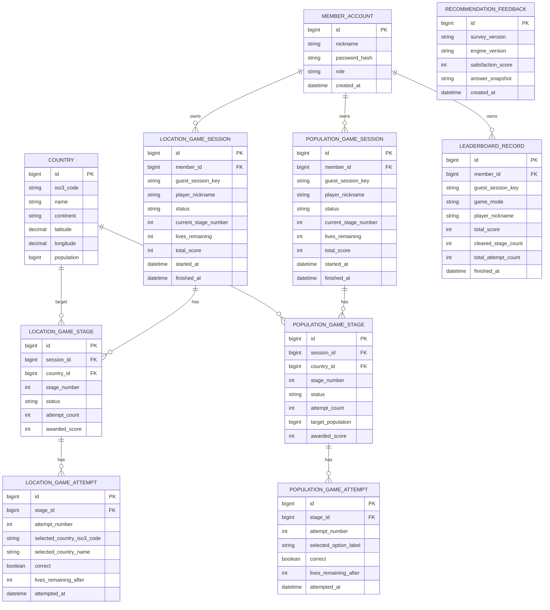

# 핵심 ERD

현재 제품 범위를 설명할 때 필요한 핵심 테이블만 정리한다.

## 읽는 방법

### 게임 기록

- `...SESSION`은 한 판 전체
- `...STAGE`는 한 문제
- `...ATTEMPT`는 그 문제 안의 개별 시도

### 계정과 게스트

- 회원이면 `member_id`
- 비회원이면 `guest_session_key`

두 값 중 하나로 소유권을 표현한다.

### 랭킹

- `leaderboard_record`는 session 자체가 아니라 `완료된 run 결과`
- 그래서 같은 세션을 재시작해도 예전 결과가 덮어써지지 않는다.

## 면접에서 짚을 포인트

1. 왜 session / stage / attempt를 나눴는가
2. 왜 leaderboard_record를 세션과 별도로 뒀는가
3. 왜 guestSessionKey와 memberId를 같이 들고 가는가
