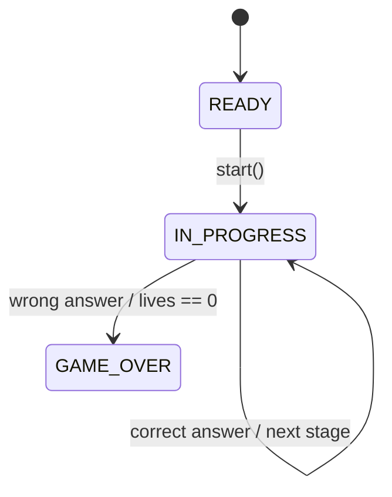
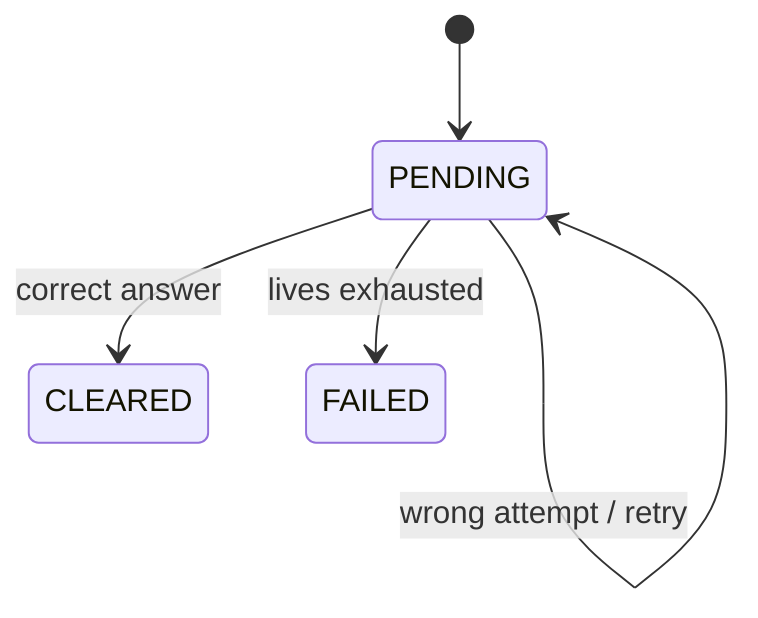

# Location Game Arcade Reboot

## 목적

이 문서는 현재 `국가 위치 찾기 Level 1`을 단순한 문제 제출형 프로토타입에서 `플래시 게임처럼 짧고 몰입감 있게 반복 플레이할 수 있는 아케이드형 게임`으로 다시 설계하기 위한 기준 문서다.

핵심은 두 가지다.

- 게임 루프를 `정답 1회 제출형`에서 `하트 기반 재시도형`으로 바꾼다.
- 사이트와 게임 화면을 `따뜻한 카드형 UI`에서 `차가운 우주 HUD` 느낌으로 전면 전환한다.

이 문서는 구현보다 먼저 “무엇을 만들 것인가”와 “왜 그렇게 만들 것인가”를 고정하는 SSOT다.

## 현재 구현 상태

- 완료:
  - `세션 / Stage / Attempt` 백엔드 구조
  - `GET /state`, `POST /answer`, `GET /result` API
  - 하트 3개, 같은 Stage 재시도, `GAME_OVER`, 자동 다음 Stage
  - 고정 종료 없는 endless Stage 생성 구조
  - Stage 상승에 따라 국가 후보 풀이 넓어지는 난이도 정책
  - tooltip 제거, 선택 후 제출 / 취소, 성공 / 실패 오버레이 1차 구현
  - 드래그와 클릭을 구분하는 선택 안정화 로직
  - GeoJSON 링 방향 보정으로 국가 바깥 영역이 채워지는 지구본 렌더링 오류 수정
  - Level 1 활성 자산을 `Natural Earth 110m`로 낮춰 초기 로딩과 폴리곤 흔들림 완화
  - `Globe.gl` polygon click 대신 지구본 클릭 좌표를 GeoJSON과 다시 비교하는 직접 선택 판정 보강
  - 홈 / 시작 / 결과 화면과 공통 CSS의 우주 테마 1차 적용
  - 모든 주요 SSR 화면 공통 홈 이동 헤더
- 남은 일:
  - 위치 게임 플레이 HUD 전용 시각 polish
  - 결과 / 게임오버 화면 완성도 보강
  - 모바일 상호작용과 시각 연출 고도화

## 1. 왜 다시 설계하는가

현재 프로토타입은 서버 주도 구조 자체는 맞다.

- 서버가 문제를 정한다.
- 서버가 정답을 판정한다.
- 세션과 라운드를 저장한다.

하지만 실제 플레이 감각은 약하다.

- 지구본 위에서 국가를 찾는 게임인데 현재 UI는 설명형 패널 비중이 크다.
- 나라를 찾는 것이 목적이므로 플레이 중 국가 이름이 보이면 안 된다.
- 한 번 틀리면 끝나는 구조라 아케이드 감각이 없다.
- 하트, 재시도, 자동 다음 단계, 짧은 성공/실패 피드백 같은 게임 루프가 없다.
- 전체 사이트도 베이지 톤과 둥근 카드 스타일이라 우주 탐색 게임 분위기와 맞지 않는다.

즉, 현재 상태는 “동작하는 프로토타입”이지 “플레이하고 싶은 게임”은 아니다.

## 2. 재설계 목표

### 게임 경험 목표

- 문제 국가 이름만 보고 지구본에서 나라를 찾아야 한다.
- 플레이 중 지구본 위 국가 이름은 보이지 않는다.
- 사용자는 클릭 후 바로 제출하지 않고 선택 상태만 확인한 뒤 `제출 / 취소`를 할 수 있다.
- 틀리면 같은 Stage를 다시 시도한다.
- 하트 3개가 모두 사라지면 게임오버다.
- 맞히면 짧은 연출 후 자동으로 다음 Stage로 넘어간다.
- Stage가 올라갈수록 점수가 커진다.
- Stage가 올라갈수록 주요 국가 중심에서 전 세계 194개 국가 전체로 출제 풀이 넓어진다.

### 포트폴리오 목표

- 하트, 점수, Stage, 시도 횟수를 서버가 관리하는 구조를 보여준다.
- 프론트는 HUD, 오버레이, 애니메이션을 담당하지만 정답 판정은 하지 않는다.
- 도메인 모델이 `세션 / Stage / Attempt`로 분리되는 이유를 설명할 수 있어야 한다.

### 비주얼 목표

- 사이트 전체를 `cold space arcade` 방향으로 바꾼다.
- 따뜻한 베이지 톤, 두꺼운 카드, 큰 라운드 값을 줄인다.
- 대신 어두운 배경, 얇은 라인, HUD 패널, 차가운 블루 포인트를 사용한다.

## 3. 최종 게임 루프

### 세션 시작

- 사용자가 닉네임을 입력하고 시작한다.
- 서버는 새 세션을 만들고 아래 기본값을 준다.
  - `livesRemaining = 3`
  - `currentStageNumber = 1`
  - `totalScore = 0`
  - `status = IN_PROGRESS`

### 한 Stage의 흐름

1. 서버가 Stage 1의 정답 국가를 정한다.
2. 프론트는 상단 HUD에 문제 국가 이름만 보여준다.
3. 사용자는 지구본에서 국가를 클릭한다.
4. 하단 액션 바에 `선택 상태 / 제출 / 취소`가 나타난다.
5. 제출 시 서버가 정답을 판정한다.
6. 정답이면:
   - 점수를 부여한다.
   - Stage를 `CLEARED`로 바꾼다.
   - 세션 점수와 진행 상태를 갱신한다.
   - 서버가 다음 Stage를 새로 생성한다.
   - 짧은 성공 연출 뒤 다음 Stage로 자동 이동한다.
7. 오답이면:
   - Attempt를 남긴다.
   - 하트를 1개 줄인다.
   - Stage는 그대로 유지한다.
   - 사용자는 같은 문제를 다시 시도한다.
8. 하트가 0이면:
   - 세션을 `GAME_OVER`로 종료한다.
   - 결과 화면이나 게임오버 오버레이를 보여준다.

### 종료 조건

- 하트가 모두 사라지면 `GAME_OVER`
- 현재 Level 1은 `고정 마지막 Stage가 없는 endless run`이다.

Level 1은 전체 시드 194개를 유지하되, 현재 플레이 자산은 상위 72개 주요 국가와 `Natural Earth 110m` 기반 경계로 먼저 운영한다.
이후 Level 2는 영토/소국 추가, 시간 압박, 연속 정답 보너스 같은 규칙으로 난도를 높인다.

## 4. 나라 이름 노출 규칙

이 규칙은 게임성 보존을 위해 필수다.

- 플레이 중 hover tooltip으로 국가 이름을 보여주지 않는다.
- 지구본 위에 국가 이름 label을 띄우지 않는다.
- 범례에 특정 국가명 힌트를 주지 않는다.
- 클릭 전에는 사용자가 어떤 나라를 고른지 텍스트로 보여주지 않는다.
- 클릭 후에도 제출 전까지는 선택한 나라 이름을 보여주지 않는다.
- 실제 선택 국가명은 제출 후 판정 피드백이나 결과 화면에서만 공개한다.
- 오답 시에도 즉시 정답 국가를 공개하지 않는다.
- Stage 클리어 또는 게임오버 후에만 정답 정보를 결과 화면에 남길 수 있다.

## 5. 점수 정책 초안

첫 구현은 단순하지만 설명 가능한 규칙으로 간다.

### 권장 공식

- `baseScore = 100 + ((stageNumber - 1) * 20)`
- `attemptBonus`
  - 첫 시도 정답: `+30`
  - 두 번째 시도 정답: `+10`
  - 세 번째 이상 시도 정답: `+0`
- `lifeBonus = livesRemaining * 10`
- `awardedScore = baseScore + attemptBonus + lifeBonus`

### 의도

- 뒤 Stage일수록 점수가 올라간다.
- 적은 시도로 맞힐수록 보상이 커진다.
- 하트를 잘 지키면 보너스를 받는다.

면접에서는 “왜 단순 100점 고정 대신 이 구조를 썼는가?”를 설명할 수 있어야 한다.

## 6. 백엔드 도메인 재설계

현재 `세션 + 라운드 1회 제출형`만으로는 부족하다.

`틀리면 같은 문제 재시도`와 `하트 감소`를 표현하려면 최소 아래 구조가 필요하다.

### 6.1 Session

`LocationGameSession`

- `id`
- `playerNickname`
- `status`
  - `READY`
  - `IN_PROGRESS`
  - `GAME_OVER`
  - `FINISHED`
- `currentStageNumber`
- `clearedStageCount`
- `totalScore`
- `livesRemaining`
- `startedAt`
- `finishedAt`

### 6.2 Stage

`LocationGameStage`

- `id`
- `sessionId`
- `stageNumber`
- `targetCountryIso3Code`
- `targetCountryName`
- `status`
  - `PENDING`
  - `CLEARED`
  - `FAILED`
- `attemptCount`
- `awardedScore`
- `clearedAt`

### 6.3 Attempt

`LocationGameAttempt`

- `id`
- `stageId`
- `attemptNumber`
- `selectedCountryIso3Code`
- `selectedCountryName`
- `correct`
- `livesRemainingAfter`
- `attemptedAt`

### 왜 Attempt가 필요한가

- 같은 Stage에서 여러 번 틀릴 수 있다.
- 어떤 오답을 냈는지 기록할 수 있어야 한다.
- 게임오버 원인과 학습 이력을 설명하기 쉽다.
- 나중에 전적 페이지에서 “어느 나라에서 자주 틀렸는가”를 보여줄 수 있다.

## 7. 상태 전이 초안

Stage 내부에서는 아래가 추가된다.

## 8. API 재설계 초안

현재 API는 `round` 중심이라 재설계가 필요하다.

### 세션 시작

- `POST /api/games/location/sessions`

응답 예시:

- `sessionId`
- `status`
- `currentStageNumber`
- `livesRemaining`
- `totalScore`
- `playPageUrl`

### 현재 상태 조회

- `GET /api/games/location/sessions/{sessionId}/state`

응답 예시:

- `sessionId`
- `status`
- `stageNumber`
- `difficultyLabel`
- `targetCountryName`
- `livesRemaining`
- `totalScore`
- `clearedStageCount`

### 답안 제출

- `POST /api/games/location/sessions/{sessionId}/answer`

요청:

- `stageNumber`
- `selectedCountryIso3Code`

응답 예시:

- `outcome`
  - `CORRECT`
  - `WRONG`
  - `GAME_OVER`
  - `FINISHED`
- `livesRemaining`
- `awardedScore`
- `totalScore`
- `currentStageNumber`
- `nextStageNumber`
- `attemptCount`
- `uiAction`
  - `ADVANCE_STAGE`
  - `RETRY_STAGE`
  - `SHOW_GAME_OVER`
  - `SHOW_FINISHED`
- `delayMs`

### 결과 조회

- `GET /api/games/location/sessions/{sessionId}/result`

응답 예시:

- `status`
- `finalScore`
- `clearedStageCount`
- `remainingLives`
- `stageSummaries`

## 9. 프론트 UX 재설계

현재 플레이 화면은 설명 패널 중심이라 게임 HUD처럼 느껴지지 않는다.

새 화면은 아래 구조로 간다.

### 상단 HUD

- `Stage 4`
- `Score 380`
- `♥ ♥ ♥`

### 중앙 메인 영역

- 지구본만 크게 배치
- 배경은 우주 느낌
- 불필요한 텍스트 제거

### 하단 액션 바

- 평소에는 숨김
- 국가 클릭 후에만 노출
- `국가 선택됨` 같은 상태 텍스트
- `제출`
- `취소`

### 오버레이 피드백

- 정답: `CORRECT`, 점수 증가 표시, 짧은 초록 연출
- 오답: `WRONG`, 하트 감소 연출, 같은 Stage 유지
- 게임오버: `GAME OVER`, 최종 점수, 다시 시작 버튼

### 제거할 것

- 플레이 중 hover tooltip
- 긴 범례 패널
- “다음 라운드 불러오기” 버튼
- 설명 문구 위주의 패널 구조

## 10. 사이트 전반 리디자인 방향

### 현재 문제가 되는 톤

- 베이지 / 오렌지 기반
- 둥근 카드 중심
- 따뜻한 카페형 UI 인상

이 방향은 우주 탐색 게임과 어울리지 않는다.

### 새 비주얼 키워드

- cold
- orbital
- tactical
- arcade HUD
- neon accent

### 색상 방향

- 배경:
  - `#050b14`
  - `#091423`
  - `#0d1b2f`
- 기본 텍스트:
  - `#dce9f7`
- 보조 텍스트:
  - `#8ea6bf`
- 라인:
  - `rgba(120, 180, 255, 0.18)`
- 강조:
  - `#5cc8ff`
  - `#7be0ff`
- 성공:
  - `#58d68d`
- 실패:
  - `#d36a6a`

### 형태 방향

- 전체 radius 축소
- 카드형보다 패널형
- 넓은 그림자보다 얇은 line과 발광 포인트
- 큰 둥근 버튼보다 HUD 버튼

### 페이지 우선순위

1. 메인 페이지
2. 위치 게임 시작 화면
3. 위치 게임 플레이 화면
4. 위치 게임 결과 화면
5. 인구수 게임 화면 공통 테마 맞춤

## 11. 구현 순서

### Phase 1. 규칙 문서 고정

- 이 문서 작성
- README와 Playbook에 새 방향 반영

### Phase 2. 백엔드 리팩터링

- `Session + Stage + Attempt` 구조 추가
- lives / score / stage 상태 관리 로직 구현
- 기존 round 중심 API 정리

### Phase 3. 위치 게임 플레이 UI 전면 개편

- tooltip 제거
- HUD 추가
- action bar 추가
- 정답/오답/게임오버 오버레이 추가

### Phase 4. 사이트 우주 테마 리디자인

- 공통 CSS 변수 교체
- 메인 페이지 리디자인
- 게임 공통 패널 스타일 교체

### Phase 5. 테스트와 문서 보강

- lives 감소 테스트
- game over 테스트
- stage clear 테스트
- 점수 정책 테스트
- 면접용 설명 정리

## 12. 완료 기준

다음 조건을 만족해야 리부트 완료로 본다.

- 지구본 위에 국가 이름이 노출되지 않는다.
- 클릭 후 `제출 / 취소` 흐름이 있다.
- 오답 시 하트가 줄고 같은 Stage를 다시 시도한다.
- 하트 0이면 게임오버가 된다.
- 정답 시 짧은 성공 연출 후 자동으로 다음 Stage로 넘어간다.
- 단계가 올라갈수록 점수 기대값이 증가한다.
- 서버가 lives, score, stage, attempts를 관리한다.
- 핵심 상태 전이 테스트가 있다.

## 13. 면접에서 설명할 핵심 문장

“처음 위치 게임은 한 문제당 한 번 제출하는 서버 주도 프로토타입이었지만, 실제 게임 감각이 약해서 `하트 기반 재시도형 아케이드 루프`로 다시 설계했습니다. 이 과정에서 세션과 라운드만으로는 부족하다고 판단해 `세션 / Stage / Attempt` 구조로 분리했고, 하트, 점수, 단계 진행을 서버가 관리하도록 바꿨습니다. 프론트는 지구본 렌더링과 HUD 연출만 담당하고, 정답 판정과 게임 상태는 여전히 서버가 책임지는 구조입니다.”
