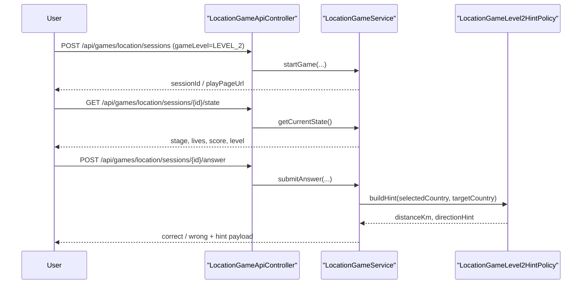

# Location Game Level 2 First Slice Plan

## 목적

이 문서는 `국가 위치 찾기 Level 2`를 한 번에 크게 구현하지 않고,
`첫 번째 작은 조각`으로 어떻게 시작할지 고정하는 문서다.

핵심 원칙은 두 가지다.

- Level 1의 `세션 / Stage / Attempt / 하트 / endless run` 구조를 깨지 않는다.
- Level 2는 "더 많은 코드를 새로 만드는 것"보다 "더 높은 난도를 서버 규칙으로 분리하는 것"에 집중한다.

즉, 이번 문서의 질문은 이것이다.

`위치 게임 Level 2를 처음 열 때 어떤 규칙 하나를 추가하면, Level 1과 충분히 구분되면서도 구현 범위를 통제할 수 있을까?`

## 왜 바로 전체 확장으로 가지 않는가

위치 게임은 이미 Level 1에서 구현 복잡도가 높았다.

- 3D 지구본 렌더링
- 나라 클릭 판정
- Stage / Attempt 서버 저장
- 하트 기반 재시도
- endless run
- 로딩 / 폴리곤 안정성 대응

여기서 Level 2를 곧바로

- 194개 전체 국가
- 타이머
- 힌트 시스템
- 소국 / 영토
- 연속 정답 보너스

까지 한 번에 밀어 넣으면 설명 가능성이 떨어진다.

그래서 첫 조각은
`기존 루프를 유지한 채 난도 정책만 추가`
하는 방향이 맞다.

## 첫 조각에서 만들 것

Level 2 첫 조각은 아래 4개만 목표로 한다.

1. 시작 화면에서 `Level 1 / Level 2` 선택
2. 세션이 `gameLevel`을 저장
3. Level 2 전용 출제 정책 추가
4. 오답 시 서버가 `거리 + 방향` 힌트를 계산해 내려줌

즉, 첫 구현은
`위치 입력 방식 변경`이 아니라
`같은 국가 선택형 루프 위에 더 강한 난도와 힌트 규칙을 올리는 것`
으로 간다.

## 왜 이 방향이 맞는가

### 1. 현재 Level 1 구조를 그대로 재사용할 수 있다

이미 위치 게임에는 아래가 있다.

- `LocationGameSession`
- `LocationGameStage`
- `LocationGameAttempt`
- 하트 3개
- 같은 Stage 재시도
- 정답 시 다음 Stage 생성
- 결과 화면

즉, 게임 루프는 이미 완성되어 있다.

Level 2에서 굳이 다른 엔티티 구조를 만들 필요가 없다.

### 2. 프론트 리스크를 크게 늘리지 않는다

좌표 직접 입력형이나 타이머 HUD를 처음부터 붙이면
지구본 상호작용이 다시 크게 흔들릴 수 있다.

반면 이번 첫 조각은

- 선택 방식은 그대로 두고
- Stage 생성 정책
- 판정 후 피드백 payload

만 바꾸기 때문에
리스크가 상대적으로 작다.

### 3. 9단계 목표와도 맞다

플레이북의 9단계 키워드는

- 힌트
- 부분 점수
- 오차 거리 표시

다.

위치 게임 Level 2 첫 조각을 `거리 + 방향 힌트`
중심으로 여는 것은 이 방향과 가장 잘 맞는다.

## Level 1과 Level 2 차이

### Level 1

- 주요 국가 중심 출제
- 오답 시 하트 감소만 발생
- 정답/오답만 알 수 있음
- 현재 자산 안정성 우선

### Level 2 첫 조각

- 더 헷갈리는 국가 위주 출제
- 오답 시 하트 감소 + 힌트 payload
- 선택한 국가와 정답 국가 사이의 `거리(km)` 제공
- 필요 시 `방향(N/E/S/W 조합)` 제공
- 점수는 `힌트 debt`까지 반영

즉, Level 2는 "더 어려운 문제 + 더 설명적인 피드백"이다.

## 도메인 구조는 어떻게 유지할 것인가

### Session

`LocationGameSession`은 현재 구조를 유지하되
`gameLevel`만 추가한다.

이 필드는

- 이번 세션이 어떤 난도 규칙을 쓰는가
- 어떤 힌트 정책을 적용하는가
- 랭킹에서 Level 1 / Level 2를 어떻게 구분하는가

를 결정한다.

### Stage

`LocationGameStage`는 그대로 유지한다.

첫 조각에서는 Stage에

- 정답 국가
- 상태
- 점수
- 시도 횟수

만 있어도 충분하다.

힌트 이력까지 Stage 컬럼으로 바로 올리지는 않는다.

### Attempt

`LocationGameAttempt`는 계속 핵심이다.

이유:

- 어떤 나라를 골랐는지 남아야 하고
- 틀렸을 때 어떤 피드백이 내려갔는지도 나중에 설명할 수 있어야 하기 때문이다

첫 조각에서는 DB 컬럼까지 늘리기보다,
거리/방향 힌트는 answer payload와 결과 read model에서 먼저 계산하는 쪽이 낫다.

## 첫 조각의 규칙 초안

### 1. 출제 국가 풀

Level 2 첫 조각은 "국가 수를 무작정 늘리는 것"보다
`헷갈리기 쉬운 조합`
을 강화한다.

우선순위:

- 대륙/인접 국가 혼동
- 비슷한 크기/비슷한 위치
- 이름은 익숙하지만 정확한 위치가 헷갈리는 국가

즉, Level 2는 단순히 "더 많은 국가"가 아니라
`더 구분하기 어려운 국가`
를 먼저 쓴다.

### 2. 오답 피드백

오답이면 서버는 아래를 내려준다.

- `distanceKm`
- `directionHint`

예:

- `정답 국가는 선택한 나라에서 약 1,240km 북동쪽입니다.`

첫 조각에서는
너무 많은 힌트를 한 번에 주지 않고
이 2개만 시작한다.

### 3. 점수 정책

Level 2는 힌트가 생기므로,
Level 1 점수식을 그대로 쓰면 안 된다.

첫 조각 기준:

- baseScore는 Level 1보다 약간 높게 시작
- 첫 시도 정답 보너스 유지
- 오답이 나왔던 Stage는 `hint debt`만큼 감점

즉,
힌트를 본 뒤 맞히면 통과는 되지만
최고 점수는 받지 못하게 한다.

### 4. 게임오버 규칙

첫 조각에서는 Level 1과 동일하게 간다.

- 하트 3개
- 같은 Stage 재시도
- 하트 0이면 `GAME_OVER`

하트 수까지 동시에 바꾸면
난도가 어디서 올라갔는지 설명이 흐려진다.

## 요청 흐름 초안

핵심은
거리/방향 계산도 프론트가 아니라 서버가 한다는 점이다.

## 왜 힌트 계산은 서비스/정책이어야 하는가

거리와 방향은 프론트에서 계산할 수도 있어 보인다.

하지만 그렇게 하면 안 된다.

이유:

- 정답 국가 기준 정보는 서버가 이미 가진다
- 어떤 힌트를 언제 줄지도 서버 규칙이어야 한다
- 랭킹/점수 감점과 힌트 사용 이력을 같이 설명하려면
  판정과 힌트가 같은 쪽에 있어야 한다

그래서 첫 조각에서는

- `LocationGameLevel2HintPolicy`
- 또는 `LocationGameDistanceHintService`

처럼 별도 정책 클래스로 분리하는 것이 맞다.

## 이번 첫 조각에서 하지 않을 것

아래는 일부러 뒤로 미룬다.

- 194개 전체 자산 전면 확대
- 타이머
- 연속 정답 streak 보너스
- 소국/영토 모드
- 지도 카메라 자동 줌 힌트
- 랭킹 실시간 SSE

이건 첫 조각 범위를 넘는다.

## 구현 순서 제안

1. `LocationGameLevel` enum 추가
2. 세션 시작 시 level 선택 저장
3. Level 2 difficulty policy 초안 추가
4. 오답 응답 payload에 `distanceKm`, `directionHint` 추가
5. play 화면 오버레이에 힌트 문구 노출
6. 결과 화면에 hint 사용 흔적을 남길지 결정
7. 랭킹 level 분리 여부는 그다음 조각

## 면접에서는 이렇게 설명할 수 있어야 한다

위치 게임 Level 2는 Level 1을 다시 만드는 것이 아니라,
이미 있는 `세션 / Stage / Attempt / 하트` 구조 위에
난도 정책과 힌트 정책만 추가하는 방향으로 설계했습니다.
첫 조각에서는 선택 방식은 그대로 유지하고,
오답 시 서버가 거리와 방향 힌트를 계산해 내려주는 구조로 시작해
프론트 리스크를 키우지 않으면서도 Level 1과 분명히 다른 규칙을 만들었습니다.
