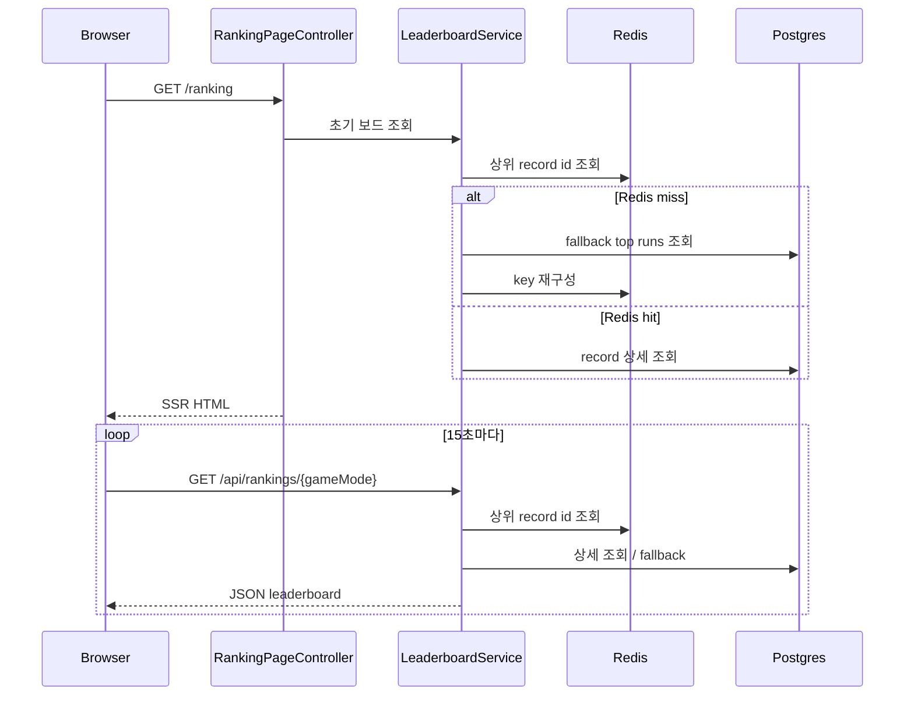

# 실시간 전달 방식 결정 기록

## 현재 결론

현재 WorldMap 프로젝트의 랭킹 실시간성은 `15초 polling 유지`로 닫는다.

즉, 현재 public `/ranking` 화면은

- SSR로 첫 화면을 렌더링하고
- 이후 짧은 주기 polling으로 갱신하며
- SSE/WebSocket은 다음 확장 후보로만 남긴다.

## 왜 지금 polling으로 닫는가

이 프로젝트의 핵심은 채팅이나 협업 도구처럼 초저지연 양방향 업데이트가 아니다.
현재 제품의 핵심은 아래 세 가지다.

1. 서버가 게임 상태와 점수를 주도적으로 계산한다.
2. Redis Sorted Set으로 상위 랭킹을 빠르게 읽는다.
3. 사용자가 "서비스가 살아 있다"는 체감을 갖도록 랭킹이 주기적으로 갱신된다.

이 기준에서는 polling이 이미 목적을 충족한다.

### 현재 polling이 충분한 이유

- 랭킹 조회는 read-only다.
- 사용자 수가 매우 크지 않은 포트폴리오/개인 프로젝트 범위다.
- 15초 주기는 "업데이트가 살아 있다"는 체감을 주기에 충분하다.
- SSE/WebSocket을 붙이면 인증, 연결 생명주기, 재연결, 운영 비용 설명까지 같이 늘어난다.

즉, 지금은 복잡도를 늘리는 것보다 "왜 polling으로도 충분했는가"를 설명하는 편이 더 가치 있다.

## SSE/WebSocket을 지금 당장 열지 않는 이유

### 1. 문제-해결 비율이 맞지 않는다

현재 랭킹은 top N read model이고, 점수 반영도 게임 종료 시점에만 일어난다.
즉, 밀리초 단위 push가 꼭 필요한 구조가 아니다.

### 2. 설명 비용이 커진다

SSE나 WebSocket을 붙이면 아래를 같이 설명해야 한다.

- 연결 유지와 재연결
- 세션/권한 처리
- 서버 인스턴스가 늘어날 때의 연결 전략
- 브라우저 탭 비활성화 상태 대응
- fallback 전략

이 프로젝트의 현재 핵심은 여기가 아니다.

### 3. 현재 구조와도 잘 맞는다

지금은

- RDB에 종료 run 저장
- Redis Sorted Set 반영
- `/api/rankings/{gameMode}` 조회
- `/ranking` polling 갱신

흐름이 이미 단순하고 설명 가능하다.

## 현재 요청 흐름

## 다음에 SSE/WebSocket을 다시 검토할 기준

아래 조건 중 하나가 생기면 다시 검토한다.

1. 랭킹 변화를 1~2초 안에 보여줘야 하는 요구가 생긴다.
2. 실시간 spectator나 live ticker 같은 기능을 붙인다.
3. 대회형 모드처럼 동시 접속자에게 즉시 순위 변화를 밀어줘야 한다.
4. polling 비용이 실제로 측정상 문제가 된다.

지금은 어느 조건도 강하지 않다.

## 면접에서는 어떻게 설명할 것인가

> 랭킹은 실시간처럼 보여야 했지만, 현재 프로젝트 범위에서는 초저지연 push보다 설명 가능한 구조가 더 중요했습니다. 그래서 게임 종료 후 RDB와 Redis Sorted Set에 결과를 반영하고, `/ranking`은 SSR + 15초 polling으로 닫았습니다. 이 방식이면 read model, fallback, Redis 사용 이유를 충분히 설명할 수 있고, SSE/WebSocket에서 생기는 연결 관리 복잡도는 다음 단계로 미뤄도 됩니다.
