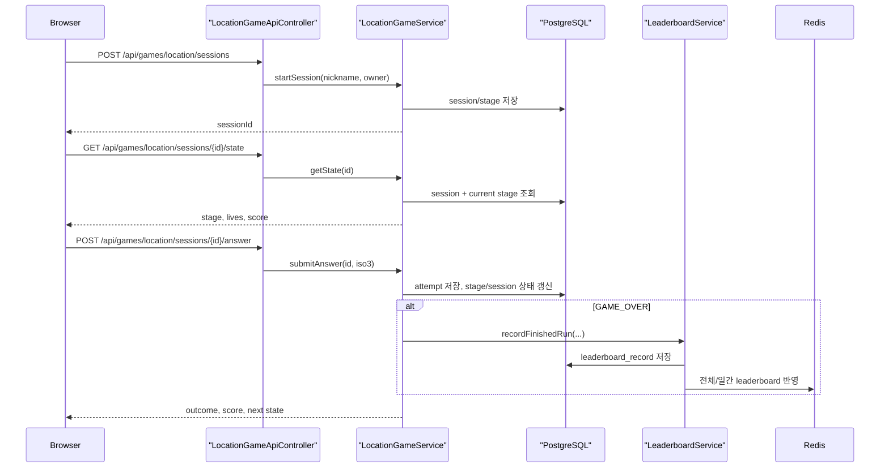
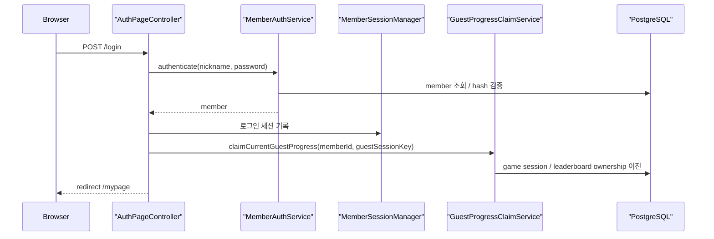
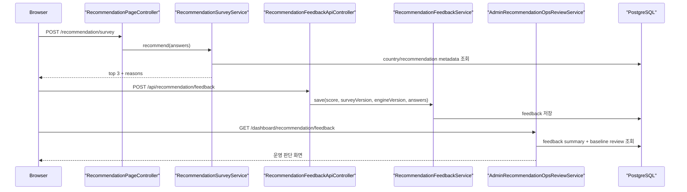

# 대표 요청 흐름 가이드

현재 프로젝트를 설명할 때 가장 중요한 요청 흐름 3개만 고정한다.

## 1. 위치 찾기 게임 한 판

### 핵심 설명 포인트

- 프론트는 국가를 고르고 제출만 한다.
- 정답 판정, 하트 감소, 점수 계산, 다음 Stage 생성은 서버가 맡는다.
- 게임 종료 시점에만 랭킹이 반영된다.

## 2. 게스트 플레이 후 로그인해서 기록 귀속

### 핵심 설명 포인트

- 게스트 플레이를 막지 않는다.
- 로그인은 기록 유지 목적이다.
- 같은 브라우저의 guest 기록만 member 계정으로 귀속한다.

## 3. 추천 설문과 운영 피드백 루프

### 핵심 설명 포인트

- 추천 결과는 서버가 deterministic하게 계산한다.
- 결과 자체는 저장하지 않고, 만족도만 저장한다.
- 운영 화면은 현재 버전 만족도와 baseline drift를 함께 본다.

## 발표할 때의 압축 버전

1. 게임은 `세션 시작 -> 상태 조회 -> 답안 제출 -> 종료 시 랭킹 반영`
2. 계정은 `로그인 -> 세션 기록 유지 -> 기존 guest 기록 귀속`
3. 추천은 `설문 계산 -> 만족도 수집 -> dashboard review`
